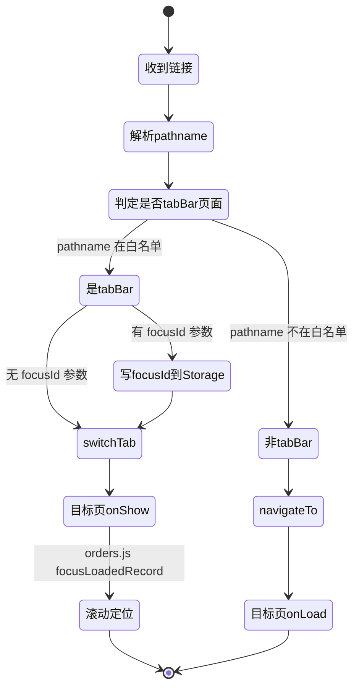
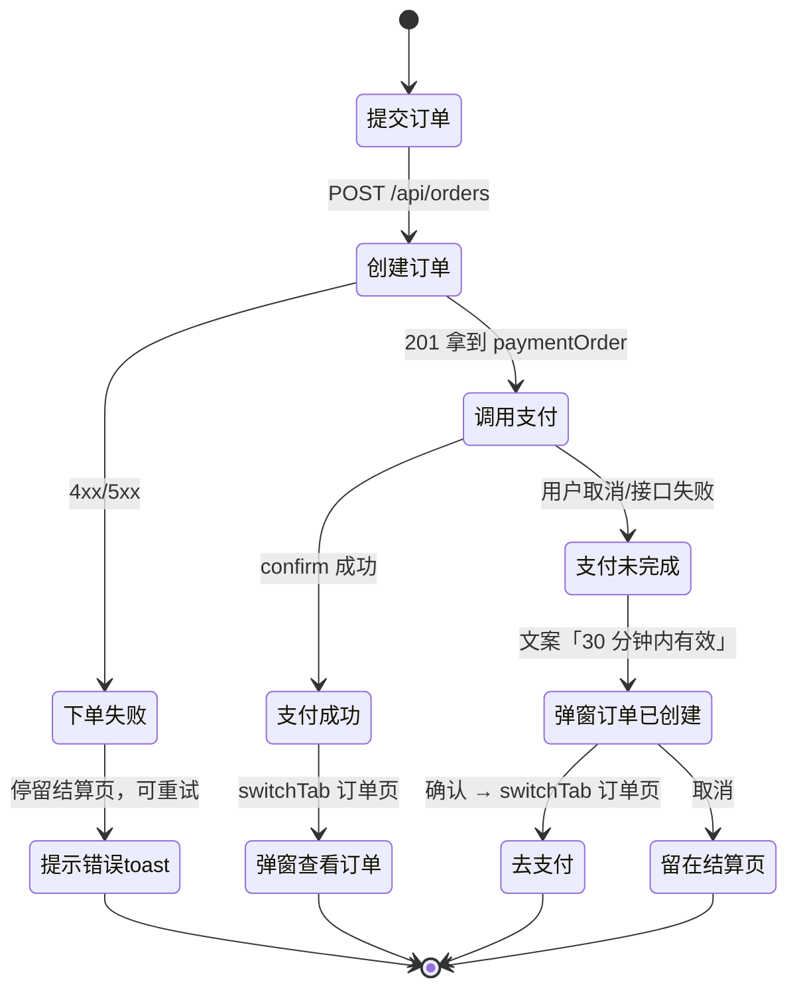
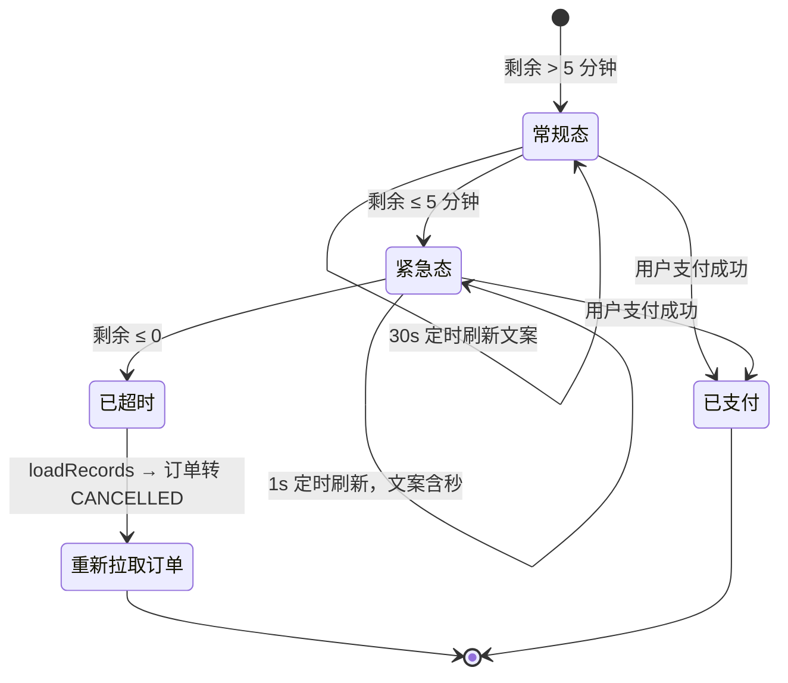
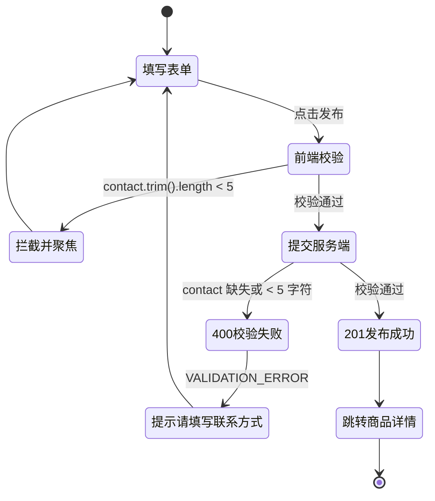
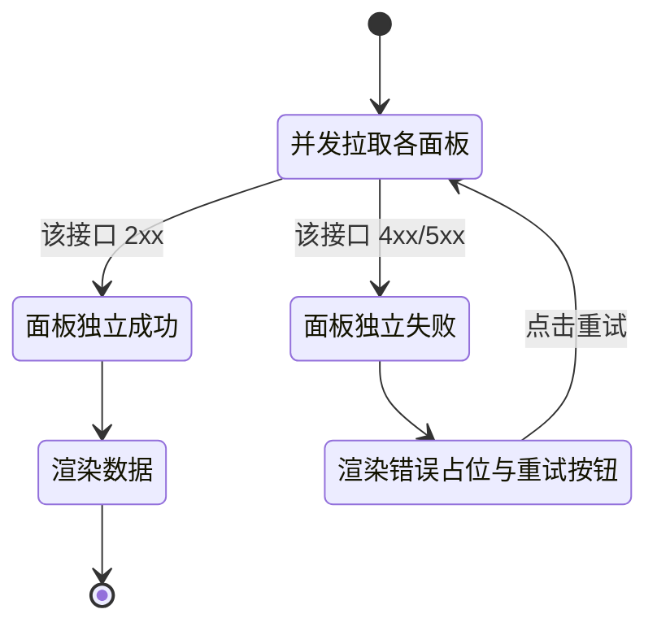
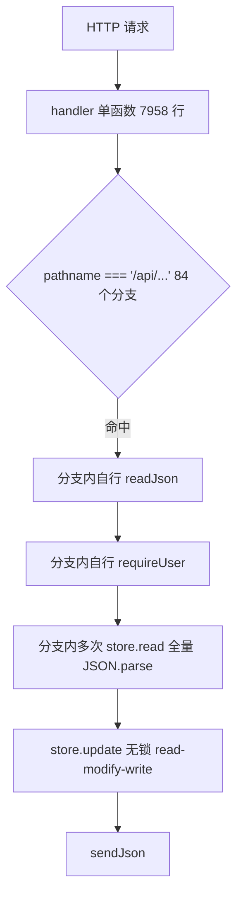
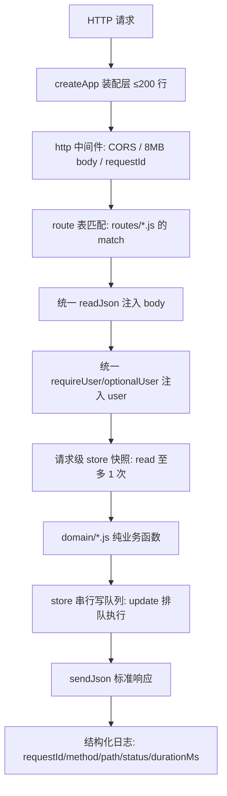
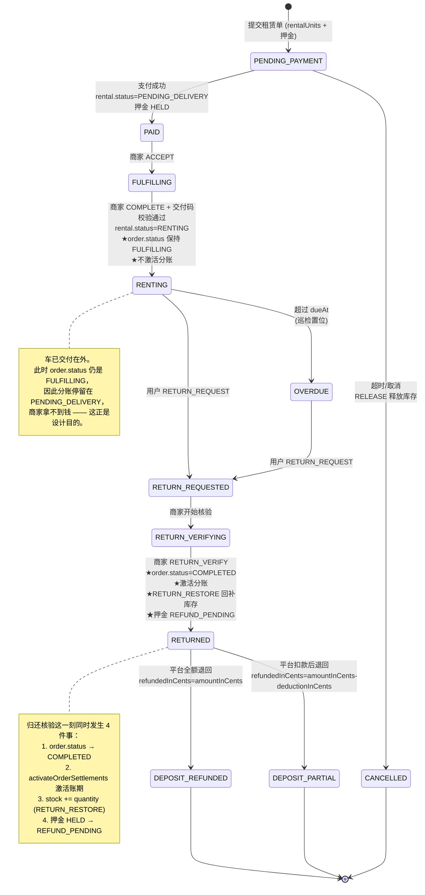
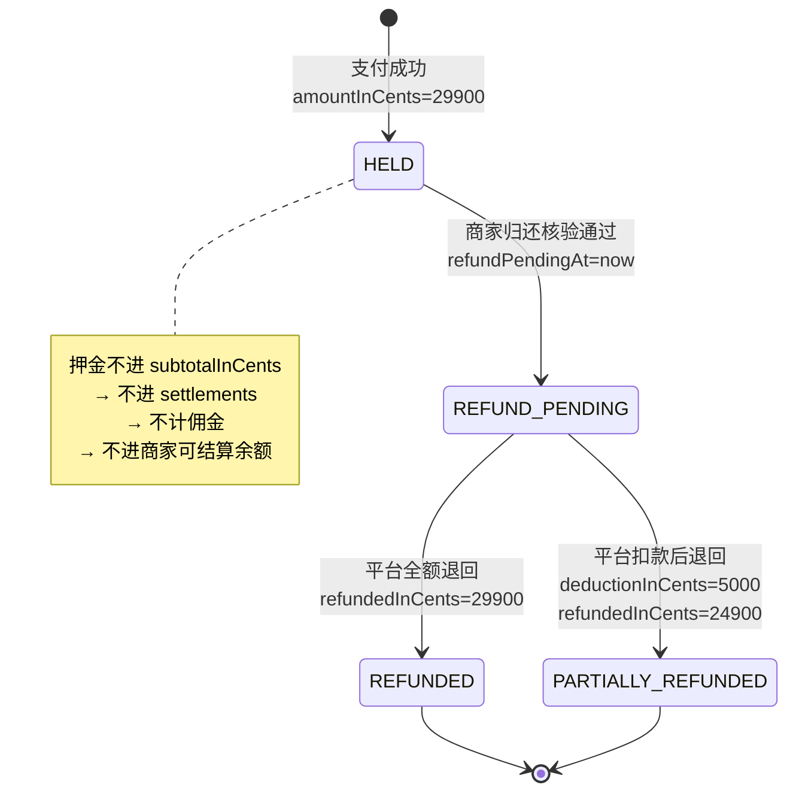
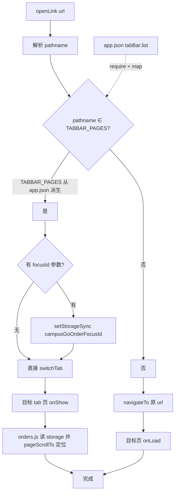

# 狮山智生活（campus-go-mvp）全业务模块优化 · 第一轮 PRD

> 文档版本：**v1.5（冻结版）** —— 待确认问题 **0 条**，PRD 就此冻结，工程师按 `03-tasks.md` 开工。
> 版本沿革：v1.0 初稿 → v1.1 落 Q1/Q5/Q8 三项用户决策 + 新增 M12 租赁 → v1.2 按架构师复核纠正 `M4-P0-01` 判据（存储拆 A/B/C 三层）+ 落 Q3/Q10 → v1.3 落 Q2/Q4/Q6/Q7/Q9，统一批次表述 → v1.4 按架构师复核纠正 2 处资损级范围不足（分账激活调用点 6 处、`app.js:1954` 的 `||` 回退膨胀），见 [7.5.6](#756-v14-两处资损级修正架构师复核已采纳) → **v1.5 按团队负责人批准加强 `M11-P0-02` 验收标准：新增断言 ⑨（`.gitmodules` 的 `url` 必须为 HTTPS 形式、不得为 SSH），并在 `M11-P0-01` 验收标准 ④ 同步覆盖「配置的形式正确性」**。
> **v1.5 是最终冻结版。** v1.3 的冲突点 2 与 `M12-P0-02` 验收标准 ② 存在**范围不足**，已在 v1.4 修正；**v1.5 只加强验收标准，不改任何需求本身、不改范围、不改优先级**。**以 v1.5 为准。**
> 产品经理：许清楚
> 编写日期：本轮迭代启动时
> 上游输入：项目代码基线分析（32 页面 / 20k+ 行）、用户原话「完善此项目，按各业务模块逐一优化，包括功能实现、交互体验与代码质量等方面；本轮暂时搁置校园地图版块，不再对其进行修改，聚焦其余业务模块的改进。」

---

## 0. 项目信息

| 项 | 内容 |
| --- | --- |
| Language | 中文 |
| Programming Language | 原生微信小程序（ES6，无构建）+ Node.js 18+（CommonJS，除 `mysql2` 外零新增运行时依赖） |
| Project Name | `campus_go_mvp_optimization_round1` |
| 代码基线 | `miniprogram/` 5616 行 / 32 个注册页面；`server/src/` 10288 行（`app.js` 9170 行）；`server/public/admin.js` 1259 行 / 约 134k 字符；测试 `server/test/` 19 文件 9258 行 + 根 `test/miniapp.test.js` |
| 测试基线 | `cd server && node --test` → 152 pass / 0 fail；仓库根 `node --test` → 245 pass / 0 fail |
| 本轮性质 | **高质量增量改进 + 一项新增业务建模（电瓶车租赁），不是重写。** 不改变既有架构选型（原生小程序、JSON/MySQL 单进程存储、静态管理端），不做框架迁移、不引入打包器 |
| 本轮范围 | **两条交付轨道，两段交付、都在本轮内**：**第一批 Track A 全模块优化**（M1~M11，P0 8 + P1 15）+ **第二批 Track B 租赁业务建模**（M12，9 条 = 5 P0 + 4 门槛 P1）。批次划分与执行顺序见 [7.4](#74-范围与交付批次已裁决两段交付都在本轮内) |

### 0.1 原始需求复述

用户要求「完善此项目，按各业务模块逐一优化，包括功能实现、交互体验与代码质量等方面」，并明确**本轮搁置校园地图版块，不再修改**。

翻译为可执行的范围界定：

1. 按业务模块**逐一**梳理需求，模块边界必须清晰、可分别验收。
2. 优化维度必须是三类之一：**功能实现**（缺功能/功能错误）、**交互体验**（断点/误导/无反馈）、**代码质量**（可维护性/可测试性/交付可复现）。
3. 地图版块**完全排除**（见 0.2），一行代码都不动。
4. 用户已追加决策：电瓶车租赁业务**本轮一并建模**（见 [7.3](#73-q8-电瓶车租赁--本轮一并建模已定稿)），因此原「不做」清单中的租赁条目已移出。

### 0.2 本轮明确排除（禁区）

**以下路径的文件内容禁止出现任何改动**，架构师与开发者也**不得**顺手重构：

- `miniprogram/pages/map/`（整个目录，含 `.js/.wxml/.wxss/.json`）
- `miniprogram/data/campus-map.js`、`miniprogram/data/pois.js`
- `miniprogram/assets/map/`、`miniprogram/assets/campus/q/`
- 根测试 `test/miniapp.test.js` 中与校园地图相关的用例（该文件里仅有的 3 处 `require` 小程序模块全部指向 `campus-map`，属于冻结范围，本轮不得删除或改写）
- `miniprogram/app.json` 的 `permission.scope.userLocation` 声明、`requiredPrivateInfos` 中的 `getLocation`
- `miniprogram/app.json` 的 `tabBar.list` 中「地图」项本身（`pagePath: "pages/map/map"`、`text: "地图"`）—— 该项**必须保留**，不得删除、不得改 `pagePath`、不得改文案

**允许的例外（用户已明确授权，见 [7.2](#72-q5-tabbar--允许改数组不碰地图文件已定稿)）**：

- ✅ **允许修改** `miniprogram/app.json` 的 `tabBar.list` **数组**（新增一项「市集」），但**不得**触碰上述「地图」项自身，也**不得**改动任何地图页面文件
- ✅ 允许在 `tabBar.list` 中新增 `{ "pagePath": "pages/market/market", "text": "市集" }`

> **注意**：把市集提升为 tabBar 页面会产生连锁影响 —— 所有 `wx.navigateTo('/pages/market/market')` 会**必然失败**（tabBar 页面只能用 `switchTab`）。已定位 3 处：`home.js:88`、`forum/forum.js:79`、`market/item.js:88`（`navigateBack` 的 fail 兜底）。这 3 处必须同步修改，见 `M1-P1-02`。
> 另：`utils/navigation.js` 的 tabBar 白名单**必须从 `app.json` 派生而非硬编码**，否则本次改动会立刻让白名单过期。见 `M1-P0-01`。

### 0.3 硬性约定（不得违背，全部沿用现状）

- 金额一律人民币**分**（`29900` = 299.00 元）
- 成功响应数据包在 `data`，列表另有 `total`
- 错误格式 `{ error: { code, message }, requestId }`
- 客户端传入的价格不采信，订单金额由服务端计算
- 服务端除已有 `mysql2` 外**不新增运行时 npm 包**
- 用户敏感信息（姓名、学号、身份证）对外输出必须脱敏（`applicantNameMasked` / `studentNoMasked` 模式）
- 安全基线（scrypt + `timingSafeEqual`、会话 token 仅存 SHA-256、登录失败锁定持久化、RBAC、CORS 精确 Origin 白名单、`path.basename` 防目录穿越、8MB body 上限、JSON 写入 tmp+rename 原子化）**只允许增强，不允许削弱或替换**
- **存储层写入契约（本轮确立，由架构师复核纠正后确定）**：
  - **`JsonStore.update()` 必须保持同步返回结果，不得改为 Promise。** 实测全仓 `store.update(` 共 **101 处调用**，其中 `= store.update(` 形式 **82 处**同步取用返回值（如 `app.js:8695` 的 `result.reused`、`app.js:8675` 下单主链路的 `store.update((data) => {...})` 返回值）。Promise 化会导致大面积运行时报错，属**破坏性变更**。若需要异步语义，**另加 `updateAsync()`**（排入队列并返回 Promise），供新代码显式选择，`update()` 的签名与同步性**冻结**。
  - **写路径不得引入 `await`**：`update()` / `read()` / `write()` 三函数体内禁止出现 `await`。同步性是 `JsonStore` 当前正确性的来源（Node 单线程下同步代码段不可被打断，单个 `update()` 天然原子），任何异步化都会重新引入丢失更新窗口。
- **租赁业务新增约定（本轮确立）**：
  - **押金不是营业收入**：押金一律不得计入 `orderItems[].subtotalInCents`，因此不得进入 `settlements.amountInCents`、不得计佣金、不得进入商家可结算余额
  - **商家不能自行扣款**：租赁押金的任何扣减必须由平台审核后执行，商家只能"提议扣款 + 提供证据"
  - **租赁资金必须可追溯**：押金的收取、退回、扣减都要落 `financeEvents` 与 `auditLogs`
  - **租赁订单的 `order.status` 语义**：租赁订单在**归还核验通过后**才置 `COMPLETED`（交付取车不置 `COMPLETED`），详见 `M12-P0-03`

---

## 1. 产品目标

本轮优化必须让下面三件事**可衡量地变好**。三个目标相互正交：目标一管交付，目标二管正确性，目标三管体验。

### 目标一：交付可复现 —— 任何人克隆仓库后 5 分钟内能跑起来并看到全绿

**现状（已实测）**：

- `server/` 是嵌套独立 git 仓库，外层以 gitlink（mode `160000`, commit `c4f01a5`）记录，remote 为 `https://github.com/komorebi-Lee/e-school-server.git`，但**仓库内没有 `.gitmodules`**。克隆外层仓库后 `server/` 是**空目录**，服务端代码、管理端、服务端测试全部丢失。
- `server/` 当前有 5 个文件未提交：`public/admin.html`、`public/admin.js`、`src/app.js`、`src/store.js`、`test/api.test.js`。外层仓库 `test/miniapp.test.js` 也处于未提交状态。
- 结果：即使有人拿到 `server/`，他看到的也是**旧版本代码**，`node --test` 无法达到 152 全绿。

**衡量指标**：在全新临时目录 `git clone` 后，`server/src/app.js`、`server/public/admin.js`、`server/public/admin.html`、`server/test/api.test.js` 四个文件均存在且内容与开发机一致；`cd server && node --test` 与根 `node --test` 一次性通过（152 / 245）。**当前成功率 0%，目标 100%。**

### 目标二：数据正确性 —— 并发写入零丢失，文档与代码零冲突

**现状（已实测）**：

- `JsonStore.update()` = `read()` 全量 `JSON.parse` → mutator 修改 → `write()` 全量序列化 + `rename`，**中间无任何锁**。同进程内两个并发请求的 `read` 可能都读到同一份旧快照，后写者覆盖先写者（lost update）。全量 `JSON.parse` 每次读 22+ 个集合。
- `MysqlStore.update()` 同步改内存 cache，但 `flush()` 是**不 await 的 fire-and-forget**，连续两次 update 的两个 `pool.query` 可能乱序落库，把新状态覆盖成旧状态。
- `CLAUDE.md` 声称「11 个页面」（实际 32）、「服务端保持零依赖不新增 npm 包」（实际依赖 `mysql2`）、「`config/api.js` 定义 `API_BASE_URL`」（实际导出 `CLOUD_ENV_ID`/`CLOUD_SERVICE_NAME`）、「不接真实微信支付，订单创建后直接 PAID」（实际已实现完整微信支付链路 + 12 个支付测试文件）。`README.md` 声称 19 页面（实际 32）、149/230 测试（实际 152/245）。`CLAUDE.md` 的「边界与禁区」还写着「不做并发/事务/预占库存改造」——而 `reserveOrderStock` 已实现。

**衡量指标**：新增并发写测试（20 并发请求）后最终落库记录数 == 成功响应数，**当前必失败，目标必通过**；新增文档一致性测试，逐条断言文档中的数字/导出名/依赖清单与代码实际一致，**当前至少 7 条断言失败，目标 0 失败**（本条为**下限口径**；该测试的完整断言清单已细化为 `M11-P0-02` 的 **9 条**验收断言，**验收一律以 `M11-P0-02` 的 9 条为准**）。

### 目标三：核心链路体验断点归零 —— 用户能完成的动作必须真的完成

**现状（已实测，每条都已定位到具体文件行）**：

- 站内通知**全部点击无效**：`userNotificationLink()`（`app.js`）为用户通知生成 `/pages/orders/orders?focusId=...`，而 `pages/orders/orders` 是 **tabBar 页面**；`profile.js:79` 用 `wx.navigateTo({ url: link, fail: () => {} })`，`notifications.js:openNotification` 用 `wx.navigateTo({ url: link, fail: () => showToast('详情页暂不可用') })`。`navigateTo` 对 tabBar 页面必然失败，前者被空 `fail` 静默吞掉（点了没反应），后者提示「详情页暂不可用」。
- `pages/card/card.js:112`：提交宽带资格后用 `wx.navigateTo({url:'/pages/orders/orders'})` 跳 tabBar 页面 → 同样必然失败，用户提交成功却停在原页。
- `pages/plate/plate.js:6`：`charging:{eligible:false,stateLabel:',detail:'}` —— 该行能通过 `node --check`（`',detail:'` 被解析为一个字符串字面量），但 `stateLabel` 的初始值是垃圾字符串 `,detail:`。`loadCharging()` 失败时 `.catch(()=>{})` 静默，`plate.wxml:26` 会把这个垃圾值渲染成充电资格状态文案。
- `pages/market/publish` 与 `POST /api/market/items`：`contact` 服务端可选（空则回退「通过平台客服联系」），前端也无校验 → 卖家可以发布一条**无法联系到卖家**的闲置。
- 论坛点赞态丢失：`GET /api/forum/posts` 与 `GET /api/forum/posts/:id` 都传 `viewerId = null`，`publicForumPost` 中 `liked: viewerId ? ... : false` 恒为 `false`，用户点赞后刷新即回退成未点赞。

**衡量指标**：上述 5 类断点全部修复并有自动化断言覆盖（通知跳转用可测试的路径判定函数 + tabBar 页面清单断言；`plate.js` 用数据断言；市集 `contact` 用 400 断言；论坛 `liked` 用两次 GET 断言）。

### 目标四：租赁业务闭环 —— 押金一分钱都不能错（新增，见 [7.3](#73-q8-电瓶车租赁--本轮一并建模已定稿)）

**现状**：`E_BIKE_NEW` 分类下混放着「远途 长续航版」（`prod_ebike_rent_001`，图片标注 Rental），但商品模型**没有任何租赁字段**——无租期、无押金、无归还状态、无超时规则。用户点进去只能"买断"，无法租赁。

**为什么这条是硬指标**：租赁引入了一条**新的资金流**（押金）。押金与营业收入在资金属性上完全不同：租金是商家收入（要进分账、要计佣金），押金是**代管资金**（不能进分账、不能计佣金、必须原路退回）。一旦押金混入 `subtotalInCents`，商家可结算余额就会虚高，平台会**按虚高余额给商家打款**，且这笔钱本不属于商家——这是不可逆的资金损失。

**衡量指标**：① 一笔 3 天租期、日租金 1500 分、押金 29900 分的订单，支付后 `settlements.amountInCents === 4500`（**只含租金，不含押金**）；② 押金记录 `rentalDeposits` 独立存在且 `status === 'HELD'`；③ 归还核验通过后押金才转 `REFUND_PENDING`，且**只有平台**能执行退回/扣款；④ 押金退回金额 + 扣款金额 == 押金收取金额（恒等式，必须有断言）。

---

## 2. 用户故事

### 2.1 学生用户（小程序端主要用户）

| ID | 故事 |
| --- | --- |
| US-U-01 | As a 在校学生，I want 底部导航有「市集」tab、首页有「逛论坛」按钮，so that 我能一步进入二手交易和校园社区。 |
| US-U-02 | As a 在校学生，I want 商品接口失败时看到「价格加载失败，点击重试」而不是一个编造的兜底价，so that 我不会被错误价格误导下单。 |
| US-U-03 | As a 在校学生，I want 待支付订单在剩余 5 分钟时卡片高亮并精确到秒倒计时，so that 我不会因为没注意时间导致订单被自动关闭、库存被释放。 |
| US-U-04 | As a 在校学生，I want 支付失败时被引导到「订单页继续支付」而不是只弹一个 toast，so that 我不会重复下单。 |
| US-U-05 | As a 在校学生，I want 点击站内通知能真的跳到对应订单并定位到那张卡片，so that 我能立刻处理超时或售后提醒。 |
| US-U-06 | As a 在校学生，I want 在收藏页/足迹页点电话卡时进入电话卡办理页（而不是电瓶车详情页），so that 我能直接办理。 |
| US-U-07 | As a 在校学生，I want 在论坛里点赞后退出再进入仍显示已点赞，so that 我能确认我的操作生效了。 |
| US-U-08 | As a 在校学生，I want 「我的」页的实名认证是真的提交到服务端并展示脱敏姓名，so that 我刷新后不用重新认证。 |
| US-U-09 | As a 在校学生，I want 在「我的」里看到「我发布的闲置」并管理它们，so that 我能下架已出的东西。 |
| US-U-10 | As a 在校学生，I want 在电瓶车列表一眼分清「买断」和「按天租」，so that 我不会误以为只能买。 |
| US-U-11 | As a 在校学生，I want 下单前清楚看到「租金多少、押金多少、押金会退」，so that 我不会以为 299 元押金是花掉的钱。 |
| US-U-12 | As a 在校学生，I want 在订单页看到租期和「还有多久要还车」，so that 我不会忘记归还而被扣钱。 |
| US-U-13 | As a 在校学生，I want 一键「申请归还」并在归还核验后看到押金退回进度，so that 我不用反复问客服我的押金去哪了。 |
| US-U-14 | As a 在校学生，I want 还车之前不能评价，so that 评价反映的是完整租赁体验而不是半程印象。 |

### 2.2 商家

| ID | 故事 |
| --- | --- |
| US-M-01 | As a 校园商家，I want 商家工作台某一块数据加载失败时只有那一块显示错误和重试，so that 不会整页空白让我以为系统挂了。 |
| US-M-02 | As a 校园商家，I want 上架商品时的数量上限与平台规则一致（而不是前端写死 5），so that 我不会被莫名其妙的「最多可买 5 辆」卡住。 |
| US-M-03 | As a 校园商家，I want 把车辆上架为「按天租赁」并配置日租金与押金，so that 我能做租赁生意。 |
| US-M-04 | As a 校园商家，I want 在商家订单页区分「交付取车」和「核验归还」两个动作，so that 我不会把交付当成订单完成、也不会漏掉收回车辆。 |
| US-M-05 | As a 校园商家，I want 核验归还时提交「车损扣款金额 + 原因 + 证据照片」，so that 车损有据可依。 |
| US-M-06 | As a 校园商家，I want 租赁车在归还核验后自动回到可租库存，so that 我不用手工改库存。 |
| US-M-07 | As a 校园商家，I want 租赁收入必须等归还核验后才进入账期，so that 车还在外面就被结算的风险由平台机制兜住。 |

### 2.3 平台运营（管理端）

| ID | 故事 |
| --- | --- |
| US-O-01 | As a 平台运营，I want 市集商品和论坛帖子都带有可用的联系方式/举报入口，so that 我能处理交易纠纷。 |
| US-O-02 | As a 平台运营，I want 上传接口有频率与配额限制，so that 单个用户可以刷爆服务器磁盘。 |
| US-O-03 | As a 平台运营，I want 管理端 `admin.js` 拆成可维护的模块，so that 修改一个视图不用在 1259 行、平均 106 字符/行的文件里翻找。 |
| US-O-04 | As a 平台运营，I want 在一个「租赁管理」视图里看到所有租期中/待归还/超期未还的车辆，so that 我能主动跟进而不是等用户投诉。 |
| US-O-05 | As a 平台运营，I want 押金退回必须经我审核、扣款必须由我确认，so that 商家的车损索赔不会变成单方扣钱。 |
| US-O-06 | As a 平台财务，I want 押金与租金在财务流水里分开呈现，so that 对账时不会把代管资金算成平台收入。 |

### 2.4 开发者 / 维护者

| ID | 故事 |
| --- | --- |
| US-D-01 | As a 新加入的开发者，I want 克隆仓库后 `server/` 里有代码、`node --test` 直接全绿，so that 我第一天就能改代码。 |
| US-D-02 | As a 维护者，I want `createApp` 拆成按业务域组织的路由模块，so that 我改订单逻辑不用在 7958 行的单函数里定位。 |
| US-D-03 | As a 维护者，I want `store.update()` 并发安全，so that 我不会因为一次压测丢掉用户订单。 |
| US-D-04 | As a 维护者，I want 文档里的页面数、测试数、依赖清单、导出名与代码一致，so that 我不会照着文档改出 bug。 |
| US-D-05 | As a 维护者，I want 小程序端的关键纯函数（订单卡片装饰、支付倒计时）有真正可运行的单元测试，so that 我改文案不会破坏逻辑。 |
| US-D-06 | As a 维护者，I want 租赁复用现有订单/支付/分账链路而不是另起一套，so that 我不会面对两套订单状态机。 |
| US-D-07 | As a 维护者，I want tabBar 页面清单从 `app.json` 派生而非硬编码，so that 我加一个 tab 不会让站内通知跳转静默失效。 |
| US-D-08 | As a 维护者，I want 押金与租金在代码里是两笔独立的钱（不同字段、不同集合），so that 我不会在改分账逻辑时不小心把押金算进去。 |

---

## 3. 优先级判定原则

| 级别 | 判定依据（满足任一即归入） | Track A 条数 | Track B（租赁）条数 |
| --- | --- | --- | --- |
| **P0** | ① 阻碍交付/复现（克隆后跑不起来、提交缺失、文档与代码冲突到会误导改错代码）；② 存在数据正确性风险（并发丢写、写序错乱、资源可被刷爆导致不可恢复）；③ 核心链路存在**必然失败**的功能断点（点击 100% 无效、接口 100% 报错、渲染 100% 出现垃圾值）；④ **新增业务一旦上线就会产生不可逆资金错误**（押金混入分账） | **8 条** + 1 项 P0 级工程项 | **5 条** |
| **P1** | ① 核心链路体验断点（非必然失败，但正常路径下用户会困惑/失去操作能力）；② 功能缺失导致闭环不完整（如卖家无法管理自己的闲置）；③ 严重拖慢维护效率的结构问题（单文件超千行、静默吞错、无测试覆盖） | **15 条**（Track A 批次；另有 15 条候选留待后续轮次） | **6 条**（Track B 批次，其中 **4 条为交付门槛**） |
| **P2** | 锦上添花：可分页/可缓存/可观测性增强、去重重构、残留清理、体验润色。不影响本轮验收 | **33 条** | **2 条** |

> **两轨合并总量：P0 = 13 条、P1 = 21 条、P2 = 35 条。** 这超出了原始预算（P0 5~8 条 / P1 10~15 条），**团队负责人已裁决：不压缩范围，改为「两段交付、都在本轮内」** —— Track A 交付 P0 8 + P1 15，Track B 交付租赁 9 条（5 P0 + 4 P1）。**P1 的 21 条全部留在本轮，无任何一条被推出本轮范围。** 详见 [7.4](#74-范围与交付批次已裁决两段交付都在本轮内)。


**取舍原则**（当出现分歧时按此排序）：

1. 交付可复现 > 数据正确性 > 功能断点 > 体验 > 代码整洁
2. 能在现有测试体系内加断言验证的优先
3. 改动面越小越好：优先「加参数/加分支/加测试」，避免「换架构/换库/换存储」

---

## 4. 按模块的需求池

> 列说明：`需求ID | 需求描述 | 类型 | 优先级 | 验收标准`
> 需求描述统一写成「**改什么 → 改成什么样**」的可执行句式。

### M1 首页与全局导航

| 需求ID | 需求描述 | 类型 | 优先级 | 验收标准 |
| --- | --- | --- | --- | --- |
| M1-P0-01 | **修复站内通知点击无效 + tabBar 白名单从 `app.json` 派生。** 在 `miniprogram` 新增 `utils/navigation.js`：① 导出 `TABBAR_PAGES` —— **必须通过 `require('../app.json').tabBar.list.map(item => item.pagePath)` 动态派生，禁止硬编码数组**（硬编码会在 M1-P1-02 新增市集 tab 后立刻过期，再次造成静默失效）；② 导出 `openLink(url)`：解析 url 的 pathname，若属于 `TABBAR_PAGES` 则用 `wx.switchTab` 并**把 query 中的 `focusId` 先 `wx.setStorageSync('campusGoOrderFocusId', focusId)`**（switchTab 不支持带参）；否则用 `wx.navigateTo`。把 `profile.js:79`、`notifications.js:openNotification` 的裸 `wx.navigateTo` 全部替换为 `openLink`。 | 功能 | **P0** | ① 新增单测断言 `openLink('/pages/orders/orders?focusId=ord_1')` 调用 `wx.switchTab` 且写入 `campusGoOrderFocusId='ord_1'`，`openLink('/pages/detail/detail?id=p1')` 调用 `wx.navigateTo` 且参数不变；② **新增一致性断言**：`TABBAR_PAGES` 深等于 `app.json` 的 `tabBar.list.map(i => i.pagePath)`（该断言在 M1-P1-02 新增市集 tab 后仍须通过）；③ 通知列表点击任一 ORDER 类型通知后进入订单 tab 且目标卡片被 `wx.pageScrollTo` 定位（`orders.js` 已有 `focusLoadedRecord` 逻辑）；④ 全局 grep `navigateTo` 不存在指向 `TABBAR_PAGES` 中任意页面的调用。 |
| M1-P0-02 | **修复 `pages/card/card.js:112` 跳转失败。** 把 `wx.navigateTo({url:'/pages/orders/orders'})` 改为 `wx.switchTab({url:'/pages/orders/orders'})`（或统一调用 M1-P0-01 的 `openLink`）。 | 功能 | **P0** | 提交宽带资格成功后 650ms 内页面切换到订单 tab；新增单测断言该分支使用 `switchTab`。 |
| M1-P1-01 | **删除首页编造兜底价。** `home.js` 中 `scooterFromPrice: 1899`、`phoneFromPrice: 19` 两处硬编码兜底与真实商品价格不一致（种子商品最低 2399 元、电话卡最低 29 元）。改为：接口失败时 `scooterFromPrice`/`phoneFromPrice` 置为 `null`，wxml 渲染「价格加载失败，点击重试」并提供重试按钮（重新调用 `loadProducts`）。 | 交互 | P1 | 断开 `/api/products` 后打开首页，不出现 1899/19 这两个数字；wxml 出现重试按钮且点击后重新发起请求；恢复接口后展示真实最低价。 |
| M1-P1-02 | **把「市集」提升为第 5 个 tabBar 项（用户已授权改数组，见 7.2）。** ① `app.json` 的 `tabBar.list` 追加 `{ "pagePath": "pages/market/market", "text": "市集" }`，插入位置在地图与订单之间（`首页 / 地图 / 市集 / 订单 / 我的`）；**不得**改动「地图」项自身、不得改 `permission`/`requiredPrivateInfos`。② **同步修复因市集变成 tabBar 页面而产生的 3 处必然失败跳转**：`home.js:88` `goMarket`、`forum/forum.js:79` `goMarket`、`market/item.js:88` 的 `navigateBack` fail 兜底 —— 全部改用 `openLink('/pages/market/market')`（或 `wx.switchTab`）。③ 论坛保持二级页面，入口 = 首页市集 banner 内新增「逛论坛」按钮（`catchtap` 阻止冒泡）+ 市集页顶部已有的「狮山论坛」按钮；`home.js` 补 `goForum()`。 | 功能 | P1 | ① 底部导航出现「市集」且点击进入市集页；② 首页点市集 banner 与论坛页点「去市集」都能成功切换（不再走 `navigateTo`）；③ 从市集商品详情页返回时能回到市集 tab（`navigateBack` 优先，fail 时 `switchTab`）；④ 首页「逛论坛」按钮点击进入论坛且不触发外层 banner 跳转；⑤ `app.json` 的 `tabBar.list` 长度为 5，且「地图」项的 `pagePath`/`text` 与改动前完全一致；⑥ `miniprogram/pages/map/` 目录下所有文件 mtime 未变（可用 git status 断言无地图文件改动）。 |
| M1-P2-01 | `home.js` 的 `onShow` 每次都并发 4 个请求（`/api/my/favorites`、`/api/my/recommendations`、`/api/products`、`/api/business-config`）且无缓存。为 `business.js` 与首页商品列表增加 60 秒内存缓存（模块级变量 + 时间戳），`onShow` 命中缓存时不重复请求。 | 交互 | P2 | 连续 3 次切换 tab 只产生 1 次 `/api/products` 请求（可通过请求计数测试断言）。 |
| M1-P2-02 | 搜索页 `search.js` 采用「全量拉取 `/api/products` + 前端过滤」，商品增长后首屏变慢。改为 `/api/products?q=` 服务端搜索（服务端 `GET /api/products` 补 `q` 参数过滤 `name`/`description`），前端保留本地过滤作为降级。 | 功能 | P2 | `GET /api/products?q=轻风` 只返回匹配商品且 `total` 正确；前端在服务端搜索可用时不再全量拉取。 |

### M2 校园电商商品域（scooters / card / plate / recharge / store / detail / favorites）

| 需求ID | 需求描述 | 类型 | 优先级 | 验收标准 |
| --- | --- | --- | --- | --- |
| M2-P0-01 | **修复牌照页垃圾初始值。** `pages/plate/plate.js:6` 的 `charging:{eligible:false,stateLabel:',detail:'}` 改为 `charging:{eligible:false,stateLabel:'',detail:''}`；`loadCharging()` 的 `.catch(()=>{})` 改为设置 `charging:{eligible:false,stateLabel:'暂不可查',detail:'充电资格加载失败，下拉可重试'}`。 | 功能 | **P0** | ① 静态断言 `plate.js` 源码不包含字符串 `,detail:`；② 单测断言 `loadCharging` 失败后 `data.charging.stateLabel === '暂不可查'`；③ 接口正常时渲染服务端 `stateLabel`。 |
| M2-P1-01 | **收藏页/足迹页按品类分流。** `favorites.js:goDetail`、`footprints.js:goDetail` 目前一律跳 `/pages/detail/detail?id=`，电话卡商品会落到电瓶车详情页。改为读 `item.category`：`PHONE_PLAN` → `/pages/card/card?planId=<id>`，`E_BIKE_NEW` → `/pages/detail/detail?id=<id>`。 | 功能 | P1 | 收藏一个电话卡后点击进入 `card` 页并自动选中该套餐（`card.js` 已支持 `pendingPlanId`）；收藏一个电瓶车后点击进入 `detail` 页。 |
| M2-P1-02 | **消除 `card.js` 静默吞错。** `loadCatalog()` 的两个请求（`/api/products?category=PHONE_PLAN`、`/api/recharge-promos`）都用 `.catch(()=>{})`，接口失败时套餐区空白且无任何提示。改为维护 `plansError`/`promosError` 状态，wxml 在对应区块展示错误文案与「重新加载」按钮。 | 交互 | P1 | 断开两个接口后 `card` 页出现「套餐加载失败，点击重试」且点击后重新请求；两个区块的错误态互相独立（只断一个接口时另一个区块正常渲染）。 |
| M2-P1-03 | **电话卡「可办理」状态真实化。** `card.js` 用 `item.stock > 0` 判断 `badge:'可办理'`，但 `PHONE_PLAN` 库存恒为 999，永远显示「可办理」。服务端 `GET /api/products` 为每个商品输出 `purchasable: Boolean(product.active !== false && availableStock(product) > 0)`；`card.js` 改用 `item.purchasable`，不可办理时置灰按钮并显示原因。 | 功能 | P1 | 服务端 `/api/products` 响应每个商品含 `purchasable` 布尔字段（新增接口断言）；下架一个电话卡套餐后前端显示「已售罄/不可办理」且提交按钮不可点。 |
| M2-P2-01 | `scooters.js` 中 `normalizeProduct` 重复赋值 `promoText` 两次（一次用 `promotion?.statusText`，一次用 `item.promotion?.statusText`），删除重复键。 | 代码质量 | P2 | 静态断言该对象字面量内 `promoText` 只出现一次。 |
| M2-P2-02 | `detail.js`、`scooters.js` 用 `item.id === 'prod_ebike_rent_001' ? '70 km' : '45 km'` 硬编码续航兜底。改为服务端商品数据补 `range`/`speed` 字段，前端仅做展示；无字段时显示「续航以商家说明为准」。 | 代码质量 | P2 | 源码中不再出现 `prod_ebike_rent_001` 这类 ID 特判；详情页无 `range` 字段时展示兜底文案而非假数值。 |
| M2-P2-03 | `services/store.js`（4 行）+ `miniprogram/data/mock.js`（47 行）仅用于商品兜底展示，与后端真实商品并存易造成「价格对不上」。保留但收敛为**单一降级入口**：删除 `home.js` 中对 `getScooters()` 的直接调用（当前先 setData mock 再被接口覆盖，造成一次闪烁），只在接口失败时使用，并在 UI 上标注「离线示例数据」。 | 代码质量 | P2 | 接口正常时首页不出现 mock 数据的瞬时渲染（可通过 setData 调用序列断言）；接口失败时出现「离线示例数据」标注。 |

> **M2 与租赁的接口**：商品域受租赁影响的部分统一在 **M12** 维护，本表不重复，避免同一需求两处维护。对应关系：商品模型加 `listingType`/`rentalPlan` → `M12-P0-01`；`scooters` 列表与 `detail` 详情的租赁展示 → `M12-P1-02`。
> 注意：`M2-P2-02` 提到的 `prod_ebike_rent_001` ID 特判（`detail.js`/`scooters.js` 里 `item.id === 'prod_ebike_rent_001' ? '70 km' : '45 km'`）在租赁建模后会自然消除——展示将由 `listingType === 'RENT'` 驱动，而不再靠商品 ID 硬编码。

### M3 交易链路（checkout / edit-order / addresses / orders / aftersales）

| 需求ID | 需求描述 | 类型 | 优先级 | 验收标准 |
| --- | --- | --- | --- | --- |
| M3-P1-01 | **支付失败必须给下一步。** `checkout.js:submit` 的 `.catch` 目前只 `setData({submitting:false})` + toast。当 `payPaymentOrder` 失败（订单已创建、支付单已生成）时，改为 `wx.showModal({title:'订单已创建，支付未完成', content:'可在订单页继续支付，30 分钟内有效', confirmText:'去支付'})`，确认后 `wx.switchTab({url:'/pages/orders/orders'})`；仅当 `/api/orders` 本身失败时才保持普通 toast。 | 交互 | P1 | 模拟 `confirm` 接口 500 后提交订单，出现「订单已创建，支付未完成」弹窗；点击「去支付」进入订单 tab 且看到该待支付订单；`/api/orders` 失败时不出现该弹窗。 |
| M3-P1-02 | **统一购买数量上限。** `checkout.js` 写死 `maxQuantity: Math.min(sellableStock, 5)`，服务端 `POST /api/orders` 允许 `1..99`，规则不一致。在 `adminSettings` 新增 `maxOrderQuantityPerItem`（默认 `5`），`publicSettings` 输出到 `/api/business-config`；前端 `maxQuantity = Math.max(1, Math.min(sellableStock, config.maxOrderQuantityPerItem))`，超限提示「本商品单笔最多可买 N 件（平台规则）」。服务端在 `POST /api/orders` 按同一字段强校验并返回 400 `VALIDATION_ERROR`。 | 功能 | P1 | 运营设置把 `maxOrderQuantityPerItem` 改为 2 后，结算页数量上限变 2；直接调接口传 `quantity: 3` 返回 400 且 `error.code === 'VALIDATION_ERROR'`；新增接口断言。 |
| M3-P1-03 | **改约接口补状态校验。** `PATCH /api/orders/:id`（改配送）当前未校验订单状态，已完成/已取消/售后中的订单仍可被改约。服务端在改约前校验：订单属于当前用户；状态不在 `['COMPLETED','CANCELLED','AFTER_SALE']` 且 `paymentStatus` 非 `REFUNDED`/`PARTIALLY_REFUNDED`，否则返回 409 `ORDER_NOT_MODIFIABLE`，`message` 写明当前状态与原因。前端 `edit-order.js` 捕获该错误码后提示「当前订单状态不支持改约」并 `navigateBack`。 | 功能 | P1 | 对已完成订单调 `PATCH` 返回 409 `ORDER_NOT_MODIFIABLE`；对进行中订单返回 200；新增 4 条接口断言（进行中/已完成/已取消/已售后）。 |
| M3-P1-04 | **改约页时间档位以服务端为准。** `edit-order.js` 初始 `deliveryTimeSlots: []` 时先用 `['尽快配送']` 渲染，`loadSlots()` 才覆盖，造成一次错误选项闪现与 `deliveryTimeIndex` 错位。改为 `loading` 期间禁用时间档位选择器，`loadSlots()` 完成后一次性 setData 生效。 | 交互 | P1 | 打开改约页在接口返回前，时间档位选择器为 disabled 且不显示「尽快配送」；返回后展示真实档位且 `deliveryTimeIndex` 指向原订单的 `timeSlot`。 |
| M3-P1-05 | **待支付倒计时分级高亮 + 秒级精度。** `orders.js` 目前固定 30s 刷新、文案只到分钟，且无任何视觉强调。改为：① 剩余 ≤5 分钟时卡片加 `countdown-urgent` 类（红色边框 + 高亮底色）；② 文案在 ≤5 分钟时改为「仅剩 X 分 Y 秒，超时自动取消」；③ 当存在任意剩余 ≤5 分钟的待支付订单时，定时器间隔从 30000ms 切换为 1000ms，全部超出后回落 30000ms；④ `onHide`/`onUnload` 必须清理定时器（当前已做，回归验证）。 | 交互 | P1 | 单测断言 `paymentCountdownText` 在剩余 4 分 30 秒时返回含「4 分」与「30 秒」的文案；剩余 6 分钟时返回不含秒的文案；`refreshCountdowns` 在存在紧急订单时以 1000ms 重建定时器。 |
| M3-P1-06 | **订单列表补状态维度筛选。** 当前 `active` 只按业务类型筛选（ALL/E_BIKE/PHONE_PLAN/RECHARGE/BROADBAND/PLATE），无法只看「待支付」。新增第二维筛选「全部/待支付/进行中/已完成/已关闭」，与类型筛选可叠加，并在筛选栏显示各维度计数。 | 功能 | P1 | 选择「待支付」后只展示 `status === 'PENDING_PAYMENT'` 的记录；类型选「电瓶车」+ 状态选「进行中」时展示 `PAID/FULFILLING/AFTER_SALE` 的电瓶车订单；计数与实际条数一致。 |
| M3-P2-01 | `aftersales.js` 与 `orders.js` 各自实现了一份 `formatDate`/`uploadXxxImage`（图片上传逻辑在 `orders.js`、`aftersales.js`、`market/publish.js`、`forum/publish.js` 中出现 4 次近乎相同的副本）。抽到 `miniprogram/utils/format.js` 与 `miniprogram/utils/upload.js`。 | 代码质量 | P2 | 4 个页面改为引用共享工具；静态断言仓库内 `readFile({filePath: file.tempFilePath` 只出现在 `utils/upload.js`。 |
| M3-P2-02 | `orders.js` 的 `card(item)` 是 96 行的纯装饰函数，是订单列表唯一数据出口但零测试。抽到 `miniprogram/utils/order-card.js` 并补单测（覆盖 PARTIALLY_REFUNDED、PAYMENT_TIMEOUT、有售后、无商家 4 种分支）。 | 代码质量 | P2 | 新增 ≥8 条纯函数断言，`node --test` 计入根仓库测试数。 |
| M3-P2-03 | 地址列表无「设为默认」的前端反馈优化：`addresses.js:setDefault` 成功后重新拉取列表导致一次全量闪烁。改为本地乐观更新 `isDefault` 标记再静默同步。 | 交互 | P2 | 点击「设为默认」后列表不闪白，标记立即切换。 |

> **M3 与租赁的接口**：租赁订单链路的完整定义在 **M12**，本表不重复。对应关系：下单金额与押金拆分 → `M12-P0-02`；租赁订单状态机与 `order.status` 语义 → `M12-P0-03`；结算页租期交互 → `M12-P1-03`；用户订单页租赁展示与「申请归还」→ `M12-P1-04`。
> **重要联动**：`M3-P1-05` 的倒计时机制必须**同时服务于租赁订单的归还倒计时**（`order.rental.dueAt`），不要只为 `paymentExpiresAt` 写一套。见 `M12-P1-04`。
> **重要联动**：`M3-P1-03`（改约状态校验）的「不可改约」状态集合在租赁订单上要额外排除 `rental.status ∈ {RENTING, RETURN_REQUESTED, RETURN_VERIFYING}`（车已交付在外，不能改配送）。

### M4 资金域（支付、分账账期、提现、对账、财务流水）

| 需求ID | 需求描述 | 类型 | 优先级 | 验收标准 |
| --- | --- | --- | --- | --- |
| M4-P0-01 | **`JsonStore` 写路径的串行化契约与可观测性（层次 C，护栏性质）。** **⚠️ 本条经架构师复核纠正，定位已从「修 bug」改为「固化不变量 + 防未来退化」。** 纠正依据（已实测）：`update()` 全段同步、**零 `await`** —— `read()` 是 `JSON.parse(fs.readFileSync(...))`，`write()` 是 `writeFileSync` + `renameSync`，`mutator(data)` 在两者之间；全仓 `grep -rn "store.update(async"` **零命中**（不存在异步 mutator）。Node 单线程 ⇒ 同步代码段不可被打断 ⇒ **单个 `update()` 天然原子，不存在「两个并发请求读到同一旧快照」的窗口**。因此本条改为做四件事：① **冻结 `update()` 的同步签名**（不得改为 Promise，理由见 §0.3；异步能力另开 `updateAsync()`）；② 加**重入哨兵** `this._reentrancy` / `this._maxWriteReentrancy`，暴露 mutator 内再次调用 `update()` 的真实丢失更新场景；③ 加**写序序号** `this._writeSeq`，`stats()` 暴露 `{ writeSeq, maxWriteReentrancy, pendingAsyncWrites }`；④ 加**源码断言**保证 `update`/`read`/`write` 三函数体内不出现 `await`。另：mutator 抛错时不得写入文件（当前实现先改内存再抛错、无写入）—— 保持该语义并加断言。 | 代码质量 | **P0** | **层次 C：当前即为绿，作为防退化护栏，不作为本轮必失败判据。** ① 断言 `stats().maxWriteReentrancy === 0`（现有 101 处调用均无重入）；② 源码断言 `update`/`read`/`write` 函数体内无 `await` 关键字；③ 断言 `typeof store.update(...)` 的返回值非 Promise（防止未来被 Promise 化）；④ 并发 20 个 `POST /api/my/addresses`（不同 payload）→ `db.json` 中该用户地址数 == 成功响应数。**⚠️ 该断言当前即为绿，保留它是为了防未来重构退化，不构成本轮失败判据** —— 因为 `app.js:4584` 存在 `throw new ApiError(409, 'ADDRESS_LIMIT_REACHED', '最多保存 10 个常用地址')`，20 次并发实际是 `10 == 10`（10 次成功、10 次 409）；⑤ 并发 10 个 `POST /api/orders`（不同商品）后 `orders` 长度为 10 且无重复 `orderNo`。 |
| M4-P0-02 | **`MysqlStore` 写入有序化（层次 A —— 本轮唯一「当前必失败」的存储缺陷）。** `flush()` 当前是无序 fire-and-forget：`mysql-store.js:71` 的 `this.flush()` 未 `await`，`:75-78` 的 `pool.query` 只挂 `.catch()`。在 `connectionLimit: 4` 下，连续两次 `INSERT ... ON DUPLICATE KEY UPDATE` 可能**乱序提交**，导致**旧值覆盖新值**。改为：`flush()` 返回 Promise 并串行化（队列模式），`update()` 记录 `this.pendingFlush`；`flush` 失败时把错误写入 `console.error` 并保留 `this.dirty = true`，下次 `flush` 重试。 | 代码质量 | **P0** | **当前必失败（层次 A）。** ① **注入 fake pool**（第一次 `pool.query` 延迟 30ms、第二次立即 resolve），连续两次 `update`（第二次把某字段改为 `B`）后断言**最终落库为新值 `B`** —— 当前实现下会读到 `A`；② `await store.pendingFlush` 后从 MySQL 读回的 `payload` 中该字段为 `B`；③ `flush` 失败被记录且 `dirty === true`；④ 连续 10 次 `update` 后 `stats().pendingAsyncWrites === 0`（无悬挂写）。 |
| M4-P0-03 | **上传接口加频率与配额限制（参数已由 Q7 定稿）。** `POST /api/uploads` 当前只校验登录态 + MIME 白名单 + 魔数 + 1KB~5MB，无频率限制、无配额、文件不自动清理。新增：① **按 `userId` 的 24 小时滑动窗口限制，默认 30 次**（**注意：不是「20 次/分钟」**），超出返回 429 `UPLOAD_RATE_LIMITED`，`message` **必须告知剩余等待时间**；② 配额数值通过管理端「运营设置」可配，**范围 1–200、默认 30**，复用 `adminSettings` 的持久化与 `auditLogs` 变更留痕机制（**不新建一套配置体系**）；③ 上传记录写入 `data.uploadRecords`（`{id,userId,fileName,size,mimeType,createdAt}`）供配额统计；④ 单次大小上限**维持现状 1KB~5MB**，MIME 白名单与魔数校验**不得改动**。 | 功能 | **P0** | ① 第 **31** 次/24h 上传返回 429 `UPLOAD_RATE_LIMITED` 且 `error.message` 含剩余等待时间；② 配额配为 2 后第 3 个文件返回 429；③ 配额配置值 `> 200` 或 `< 1` 被拒（400 `VALIDATION_ERROR`）；④ 修改配额产生 1 条 `auditLogs`；⑤ 限制只影响上传接口，同 token 调 `/api/my/orders` 仍 200；⑥ `uploadRecords` 中记录数与成功上传数一致；⑦ 1KB~5MB 之外的尺寸仍被拒（回归断言，证明大小校验未被改动）。 |
| M4-P1-01 | **用户可见的支付/退款进度。** `/api/my/orders` 已返回 `paymentOrderId`/`paymentStatus`/`paymentExpiresAt`/`cancelReason`，但订单卡片只展示 `statusLabel`。在订单卡片新增可折叠「支付与退款进度」区：展示支付单号、渠道（`provider`/`channel`）、支付时间（`paidAt`）、已退金额（`partialRefundedInCents`）与退款状态；数据取自现有字段，不新增接口。 | 功能 | P1 | 部分退款订单展开后显示「已退 ¥X.XX」与退款时间；已超时关闭订单显示 `cancelReason === 'PAYMENT_TIMEOUT'` 对应的「超过支付时限自动关闭」文案与支付单号。 |
| M4-P1-02 | **商家资金账户的账期文案精确化。** `merchant/index.js` 的「最近分账」用「09/12 后可结算」，无剩余天数。改为「09/12 后可结算（还剩 3 天）」，已到期显示「今日可结算」，售后冻结显示「售后处理完成后可结算」。 | 交互 | P1 | 结算记录渲染文案包含剩余天数；`settlementAvailableAt` 为今天时显示「今日可结算」；冻结记录不显示天数而显示原因。 |
| M4-P2-01 | 提现申请被驳回后，商家端目前只在「提现记录」列表里显示原因。在商家工作台顶部增加一条待处理提示（驳回未读时高亮），点击定位到提现记录。 | 交互 | P2 | 存在 `REJECTED` 且未读的提现单时，工作台出现提示条；点击后滚动到「提现记录」并高亮该条。 |
| M4-P2-02 | `orders.js` 与 `recharge/detail.js` 对「支付单不存在」分别处理（前者 reject「支付单不存在」，后者 toast）。统一到 `services/payment.js` 的 `payPaymentOrderById` 抛标准错误，页面只做文案映射。 | 代码质量 | P2 | 两处页面不再各自判断 `paymentOrderId` 是否存在；错误文案来自统一映射表。 |

> **M4 与租赁的接口**：租赁押金是**代管资金**，其资金处理独立于租金分账，完整定义在 **M12**。对应关系：归还时库存归位与押金转 `REFUND_PENDING` → `M12-P0-04`；押金退回/扣款的平台审核与状态机 → `M12-P0-05`。
> **对本表的硬约束（必须验证，否则会产生不可逆资金错误）**：`M4` 相关的任何改动都不得让押金进入 `settlements.amountInCents` / `platformFeeInCents` / 商家可结算余额。`createSettlements`（`app.js:1945`）按 `orderItems[].subtotalInCents` 汇总，因此**只要租赁订单的 `subtotalInCents` 只写租金**，分账天然安全——这是 `M12-P0-02` 的核心验收点，也是本模块的回归重点。

#### M4 存储写入问题的三层拆分（架构师复核纠正后的验收口径）

> **背景**：PRD v1.1 曾把 `M4-P0-01` 写成「并发 20 次地址必然 < 20」，即宣称 `JsonStore` 存在丢失更新。**经团队负责人实测，该表述不成立，已纠正。** 存储侧的问题实际分三层，只有 A、B 两层「当前必失败」：

| 层次 | 缺陷 | 当前可复现？ | 归属需求 | 验收判据 |
| --- | --- | --- | --- | --- |
| **A** | `MysqlStore.flush()` 无序 fire-and-forget（`mysql-store.js:71` 的 `this.flush()` 未 await；`:75-78` 的 `pool.query` 只挂 `.catch()`）。`connectionLimit: 4` 下连续两次 `INSERT ... ON DUPLICATE KEY UPDATE` 可能乱序提交，**旧值覆盖新值** | ✅ **是** | `M4-P0-02` | 注入 fake pool（第一次延迟 30ms、第二次立即），断言**最终落库为新值** |
| **B** | 单请求内 `store.read()` 最多 **94 次**全量 `JSON.parse`（22+ 集合），`read()` 无缓存 | ✅ **是** | `M10-P0-02` | spy 计数断言读次数下降（单请求 `store.read()` ≤ 1） |
| **C** | `JsonStore.update()` 缺显式串行化契约与可观测性（**同步所以当前正确**） | ❌ **否** | `M4-P0-01` | 断言不变量：`stats().maxWriteReentrancy === 0` |

> **「并发 20 次地址」这条断言的处置（按要求保留，重新定位）**：该断言**保留**，但重新定位为**防退化护栏** —— 保护未来重构不退化，在 PRD 中明确标注「**当前即为绿，不作为本轮必失败判据**」。理由：`app.js:4584` 存在 `throw new ApiError(409, 'ADDRESS_LIMIT_REACHED', '最多保存 10 个常用地址')`，20 次并发实际是 `10 == 10`。这条护栏本身有价值，**不得删除**。
>
> **本条纠正的另一项影响（已写入 §0.3）**：原建议「把 `update()` 改为排入队列并返回 Promise」**不可行**，已废弃。实测全仓 `store.update(` **101 处调用**，其中 `= store.update(` **82 处**同步取用返回值（如 `app.js:8695` 的 `result.reused`）。架构师方案为**保持 `update()` 同步返回、另加 `updateAsync()`**，已采纳并升格为硬性约定。

### M5 商家工作台（merchant/apply、index、orders、products、reviews）

| 需求ID | 需求描述 | 类型 | 优先级 | 验收标准 |
| --- | --- | --- | --- | --- |
| M5-P1-01 | **工作台数据加载解耦。** `merchant/index.js`（869 行）在 `onShow` 中用一个 `.then` 链 + `Promise.all([...]).catch(()=>{})` 同时拉取 overview / notifications / subscriptions / templates / trend / statement，**任一处失败被整体吞掉**，且 `.catch(()=>{})` 在文件内出现 6 次。改为：① 抽出 `miniprogram/services/merchant.js`，每个数据块一个独立函数；② 每块数据独立 `loading`/`error` 状态，wxml 按块渲染错误占位与「重试」按钮；③ 删除所有空 `catch`，改为 `setData({xxxError: error.message})`。 | 交互 | P1 | 断开 `/api/merchant/revenue-trend` 后仅趋势图区域显示「趋势加载失败，点击重试」，其余面板正常；断开 `/api/merchant/overview` 后仍能进入申请页/工作台错误态（现有降级逻辑保持）；`merchant/index.js` 内空 `catch` 数量为 0。 |
| M5-P1-02 | **工作台文件瘦身。** `merchant/index.js` 869 行是最大单页。把「资金账户」「履约提醒」「服务分/整改」「资质复审」「消息订阅」5 个面板的装饰逻辑各抽到 `services/merchant.js` 中的纯函数，页面只保留数据装配与事件。目标：页面 JS ≤ 500 行。 | 代码质量 | P1 | `merchant/index.js` ≤ 500 行；装饰纯函数可在 node 环境直接 require 并有 ≥6 条单测。 |
| M5-P2-01 | `merchant/products.js` 的库存流水（`/api/merchant/stock-movements?limit=50`）无「加载更多」，超过 50 条后无法查看。改为分页加载（服务端 `limit` 已支持，补 `before` 游标）。 | 功能 | P2 | 流水超过 50 条时可加载更多，不重复不丢项。 |
| M5-P2-02 | `merchant/apply.js` 资质复审上传证据后无本地预览缩略图，用户无法确认上传成功。补缩略图列表与「移除」按钮（对齐 `market/publish.js` 的图片管理交互）。 | 交互 | P2 | 上传后出现缩略图；移除后重新提交不含该图。 |
| M5-P2-03 | `merchant/reviews.js` 差评回复只支持单条手填，无差评筛选与超时提示。补「仅看未回复差评」筛选与 `reviewReplyHours` 超时标记。 | 功能 | P2 | 筛选后只显示 `rating <= 3 && !reply` 的评价；超时评价显示「已超回复时限」。 |

> **M5 与租赁的接口**：租赁订单在商家端的展示与「交付取车 / 核验归还」两个动作定义在 `M12-P1-05`。本表不重复。
> **联动提醒**：`M5-P1-02`（工作台瘦身）与 `M12-P1-05` 都会改 `merchant/` 下的文件，建议先做 `M5-P1-02` 的抽函数再做租赁展示，避免在 869 行文件里叠加新逻辑。

### M6 二手市场（market、market/item、market/publish）

| 需求ID | 需求描述 | 类型 | 优先级 | 验收标准 |
| --- | --- | --- | --- | --- |
| M6-P0-01 | **联系方式必填。** 服务端 `POST /api/market/items` 的 `contact` 目前 `String(body.contact || '').trim().slice(0,50)` 允许为空，`publicMarketItem` 空值回退「通过平台客服联系」；`market/publish.js` 也无校验。改为：服务端 `contact` 必填（trim 后长度 5~50），否则 400 `VALIDATION_ERROR`「请填写联系方式（微信号或手机号）」；前端 `publish.js:submit` 同步校验并聚焦输入框。 | 功能 | **P0** | 不填联系方式提交返回 400 且 `error.code === 'VALIDATION_ERROR'`；前端不填时本地拦截且不发请求；填入 4 字符仍被拦截，5 字符通过。 |
| M6-P1-01 | **「我发布的闲置」入口 + 卖家自删除。** `/api/my/market-items` 服务端已实现但小程序**零调用**，卖家无法管理自己的发布；且状态机只有 `ACTIVE/RESERVED/SOLD`，卖家无法彻底下架（`REMOVED` 仅平台可用）。改为：① 「我的」页新增「我发布的闲置」入口 → 新增页面 `pages/market/mine`（含 `DELETED` 软删除与恢复）；② 服务端 `POST /api/market/items/:id` 允许卖家把状态置为 `DELETED`，`GET /api/market/items` 与详情对 `DELETED` 返回 404；③ 已产生交易记录的闲置不允许删除，返回 409 并提示改为 `SOLD`。 | 功能 | P1 | 「我的」出现「我发布的闲置」入口；删除后市集列表不再出现且详情返回 404；有交易记录的闲置删除返回 409；新增 3 条接口断言。 |
| M6-P1-02 | **发布页补齐校验与草稿。** `market/publish.js` 缺少标题长度上限提示（服务端 60 字符）、描述上限提示（500 字符）、价格上限提示（10 万元），且离开页面内容全丢。改为：① 输入框加 `maxlength` 与实时字数计数；② 价格输入即时校验并展示「0.01 ~ 100000 元」；③ 用 `wx.setStorageSync('campusGoMarketDraft', ...)` 保存草稿，`onLoad` 恢复。 | 交互 | P1 | 标题超过 60 字符无法继续输入且显示计数；价格填 0 或 200000 时按钮置灰并显示原因；离开再进入页面内容与图片被恢复。 |
| M6-P2-01 | `GET /api/market/items` 无分页，全量返回并全量下发。补 `limit`/`before` 游标分页（默认 20 条），前端下拉加载更多。 | 功能 | P2 | 超过 20 条时首屏只返回 20 条且 `total` 为真实总数；下拉能加载剩余。 |
| M6-P2-02 | 市集与论坛缺少举报入口，运营只能靠人工巡查。在详情页加「举报」按钮，调用新增 `POST /api/reports`（`{targetType, targetId, reason}`），写入 `data.reports` 并在管理端「市集商品/学校论坛」视图展示待处理举报。 | 功能 | P2 | 举报后管理端对应视图出现待处理条目；同一用户对同一目标重复举报返回 409。 |
| M6-P2-03 | `market/market.js:applyFilters` 用 `item.categoryText === label` 做分类匹配（依赖服务端下发 `categoryText` 中文），脆弱。改为用 `category` 键匹配，展示时才映射中文。 | 代码质量 | P2 | 分类筛选改用 key；服务端改文案不影响筛选结果。 |

### M7 校园论坛（forum、forum/post、forum/publish）

| 需求ID | 需求描述 | 类型 | 优先级 | 验收标准 |
| --- | --- | --- | --- | --- |
| M7-P0-01 | **修复点赞态丢失。** `GET /api/forum/posts`（列表）与 `GET /api/forum/posts/:id`（详情）都调用 `publicForumPost(post, null)`，导致 `liked` 恒为 `false`。两处改为 `publicForumPost(post, optionalUser(request)?.userId || null)`（`optionalUser` 已存在于 `app.js`）。前端 `forum/post.js:decorate` 保留服务端 `liked` 并渲染实心/空心图标，`forum.js` 列表也展示点赞态。 | 功能 | **P0** | 点赞后再次 `GET /api/forum/posts/:id` 返回 `liked === true` 且 `likes` 计数正确；再次点赞（取消）后返回 `liked === false` 且计数减 1；新增 3 条接口断言。 |
| M7-P1-01 | **论坛支持管理自己的帖子。** 当前用户无法删除或隐藏自己发的帖子，也无法查看「我发的帖子」（`GET /api/forum/posts` 不返回 `authorId`，无法判断归属）。改为：① `publicForumPost` 在 `viewerId` 等于 `authorId` 时返回 `isOwner: true`；② 新增 `POST /api/forum/posts/:id/status`（作者可将自己的帖子置 `HIDDEN`，可恢复）；③ 帖子详情页作者视角显示「删除/隐藏」操作；④ 「我的」页新增「我的帖子」入口（复用 `GET /api/forum/posts?mine=1`）。 | 功能 | P1 | 作者看到 `isOwner: true` 与隐藏按钮；隐藏后列表与详情对该用户以外返回 404；非作者调 status 返回 403；新增 3 条接口断言。 |
| M7-P1-02 | **发布页补齐校验与草稿。** `forum/publish.js` 无字数上限提示（标题 60 / 正文 1000），无草稿。补 `maxlength` + 字数计数 + 草稿保存（`campusGoForumDraft`）。 | 交互 | P1 | 标题超 60 无法输入并显示计数；正文超 1000 被拦截；离开再进入内容恢复。 |
| M7-P2-01 | `GET /api/forum/posts` 无分页，全量返回含全部评论。补 `limit`（默认 20）与列表接口不返回完整 `comments`（只返回 `commentCount`，评论在详情页拉取）。 | 功能 | P2 | 列表响应不含 `comments` 数组；详情页仍返回完整评论。 |
| M7-P2-02 | 评论无分页、无删除、无点赞。补评论分页与作者自删除（`DELETE /api/forum/posts/:postId/comments/:commentId`）。 | 功能 | P2 | 评论超过 20 条时分页加载；作者可删除自己的评论且 `commentCount` 同步。 |
| M7-P2-03 | 论坛列表无搜索入口（服务端 `q` 参数已支持）。列表页顶部补搜索框，输入后带 `q` 请求。 | 功能 | P2 | 输入关键字后只返回匹配帖子。 |

### M8 个人中心（profile、footprints、reviews、notifications、agreement、consult）

| 需求ID | 需求描述 | 类型 | 优先级 | 验收标准 |
| --- | --- | --- | --- | --- |
| M8-P1-01 | **学生认证真实落库。** `profile.js:verify()` 只 `setData({verified:true})` + toast「演示认证成功」，不调用服务端 `/api/identity/verify`（该接口已存在），刷新即丢失。改为：`verify()` 调用 `POST /api/identity/verify`，成功后展示服务端返回的 `verified` 状态与脱敏姓名/学号（`applicantNameMasked`/`studentNoMasked`），`onShow` 时从服务端读取认证状态。 | 功能 | P1 | 认证后刷新页面认证状态保持；展示的姓名/学号已脱敏（不含完整 18 位数字）；新增接口断言认证状态可读回。 |
| M8-P1-02 | **通知列表分页与按类型跳转。** `notifications.js` 全量拉取、无分页；`type` 映射表有 10 种但筛选只有 5 个。改为：① 通知列表分页加载（服务端 `/api/my/notifications` 补 `limit`/`before`）；② 筛选补 `RECHARGE`/`PLATE`/`BROADBAND` 归入「办理」、`SCORE`/`SLA`/`STOCK`/`PROMOTION` 归入「服务提醒」（当前已部分实现，补齐 tab 文案与计数）；③ 跳转统一走 M1-P0-01 的 `openLink`。 | 交互 | P1 | 通知超过 20 条时可加载更多；每个筛选 tab 显示未读数；点击通知成功跳转（含 tabBar 页面）。 |
| M8-P1-03 | **足迹页补「清空」与去重说明。** `footprints.js` 无清空入口，服务端 `productFootprints` 上限 200 且按 `unshift` 去重，用户不知道规则。补「清空足迹」按钮（`DELETE /api/my/footprints`）与说明文案「最多保留最近 200 件，重复浏览自动置顶」。 | 功能 | P1 | 清空后列表为空且刷新不回填；说明文案可见；新增删除接口断言。 |
| M8-P2-01 | `reviews.js`（26 行）仅展示评价列表，无「评价可隐藏/编辑」能力，服务端已有 `visibility === 'HIDDEN'` 字段。补「隐藏这条评价」操作（`POST /api/product-reviews/:id/visibility`）。 | 功能 | P2 | 隐藏后 `reviews.js` 标记「已隐藏」且商品详情页不再展示该评价。 |
| M8-P2-02 | `profile.js` 未读通知只展示前 3 条且无「全部已读」快捷入口（`markNotificationsRead` 只在通知页可触发）。在「我的」通知区块加「全部已读」按钮。 | 交互 | P2 | 点击后未读数归零且列表标记已读。 |
| M8-P2-03 | `consult.js` 提交失败时只弹「可直接联系客服」但未带上已填内容，用户需重填。改为失败时保留表单内容并展示重试按钮。 | 交互 | P2 | 提交失败后表单内容不丢，点击重试可再次提交。 |
| M8-P2-04 | `agreement.js`（37 行）内容为硬编码文案，与 `adminSettings.platformNotice` 等运营配置不一致。改为协议页从 `/api/business-config` 读取品牌名/学校名/客服电话并动态插入。 | 代码质量 | P2 | 运营设置改品牌名后协议页文案同步变化。 |

### M9 运营管理端（server/public/admin.* 的 27 个视图）

| 需求ID | 需求描述 | 类型 | 优先级 | 验收标准 |
| --- | --- | --- | --- | --- |
| M9-P1-01 | **`admin.js` 模块化拆分。** 现为 1259 行 / 约 134k 字符 / 平均 106 字符每行（大量超长单行代码），单文件承载 27 个视图渲染 + 全部 API 调用 + 事件绑定。拆分为：`public/admin/api.js`（请求封装 + 错误处理）、`public/admin/utils.js`（`esc`/`fmtDate`/金额格式化）、`public/admin/views/*.js`（每个视图一个文件，按域分组为 `workbench/`、`trade/`、`finance/`、`community/`、`fulfillment/`、`system/`）、`public/admin/app.js`（状态 + 路由 + 装配）。保持「无打包器、`<script>` 顺序引入」的现状，在 `admin.html` 中按依赖顺序追加 `<script>`。目标：单文件 ≤ 400 行。 | 代码质量 | P1 | 单文件 ≤ 400 行；27 个 `data-view` 全部可切换且渲染无报错；现有 4 个 admin UI 测试（`admin-qualification-ui`/`admin-reconciliation-ui`/`admin-stock-ui`/`admin-trend-ui`）全绿；新增断言「每个 `data-view` 值在 `app.js` 的视图映射表中存在对应渲染函数」。 |
| M9-P1-02 | **管理端列表统一分页与空态。** 27 个视图中多个列表（`leads`、`logs`、`market`、`forum`、`payments`、`finance`）全量渲染，数据量大时卡顿；且缺少统一空态。改为：① 抽取 `renderTable({columns, rows, emptyText, page})` 通用表格渲染器，内置分页（每页 20）与空态；② 至少 `logs`/`leads`/`market`/`forum` 4 个视图接入。 | 交互 | P1 | 数据超过 20 条时出现分页控件；空数据时展示「暂无数据」而非空白表格；4 个视图改造后原有操作（导出 CSV、状态变更）功能不变。 |
| M9-P2-01 | 管理端无任何前端测试覆盖渲染结果（4 个 UI 测试为源码正则断言）。补 `admin` 渲染函数的纯函数测试（把 `views/*.js` 写成可在 node 中 require 的纯字符串生成函数）。 | 代码质量 | P2 | 每个视图渲染函数有 ≥1 条输入/输出断言。 |
| M9-P2-02 | `admin.html` 中 `#syncState`（「数据已同步」）为静态文本，不反映真实刷新状态。改为请求进行中显示「同步中…」、失败显示「同步失败，点击重试」。 | 交互 | P2 | 断网时显示同步失败并可点击重试。 |
| M9-P2-03 | 管理端「经营概览」无时间范围切换，`/api/admin/revenue-trend` 只返回固定区间。补 7/30/90 天切换（服务端 `days` 参数）。 | 功能 | P2 | 切换后趋势图与统计数字同步变化。 |
| M9-P2-04 | 管理端操作日志 `logs` 视图无按操作者/动作/时间筛选。补筛选条件与 CSV 导出（复用已有导出模式）。 | 功能 | P2 | 筛选生效且导出内容与筛选结果一致。 |

> **M9 与租赁的接口**：租赁管理视图（押金审核、超期未还跟进）定义在 `M12-P1-06`，本表不重复。
> **必须同步的既有代码（否则管理端显示原始英文代码）**：`admin.js:88` 的 `movementTypeLabels` 与 `admin.js:89` 的 `movementBadges` 目前只有 7 个键（`INITIAL`/`ADJUST_IN`/`ADJUST_OUT`/`RESERVE`/`RELEASE`/`CONSUME`/`RESTORE`）。租赁归还回补会新增 `RETURN_RESTORE` 流水类型，两个映射表都必须补齐，见 `M12-P0-04` 验收标准。
> **联动**：`M9-P1-01`（`admin.js` 拆分）会改变 `movementTypeLabels` 的所在文件位置，`M12-P1-06`（新增租赁视图）会新增 `data-view`。两者都改 `admin.js`/`admin.html`，建议**先拆分再加视图**，避免在 1259 行单文件上叠加。

### M10 服务端工程结构（app.js 分层拆分、store 并发安全）

| 需求ID | 需求描述 | 类型 | 优先级 | 验收标准 |
| --- | --- | --- | --- | --- |
| M10-P0-01 | **拆分 `createApp`（粒度已由 Q2 定稿：9 个路由模块）。** `server/src/app.js` 9170 行，`createApp` 是单个 7958 行函数（起 `1213` 行，`handler` 起 `4434` 行），内含 84 个 `pathname === '...'` 分支，最深嵌套 10 层。**按 Q2 定稿方案**拆为 `server/src/routes/` 下的 **9 个模块**：`assets.js`(5) / `auth.js`(3) / `catalog.js`(6) / `community.js`(11) / `profile.js`(20) / `orders.js`(18) / `payment.js`(11) / `merchant.js`(23) / `admin.js`(38)，共承接 **135 个分发点**（括号内为该模块承接的分发点数）。**`routes/admin.js` 若超 1000 行，允许内部再拆 4 个子文件。** 配套 `server/src/http/` 放 `readJson`、`sendJson`、`ApiError`、`requireUser`/`optionalUser`、CORS、静态文件；`server/src/domain/` 放纯业务函数（`withAvailableStock`、`withProductSale`、`publicMarketItem`、`publicForumPost`、`reserveOrderStock`、`expirePendingOrders`、`computeMerchantScore` 等）。`createApp` 只做依赖注入 + 路由表装配。**粒度问题不再讨论，实现细节见 `02-architecture.md` §3。** | 代码质量 | **P0** | ① `server/src/app.js` ≤ 800 行，`createApp` 函数体 ≤ 200 行，仓库内不存在单文件 > 1200 行（**`routes/admin.js` 拆子文件后仍须满足**）；② `grep -c "pathname === '" server/src/app.js` 为 0（分支移入各 route 模块）；③ **9 个路由模块文件全部存在**，且各自承接的分发点数与 Q2 定稿一致（合计 135）；④ `cd server && node --test` 152 项全绿（**这是硬门槛，重构必须零回归**）；⑤ 每个 route 模块导出 `{ match(pathname, method), handle }` 形式的纯函数，可被单测直接调用。 |
| M10-P0-02 | **收敛重复调用（同时承担存储层次 B）。** `app.js` 文件内出现 `readJson(request)` 71 次、`store.read()` 94 次、`store.update(` 101 次、`new Date().toISOString()` 164 次、`requireUser(request)` 55 次、`randomUUID()` 60 次。重构为：① `readJson`/`requireUser` 由路由分发层统一执行，把 `body`/`user`/`nowIso()` 注入 handler 上下文；② `new Date().toISOString()` 统一为 `server/src/utils/time.js` 的 `nowIso()`；③ `store.read()` 在同一次请求内**至多一次**（请求级快照），避免同一请求内多次全量解析 22+ 个集合。**注意 `store.update(` 的 101 处调用属 §0.3 冻结项：只允许收敛重复调用，不得改变 `update()` 的同步签名。**<br>**⚠️ Q6 三段式约束（read 缓存的前置条件，必须全部满足）**：**(a) 前置确认** —— 只有当 **94 处 `store.read()` 全部确认无原地修改**（无 `push`/`splice`/`sort`/直接赋值属性）时，**才允许**加 mtime 缓存；若无法在合理成本内完成确认 → **放弃 read 缓存**，本轮只做 `updateAsync()` 与不变量可观测化。**不要为性能引入数据风险。** **(b) 深拷贝** —— 若实施缓存，缓存返回值**必须深拷贝**，否则会把「读」变成隐式的写共享。 **(c) 可回退** —— 必须提供开关（环境变量或选项），可一键关闭缓存回退到直读。 | 代码质量 | **① 承担存储层次 B（当前必失败）**：单次 `GET /api/products` 请求内 `store.read()` 调用 ≤ 1（用计数 spy 断言）—— 当前实现下为多次全量 `JSON.parse`，**必失败**；② 全仓 `new Date().toISOString()` 出现次数 ≤ 5（仅 `nowIso` 内部）；③ 152 项服务端测试全绿；④ 源码断言：`store.update(` 的调用点仍为同步取用（不出现 `await store.update(`）；⑤ **Q6(c) 回退断言：缓存开关关闭时行为与当前完全一致**（同一请求内的 `store.read()` 次数、返回对象内容与未加缓存时逐字节一致）；⑥ **Q6(b) 深拷贝断言**：修改缓存返回的对象属性后再次 `read()`，返回结果不受影响（证明不是共享引用）；⑦ 若 **(a)** 的前置确认未完成，则本条**只交付 ①②③④**，⑤⑥ 标为 `test.skip` 并在 PR 说明中写明「已放弃 read 缓存」——**这是被允许的合法交付形态，不算未完成**。 |
| M10-P1-01 | **JSON 存储读取性能。** `store.read()` 每次完整 `JSON.parse` 整个库（22 个集合）。加进程内 mtime 缓存：`read()` 先 `fs.statSync` 比对 `mtimeMs`，未变更则返回上次解析结果的深拷贝。 | 代码质量 | P1 | 新增单测：连续 10 次 `read()` 在文件未变更时只触发 1 次 `JSON.parse`（spy 计数）；外部修改文件后 `read()` 返回新内容（mtime 失效生效）。 |
| M10-P1-02 | **`store` 抽象接口对齐。** `JsonStore` 与 `MysqlStore` 的 `update()` 语义不一致（前者同步返回结果，后者也同步返回但 flush 异步；`read()` 前者返回新解析对象、后者返回 clone）。抽出 `server/src/store/contract.md` 与共用 `deepClone` 工具，并补一组**双实现共享的契约测试**（同一套断言跑 `JsonStore` 与 `MysqlStore`（MySQL 不可用时 skip））。 | 代码质量 | P1 | 契约测试文件 `store-contract.test.js` 存在，`JsonStore` 分支全部执行并通过；`MysqlStore` 分支在无 `MYSQL_HOST` 时 `test.skip` 且不报错。 |
| M10-P1-03 | **错误处理与可观测性。** 每个请求已有 `requestId`，但未在服务端日志中输出；`sendJson` 未统一记录慢请求。补：① 请求结束时输出一行结构化日志（`requestId`、method、pathname、status、durationMs）；② 单请求耗时 > 500ms 时标注 `slow`；③ 未捕获异常统一记录 `error.stack`（当前只返回 500）。 | 代码质量 | P1 | 每次请求产生一行日志且含 `requestId`；构造慢接口时日志含 `slow`；抛错请求日志含 stack 且响应仍为标准错误格式。 |
| M10-P2-01 | `reserveOrderStock`/`expirePendingOrders`/`sweepExpiredOrders` 三处库存与超时逻辑分散。收敛到 `server/src/domain/inventory.js`，并补边界测试（并发下单同一商品、超时释放、退款回补）。 | 代码质量 | P2 | 库存相关逻辑集中在一个模块；新增 ≥6 条边界断言。 |
| M10-P2-02 | 服务端 `mysql-store.js` 的 `flush` 失败只 `console.error`，无指标。补 `store.health()` 返回 `{storage, dirty, lastFlushAt, lastFlushError}`，并在 `GET /health` 中输出。 | 代码质量 | P2 | `/health` 返回 `store` 健康字段；模拟 flush 失败后 `dirty === true`。 |
| M10-P2-03 | ~~引入 ESLint + Prettier~~ **已决策：本轮不引入（见 §7.5.2）。** 理由：在 9170 行 `app.js` + 1259 行 `admin.js` 的存量代码上首次启用会产生海量噪声改动，与「最小变更」原则冲突。替代方案：本轮只落 `CONTRIBUTING` 风格约定（缩进、行长、命名），不引入任何工具与配置。运行时依赖保持**只有 `mysql2`**，devDependency 也不新增。 | 代码质量 | P2 | 本轮**不产生** `eslint.config.js` / `.prettierrc`；`package.json` 的 `dependencies` 仍只有 `mysql2` 且 `devDependencies` 为空或不存在；`CONTRIBUTING` 风格约定文档存在。 |
| M10-P2-04 | `server/data/probe.json`（8042 字节）全仓无任何 JS 引用，属于残留物。确认后删除或移入 `server/data/fixtures/` 并加 README 说明用途。 | 代码质量 | P2 | 仓库内不再有「无引用且无说明」的数据文件。 |

### M11 文档与交付（CLAUDE.md、README.md、server/README.md、submodule 配置）

| 需求ID | 需求描述 | 类型 | 优先级 | 验收标准 |
| --- | --- | --- | --- | --- |
| M11-P0-01 | **修复交付可复现性（用户已定稿为「保留子模块」方案，见 7.1，不得改为合并仓库）。** ① **保留** `server/.git` 与远程 `https://github.com/komorebi-Lee/e-school-server.git`，**不移除嵌套仓库、不把 `server/` 合并进外层仓库**；② 在外层仓库根目录**新增 `.gitmodules`**，正确注册 `path = server` 与对应 `url`（三行式标准格式：`[submodule "server"]` + `path = server` + `url = ...`）；③ 把 `server/` 当前 **5 个未提交文件**（`public/admin.html`、`public/admin.js`、`src/app.js`、`src/store.js`、`test/api.test.js`）**提交到 server 仓库**并推送；④ 提交外层仓库的 `test/miniapp.test.js` 修改；⑤ 外层仓库同步更新 gitlink 指向 server 仓库的最新提交；⑥ 在 `README.md` 增加「克隆后如何验证」小节（含 `git submodule update --init --recursive` 步骤）。 | 代码质量 | **P0** | 在**全新临时目录**执行 `git clone <外层仓库>` + `git submodule update --init --recursive` 后：① `server/src/app.js`、`server/src/store.js`、`server/public/admin.html`、`server/public/admin.js`、`server/test/api.test.js` 五个文件全部存在；② `cd server && npm install && node --test` → **152 项通过**；③ 根目录 `node --test` → **245 项通过**；④ `.gitmodules` 存在，含 `path = server`，且 **`url` 为 HTTPS 形式**（`https://github.com/komorebi-Lee/e-school-server.git`，**不得为 SSH** —— 见 `M11-P0-02` 断言 ⑨）；⑤ `git submodule status` 输出的 server commit 与外层 `git ls-files -s server` 的 gitlink 一致（无 `-` 前缀、无 `+` 前缀）；⑥ `git status` 在 server 子模块内为 clean（5 个文件已提交，不再显示 `M`）。 |
| M11-P0-02 | **修正文档与代码冲突。** 逐条修正：`CLAUDE.md`「11 个页面」→ 32；「服务端保持零依赖不新增 npm 包」→「运行时不新增依赖，当前唯一运行时依赖为 `mysql2`」；「`config/api.js` 定义 `API_BASE_URL`」→ 实际导出 `CLOUD_ENV_ID` / `CLOUD_SERVICE_NAME`（且请求经 `wx.cloud.callContainer` 走云托管，非 `wx.request` 直连）；「不接真实微信支付，订单创建后直接 PAID」→ 已实现完整微信支付链路（JSAPI/回调验签/退款/对账，12 个支付测试文件）；「JSON 文件存储不做并发/事务/预占库存改造」→ 已实现库存预占（`reserveOrderStock`），并发改造已列入本轮 P0；「CORS 全开是本地联调设计」→ 已是精确 Origin 白名单（`CORS_ALLOWED_ORIGINS`）。`README.md`「19 个页面」→ 32；「149 项 / 230 项测试」→ 152 / 245。`server/README.md` 同步核对。**另需新增**：① `CLAUDE.md` 的「边界与禁区」需更新——`server/` 现为**正式 git submodule**（不再是"有独立 git 仓库但无 .gitmodules"的模糊状态），并补充「提交 server 改动后必须同步外层 gitlink」的操作说明；② 文档补充租赁业务的资金约定（押金不计入分账、商家不能自行扣款）；③ **按 Q4 在 `CLAUDE.md` 中标注 `i18n/base.json`、`miniapp/` 空目录、`project.miniapp.json` 为「脚手架残留，无任何代码引用，可安全删除」（文件本身保留不删）**；④ **按 Q9 在 `README.md` 增加「小程序端交付检查清单」章节**，写明三条硬要求（工具编译预览 / 核心链路真机走通 / 不接受仅凭静态断言判定通过）。 | 代码质量 | **P0** | 新增 `server/test/docs-consistency.test.js`：① 断言 `CLAUDE.md` 中的页面数等于 `app.json` 的 `pages.length`；② 断言文档提到的测试数与实际 `node --test` 用例数一致；③ 断言文档提到的 `miniprogram/config/api.js` 导出名与实际 `module.exports` 一致；④ 断言文档提到的服务端依赖与 `server/package.json` 的 `dependencies` 一致；⑤ 断言文档未出现 `API_BASE_URL` 字样；⑥ **断言 `.gitmodules` 存在且 `path = server`**（防止子模块配置被误删导致问题复发）；⑦ **断言 `CLAUDE.md` 含「脚手架残留」标注且 `i18n/base.json`、`miniapp/` 目录仍存在**（Q4：标注可删但文件保留）；⑧ **断言 `README.md` 含「小程序端交付检查清单」章节，且文中出现「真机」与「微信开发者工具」两个关键词**（Q9）。⑨ **`.gitmodules` 的 `url` 必须是 HTTPS 形式**（`https://github.com/komorebi-Lee/e-school-server.git`），**不得为 SSH 形式**（`git@github.com:...`）。理由：两个仓库均为**公开仓库**（`git ls-remote https://...` 无凭据即可读取），HTTPS 在任何环境（CI、新开发者、评审者）都能完成 `git submodule update --init`；SSH 要求每个克隆方配置密钥，会使 `M11-P0-01` 的克隆验收在干净环境中失败。**推送写入路径不受影响** —— 通过 `remote.origin.pushurl` 配置为 SSH 实现，`url` 保持 HTTPS。**（v1.5 新增：只断言「配置存在」不够，必须断言「配置的形式正确」—— 本条防的是一个真实发生过的失效：`.gitmodules` 曾被创建为 SSH 形式。）** **当前 9 条断言全部失败，目标 0 失败。** |
| M11-P1-01 | **补齐小程序端运行时测试（Q9 依据）。** `test/miniapp.test.js` 93 个测试中有 234 次 `readMiniappFile`（源码文本/正则断言），仅 3 处真正 `require` 小程序模块——且这 3 处全部指向被冻结的 `campus-map`。其余页面的交互逻辑（订单卡片装饰、支付倒计时、筛选、跳转路径判定、金额格式化）**零运行时覆盖**。改为：① 新增 `miniprogram/utils/` 下的纯函数模块（`format.js`、`navigation.js`、`order-card.js`、`upload.js`）并为其写 `node --test` 单元测试；② 新增 `test/miniapp-runtime.test.js`，用轻量 `wx` 全局桩（`globalThis.wx = { switchTab, navigateTo, setStorageSync, getStorageSync, showToast }`）require 工具模块并断言行为；③ 保留现有源码正则断言（作为结构检查）不动。<br>**⚠️ Q9 明确本条的定位**：运行时断言是**必要但不充分**的交付条件。本条**不能**替代真机验证。 | 代码质量 | P1 | 新增 ≥25 条运行时断言（不含任何 `campus-map` 相关用例）；根目录 `node --test` 总数从 245 增至 ≥270 且全绿；`test/miniapp.test.js` 中被冻结的 3 处 map 用例保持不变。<br>**Q9 补充（交付门槛，非自动化断言）**：本条完成后，**小程序端改动仍必须通过「微信开发者工具编译预览 + 核心链路（下单→支付→订单→售后）真机走通」两道人工确认**；**不接受仅凭本条的静态/运行时断言判定小程序端通过**。该要求已写入 `README.md` 的「小程序端交付检查清单」（`M11-P0-02` 第 ④ 项）。 |
| M11-P1-02 | ~~**残留物清理。**~~ **⚠️ 本条已按 Q4 裁决调整，且不在本轮范围（属 15 条未选入的候选之一）。** 原方案是「删除 `miniapp/` 空目录树 + 确认无引用后删除 `i18n/base.json`」。**Q4 裁决：本轮保留、不删除**，理由：删除属清理动作，与最小变更原则无关的收益，且 `project.miniapp.json` 涉及多端工程识别。**本轮的实际处置改为**：文件**全部保留不动**，只在 `CLAUDE.md` 中标注为「脚手架残留，无任何代码引用，可安全删除」—— 该动作已由 `M11-P0-02` 第 ③ 项承接。**本条若进入后续轮次，须重新评估 Q4 的保留理由是否仍然成立。** | 代码质量 | P1 | **本轮不执行**（不在本轮 21 条 P1 内）。若后续执行：仓库内不存在空目录树；`grep -rn "miniapp/" --include=*.json --include=*.js .` 无构建/运行引用；`CLAUDE.md` 目录结构章节与实际一致。 |
| M11-P1-03 | **文档结构重整。** `README.md` 目前把「如何运行」「演示范围」「商家资金账户」「履约超时预警」「商家服务分」「校园地图」「上线检查清单」平铺在 128 行里，新人难以定位。重组为：快速开始 / 架构总览 / 业务模块索引（对应本 PRD 的 M1~M11）/ 验证方式 / 上线检查清单；校园地图章节**原样保留**（不修改其内容，仅调整位置）。 | 代码质量 | P1 | `README.md` 含「业务模块索引」章节且每个模块链接到 `docs/optimization/` 下对应文档；校园地图章节文字内容与当前完全一致。 |
| M11-P2-01 | 新增 `docs/optimization/README.md` 作为本轮优化索引（PRD → 架构设计 → 任务分解 → 测试报告）。 | 代码质量 | P2 | 索引文件存在且链接可达。 |
| M11-P2-02 | 新增 `server/.env.example` 的完整性校验测试（断言 `.env.example` 中的键与代码中 `process.env.XXX` 引用集合一致，缺失/多余均报错）。 | 代码质量 | P2 | 测试断言通过；人为删掉一个键后测试失败。 |

### M12 电瓶车租赁业务域（本轮新增范围，用户已定稿，见 [7.3](#73-q8-电瓶车租赁--本轮一并建模已定稿)）

> **本模块是本轮唯一的新增业务建模**，不是优化。所有需求都以「可自动化断言」为标准编写。
> **设计总原则**：**最大化复用现有订单/支付/分账/库存链路，最小化新增状态**。理由见每条需求内的「为什么不另起一套」。
> **本模块的 5 条 P0 全部围绕一件事：押金与租金是两笔性质不同的钱，绝不能混。**

| 需求ID | 需求描述 | 类型 | 优先级 | 验收标准 |
| --- | --- | --- | --- | --- |
| M12-P0-01 | **商品模型加 `listingType` 与 `rentalPlan`（不新增 category）。** ① **不新增 `E_BIKE_RENT` 分类**，租赁车继续保持 `category: 'E_BIKE_NEW'` —— 因为 `E_BIKE_NEW` 被 20+ 处当作「电瓶车品类」使用（`app.js:1992` 的 `quantityAwarePlateItem` 靠它自动生成免费牌照辅助；`home.js`、`scooters.js` 的 `/api/products?category=E_BIKE_NEW`、`search.js` 的 `typeLabels`、`store.js` 的 `categoryLabels`、管理端商品中心分类下拉），新增 category 会让租赁车从**所有现有入口消失**。② 新增字段 `listingType: 'SALE' | 'RENT'`，**缺省即 `'SALE'`**（存量商品无此字段时所有对外输出补 `'SALE'`，保证向后兼容）。③ `listingType === 'RENT'` 时**必填** `rentalPlan`：`{ unit: 'DAY' \| 'WEEK', minUnits, maxUnits, unitPriceInCents, depositInCents, freeGraceMinutes, overtimeFeePerHourInCents, returnMode: 'SELF_PICKUP' }`。④ **存量种子商品归属**：`prod_ebike_001`（轻风 通勤版）→ `SALE`；`prod_ebike_rent_001`（远途 长续航版，图片已标 Rental）→ `RENT` + `rentalPlan{ unit:'DAY', minUnits:1, maxUnits:30, unitPriceInCents:1500, depositInCents:29900, freeGraceMinutes:60, overtimeFeePerHourInCents:500, returnMode:'SELF_PICKUP' }`；`prod_card_service_001/002/003`（电话卡，服务类）→ `SALE`。⑤ 服务端在 `POST /api/admin/products` 与 `POST /api/merchant/products` 保存时校验：若 `listingType === 'RENT'` 则 `rentalPlan` 完整性必检（`unit` 枚举合法、`minUnits ≥ 1`、`maxUnits ≥ minUnits`、`unitPriceInCents ≥ 1`、`depositInCents ≥ 0`），不合法返回 400 `VALIDATION_ERROR`。 | 功能 | **P0** | ① `GET /api/products` 每个商品都含 `listingType`，存量无该字段的商品输出 `'SALE'`；② `prod_ebike_rent_001` 返回 `listingType === 'RENT'` 且 `rentalPlan.depositInCents === 29900`、`rentalPlan.unitPriceInCents === 1500`；③ 创建 `listingType:'RENT'` 但缺 `rentalPlan.unit` 的商品返回 400 且 `error.code === 'VALIDATION_ERROR'`；④ 创建 `listingType:'RENT'` 且 `maxUnits < minUnits` 返回 400；⑤ `category` 仍为 `'E_BIKE_NEW'`，`GET /api/products?category=E_BIKE_NEW` 同时返回租赁车与售卖车（回归断言，证明没有把租赁车挤出列表）；⑥ 存量种子商品数量不变（仍为 5 个）。 |
| M12-P0-02 | **下单链路支持租赁（复用 `POST /api/orders`，不新增下单接口）。** ① `items[]` 新增可选 `rentalUnits`（整数）；当商品 `listingType === 'RENT'` 时**必填**，`SALE` 商品传入则返回 400（防止把买断单写成租赁单）。② **金额计算（服务端唯一口径，客户端传值不采信）**：`rentAmountInCents = rentalPlan.unitPriceInCents × rentalUnits × quantity`；`depositInCents = rentalPlan.depositInCents × quantity`；`order.totalInCents = rentAmountInCents + depositInCents + deliveryFeeInCents`。③ **关键设计（押金隔离，三层防线）**：`orderItems[].subtotalInCents` **只写租金 `rentAmountInCents`，绝不写押金** —— 因为 `createSettlements`（`app.js:1945`）按 `subtotalInCents` 汇总生成商家分账，只要押金不进这个字段，押金就**天然不会进入分账、不会计佣金、不会进入商家可结算余额**，无需改动任何分账逻辑。**第一层**：`subtotalInCents` 只写租金。**第二层**：`orderItems[].priceInCents` **也承载租金（`= unitRentInCents`），不得写售价** —— 因为 `app.js:1954` 用的是 `||` 而非 `??`（`item.subtotalInCents || (priceInCents × quantity)`），`subtotalInCents === 0` 时会回退到 `priceInCents × quantity`，若 `priceInCents` 仍是售价则 gross 会**回退到售价而非租金、造成数量级膨胀**。**第三层**：验收断言 ②' 直接锁死 `priceInCents === 4500`。④ 订单新增 `orderKind: 'SALE' \| 'RENTAL'`（缺省 `'SALE'`）与 `rental: { status, unit, units, unitPriceInCents, rentAmountInCents, depositInCents, startAt, endAt, dueAt, freeGraceMinutes, overtimeFeePerHourInCents, deliveredAt:'', returnedAt:'' }`；`startAt` 取 `fulfillment.date` + `timeSlot`（租赁起租 = 交付时间），`endAt = startAt + units × unit`，`dueAt = endAt + freeGraceMinutes`。⑤ 押金**独立记录**：`data.rentalDeposits.unshift({ id, orderId, orderNo, userId, merchantId, amountInCents, status:'HELD', deductionInCents:0, deductionReason:'', evidenceImages:[], refundedInCents:0, heldAt, refundPendingAt:'', refundedAt:'' })`。⑥ `rentalDeposits` 加入 `store.js` 的 `initialData()` 与 `initialize()` 的集合补齐列表（否则旧 db.json 加载后该集合为 `undefined`）。 | 功能 | **P0** | ① 租 3 天、日租金 1500 分、押金 29900 分、免配送费 → `order.totalInCents === 3*1500 + 29900 === 34400`；② `order.items[0].subtotalInCents === 4500`（**不含押金**，这是最关键断言）；**②' `order.items[0].priceInCents === 4500`（承载租金而非售价 319900）** —— 堵住 `app.js:1954` 的 `||` 回退膨胀路径：该行是 `item.subtotalInCents || (priceInCents × quantity)`，用的是 `||` 而非 `??`，因此 `subtotalInCents === 0` 时会回退到 `priceInCents × quantity`；若 `priceInCents` 仍为售价，`createSettlements` 的 gross 会**回退到售价而非租金，造成数量级膨胀**，押金隔离在边界情况下失效。让 `priceInCents` 承载租金是**第二层防线**（即使回退也只回退到正确的租金值），配合本断言构成第三层。③ 该订单支付成功后 `settlements` 中该订单的 `amountInCents === 4500` 且 `platformFeeInCents === Math.round(4500 * 2 / 100)`（押金未进分账）；④ `rentalDeposits` 出现 1 条 `amountInCents === 29900` 且 `status === 'HELD'` 的记录；⑤ `order.orderKind === 'RENTAL'`、`order.rental.rentAmountInCents === 4500`、`order.rental.depositInCents === 29900`；⑥ `SALE` 商品传 `rentalUnits` 返回 400；⑦ `RENT` 商品不传 `rentalUnits` 返回 400；⑧ `rentalUnits` 超出 `maxUnits` 或小于 `minUnits` 返回 400；⑨ 幂等：同一 `Idempotency-Key` 重复提交只产生 1 个订单与 1 条 `rentalDeposits`。 |
| M12-P0-03 | **租赁订单状态机（复用 `order.status`，不新增枚举值）。** ① **不新增 `order.status` 枚举** —— `allowedOrderStatuses.orders`、`allowedMerchantOrderStatuses`、`app.js` 中大量 `['PAID','FULFILLING','COMPLETED','AFTER_SALE']` 数组、`orders.js` 的 `statusTones`/`ebikeJourney`、管理端状态标签映射都会受影响，改动面不可控。② 租赁专属子状态放在 `order.rental.status`：`PENDING_DELIVERY`（已支付待交付取车）→ `RENTING`（租期中）→ `RETURN_REQUESTED`（用户已申请归还）→ `RETURN_VERIFYING`（商家核验中）→ `RETURNED`（归还完成）；异常分支 `OVERDUE`（超过 `dueAt` 未还）。③ **状态映射（核心设计）**：支付成功 → `order.status='PAID'` + `rental.status='PENDING_DELIVERY'`；商家 `ACCEPT` → `order.status='FULFILLING'`；商家 `COMPLETE` + 交付码校验通过（`app.js:5584` 分支）→ **租赁订单保持 `order.status='FULFILLING'` 不变**，只置 `rental.status='RENTING'` + `rental.deliveredAt=now`，**并且不调用 `activateOrderSettlements`**；新增商家 action `RETURN_VERIFY` → 置 `rental.status='RETURNED'` + `rental.returnedAt=now`，**此时才**置 `order.status='COMPLETED'` 并调用 `activateOrderSettlements`。④ **为什么不新增状态（必须写入代码注释）**：`createSettlements` 的 `PENDING_DELIVERY → IN_ACCOUNT_PERIOD` 转换由 `order.status === 'COMPLETED'` 触发（`app.js:2007`），复用该条件后**租赁商家必须等归还核验完成才能进入账期**，零改动就实现了「车还在外面不能结算」；同理 `POST /api/product-reviews` 的 `order.status !== 'COMPLETED'` 拒绝条件（`app.js:5473`）自动生效，用户**还车前无法评价**。⑤ 新增用户 action `RETURN_REQUEST`（`rental.status` 由 `RENTING`/`OVERDUE` → `RETURN_REQUESTED`）。 | 功能 | **P0** | ① 租赁订单交付码核验后：`order.status === 'FULFILLING'` 且 `rental.status === 'RENTING'`，且 `settlements` 中该订单 `settlementStatus === 'PENDING_DELIVERY'`（**未被激活**）；② 归还核验后：`order.status === 'COMPLETED'`、`rental.status === 'RETURNED'`，且 `settlementStatus` 变为 `IN_ACCOUNT_PERIOD` 或 `PENDING_SETTLE`；③ 交付后、归还前调 `POST /api/product-reviews` 返回 409 `ORDER_NOT_COMPLETED`；④ 归还核验后同一请求成功；⑤ 用户调 `RETURN_REQUEST` 后 `rental.status === 'RETURN_REQUESTED'`；⑥ 对 `SALE` 订单调 `RETURN_REQUEST`/`RETURN_VERIFY` 返回 409 `ACTION_NOT_ALLOWED`；⑦ 交付码错误的 `COMPLETE` 仍返回 409 `DELIVERY_CODE_INVALID`（回归断言，原有行为不变）。 |
| M12-P0-04 | **归还时库存归位（新增 `RETURN_RESTORE` 流水类型）。** ① 归还核验通过（`rental.status → RETURNED`）时：`product.stock += quantity`（复用 `recordStockMovement`，`movementType: 'RETURN_RESTORE'`，`operator: 'RENTAL_FLOW'`，`note: '租赁归还回补库存'`，`referenceId: order.id`）。② **与售后退款的 `RESTORE` 严格区分**：租赁归还用 `RETURN_RESTORE`，售后退款回补用既有 `RESTORE`，两者互不触发（避免同一辆车被回补两次）。③ **幂等保护**：`RETURN_RESTORE` 只在 `rental.status` 从 `RENTING`/`OVERDUE`/`RETURN_REQUESTED`/`RETURN_VERIFYING` **转为 `RETURNED` 的那一次**执行；重复调用 `RETURN_VERIFY` 返回 409 `RENTAL_ALREADY_RETURNED` 且不重复回补库存。④ **管理端渲染同步（必做，否则显示原始英文代码）**：`admin.js:88` 的 `movementTypeLabels` 增加 `RETURN_RESTORE:'租赁归还回补'`；`admin.js:89` 的 `movementBadges` 增加 `RETURN_RESTORE:'green'`。⑤ 归还核验同时把押金置 `REFUND_PENDING` 并记 `refundPendingAt`（押金处理见 `M12-P0-05`）。 | 功能 | **P0** | ① 库存 5 的车租出 1 辆，支付后 `product.stock === 4`（`CONSUME` 扣减）；归还核验后 `product.stock === 5` 且新增 1 条 `movementType === 'RETURN_RESTORE'` 的流水；② 重复调 `RETURN_VERIFY` 返回 409 `RENTAL_ALREADY_RETURNED` 且 `product.stock` 不再变化；③ 管理端库存流水视图对该条流水显示「租赁归还回补」而非 `RETURN_RESTORE`（断言两个映射表都含该键）；④ 对租赁订单走售后退款流程时，回补流水类型为 `RESTORE` 而非 `RETURN_RESTORE`（两条流水类型不混淆）；⑤ 归还核验后 `rentalDeposits` 中该押金 `status === 'REFUND_PENDING'` 且 `refundPendingAt` 非空。 |
| M12-P0-05 | **押金退还与扣款（必须平台审核，商家不能自行扣款）。** ① 押金状态机：`HELD`（已收）→ `REFUND_PENDING`（归还核验通过，待平台处理）→ `REFUNDED`（全额退回）或 `PARTIALLY_REFUNDED`（扣款后退回）。② 商家在归还核验时可**提议**扣款：提交 `deductionInCents` + `deductionReason` + `evidenceImages`（车损/超时证据），但**商家不能执行扣款**，押金一律由平台审核后退回。③ 新增管理端接口：`GET /api/admin/rental-deposits`（列表，支持按 `status` 过滤，返回金额、账龄、订单信息）与 `POST /api/admin/rental-deposits/:id/settle`（请求体 `{ refundAll: true }` 全额退回，或 `{ deductionInCents, reason }` 扣款后退回）；RBAC 限 `SUPER_ADMIN`/`FINANCE`（复用现有 `adminRolePermissions` 机制）。④ 金额约束：`0 ≤ deductionInCents ≤ amountInCents`，超出返回 400 `VALIDATION_ERROR`；扣款必须写 `auditLogs`。⑤ 押金退回复用现有退款链路（`payment-provider`）并生成 `financeEvents` 记录，**在财务流水中与租金分账分开呈现**。⑥ **本轮明确不做**（边界，必须写进文档）：超时费**不自动**从押金扣（`overtimeFeePerHourInCents` 只用于**状态提示**，用户端**不展示具体金额**，实际扣款仍需平台在审核时手工填 `deductionInCents`，见 `M12-P1-04` 第 ⑤ 项）；押金利息；押金分期；押金转余额。⑦ **扣款所得归属（v1.4 裁定 R11）**：**本轮不分配，暂挂平台待分配** —— 只做「钱从用户押金扣下」+「记 `deductionInCents` 与 `financeEvents`」两件事；**不写进商家余额，也不记为平台收入**，在 `financeEvents` 与文档中明确标注「扣款所得归属口径本轮未定，暂挂待分配」。**不得**把扣款记为平台营业收入（扣款是车损/超时补偿，车是商家的、损失是商家的）。 | 功能 | **P0** | ① 归还核验后押金 `status === 'REFUND_PENDING'`；② 平台全额退回后 `status === 'REFUNDED'` 且 `refundedInCents === 29900`；③ 平台扣 5000 分后退回：`status === 'PARTIALLY_REFUNDED'`、`deductionInCents === 5000`、`refundedInCents === 24900`；④ **恒等式断言（必做）**：任意终态下 `refundedInCents + deductionInCents === amountInCents`；⑤ `deductionInCents > amountInCents` 返回 400；⑥ `deductionInCents < 0` 返回 400；⑦ `SUPPORT`/`OPERATOR` 角色调 `settle` 返回 403，`SUPER_ADMIN`/`FINANCE` 返回 200；⑧ 每次扣款产生 1 条 `auditLogs` 且 1 条 `financeEvents`；⑨ 商家角色（`merchantSessions` token）调 `settle` 返回 403（**商家不能自行扣款**）；⑩ 押金金额不出现在任何 `settlements` 记录中（全局扫描断言）；⑪ **R11 断言（v1.4 新增）：扣款后商家可结算余额不变**（断言 `settlements` 中该订单 `amountInCents` 仍为 4500、商家 `availableInCents` 未增加），**且不产生任何记为平台收入的记录**（断言 `financeEvents` 中该扣款的 `type` 为「暂挂待分配」而非平台收入类目）。 |
| M12-P1-01 | **超期未归还的运营巡检规则。** 在 `runOperationsPatrol` 的 targets 生产逻辑中新增一条：`ruleKey: 'RENTAL_RETURN'`、`ruleLabel: '租赁归还超期'`、`businessType: 'RENTAL'`、`businessId: order.id`、`businessNo: order.orderNo`、`ownerRole: 'MERCHANT'`、`merchantId`、`userId`、`dueAt: order.rental.dueAt`、`detail: 车型 + 到期时间 + 已超期小时数`。覆盖条件：`order.orderKind === 'RENTAL'` 且 `rental.status ∈ {RENTING, RETURN_REQUESTED, RETURN_VERIFYING, OVERDUE}` 且 `now > rental.dueAt`。同时把 `rental.status === 'OVERDUE'` 的置位逻辑放进巡检（与 `expirePendingOrders` 同批执行，避免依赖用户访问）。归还核验后由现有「业务状态推进后自动关闭」机制自动关闭预警。 | 功能 | P1 | ① 构造 `rental.dueAt` 已过期的租赁订单，执行巡检后 `slaAlerts` 出现 `ruleKey === 'RENTAL_RETURN'` 且 `ownerRole === 'MERCHANT'` 的预警；② 该订单 `rental.status` 被置为 `'OVERDUE'`；③ 归还核验后再跑一轮巡检，该预警 `status === 'RESOLVED'`；④ 未过 `dueAt` 的订单不产生预警；⑤ 同一订单连续两轮巡检只产生 1 条未关闭预警（复用 `${ruleKey}:${businessId}` 去重）；⑥ 商家端「履约提醒」卡片出现该预警（复用现有 `ownerRole === 'MERCHANT'` 过滤）。 |
| M12-P1-02 | **租赁展示层（`scooters` 列表 + `detail` 详情）。** ① `scooters.js`/`scooters.wxml`：`listingType === 'RENT'` 的卡片价格显示为「¥15/天 起」而非裸售价 `¥3199`，并加「可租赁」角标；`salesText` 对租赁车改为「N 辆在租」而非「已售 N」。② **修正排序语义**：`scooters.js:filterProducts` 的「价格优先」当前按 `item.price` 比较，会把 3199 元的**售价**当作租金与其他车比较 —— 租赁车必须按 `rentalPlan.unitPriceInCents`（日租金）参与比较，否则排序结果无意义。③ `detail.js`/`detail.wxml`：租赁商品渲染独立信息块「租赁方案」（单位、日租金、押金、最短/最长租期、免罚宽限、超时费率），底部主按钮文案由「立即购买」改为「立即租赁」；服务承诺区「平台购车牌照辅助」文案需按租赁场景调整（租赁车同样支持牌照辅助，但表述不能是"购车"）。④ 详情页 `normalizeProduct` 中 `range`/`speed` 的 ID 特判（`item.id === 'prod_ebike_rent_001'`）随 `listingType` 引入自然移除（见 `M2-P2-02`）。 | 交互 | P1 | ① `scooters` 列表对 `listingType==='RENT'` 的卡片文案含「/天」且不出现裸 `¥3199`；② `detail` 页租赁商品渲染出押金「¥299.00」与租期上下限「1~30 天」；③ 底部按钮文案为「立即租赁」；④ 构造两辆租赁车（日租金 1500 与 2000），「价格优先」排序下 1500 的在前（**断言按日租金而非售价比较**）；⑤ 售卖车卡片文案与改造前一致（回归断言）。 |
| M12-P1-03 | **租赁下单交互（`checkout`）。** ① `checkout.js`/`checkout.wxml`：`listingType === 'RENT'` 时展示「租期选择」（单位选择器，范围 `minUnits..maxUnits`）与实时费用拆分「租金合计 / 押金 / 配送费 / 应付合计」。② **押金必须显式告知**：结算页固定展示一条说明「押金 ¥299.00 在归还核验后原路退回，不计入商家分账」，避免用户以为押金是消费。③ 提交请求体带 `rentalUnits`；`maxQuantity` 对租赁商品取 `Math.max(1, Math.min(sellableStock, config.maxOrderQuantityPerItem))`（复用 `M3-P1-02` 的运营配置）。④ 租期选择器需展示 `endAt` 与 `dueAt`（「9月20日 18:00 到期，之后 1 小时免罚」），让用户明确归还时点。 | 交互 | P1 | ① 选择租 3 天后应付合计 = 日租金×3 + 押金 + 配送费（与 `M12-P0-02` 的服务端计算一致）；② 提交请求体含 `rentalUnits: 3`；③ 页面出现押金说明文案；④ 租期超出 `maxUnits` 时不可增加并提示上限；⑤ 页面展示 `dueAt` 文案；⑥ 售卖商品的结算页不出现租期选择与押金说明（回归断言）。 |
| M12-P1-04 | **租赁订单在用户订单页的展示与归还入口。** ① `orders.js`：`orderKind === 'RENTAL'` 的订单改用**租赁专属进度条 `rentalJourney`**（按 `rental.status` 取：`PENDING_DELIVERY`→「已支付待取车」、`RENTING`→「租期中」、`RETURN_REQUESTED`→「已申请归还」、`RETURN_VERIFYING`→「归还核验中」、`RETURNED`→「归还完成」），**替代现有 `ebikeJourney`**（现有 4 段是「支付成功→商家确认→校内配送→交付核验」，对租赁完全不适配）。② 卡片新增租赁信息行：租期（`startAt ~ endAt`）、归还倒计时（基于 `rental.dueAt`，**复用 `M3-P1-05` 的倒计时机制，不要另写一套**）、押金金额与押金状态文案。③ 操作按钮：`RENTING`/`OVERDUE` 时显示「申请归还」（调 `RETURN_REQUEST`）；`RETURN_REQUESTED`/`RETURN_VERIFYING` 时显示「归还处理中」且禁用；`RETURNED` 后显示「查看押金状态」（跳订单详情或展示押金状态文案）。④ 归还倒计时进入 `dueAt` 前 24 小时时高亮提示。⑤ **超时提示（v1.4 裁定 R15：限定条件展示 + 不展示金额）**：仅在 `dueAt` 前 24 小时内、或已 `OVERDUE` 时展示，**内容为「归还截止时间 + 即将到期/已超时状态 + 『超时归还将由平台核定处理，可能产生额外费用』」**；**任何状态下不得展示具体超时费金额**（计费规则本轮不实现，展示数字等于虚构承诺）；不落库、不参与扣款，与 `M12-P0-05` 的「不自动扣款」边界一致。 | 交互 | P1 | ① 租赁订单卡片渲染租期与押金文案；② 进度条节点来自 `rentalJourney`（断言首节点文案为「已支付待取车」而非 `ebikeJourney` 的「支付成功」）；③ `RENTING` 状态出现「申请归还」按钮，点击后 `rental.status === 'RETURN_REQUESTED'`；④ 倒计时显示基于 `dueAt`（构造 `dueAt` 为 2 小时后，断言文案含「2 小时」）；⑤ `RETURNED` 后「申请归还」按钮消失、出现「查看押金状态」；⑥ 售卖订单仍使用 `ebikeJourney`（回归断言）；**⑦ R15 断言：正常租期（`dueAt` 前 24h 以外）不出现任何超时相关文案**（断言页面文案不含「超时」「已超时」「即将到期」）；**⑧ R15 断言：任何状态下不出现具体超时费金额数字**（断言页面不出现 `overtimeFeePerHourInCents` 的格式化结果，即不含「¥5/小时」类文案）。 |
| M12-P1-05 | **租赁订单在商家端的展示与「交付取车 / 核验归还」两个动作。** ① `merchant/orders.js`：租赁订单卡片标注「租赁」类型标签，展示租期、应还时间（`dueAt`）、押金金额；② 动作区分（**关键：交付 ≠ 完成**）：`rental.status === 'PENDING_DELIVERY'` 时操作为「交付取车（核验交付码）」；`RENTING`/`OVERDUE` 时无核验动作（等用户申请归还）；`RETURN_REQUESTED` 时操作为「核验归还」；③ 核验归还弹窗支持填 `deductionInCents` + `deductionReason` + 上传证据图（`evidenceImages`），并在弹窗内明确说明「扣款需平台审核，押金由平台退回，你不能自行扣款」；④ 商家端**不出现**「退还押金」按钮。 | 交互 | P1 | ① 租赁订单在商家端显示「租赁」标签与应还时间；② `PENDING_DELIVERY` 时按钮文案为「交付取车」，提交后 `rental.status === 'RENTING'` 且 `order.status` 仍为 `FULFILLING`；③ `RETURN_REQUESTED` 时出现「核验归还」按钮，提交后 `rental.status === 'RETURNED'`；④ 扣款金额输入超出押金时前端拦截且不发请求；⑤ 商家端不存在「退还押金」按钮（源码断言）；⑥ 售卖订单在商家端的动作与改造前一致（回归断言）。 |
| M12-P1-06 | **管理端「租赁管理」视图。** ① `admin.html` 导航「履约服务」分组下新增 `data-view="rentals"` 按钮「租赁管理」；② 视图分组展示：待交付取车（`PENDING_DELIVERY`）/ 租期中（`RENTING`）/ 待归还核验（`RETURN_REQUESTED`/`RETURN_VERIFYING`）/ 超期未还（`OVERDUE`）/ 待处理押金（`REFUND_PENDING`）/ 已结算押金（`REFUNDED`/`PARTIALLY_REFUNDED`）；每条显示订单号、用户、车型、租期、押金金额、账龄；③ 押金操作：「全额退回」与「扣款后退回」（填金额 + 原因），写 `auditLogs`；④ 在 `admin.js` 的 `views` 映射表（`app.js:265` 对应位置）注册该视图渲染函数，并在 `titles` 映射表补标题。 | 交互 | P1 | ① 导航出现「租赁管理」且可切换、`#pageTitle` 显示正确标题；② `REFUND_PENDING` 的押金出现在「待处理押金」分组；③ 点「全额退回」后该条移出待处理且状态显示「已退回」；④ 「扣款后退回」提交 5000 分后该条显示「已扣 ¥50.00」；⑤ 断言 `data-view="rentals"` 在 `views` 映射表中存在对应渲染函数（复用 `M9-P1-01` 的断言）；⑥ 其余 27 个 `data-view` 仍全部可切换（回归断言，防止新增视图破坏映射）。 |
| M12-P2-01 | 租赁订单支持续租（`POST /api/orders/:id/rental-extend`，延长 `endAt`/`dueAt` 并按 `unitPriceInCents` 补收租金，需重新支付）。 | 功能 | P2 | 续租后 `endAt`/`dueAt` 顺延，产生新的支付单，且库存不重复预占。 |
| M12-P2-02 | 租赁支持多归还点选择（`returnMode` 扩展为 `SELF_PICKUP` / `STATION`），管理端配置归还点列表。 | 功能 | P2 | 用户可在结算页选择归还点，订单记录所选归还点并在商家端展示。 |

> **M12 的 5 条 P0 之间存在硬依赖顺序（架构师排期必须遵守）**：
> `M12-P0-01`（模型）→ `M12-P0-02`（下单与押金隔离）→ `M12-P0-03`（状态机）→ `M12-P0-04`（库存归位，依赖状态机）→ `M12-P0-05`（押金结算，依赖 `M12-P0-04` 的 `REFUND_PENDING`）。
> `M12-P1-02`/`M12-P1-03`（展示与结算交互）依赖 `M12-P0-01`；`M12-P1-04`/`M12-P1-05`（订单页与商家端）依赖 `M12-P0-03`；`M12-P1-06`（管理端）依赖 `M12-P0-05`；`M12-P1-01`（巡检）依赖 `M12-P0-03`。
>
> **租赁与既有模块的冲突点（架构师必须逐条核对）**：
> 1. `createSettlements`（`app.js:1945`）按 `subtotalInCents` 汇总 —— 靠「押金不进 subtotal」保证安全，**不得**为租赁单独改这个函数。**注意 `app.js:1954` 用的是 `||` 而非 `??`**（`item.subtotalInCents || (priceInCents × quantity)`），边界处理见 `M12-P0-02` 验收标准 ②'。
> 2. **【v1.4 修正 —— 原文范围不足，属资损级】`activateOrderSettlements` 有 6 个调用点，不得逐点打补丁，必须在函数入口加单点守卫。**
>    - **守卫位置**：`app.js:2001` 函数定义处，插入 `if (order.orderKind === 'RENTAL' && order.rental?.status !== 'RETURNED') return [];`
>    - **6 个调用点**：`2489`（`applyPartialOrderRefund` 部分退款）、`5590`（`POST /api/order-collab`，`role:MERCHANT, action:COMPLETE`）、**`6486`（`POST /api/merchant/orders/:id/status`）**、`6524`（`POST /api/merchant/after-sales/:id/status`，CLOSED）、`8032` / `8037`（`POST /api/admin/orders/:id/status` 两个分支）。
>    - **为什么必须单点而非逐点**：6 个调用方跨 4 个模块，逐个改**必漏**（`8032`/`8037` 就藏在管理端的正则分支里）；单点守卫对**未来新增的第 7 个调用方自动生效**。
>    - **⚠️ 最危险的调用点是 `6486`，不是 `5590`**：`miniprogram/pages/merchant/orders.js:131-145` 的商家端「核验交付码并完成配送」**主按钮直连 `POST /api/merchant/orders/:id/status`**（`merchant/orders.js:145`），走的是 `app.js:6486`；而 `merchant/orders.js:158` 才走 `order-collab`（`5590`）。**若只在 `5590` 加判断，商家点一下「完成」，车还在外面、分账就进账期了** —— 平台会按虚高余额给商家打款，且不可逆。
>    - **守卫补丁的类型安全性依据（已实测）**：零新增分支且类型安全 —— `activateOrderSettlements` 第 **2002** 行本就有早返回 `if (!order?.id || !Array.isArray(data.settlements)) return [];`，函数末尾返回 `touched` 数组，故 `return []` 与既有返回类型**完全一致**；调用点 `app.js:6486` 用 `if (released.length)` 消费返回值，**已正确处理空数组**。因此该守卫对 6 个调用点均无副作用。
>    - **状态侧收口**：`order.status = 'COMPLETED'` 的赋值点实为 **3 处**（`5589`、`6521`、`8029`），统一用 `resolveOrderCompletion(order, action)` 收口。
>    - **验收（必须同时含结构断言与行为断言）**：① 结构断言 —— 源码在 `app.js:2001` 附近含该守卫字符串；② 行为断言 —— **枚举上述 6 条路径，每条都不得激活租赁分账**（`settlements.settlementStatus` 保持 `PENDING_DELIVERY`），且 `order.rental.status === 'RETURNED'` 后同一路径可正常激活。
> 3. `admin.js:88/89` 的 `movementTypeLabels`/`movementBadges` 必须补 `RETURN_RESTORE`。
> 4. `store.js` 的 `initialData()` 与 `initialize()` 集合补齐列表必须加 `rentalDeposits`。
> 5. `M3-P1-03`（改约校验）对租赁订单需额外排除 `RENTING`/`RETURN_REQUESTED`/`RETURN_VERIFYING`。
> 6. `M3-P1-05` 的倒计时机制必须被 `M12-P1-04` 复用（归还倒计时），不要写第二套定时器。

---

## 5. 交互设计稿

仅覆盖 P0/P1 中涉及交互变更的条目。改前/改后均以文字线框 + Mermaid 状态图描述。

### 5.1 站内通知跳转链路（M1-P0-01）

**改前**：所有通知都用 `wx.navigateTo`，对 `/pages/orders/orders` 必然失败。

```
┌─ 通知列表 ────────────────────────────┐
│ [订单] 你的订单已超时关闭      未读 >  │  ← 点击
│ [售后] 商家已回复你的售后         >  │
└──────────────────────────────────────┘
              │
              ▼  wx.navigateTo('/pages/orders/orders?focusId=ord_x')
      ┌───────────────────────────┐
      │ ✗ can not navigateTo a    │
      │   tabbar page             │
      └───────────────────────────┘
              │
   profile.js: fail: () => {}      → 静默，用户点了没反应
   notifications.js: fail: ()=>toast('详情页暂不可用')
```

**改后**：`utils/navigation.js` 统一判定。

```
┌─ 通知列表 ────────────────────────────┐
│ [订单] 你的订单已超时关闭      未读 >  │  ← 点击
└──────────────────────────────────────┘
              │
              ▼  openLink('/pages/orders/orders?focusId=ord_x')
      ┌─────────────────────────────────────────────┐
      │ pathname ∈ TABBAR_PAGES ?                   │
      │   {pages/home/home, pages/map/map,          │
      │    pages/orders/orders, pages/profile/profile}│
      └───────────────┬─────────────────┬───────────┘
                   是 │                 │ 否
                      ▼                 ▼
   setStorageSync('campusGoOrderFocusId', focusId)
   wx.switchTab({url: pathname})     wx.navigateTo({url: 原 url})
                      │                 │
                      ▼                 ▼
   orders.js onShow 读 storage → 滚动定位到 #user-record-ord_x
```



### 5.2 结算支付失败分支（M3-P1-01）

**改前**：支付失败与下单失败走同一条 `catch`，只弹 toast，用户不知道订单已创建。

```
[提交订单] ─► POST /api/orders ─► 201 订单+支付单已创建
                    │
                    ▼
            payPaymentOrder(paymentOrder)
                    │
                  失败 ✗
                    ▼
        catch → toast('支付失败') → 用户以为没下单 → 再次下单 → 库存被占两份
```

**改后**：区分「下单失败」与「下单成功但支付失败」。



### 5.3 待支付倒计时分级高亮（M3-P1-05）

**改前**：卡片无视觉强调，30s 刷新，只到分钟。

```
┌──────────────────────────────────────┐
│ 轻风 通勤版 ×1              ¥2,399.00│
│ 请在 24 分钟内完成支付，超时自动取消 │   ← 与「请在 3 分钟内」视觉完全相同
│              [去支付] [取消订单]     │
└──────────────────────────────────────┘
```

**改后**：剩余 ≤5 分钟进入紧急态。

```
┌──────────────────────────────────────┐
│ ⚠ 轻风 通勤版 ×1            ¥2,399.00│   ← 卡片红色边框 + 高亮底色
│ ⏱ 仅剩 4 分 30 秒，超时自动取消      │   ← 秒级，倒计时每 1s 刷新
│              [去支付] [取消订单]     │
└──────────────────────────────────────┘

┌──────────────────────────────────────┐
│ 轻风 通勤版 ×1              ¥2,399.00│   ← 常规态，30s 刷新
│ 请在 24 分钟内完成支付，超时自动取消 │
└──────────────────────────────────────┘
```



### 5.4 市集发布联系方式校验（M6-P0-01）

**改前**：`contact` 可空，服务端回退「通过平台客服联系」，买家无法直接联系。

```
[发布闲置]
  标题   [高等数学教材（第七版）________]
  描述   [九成新，可自提________________]
  价格   [15.00]
  分类   [二手书 ▾]   成色 [九成新 ▾]
  图片   [+]
  联系方式 [____________________]   ← 可留空
                        [发布]  ← 可提交
```

**改后**：前端拦截 + 服务端 400 双保险。

```
[发布闲置]
  标题   [高等数学教材（第七版）________]  12/60
  描述   [九成新，可自提________________]  9/500
  价格   [15.00]   ✓ 0.01 ~ 100000 元
  分类   [二手书 ▾]   成色 [九成新 ▾]
  图片   [+]
  联系方式 [____________________]  *必填
           ↳ 微信号或手机号，买家将直接看到
                        [发布]  ← contact 为空时置灰
```



### 5.5 商家工作台分块错误态（M5-P1-01）

**改前**：`Promise.all([...]).catch(()=>{})` 一处失败整体吞掉，面板空白无提示。

```
┌─ 商家工作台 ──────────────────────────┐
│ 资金账户    [ 空白 ]                  │  ← 任一接口失败导致
│ 履约提醒    [ 空白 ]                  │
│ 经营趋势    [ 空白 ]                  │
│ 服务分      [ 空白 ]                  │
└──────────────────────────────────────┘
```

**改后**：每块独立 loading / error / 重试。

```
┌─ 商家工作台 ──────────────────────────┐
│ 资金账户    ✓ 可结算 ¥1,234.00        │
│ 履约提醒    ✓ 2 条待处理              │
│ 经营趋势    ⚠ 趋势加载失败 [点击重试] │  ← 仅此块受影响
│ 服务分      ✓ 92 分 · 优秀            │
└──────────────────────────────────────┘
```



### 5.6 服务端请求生命周期（M10-P0-01 / M10-P0-02 / M10-P1-03）

**改前**：单函数 7958 行内手写 84 个 `pathname ===` 分支，每分支各自 `readJson` / `requireUser` / `store.read()`。



**改后**：分发层统一前置处理 + 按域路由模块 + 请求级快照 + 串行写队列。



### 5.7 租赁订单全状态机（M12-P0-03 / M12-P0-04 / M12-P0-05）

**这是本轮唯一新增的业务状态机。核心设计意图：交付取车 ≠ 订单完成。**



**押金状态机（独立于订单状态机）**：



**改前 / 改后对比（订单资金与分账）**：

```
【改前】E_BIKE_NEW 下只有买断，prod_ebike_rent_001 只能"买"，无押金概念
  POST /api/orders { items:[{productId, quantity:1}] }
    → totalInCents = 319900
    → items[0].subtotalInCents = 319900
    → settlements.amountInCents = 319900（全额进商家分账）
    → 交付核验后 order.status = COMPLETED → 立即进账期

【改后】listingType='RENT' 走租赁分支
  POST /api/orders { items:[{productId, rentalUnits:3, quantity:1}] }
    → rentAmountInCents  = 1500 × 3 = 4500
    → depositInCents     = 29900
    → totalInCents       = 4500 + 29900 + 0 = 34400
    → items[0].subtotalInCents = 4500        ← 只有租金！
    → settlements.amountInCents = 4500       ← 押金被天然隔离
    → rentalDeposits: { amountInCents:29900, status:'HELD' }
    → 交付核验后 order.status 仍为 FULFILLING → 分账停在 PENDING_DELIVERY
    → 归还核验后 order.status = COMPLETED → 才进账期
    → 押金 REFUND_PENDING → 平台审核 → REFUNDED / PARTIALLY_REFUNDED
```

**租赁订单卡片（用户端，M12-P1-04）**：

```
┌──────────────────────────────────────────────┐
│ [租赁] 远途 长续航版 ×1            ¥15/天 起 │
│ 租期 09/20 10:00 ~ 09/23 10:00               │
│ ⏱ 距应还还有 2 天 3 小时（09/23 11:00 前免罚）│
│ 押金 ¥299.00 · 归还核验后原路退回            │
│ ── 进度 ──────────────────────────────────── │
│ ①已支付待取车 ─ ②租期中 ─ ③申请归还 ─ ④归还完成│
│                          ↑ 当前              │
│                        [ 申请归还 ]          │
└──────────────────────────────────────────────┘
```

**商家端动作差异（M12-P1-05）**：

```
【售卖订单】                      【租赁订单】
PAID      → [确认接单]            PAID      → [确认接单]
FULFILLING→ [核验交付码=完成]     FULFILLING→ [核验交付码=交付取车]
  ↓ 订单 COMPLETED                  ↓ order 仍 FULFILLING, rental=RENTING
  立即进账期                       RETURN_REQUESTED → [核验归还]
                                     ↓ 填扣款金额+原因+证据图
                                   RETURNED
                                     ↓ order COMPLETED, 才进账期
                                   押金由平台退回（商家无此按钮）
```

### 5.8 新增市集 tab 后的导航拓扑（M1-P0-01 + M1-P1-02）

**改前**：tabBar 4 项，市集是普通页面。

```
tabBar: [首页] [地图] [订单] [我的]

首页 ──navigateTo──► 市集(market)      ← 普通页面，navigateTo 可用
论坛 ──navigateTo──► 市集(market)
市集商品详情 ──navigateBack fail──► 市集

TABBAR_PAGES 硬编码 = {home, map, orders, profile}
```

**改后**：tabBar 5 项，市集成为 tabBar 页面 → **原有 3 处 navigateTo 全部失效**，必须同步修。

```
tabBar: [首页] [地图] [市集] [订单] [我的]
                      ↑ 新增，地图项原样保留

首页 ──openLink──► 市集(market)   → 判定为 tabBar → switchTab ✅
论坛 ──openLink──► 市集(market)   → switchTab ✅
市集商品详情 ──navigateBack──► 市集   → 优先 navigateBack；
                                      fail 时 openLink → switchTab ✅

TABBAR_PAGES = require('../app.json').tabBar.list.map(i => i.pagePath)
             ← 动态派生，新增 tab 后自动包含市集，不会再过期
```



---

## 6. 待确认问题（Q1~Q10 全部已解决 · 0 条待确认）

> **状态更新（v1.3 定稿）**：**Q1 ~ Q10 共 10 条全部已解决，待确认项 = 0 条。PRD 就此冻结。**
> 结论汇总见 [第 7 节 决策记录（已定稿）](#7-决策记录已定稿)。下表保留原问题描述并标注为**已解决**，便于追溯决策来源。
> **后续任何新增问题一律另立文档，不得再改动本 PRD**（工程师已按 `03-tasks.md` 开工）。

| ID | 状态 | 问题 | 我的建议 | 理由 |
| --- | --- | --- | --- | --- |
| **Q1** | ✅ **已解决 → 选方案②** | **`server/` 交付方式二选一**：① 移除嵌套 `.git`，把 `server/` 并入外层仓库作为普通目录；② 保留子模块，补齐 `.gitmodules` 并推送到 `e-school-server.git`。 | ~~建议 ①~~ **用户拍板 ②** | 子模块要求远程仓库可写且后续每次改服务端都要「先提交子模块 → 再更新外层 gitlink」，对当前单人/小团队维护是纯负担。**用户选择保留子模块独立性，理由是 `server/` 有独立远程仓库、后续可能独立协作。** 结论与实施要求见 [7.1](#71-q1-server-交付方式--保留子模块补齐-gitmodules已定稿)。**注意：我原建议 ① 未被采纳，PRD 已按 ② 定稿，不得再标记为"按建议定稿"。** |
| **Q2** | ✅ **已解决 → 采纳架构师 9 模块方案** | **`server/src/app.js` 拆分的粒度上限**：拆到 `routes/*.js`（约 8 个文件）够不够，还是要继续拆到「一个接口一个文件」？ | ~~建议 8~12 个路由模块~~ **团队负责人采纳架构师方案** | **定稿方案**：`routes/` 下 9 个模块 —— `assets(5) / auth(3) / catalog(6) / community(11) / profile(20) / orders(18) / payment(11) / merchant(23) / admin(38)`，共承接 **135 个分发点**；`routes/admin.js` 若超 1000 行**允许内部再拆 4 个子文件**。**不再讨论粒度问题**，实现细节见 `02-architecture.md` §3。**`M10-P0-01` 已同步改写为 9 个模块**（v1.2 中曾写「约 8 个」，以本节为准）。 |
| **Q3** | ✅ **已解决 → 本轮不引入** | **是否允许引入 devDependency（ESLint/Prettier）**？硬性约定写的是「服务端除已有 `mysql2` 外不新增 npm 包」，未区分运行时与开发时。 | ~~建议允许 devDependency~~ **团队负责人裁决：本轮不引入** | 理由：在 9170 行 `app.js` + 1259 行 `admin.js` 的存量代码上首次启用会产生**海量噪声改动**，与「最小变更」原则冲突。**运行时依赖保持只有 `mysql2`，devDependency 也不新增。** 替代方案：本轮只落 `CONTRIBUTING` 风格约定（缩进/行长/命名），不加工具与配置。对应需求 `M10-P2-03` 已改写为「不引入」并给出反向验收（断言不产生 `eslint.config.js`/`.prettierrc`、`devDependencies` 为空）。见 [7.5.2](#752-q3-代码风格工具--已决策本轮不引入)。 |
| **Q4** | ✅ **已解决 → 本轮保留，不删除** | **`i18n/base.json` 与 `miniapp/` 空目录是否可直接删除**？`CLAUDE.md` 写「勿动」。 | ~~建议删除~~ **团队负责人裁决：本轮保留** | 理由：删除属**清理动作**，与「最小变更」原则无关的收益；且 `project.miniapp.json` 属于**多端应用工程配置**，贸然删除可能影响微信开发者工具的工程识别。**处理方式：不删除文件，改为在 `CLAUDE.md` 中标注「脚手架残留，无任何代码引用，可安全删除」**（`T02` 已按此执行）。对应需求见 `M11-P0-02`。 |
| **Q5** | ✅ **已解决 → 允许改 tabBar 数组** | **地图 tab 冻结的副作用**：本轮不新增 tabBar 项，因此「市集/论坛」只能通过页面内入口进入。是否接受？ | ~~建议接受页面内入口~~ **用户拍板：允许只改数组，不碰地图文件** | 用户明确「可以修改 `app.json` 的 `tabBar.list` 数组（例如把市集/论坛提为第 5 个 tab），但不得修改 `pages/map/` 下任何文件、不得修改 `assets/map/`、`assets/campus/q/`、`data/campus-map.js`、`data/pois.js`，也不得改动 `permission.scope.userLocation` 与地图页相关的 `requiredPrivateInfos`」。结论与实施要求见 [7.2](#72-q5-tabbar--允许改数组不碰地图文件已定稿)。**由此产生的 3 处 `navigateTo` 必然失败已全部识别并纳入 `M1-P1-02`。** |
| **Q6** | ✅ **已解决 → 有条件批准，且必须可回退** | **`M10-P0-02` 的「请求级 store 快照」是否接受语义变化**？同一请求内多次 `store.read()` 改为读同一份快照，意味着同请求内**看不到本请求中途其他请求的写入**。 | ~~建议接受~~ **团队负责人：有条件批准，附三段式约束** | **三段式约束（必须全部满足，缺一不可）**：<br>① **前置条件**：只有当 **94 处 `store.read()` 全部确认无原地修改**（无 `push`/`splice`/`sort`/直接赋值属性）时，**才允许**加 mtime 缓存。若无法在合理成本内完成确认 → **放弃 read 缓存**，本轮只做 `updateAsync()` 与不变量可观测化。**不要为性能引入数据风险。**<br>② **深拷贝**：若实施缓存，**缓存返回值必须深拷贝**，否则会把「读」变成隐式的写共享。<br>③ **可回退**：必须提供开关（环境变量或选项），可一键关闭缓存回退到直读；**`M10-P0-02` 的验收标准必须包含「缓存关闭时行为与当前完全一致」**。<br>详见 [7.5.3](#753-q6-请求级-store-快照--有条件批准三段式约束)。 |
| **Q7** | ✅ **已解决 → 采用以下默认值** | **`M4-P0-03` 上传配额的具体数值**：频率 20 次/分钟、总量 200 文件/用户 是否合适？ | ~~建议 20 次/分钟 + 200 文件/用户~~ **团队负责人裁决：改为下述默认值** | **定稿参数（`M4-P0-03` 以此为准）**：<br>① **每用户每 24 小时最多 30 次上传**（按**登录用户维度**计数，与现有鉴权模型一致）—— 替换原「20 次/分钟」<br>② 单次大小上限**维持现状 1KB ~ 5MB**，MIME 白名单与魔数校验**不变**<br>③ 超限返回 **429 `UPLOAD_RATE_LIMITED`**，响应体沿用 `{ error: { code, message }, requestId }`，**message 必须告知剩余等待时间**<br>④ 配额数值通过管理端「运营设置」可配，**范围 1–200，默认 30**，与管理端其他可配项**保持同一套持久化与变更留痕机制**（`adminSettings` + `auditLogs`）<br>⑤ **本轮不做孤儿文件清理**（无引用图片的回收）—— 已列入附录 B「不做清单」，避免验收时被追问<br>详见 [7.5.4](#754-q7-上传配额--采用默认值)。 |
| **Q8** | ✅ **已解决 → 本轮一并建模** | **本轮是否需要处理「校园电商商品域」中的电瓶车租赁**？ | ~~建议本轮只做展示层优化~~ **用户拍板：本轮一并建模** | 用户明确「本轮一并建模」，因此已新增 **M12 电瓶车租赁业务域**（5 条 P0 + 6 条 P1 + 2 条 P2），并从附录 B「不做」清单中移除。结论与建模要求见 [7.3](#73-q8-电瓶车租赁--本轮一并建模已定稿)。**这使本轮 P0 从 8 条增至 13 条、P1 从 15 条增至 21 条**；团队负责人已裁决为**两段交付、都在本轮内**（不压缩范围），见 [7.4](#74-范围与交付批次已裁决两段交付都在本轮内)。 |
| **Q9** | ✅ **已解决 → 必须，写入交付检查清单** | **是否要求小程序端所有改动都通过真机验证**？命令行无法验证小程序 UI，而本轮 P1 中有 8 条涉及 wxml/wxss 改动。 | ~~建议仅交互类由用户确认~~ **团队负责人：必须，且写入交付检查清单** | **依据**：根测试 `test/miniapp.test.js` 93 个测试中**仅 3 处真实 `require` 小程序模块**（且全部指向冻结的 `campus-map`），**交互逻辑无运行时覆盖** —— 静态断言不足以判定通过。**要求**：<br>① 所有小程序端改动必须在**微信开发者工具编译预览**确认<br>② **核心链路（下单 → 支付 → 订单 → 售后）必须真机走通**<br>③ 明确写入 PRD：**「小程序端改动的验收，工具编译 + 真机确认是必要环节，不接受仅凭静态断言判定通过」**<br>对应需求见 `M11-P1-01` 与 `M11-P0-02` 的交付检查清单。 |
| **Q10** | ✅ **已解决 → 两段交付，都在本轮内** | **租赁建模是否与 Track A 优化同轮交付？** 加入 M12 后本轮总量为 P0 13 条 / P1 21 条，超出用户原定预算（P0 5~8 条 / P1 10~15 条）。 | ~~建议拆为两个交付增量（Track B 顺延到下一轮）~~ **团队负责人裁决：不压缩范围，两段交付、都在本轮内** | **Track A = P0 8 条 + P1 15 条；Track B = 租赁 9 条（5 P0 + 4 门槛 P1）。** 这样我的原始规划**完整保留**，只是分两批验收。**因此 PRD 中「P1 降级到下一轮」的处置全部作废** —— A.3 的 **21 条全部留在本轮**（Track A 15 条 + Track B 6 条）。<br>**批次标注（统一表述）**：**「Track A 交付 15 条 P1；Track B 交付 6 条租赁 P1，其中 4 条为交付门槛（与 P0 等同，不得降级）。」** Track B 的 6 条**全部是租赁 P1**，**不是「6 条 + 4 条 = 10 条」**。见 [7.4](#74-范围与交付批次已裁决两段交付都在本轮内)。 |


---

## 7. 决策记录（已定稿）

> 本节记录**已由用户 / 团队负责人拍板、不可再议**的决策及其对 PRD 的影响。架构师与开发者遇到与本节冲突的表述时，**以本节为准**。
> **§7.1 ~ §7.3** 为用户拍板的三项决策（交付方式、导航结构、业务范围），各自附「受影响需求 ID 清单」，便于核对是否有遗漏。
> **§7.4** 为交付批次裁决。**§7.5** 为其余已裁决事项（`M4-P0-01` 判据纠正、Q3、Q6、Q7、Q9）。
> **本节定稿后 PRD 冻结**，任何新增问题一律另立文档。

### 7.1 Q1 `server/` 交付方式 → 保留子模块，补齐 `.gitmodules`（已定稿）

**用户决策（原文）**：

> Q1 `server/` 交付方式 → 选「补齐子模块配置」，即你列的方案②，不是建议方案①。请勿标记为"已按建议定稿"。

**决策内容（不可再议）**：

| 项 | 决定 |
| --- | --- |
| `server/.git` | **保留**，不移除 |
| `server/` 独立远程 `e-school-server.git` | **保留**，不合并进外层仓库 |
| 外层仓库根目录 | **新增 `.gitmodules`**，正确注册 `path = server` 与对应 `url` |
| `server/` 未提交的 5 个文件 | **提交到 server 仓库**：`public/admin.html`、`public/admin.js`、`src/app.js`、`src/store.js`、`test/api.test.js` |
| 外层 `test/miniapp.test.js` | **提交** |
| 外层 gitlink | 同步指向 server 仓库最新提交 |

**`.gitmodules` 目标内容（标准三行式）**：

```ini
[submodule "server"]
	path = server
	url = https://github.com/komorebi-Lee/e-school-server.git
```

**验收标准（写入 `M11-P0-01`）**：在**全新目录**执行 `git clone <外层仓库>` + `git submodule update --init --recursive` 后 ——
1. `server/src/app.js`、`server/src/store.js`、`server/public/admin.html`、`server/public/admin.js`、`server/test/api.test.js` 五个文件全部存在
2. `cd server && npm install && node --test` → **152 项通过**
3. 根目录 `node --test` → **245 项通过**
4. `.gitmodules` 存在且含 `path = server`
5. `git submodule status` 的 server commit 与外层 gitlink 一致（无 `-`/`+` 前缀）
6. server 子模块内 `git status` 为 clean

**对我原建议的说明（诚实记录）**：我原本建议方案①（移除嵌套 `.git`），理由是子模块对单人/小团队维护是额外负担。**该建议未被采纳**，用户选择保留子模块独立性。我据此把 `M11-P0-01` 从"二选一"改为"必须按方案②执行"，并**追加了两项维护性要求**（避免方案②的已知痛点）：

- `M11-P0-02` 新增断言：`.gitmodules` 必须存在且含 `path = server`（防止配置被误删导致问题复发）；**v1.5 起同时断言其 `url` 为 HTTPS 形式**（见 `M11-P0-02` 断言 ⑨ —— 该配置本轮曾被创建为 SSH 形式，只断言存在性会漏掉这个真实发生过的失效）
- `M11-P0-02` 新增文档要求：`CLAUDE.md` 必须写明「提交 server 改动后必须同步外层 gitlink」的操作步骤

> ⚠️ **给架构师的风险提示**：方案②下，「改服务端代码」变成**两步提交**（先 `cd server && git commit && git push`，再在外层 `git add server && git commit`）。这是子模块的固有成本，**必须在 `CLAUDE.md` 中显式说明**，否则下一位开发者会只提交一半，导致外层 gitlink 指向旧提交 —— 那正是当前这个 bug 的成因（当前 `server/` 有 5 个文件未提交，外层 gitlink 指向 `c4f01a5`）。

### 7.2 Q5 tabBar → 允许改数组，不碰地图文件（已定稿）

**用户决策（原文）**：

> Q5 tabBar → 用户允许「只改数组，不碰地图文件」。即：可以修改 `app.json` 的 `tabBar.list` 数组（例如把市集/论坛提为第 5 个 tab），但**不得修改 `pages/map/` 下任何文件、不得修改 `assets/map/`、`assets/campus/q/`、`data/campus-map.js`、`data/pois.js`**，也不得改动 `permission.scope.userLocation` 与地图页相关的 `requiredPrivateInfos` 配置。

**决策边界（必须严格遵守）**：

| 允许 ✅ | 禁止 ❌ |
| --- | --- |
| 修改 `miniprogram/app.json` 的 `tabBar.list` **数组**（新增/调整项） | 修改 `pages/map/` 下任何文件 |
| 新增 `{ "pagePath": "pages/market/market", "text": "市集" }` | 修改 `assets/map/`、`assets/campus/q/` |
| 新增页面注册到 `pages` 数组 | 修改 `data/campus-map.js`、`data/pois.js` |
| — | 修改 `permission.scope.userLocation` |
| — | 修改 `requiredPrivateInfos`（含 `getLocation`） |
| — | 删除/改 `pagePath`/改文案 `tabBar.list` 中的「地图」项 |

**落地方案**：tabBar 由 4 项扩为 5 项（微信上限即 5），新增「市集」插入在地图与订单之间：

```
改前： [首页] [地图] [订单] [我的]
改后： [首页] [地图] [市集] [订单] [我的]
                 ↑ 新增，地图项原样保留
```

**为什么选「市集」而不是「论坛」作为第 5 个 tab**：tabBar 只有 1 个空位。市集是交易面（有资金流、有卖家管理需求），且**市集页已经自带「狮山论坛」入口**（`market/market.js:90` 的 `goForum`），把市集提升为 tab 后论坛仍可一步到达；反之若把论坛提升为 tab，市集就仍需二次跳转。论坛保持二级页面，入口 = 首页 banner 内新增「逛论坛」按钮 + 市集页顶部已有按钮。

**必须同步修复的连锁影响（已全部识别，写入 `M1-P1-02`）**：

| 文件:行 | 现有代码 | 问题 | 修法 |
| --- | --- | --- | --- |
| `home.js:88` | `goMarket(){ wx.navigateTo({url:'/pages/market/market'}) }` | 市集变 tabBar 页面后 `navigateTo` **必然失败** | 改用 `openLink('/pages/market/market')` → `switchTab` |
| `forum/forum.js:79` | `wx.navigateTo({ url: '/pages/market/market' })` | 同上 | 改用 `openLink` |
| `market/item.js:88` | `wx.navigateBack({ fail: () => wx.navigateTo({url:'/pages/market/market'}) })` | `navigateBack` 失败兜底用 `navigateTo` **必然失败** | 兜底改用 `openLink`（优先 `navigateBack` 保持返回语义） |

**由此产生的架构性改进（写入 `M1-P0-01`）**：`utils/navigation.js` 的 `TABBAR_PAGES` **必须从 `app.json` 派生**：

```js
// ✅ 正确：新增 tab 后自动包含，不会再过期
const TABBAR_PAGES = require('../app.json').tabBar.list.map((item) => item.pagePath);

// ❌ 错误：硬编码数组。本次新增市集 tab 后立刻过期，
//         会导致新的静默失效（正是 M1-P0-01 要修的那类 bug 复发）
const TABBAR_PAGES = ['pages/home/home', 'pages/map/map', 'pages/orders/orders', 'pages/profile/profile'];
```

并新增一致性断言：`TABBAR_PAGES` 深等于 `app.json` 的 `tabBar.list.map(i => i.pagePath)`。**该断言在本次新增市集 tab 后仍须通过** —— 这正是防止此类 bug 复发的机制。

**受影响需求 ID 清单**：`M1-P0-01`（白名单派生 + 一致性断言）、`M1-P1-02`（tabBar 数组 + 3 处跳转修复 + 论坛入口）、`M11-P1-03`（README 导航说明）、`M11-P0-02`（文档页面数从 32 → 仍为 32，因为只新增 tab 未新增页面）。

### 7.3 Q8 电瓶车租赁 → 本轮一并建模（已定稿）

**用户决策（原文）**：

> Q8 电瓶车租赁 → 用户选择「本轮一并建模」，进入本轮范围。这条需要你补 PRD 需求条目，因为原始 PRD 把它列在"不做"清单里。

**决策内容**：租赁业务建模进入本轮范围，已新增 **M12 电瓶车租赁业务域**，共 **13 条需求（5 P0 + 6 P1 + 2 P2）**，并已从附录 B「不做」清单移除。

**建模总原则（架构师必须遵守）**：**最大化复用现有订单/支付/分账/库存链路，最小化新增状态。** 具体体现为三个"不新增"：

| 不新增 | 复用方案 | 收益 |
| --- | --- | --- |
| **不新增 category** | 租赁车保持 `category: 'E_BIKE_NEW'`，加 `listingType: 'SALE'\|'RENT'` 字段 | `E_BIKE_NEW` 被 20+ 处当作「电瓶车品类」使用（含 `quantityAwarePlateItem` 自动生成免费牌照辅助、首页/列表页过滤、管理端分类下拉）。新增 category 会让租赁车从所有现有入口消失 |
| **不新增下单接口** | `POST /api/orders` 加可选 `items[].rentalUnits` | 免费获得幂等键、库存预占、支付单创建、分账创建、审计日志，避免复制约 120 行逻辑 |
| **不新增 `order.status` 枚举** | 租赁子状态放 `order.rental.status`，`order.status` 复用现有枚举 | 新增枚举值会波及 `allowedOrderStatuses`、`allowedMerchantOrderStatuses`、`app.js` 中大量 `['PAID','FULFILLING','COMPLETED','AFTER_SALE']` 数组、`orders.js` 的 `statusTones`/`ebikeJourney`、管理端标签映射 |

**核心设计（本轮最关键的一条产品决策）**：

> **租赁订单在「归还核验通过」时才置 `order.status = 'COMPLETED'`；「交付取车」不置 `COMPLETED`。**

这一条决策的价值在于：它**零改动地复用**了两个既有关卡 ——
- `createSettlements` 的 `PENDING_DELIVERY → IN_ACCOUNT_PERIOD` 由 `order.status === 'COMPLETED'` 触发（`app.js:2007`）→ 租赁商家**必须等归还核验完成才能进入账期**，车还在外面时拿不到钱
- `POST /api/product-reviews` 的 `order.status !== 'COMPLETED'` 拒绝条件（`app.js:5473`）→ 用户**还车前无法评价**

如果改为新增 `RENTING` 状态，这两处都要额外加判断，且会扩散到 20+ 处状态数组。

**押金资金隔离（本轮唯一的不可逆资金风险，三层防线）**：

> **第一层：押金一律不得写入 `orderItems[].subtotalInCents`。**
> **第二层：`orderItems[].priceInCents` 也必须承载租金而非售价。**
> **第三层：验收断言直接锁死两个字段的值。**

因为 `createSettlements`（`app.js:1945`）按 `subtotalInCents` 汇总生成商家分账，**只要押金不进这个字段，押金就天然不会进入分账、不会计佣金、不会进入商家可结算余额**。若押金混入，平台会按虚高余额给商家打款，且这笔钱本不属于商家 —— 不可逆损失。因此 `M12-P0-02` 把「`subtotalInCents === 4500`（只含租金）」列为**最关键断言**。

**第二层防线的必要性（v1.4 新增，架构师复核）**：`app.js:1954` 是

```js
const gross = Number(item.subtotalInCents || (Number(item.priceInCents || 0) * Number(item.quantity || 0)));
```

**用的是 `||` 而非 `??`** —— `subtotalInCents === 0` 时会回退到 `priceInCents × quantity`。若 `priceInCents` 仍是售价，gross 会**回退到售价而非租金、造成数量级膨胀**，第一层防线在边界情况下失效。让 `priceInCents` 承载租金后，即使回退也只回退到正确的租金值。**第三层**由 `M12-P0-02` 验收断言 ②' 直接锁死 `priceInCents === 4500`。

**边界（本轮明确不做，已写入 `M12-P0-05`）**：超时费**不自动**从押金扣（**且用户端只展示状态与截止时间、不展示具体金额**，见 `M12-P1-04`）；押金利息；押金分期；押金转余额；续租（→ `M12-P2-01`）；多归还点（→ `M12-P2-02`）。

**押金扣款所得归属（v1.4 裁定）**：**本轮不分配，暂挂平台待分配。** 只做两件事：① 钱从用户押金扣下；② 记 `deductionInCents` + `financeEvents`。**不写进商家余额，也不记为平台收入**，明确标注「扣款所得归属口径本轮未定，暂挂待分配」。理由：扣款是车损/超时补偿，车是商家的、损失是商家的，把扣款记为平台收入会引发商家抗议，且下一轮做真实分账时历史数据要回头洗。技术改动面与「只记 `financeEvents`」方案完全相同。

**受影响需求 ID 清单**：

| 模块 | 受影响需求 | 说明 |
| --- | --- | --- |
| **M12（新增）** | `M12-P0-01` ~ `M12-P0-05`、`M12-P1-01` ~ `M12-P1-06`、`M12-P2-01` ~ `M12-P2-02` | 租赁完整需求池（13 条） |
| M2 商品域 | `M12-P0-01`、`M12-P1-02`（交叉引用，不重复定义）；`M2-P2-02` 的 ID 特判因此消除 | 见 M2 表后注释 |
| M3 交易链路 | `M12-P0-02`、`M12-P0-03`、`M12-P1-03`、`M12-P1-04`；**`M3-P1-03` 需追加排除 `RENTING`/`RETURN_REQUESTED`/`RETURN_VERIFYING`**；**`M3-P1-05` 倒计时须被租赁归还倒计时复用** | 见 M3 表后注释 |
| M4 资金域 | `M12-P0-04`、`M12-P0-05`；**硬约束：不得让押金进入 `settlements`** | 见 M4 表后注释 |
| M5 商家工作台 | `M12-P1-05`（交付取车 / 核验归还两个动作） | 见 M5 表后注释 |
| M9 运营管理端 | `M12-P1-06`（租赁管理视图）；**`admin.js:88/89` 的 `movementTypeLabels`/`movementBadges` 必须补 `RETURN_RESTORE`** | 见 M9 表后注释 |
| M11 文档与交付 | `M11-P0-02` 需补充租赁资金约定（押金不计入分账、商家不能自行扣款） | 见 `M11-P0-02` 需求描述 |
| `store.js` | `initialData()` 与 `initialize()` 集合补齐列表**必须新增 `rentalDeposits`** | 否则旧 db.json 加载后该集合为 `undefined` |

**M12 内部依赖顺序（架构师排期必须遵守）**：

```
M12-P0-01 商品模型（listingType + rentalPlan）
   ↓
M12-P0-02 下单链路（rentalUnits + 押金隔离）  ← 最关键，决定钱是否算错
   ↓
M12-P0-03 状态机（交付≠完成）                ← 决定账期是否被提前激活
   ↓
M12-P0-04 库存归位（RETURN_RESTORE）
   ↓
M12-P0-05 押金结算（平台审核）

并行支线：
M12-P1-02 / M12-P1-03  ← 依赖 M12-P0-01
M12-P1-04 / M12-P1-05  ← 依赖 M12-P0-03
M12-P1-01              ← 依赖 M12-P0-03
M12-P1-06              ← 依赖 M12-P0-05
```

### 7.4 范围与交付批次（已裁决：两段交付，都在本轮内）

**团队负责人裁决（已定稿）**：**不压缩范围，改为两段交付，两段都在本轮内。**

**冲突事实（供追溯）**：用户原定预算为「P0 5~8 条、P1 10~15 条」，但 Q8 决定租赁本轮建模后，总量变为：

| 轨道 | P0 | P1 | P2 | 小计 |
| --- | --- | --- | --- | --- |
| **Track A** 全模块优化（M1~M11） | 8 + 1 项工程项 | 15 | 33 | 56 + 1 |
| **Track B** 租赁建模（M12） | 5 | 6 | 2 | 13 |
| **合并总量** | **13** | **21** | **35** | **69 + 1** |

**超预算幅度**：P0 超 5 条（上限 8）、P1 超 6 条（上限 15）。

**裁决内容**：我的方案 A（拆两个增量）**被采纳，但两段都在本轮内**，而非把 Track B 顺延到下一轮 ——

| 批次 | 交付内容 | P0 | P1 | P2 |
| --- | --- | --- | --- | --- |
| **第一批 Track A** | 全模块优化（M1~M11） | 8 条 + 1 项 P0 级工程项 | **15 条** | 33 条（不强制） |
| **第二批 Track B** | 租赁建模（M12） | 5 条 | **6 条**（其中 **4 条为交付门槛**） | 2 条（不强制） |
| **本轮合计** | — | **13 条** | **21 条** | **35 条** |

> **批次标注（统一表述）**：**「Track A 交付 15 条 P1；Track B 交付 6 条租赁 P1，其中 4 条为交付门槛（与 P0 等同，不得降级）。」**
> 说明：Track B 的 6 条**全部是租赁 P1**（`M12-P1-01`~`M12-P1-06`），其中 4 条为交付门槛。**不是「6 条 + 4 条 = 10 条」**，切勿读成并列关系。
> **⚠️ 因此 PRD v1.1 中所有「P1 降级到下一轮」的处置全部作废** —— 附录 A.3 的 **21 条全部留在本轮**，不再区分「保留 / 降级」。原始规划完整保留，只是分两批验收。
>
> **Track B 的「4 条交付门槛」**：`M12-P1-02`（展示层）、`M12-P1-03`（结算页租期选择）、`M12-P1-04`（订单页归还入口）、`M12-P1-05`（商家端交付/核验）。**没有这 4 条，租赁只有后端能力、用户完全无法使用**，等于 5 条 P0 做了但业务不可交付。**即租赁的最小可交付集合是 9 条（5 P0 + 4 门槛 P1），不是 5 条。** 这 4 条虽在编号上仍为 P1，但**交付门槛与 P0 等同，不得降级**。

**为什么两段之间必须保持顺序（而不是并行开工）**：

1. 租赁的 5 条 P0 全部涉及**新增资金流（押金）的正确性**，按第 3 节 P0 判定原则第④条（"新增业务一旦上线就会产生不可逆资金错误"）**不可降级**；Track A 的 8 条 P0 是**修既有缺陷**，同样不可降级。
2. 租赁是**自洽的功能增量**，不依赖 Track A 的任何改动，天然适合独立交付与独立验收。
3. 两条轨道存在**文件级冲突**：`M9-P1-01`（拆分 `admin.js`）与 `M12-P1-06`（新增租赁视图）都改 `admin.js`/`admin.html`；`M5-P1-02`（工作台瘦身）与 `M12-P1-05`（租赁展示）都改 `merchant/`。**先交付 Track A 可以让这些文件先落到目标结构，Track B 再叠加**，避免在同一文件上交叉改动。
4. Track A 的 `M11-P0-01`（子模块配置）与 `M11-P0-02`（文档一致性）**必须最先做** —— 否则后续改动可能在旧版本代码上进行。

**P0 执行顺序（13 条，全部必须完成）**：

| 序 | 需求 ID | 一句话 | 为什么排这个位置 |
| --- | --- | --- | --- |
| 1 | M11-P0-01 | 补齐 `.gitmodules` + 提交 6 个文件 | 不改业务逻辑、风险最低，且**不先做的话后续改动可能在旧版本代码上进行** |
| 2 | M11-P0-02 | 文档一致性修正 + 防复发断言 | 同上，且为后续所有改动建立可信基线 |
| 3 | **M4-P0-02** | **`MysqlStore` 写入有序化（层次 A，当前必失败）** | 租赁会引入更多写入路径，**必须先有写序正确的地基** |
| 4 | M4-P0-01 | `JsonStore` 串行化契约与可观测性（层次 C，护栏） | 与 3 同批；**注意保持 `update()` 同步签名**（§0.3） |
| 5 | M1-P0-01 + M1-P0-02 | `utils/navigation.js` + tabBar 白名单派生 | 为 `M1-P1-02` 新增市集 tab 做准备（否则新增 tab 会立刻引入新的静默失效） |
| 6 | M2-P0-01 | 牌照页垃圾值 | 独立小改动，可并行 |
| 7 | M6-P0-01 | 市集联系方式必填 | 独立小改动，可并行 |
| 8 | M7-P0-01 | 论坛点赞态 | 独立小改动，可并行 |
| 9 | M4-P0-03 | 上传限流与配额 | 独立，但需 `adminSettings` 加字段（与 M3-P1-02 同批改 `publicSettings`，建议一起做） |
| 10 | **M12-P0-01** | 商品模型加 `listingType`/`rentalPlan` | 租赁起点 |
| 11 | **M12-P0-02** | 下单链路 + **押金隔离** | **最关键**，决定钱是否算错 |
| 12 | **M12-P0-03** | 租赁状态机（交付≠完成） | 决定账期是否被提前激活 |
| 13 | **M12-P0-04** | 归还库存归位 + `RETURN_RESTORE` | 依赖状态机 |
| 14 | **M12-P0-05** | 押金退还与扣款（平台审核） | 依赖 `REFUND_PENDING` |
| — | M10-P0-01 + M10-P0-02 | `createApp` 拆分 + 重复调用收敛 | **工程项，可与上述任一条并行**，但建议在第 10 项之前完成，避免在 9170 行文件里加租赁逻辑；若工期紧张可延后 |

> 说明：序 3/4 相比 v1.1 对调了顺序 —— **层次 A（`MysqlStore`，当前必失败）应先于层次 C（`JsonStore`，护栏）**。理由见 [7.5.1](#751-m4-p0-01-判据纠正架构师复核已采纳)。
> 序号 1~9 属第一批（Track A），10~14 属第二批（Track B）；`M10-P0-01/02` 跨两批（建议在第一批完成主体）。

**P1 交付分配（21 条全部在本轮，分两批）**：

| 批次 | 条数 | 需求 ID |
| --- | --- | --- |
| **第一批 Track A** | **15 条** | `M3-P1-01`、`M1-P1-02`、`M7-P1-01`、`M6-P1-01`、`M3-P1-03`、`M3-P1-02`、`M3-P1-05`、`M2-P1-01`、`M2-P1-03`、`M8-P1-01`、`M11-P1-01`、`M10-P1-03`、`M5-P1-01`、`M2-P1-02`、`M1-P1-01` |
| **第二批 Track B** | **6 条** | `M12-P1-01`、`M12-P1-02`⬆️、`M12-P1-03`⬆️、`M12-P1-04`⬆️、`M12-P1-05`⬆️、`M12-P1-06` |

> ⬆️ = **交付门槛（与 P0 等同，不得降级）**：`M12-P1-02`（展示层）、`M12-P1-03`（结算交互）、`M12-P1-04`（订单页归还）、`M12-P1-05`（商家核验）。即 Track B 的 6 条租赁 P1 中作为交付门槛的那 4 条。
> `M12-P1-01`（超期归还巡检）与 `M12-P1-06`（管理端租赁视图）为普通 P1，可在第二批内后置。
> **Track A 的 15 条不再有「降级」概念** —— 它们全部在本轮第一批内交付。另有 15 条 Track A P1 候选（见 [A.3](#a3-p1-需求清单21-条全部在本轮) 表末）**从未进入本轮范围**，属后续轮次输入。

### 7.5 其他已裁决事项（本轮定稿）

#### 7.5.1 `M4-P0-01` 判据纠正（架构师复核，已采纳）

**纠正来源**：架构师对 PRD v1.1 的 `M4-P0-01` 提出复核纠正，**团队负责人已亲自实测验证，纠正成立**。

**我的原表述（错误，已作废）**：

> ~~`JsonStore.update()` 改为进程内串行化，返回 Promise；验收标准「并发 20 个 `POST /api/my/addresses`，地址数 == 成功响应数（**当前实现下必然 < 20**）」~~

**实测证据（团队负责人逐条跑过，可直接引用）**：

1. `server/src/store.js` 的 `update()` **全段同步、零 `await`**：`read()` 是 `JSON.parse(fs.readFileSync(...))`，`write()` 是 `writeFileSync` + `renameSync`，`mutator(data)` 在两者之间。全仓 `grep -rn "store.update(async"` **零命中** —— 不存在异步 mutator。
2. Node 单线程 ⇒ 同步代码段不可被打断 ⇒ **单个 `update()` 天然原子，不存在「两个并发请求读到同一旧快照」的窗口**。
3. `server/src/app.js:4584` 确实存在 `throw new ApiError(409, 'ADDRESS_LIMIT_REACHED', '最多保存 10 个常用地址')`。因此「并发 20 次地址 → 地址数 == 成功响应数」实际是 **`10 == 10`，当前就是绿的**，不是「当前必失败」。

**结论**：`M4-P0-01` 的「当前必失败」表述**不成立**，已改写为三层结构（A 必失败 / B 必失败 / C 护栏）。完整对照表见 **M4 表后的「M4 存储写入问题的三层拆分」**：

| 层次 | 缺陷 | 当前可复现？ | 归属需求 | 新判据 |
| --- | --- | --- | --- | --- |
| **A** | `MysqlStore.flush()` 无序 fire-and-forget（`mysql-store.js:71` 未 await；`:75-78` 只挂 `.catch()`），`connectionLimit: 4` 下可能**旧值覆盖新值** | ✅ **是** | `M4-P0-02` | 注入 fake pool（第一次延迟 30ms、第二次立即），断言**最终落库为新值** |
| **B** | 单请求内 `store.read()` 最多 94 次全量 `JSON.parse`，`read()` 无缓存 | ✅ **是** | `M10-P0-02` | spy 计数断言单请求 `store.read()` ≤ 1 |
| **C** | `JsonStore.update()` 缺显式串行化契约与可观测性（**同步所以当前正确**） | ❌ **否** | `M4-P0-01` | 断言不变量 `stats().maxWriteReentrancy === 0` |

**三项处置（已全部落到文档）**：

1. **「并发 20 次地址」断言保留，重新定位为「防退化护栏」** —— 已在该条验收标准中显式标注「**当前即为绿，不作为本轮必失败判据**」，并写清原因（`ADDRESS_LIMIT_REACHED` 使 20 次并发实际为 `10 == 10`）。**该护栏本身有价值，不得删除。**
2. **真正标为「当前必失败」的只有层次 A 与层次 B** —— 已分别落到 `M4-P0-02`（注入 fake pool 判据）与 `M10-P0-02`（`store.read()` ≤ 1 判据），附录 A.2 的 `A-P0-3` 判据同步改写。**`M4-P0-01` 与 `M4-P0-02` 的执行顺序已对调**：层次 A（必失败）先于层次 C（护栏）。
3. **另一项必须记录的偏离：原建议「`update()` 改为排入队列并返回 Promise」不可行，已废弃。** 实测全仓 `store.update(` **101 处调用**，其中 `= store.update(` **82 处**同步取用返回值（如 `app.js:8695` 的 `result.reused`、`app.js:8675` 下单主链路）。Promise 化会导致**大面积运行时报错**。架构师方案为**保持 `update()` 同步返回、另加 `updateAsync()`**，**我采纳**，并已升格为 §0.3 硬性约定（含「`update`/`read`/`write` 三函数体内禁止出现 `await`」）。

**行号抽查确认**：`1155`（`adminPermissionForRequest` 附近）、`1945`（`createSettlements`）、`2007`（账期激活门禁）、`5473`（`ORDER_NOT_COMPLETED`）—— 团队负责人抽查**全部命中**。
> **⚠️ 例外（v1.4 更正）**：`5584`（原写「merchant `COMPLETE` 分支」）**不准确** —— 该分支的判断语句在 `5584` 附近，但真正的 `activateOrderSettlements` 调用在 **`5590`**，且 `5584` 不是租赁改造的关键位置（关键位置是 `6486`）。详见 [7.5.6](#756-v14-两处资损级修正架构师复核已采纳)。**这一处「抽查命中」是假阳性**：行号附近确实有相关代码，但覆盖面判断错了。

> **对本轮验收的直接价值**：这条纠正避免了一次「假绿」争议 —— 若按原判据验收，`M4-P0-01` 会显示「通过」，让人误以为并发安全问题已修复；而真正的写序风险在 `MysqlStore`（层次 A），可能被漏掉。

#### 7.5.2 Q3 代码风格工具 → 已决策：本轮不引入

**团队负责人裁决**：**本轮不引入 ESLint/Prettier。**

**理由（团队负责人给出）**：在 9170 行 `app.js` + 1259 行 `admin.js` 的存量文件上首次启用会产生**海量噪声改动**，与「最小变更」原则冲突。

**对 PRD 的落地**：

- `M10-P2-03` 已改写为「**不引入**」，并给出**反向验收**：本轮不产生 `eslint.config.js` / `.prettierrc`；`package.json` 的 `dependencies` 仍只有 `mysql2`，且 `devDependencies` 为空或不存在。
- 替代方案：本轮只落 `CONTRIBUTING` 风格约定（缩进、行长、命名），**不引入任何工具与配置**。
- 硬性约定表述确认：§0.3 的「服务端除已有 `mysql2` 外不新增运行时 npm 包」**保持原文不变** —— 本决策不改变该约定，只是明确了 devDependency 也一并暂缓。
- 第 6 节 Q3 已标记为 ✅ 已解决。

#### 7.5.3 Q6 请求级 store 快照 → 有条件批准（三段式约束）

**团队负责人裁决**：**有条件批准，且必须可回退。**

| 序号 | 约束 | 说明 |
| --- | --- | --- |
| **(a)** | **前置确认** | 只有当 **94 处 `store.read()` 全部确认无原地修改**（无 `push`/`splice`/`sort`/直接赋值属性）时，**才允许**加 mtime 缓存。若无法在合理成本内完成确认 → **放弃 read 缓存**，本轮只做 `updateAsync()` 与不变量可观测化。**不要为性能引入数据风险。** |
| **(b)** | **深拷贝** | 若实施缓存，**缓存返回值必须深拷贝**，否则会把「读」变成隐式的写共享。 |
| **(c)** | **可回退** | 必须提供开关（环境变量或选项），可一键关闭缓存回退到直读。**`M10-P0-02` 的验收标准必须包含「缓存关闭时行为与当前完全一致」。** |

**落地**：三段约束已逐字写入 `M10-P0-02` 的需求描述，并新增三条验收标准 —— ⑤ 缓存关闭时行为逐字节一致；⑥ 深拷贝断言（改返回值不影响下次 `read()`）；⑦ **若 (a) 未完成，允许只交付 ①②③④、把 ⑤⑥ 标 `test.skip` 并在 PR 说明「已放弃 read 缓存」—— 这是被允许的合法交付形态，不算未完成。**

> **我为什么完全认同这条裁决**：`store.read()` 的返回值当前**被调用方直接原地修改是常态**（`store.update` 的 mutator 就在改它）。如果引入缓存而漏掉任何一处深拷贝，会把「每次读新对象」悄悄变成「所有请求共享同一个对象」—— 这类缺陷**不会立刻报错**，而是在并发下表现为随机数据错乱，比原问题（性能）严重得多。所以「**确认不了就放弃**」是正确的取舍。

#### 7.5.4 Q7 上传配额 → 采用默认值

**团队负责人裁决的定稿参数**（`M4-P0-03` 以此为准）：

| 项 | 定稿值 | 与我的原建议对比 |
| --- | --- | --- |
| 频率限制 | **每用户每 24 小时最多 30 次上传**（按**登录用户维度**计数，与现有鉴权模型一致） | 我的原建议是「20 次/分钟」→ **已替换** |
| 单次大小 | **维持现状 1KB ~ 5MB**，MIME 白名单与魔数校验**不变** | 一致 |
| 超限响应 | **429 `UPLOAD_RATE_LIMITED`**，响应体沿用 `{ error: { code, message }, requestId }`，**`message` 必须告知剩余等待时间** | 我原写了两个码（`UPLOAD_RATE_LIMITED` + `UPLOAD_QUOTA_EXCEEDED`）→ **统一为一个码**，因为「文件数配额」已被「24h 次数限制」取代 |
| 可配置性 | 管理端「运营设置」可配，**范围 1–200、默认 30**，与管理端其他可配项**保持同一套持久化与变更留痕机制**（`adminSettings` + `auditLogs`） | 我原用 `uploadRateLimitPerMinute` / `uploadQuotaPerUser` 两个键 → **合并为一个，复用现有机制** |
| **孤儿文件清理** | **本轮不做**（无引用图片的回收） | 新增边界，已列入**附录 B.2**，避免验收时被追问 |

**落地**：`M4-P0-03` 需求描述与 7 条验收标准已全部按此重写（含「第 **31** 次/24h 返回 429」「配额 `> 200` 或 `< 1` 被拒」「修改配额产生 1 条 `auditLogs`」「1KB~5MB 尺寸校验未被改动」的回归断言）。

#### 7.5.5 Q9 小程序端真机验证 → 必须，且写入交付检查清单

**团队负责人裁决**：**必须，且写入交付检查清单。**

**依据（团队负责人给出，我完全认同）**：根测试 `test/miniapp.test.js` 的 93 个测试中**仅 3 处真实 `require` 小程序模块**（且这 3 处全部指向冻结的 `campus-map`），**交互逻辑无运行时覆盖** —— 静态正则断言不足以判定通过。

**定稿要求（写入 PRD 交付检查清单）**：

1. 所有小程序端改动必须在**微信开发者工具编译预览**确认；
2. **核心链路（下单 → 支付 → 订单 → 售后）必须真机走通**；
3. **「小程序端改动的验收，工具编译 + 真机确认是必要环节，不接受仅凭静态断言判定通过」** —— 这句作为原则写入 `M11-P1-01` 与 `M11-P0-02` 的交付检查清单。

**落地**：`M11-P1-01`（新增小程序运行时断言）与 `M11-P0-02`（文档一致性 + 交付检查清单）已按此补充。

#### 7.5.6 v1.4 两处资损级修正（架构师复核，已采纳）

**来源**：架构师对冻结的 v1.3 提出回改请求，我**独立重跑验证后确认 2 处成立**，团队负责人逐条实测复核后**授权修正**。

##### 修正 A：分账激活的调用点从 1 个更正为 6 个（原文范围不足）

**v1.3 的错误表述**：

> ~~2. 商家 `COMPLETE` 分支（`app.js:5584`）现在无条件置 `COMPLETED` + 激活分账 —— 租赁必须在此分支加 `orderKind === 'RENTAL'` 判断并走 `RENTING` 分支。~~

**实测证据**（我重跑 `grep -n "activateOrderSettlements(" server/src/app.js`）：**6 个调用点**，v1.3 只点了 1 个，且行号写错（写 `5584`，实际调用在 `5590`）。

| # | 调用点 | 端点 / 路径 | v1.3 是否提到 |
| --- | --- | --- | --- |
| 1 | `app.js:2489` | `applyPartialOrderRefund`（部分退款） | ❌ |
| 2 | `app.js:5590` | `POST /api/order-collab`（`role:MERCHANT, action:COMPLETE`） | ✅（行号写成 5584） |
| 3 | **`app.js:6486`** | **`POST /api/merchant/orders/:id/status`** | ❌ |
| 4 | `app.js:6524` | `POST /api/merchant/after-sales/:id/status`（CLOSED） | ❌ |
| 5 | `app.js:8032` | `POST /api/admin/orders/:id/status` | ❌ |
| 6 | `app.js:8037` | 同上（另一分支） | ❌ |

**#3 是本轮最危险的遗漏，我追加验证确认了它的真实性**（架构师只给了推论）：

```
miniprogram/pages/merchant/orders.js:131   if (status !== 'COMPLETED') {
miniprogram/pages/merchant/orders.js:140       this.submitStatus(id, { status, deliveryCode: ... });
miniprogram/pages/merchant/orders.js:145       this.request(`/api/merchant/orders/${id}/status`, ...)   ← 直连 app.js:6486
miniprogram/pages/merchant/orders.js:158       this.request('/api/order-collab', ...)                   ← app.js:5590
```

商家端「核验交付码并完成配送」**主按钮走 `6486`**，而 v1.3 点的是 `5590`。**若按 v1.3 实现，商家点一下「完成」，车还在外面、分账就进账期了** —— 平台按虚高余额给商家打款，不可逆。

**采纳的修法**：**不改 6 个调用方，改函数入口单点守卫**（`app.js:2001`）。理由：6 个调用方跨 4 个模块，逐个改必漏（`8032`/`8037` 藏在管理端正则分支里）；单点守卫对**未来新增的第 7 个调用方自动生效**。

**类型安全性（团队负责人实测确认，已写入 PRD）**：守卫补丁**零新增分支且类型安全** —— 第 `2002` 行本就有早返回 `if (!order?.id || !Array.isArray(data.settlements)) return [];`，函数末尾返回 `touched` 数组，故 `return []` 与既有返回类型完全一致；调用点 `6486` 用 `if (released.length)` 消费返回值，**已正确处理空数组**。因此该守卫对 6 个调用点均无副作用。

##### 修正 B：`app.js:1954` 的 `||` 回退会让押金隔离在边界情况下失效

**实测证据**（我读了原文）：

```js
// app.js:1954 —— 注意是 || 不是 ??
const gross = Number(item.subtotalInCents || (Number(item.priceInCents || 0) * Number(item.quantity || 0)));
```

`||` 在 `subtotalInCents === 0` 时会回退到 `priceInCents × quantity`。若 `priceInCents` 仍为售价，gross 会**回退到售价而非租金、造成数量级膨胀**，v1.3 的第一层防线（押金不进 `subtotalInCents`）在边界情况下失效。

**采纳的修法**：`orderItems[].priceInCents` **也承载租金**（`= unitRentInCents`），作为**第二层防线**；验收断言 ②' 锁死 `priceInCents === 4500` 作为**第三层**。三层防线已写入 `M12-P0-02` 需求描述与 §7.3。

> **关于倍数的处理（团队负责人裁定）**：`319900/4500 = 71.1`、`319900/1500 = 213.3` 两者都成立，取决于是否含租期天数。**PRD 统一表述为「数量级膨胀」，不写死 71 或 213。**

##### 我否证架构师的一处子论断（团队负责人已裁决，数字以我为准）

架构师称「`order.status = 'COMPLETED'` 也有 **6 处赋值点**」。我按 `status = 'COMPLETED'` / `status: 'COMPLETED'` 两种写法全量 grep，**实际只有 3 处**（`5589`、`6521`、`8029`）。团队负责人复核后确认并补充数据：`'COMPLETED'` 在 `app.js` 中共出现 **37 次**，其中**赋值形态 3 次、比较形态（`===`/`!==`）11 次** —— 架构师的「6 处」应是混淆了这两类。**数字以 3 为准**，团队负责人已要求架构师改正。

> 这不影响架构师的 `resolveOrderCompletion()` 收口方案（仍然正确），只影响计数。

##### 不采纳为 PRD 修改的两项（已确认无需改动）

- **架构师的发现 3**（`M9-P1-01` 无任务承接）：v1.2 的 §7.4 已写该联动风险，架构师补的 `T43` 条件任务与我的预警**独立吻合**，不是 PRD 缺陷。仅需在 `03-tasks.md` 说明「Track B 从 11 条变 12 条」是因为把 `M9-P1-01` 作为 `M12-P1-06` 的前置计入。
- **架构师的 Q10 站队（拆两轮）**：已被团队负责人「两段交付、都在本轮内」的裁决取代。但其依赖图证据（`T38`/`T39`/`T40` 是 `M12-P0-02`/`M12-P0-03` 验收标准的前置）**独立印证了 §7.4 的「租赁最小可交付集合是 9 条不是 5 条」**，两边独立得出同一结论。

##### 本轮追加的产品裁定（R11 / R15）

- **R11 押金扣款所得归属**：**本轮不分配，暂挂平台待分配**（不采纳架构师的「归平台」）。理由与落地见 §7.3 末尾。技术改动面与「只记 `financeEvents`」完全相同，但不会留下错误的产品语义。
- **R15 超时费展示**：**限定条件展示，且不展示具体金额**。展示时机仅 `dueAt` 前 24h 内或已 `OVERDUE`；展示内容为归还截止时间 + 「即将到期/已超时」状态 + 「超时归还将由平台核定处理，可能产生额外费用」；**不落库、不参与扣款**。验收断言：① 正常租期（`dueAt` 前 24h 以外）**不出现**任何超时相关文案；② 任何状态下**不出现**具体金额数字。已写入 `M12-P1-04`。

---

## 附录 A：本轮需求统计（验收口径以此为准）

### A.1 按优先级统计

**按交付批次拆分（已裁决口径，见 [7.4](#74-范围与交付批次已裁决两段交付都在本轮内)）**

| 批次 | P0 | P1 | P2 | 是否在原预算内 |
| --- | --- | --- | --- | --- |
| **第一批 Track A** 全模块优化（M1~M11） | 8 条 + 1 项工程项 | 15 | 33（不强制） | ✅ 是（P0 ≤ 8、P1 ≤ 15） |
| **第二批 Track B** 租赁建模（M12） | 5 | 6（其中 **4 条为交付门槛**） | 2（不强制） | ⚠️ 新增范围，无原始预算 |
| **本轮合并总量** | **13** | **21** | **35** | ❌ 超出单批预算，**已由「两段交付」化解** |

> **⚠️ 关键：21 条 P1 全部在本轮，没有任何一条被推出本轮范围。** v1.1 中「Track B 6 条 P1 降级到下一轮」的处置**已作废**。分两批只是**验收顺序**，不是范围裁剪。
>
> **Track B 的 4 条交付门槛**：`M12-P1-02`、`M12-P1-03`、`M12-P1-04`、`M12-P1-05` —— 编号仍为 P1，但**交付门槛与 P0 等同，不得降级**（否则租赁只有后端能力、用户无法使用）。

**合并口径（13 条 P0 + 21 条 P1 全部计入本轮）**

| 优先级 | 合并条数 | 说明 |
| --- | --- | --- |
| **P0** | **13** | Track A 8 条 + Track B 5 条，见 A.2；**全部不可降级**（Track A 是既有缺陷，Track B 是新增资金流正确性） |
| **P1** | **21** | Track A 15 条 + Track B 6 条（其中 4 条为交付门槛），见 A.3；**全部在本轮** |
| **P2** | **35** | 见各模块表格，本轮不强制完成，可作为下一轮输入 |

### A.2 P0 需求清单（13 条 = Track A 8 条 + Track B 5 条）

**Track A（8 条，既有缺陷修复）**

| P0 序号 | 需求实体 | 对应模块需求 ID | 归类 | 一句话 |
| --- | --- | --- | --- | --- |
| A-P0-1 | 交付可复现（子模块方案） | M11-P0-01 | 阻碍交付 | 补齐 `.gitmodules`、提交 server 5 文件 + 外层 1 文件、同步 gitlink |
| A-P0-2 | 文档与代码一致性 | M11-P0-02 | 阻碍交付 | 修正 `CLAUDE.md`/`README.md` 中 7 处冲突陈述 + **9 条**防复发断言（含 `.gitmodules` 存在性**与 url 形式**、`CLAUDE.md` 脚手架残留标注、`README.md` 小程序端交付检查清单） |
| A-P0-3 | 存储写路径有序化（**唯一「当前必失败」的是 MySQL 侧**） | **M4-P0-02（层次 A，必失败）** + M4-P0-01（层次 C，护栏） | 数据风险 | **层次 A（`M4-P0-02`）当前必失败**：`MysqlStore.flush()` 无序 fire-and-forget（`mysql-store.js:71` 未 await、`:75-78` 只挂 `.catch()`），`connectionLimit: 4` 下两次 `INSERT ... ON DUPLICATE KEY UPDATE` 可能乱序提交、**旧值覆盖新值** → 注入 fake pool（第一次延迟 30ms、第二次立即）断言最终落库为**新值**。**层次 C（`M4-P0-01`）当前即为绿**：`update()` 全段同步零 `await`，Node 单线程下天然原子，只做护栏（`stats().maxWriteReentrancy === 0` + 保持同步签名）。**详见 [7.5.1](#751-m4-p0-01-判据纠正架构师复核已采纳)** |
| A-P0-4 | 上传限流与配额 | M4-P0-03 | 数据风险 | `POST /api/uploads` 加**每用户每 24h 最多 30 次**限制（**Q7 定稿，非「20 次/分钟」**）+ 运营可配（范围 1–200、默认 30）+ `uploadRecords` 记录；超限 429 `UPLOAD_RATE_LIMITED` 且 message 含剩余等待时间；**不做孤儿文件清理**（附录 B.2） |
| A-P0-5 | 跳转 tabBar 页面必然失败 | M1-P0-01 + M1-P0-02 | 功能断点 | 新增 `utils/navigation.js`（白名单从 `app.json` 派生），修复通知与宽带提交跳转 |
| A-P0-6 | 牌照页渲染垃圾值 | M2-P0-01 | 功能断点 | `plate.js` 的 `stateLabel:',detail:'` 改为 `''`，失败态展示可重试文案 |
| A-P0-7 | 市集可发布无联系方式商品 | M6-P0-01 | 功能断点 | `contact` 前端 + 服务端双重必填（5~50 字符） |
| A-P0-8 | 论坛点赞态恒为未点赞 | M7-P0-01 | 功能断点 | 列表与详情改用 `optionalUser` 取 `viewerId`，返回真实 `liked` |

**Track B（5 条，租赁新增资金流正确性 —— 本轮唯一的新增业务）**

| P0 序号 | 需求实体 | 对应模块需求 ID | 归类 | 一句话 |
| --- | --- | --- | --- | --- |
| B-P0-1 | 商品模型加租赁字段 | M12-P0-01 | 功能 | 不新增 category，加 `listingType` + `rentalPlan`；存量 5 个种子商品归属明确 |
| B-P0-2 | **下单链路 + 押金隔离** | M12-P0-02 | 资金风险 | `subtotalInCents` **只写租金不写押金** → 押金天然不进分账 |
| B-P0-3 | **租赁状态机（交付≠完成）** | M12-P0-03 | 资金风险 | 归还核验才置 `order.status='COMPLETED'` → 零改动实现「车在外不结算、还车前不能评价」 |
| B-P0-4 | 归还库存归位 | M12-P0-04 | 数据风险 | `RETURN_RESTORE` 回补库存 + 幂等保护 + 管理端两个映射表补键 |
| B-P0-5 | 押金退还与扣款（平台审核） | M12-P0-05 | 资金风险 | 押金状态机 + 平台审核接口 + RBAC + 恒等式 `refunded + deduction == amount` |

> **A.2 说明 1**：`M10-P0-01`（`createApp` 拆分）与 `M10-P0-02`（重复调用收敛）编号为 P0，但**性质是「工程结构重构」**，故不计入上述 13 条需求。它与 A-P0-3~A-P0-8 及 B-P0-2/B-P0-3 存在**代码位置重叠**（都改 `app.js`），架构师应将它作为**第 14 项 P0 级工作项**优先执行（先重构、后叠加功能，避免二次改动同一批代码）。若工期紧张允许延后，但**不得**以「要重构」为由推迟 13 条 P0 中的任何一条。**注意 `M10-P0-02` 同时承担存储层次 B（单请求 `store.read()` ≤ 1，当前必失败）。**
> **A.2 说明 2**：**Track B 的 5 条 P0 完成后租赁业务仍不可用** —— 缺少展示层入口、结算页租期选择、订单页归还按钮、商家核验界面。**因此 `M12-P1-02`/`M12-P1-03`/`M12-P1-04`/`M12-P1-05` 已定为 Track B 的「交付门槛」，与 P0 等同、不得降级**（编号仍为 P1，见 [7.4](#74-范围与交付批次已裁决两段交付都在本轮内)）。**租赁的最小可交付集合是 9 条（5 P0 + 4 门槛 P1），不是 5 条。**
> **A.2 说明 3（存储三层拆分）**：`A-P0-3` 涉及两个层次，**只有层次 A（`M4-P0-02`）「当前必失败」**。层次 C（`M4-P0-01`）当前行为正确，属**防退化护栏**，其「并发 20 次地址」断言**当前即为绿**（`app.js:4584` 的 `ADDRESS_LIMIT_REACHED` 使 20 次并发实际为 `10 == 10`），**不作为本轮失败判据，但不得删除**。层次 B 归 `M10-P0-02`。完整对照表见 [7.5.1](#751-m4-p0-01-判据纠正架构师复核已采纳)。**执行顺序：层次 A 先于层次 C。**

### A.3 P1 需求清单（21 条，全部在本轮 = Track A 15 条 + Track B 6 条）

> **21 条全部在本轮交付**，分两批验收：Track A 的 15 条随第一批，Track B 的 6 条随第二批（其中 4 条为交付门槛）。**无任何一条被降级或顺延。**

**Track A（15 条，第一批交付）**，按「本轮实现优先级」排序：

| 序 | 需求 ID | 一句话 | 类型 |
| --- | --- | --- | --- |
| 1 | M3-P1-01 | 支付失败时弹「订单已创建」并引导去订单页继续支付 | 交互 |
| 2 | M1-P1-02 | **市集提升为第 5 个 tabBar 项** + 修复 3 处 `navigateTo` 必然失败 + 首页「逛论坛」按钮 | 功能 |
| 3 | M7-P1-01 | 论坛支持作者隐藏/恢复自己的帖子 + 「我的帖子」入口 | 功能 |
| 4 | M6-P1-01 | 「我发布的闲置」入口 + 卖家软删除（`DELETED`） | 功能 |
| 5 | M3-P1-03 | `PATCH /api/orders/:id` 改约补状态校验（**租赁订单需额外排除 RENTING 等状态**） | 功能 |
| 6 | M3-P1-02 | `adminSettings.maxOrderQuantityPerItem` 统一前后端购买数量上限 | 功能 |
| 7 | M3-P1-05 | 待支付倒计时 ≤5 分钟高亮 + 秒级刷新（**须被租赁归还倒计时复用**） | 交互 |
| 8 | M2-P1-01 | 收藏页/足迹页电话卡分流到 `card` 页 | 功能 |
| 9 | M2-P1-03 | 服务端输出 `purchasable`，电话卡「可办理」状态真实化 | 功能 |
| 10 | M8-P1-01 | 学生认证调用 `/api/identity/verify` 并展示脱敏信息 | 功能 |
| 11 | M11-P1-01 | 新增 `test/miniapp-runtime.test.js`，≥25 条小程序运行时断言 | 代码质量 |
| 12 | M10-P1-03 | 每请求一行结构化日志（`requestId`/status/durationMs）+ 慢请求标注 | 代码质量 |
| 13 | M5-P1-01 | 商家工作台按面板独立 loading/error/重试，删除全部空 `catch` | 交互 |
| 14 | M2-P1-02 | `card.js` 套餐/活动区块独立错误态与重试 | 交互 |
| 15 | M1-P1-01 | 删除首页 1899/19 硬编码兜底价，改为错误态 + 重试 | 交互 |

**Track B（6 条，租赁 —— 全部在本轮第二批）**：

| 序 | 需求 ID | 一句话 | 类型 | 交付门槛 |
| --- | --- | --- | --- | --- |
| B-1 | M12-P1-02 | `scooters`/`detail` 租赁展示（按日租金排序、押金、租期） | 交互 | ⬆️ **是（与 P0 等同，不得降级）** —— 否则租赁无入口 |
| B-2 | M12-P1-03 | `checkout` 租期选择 + 费用拆分 + 押金说明 | 交互 | ⬆️ **是（与 P0 等同，不得降级）** —— 否则无法下单 |
| B-3 | M12-P1-04 | 用户订单页租赁进度条 + 归还倒计时 + 「申请归还」 | 交互 | ⬆️ **是（与 P0 等同，不得降级）** —— 否则无法归还 |
| B-4 | M12-P1-05 | 商家端「交付取车 / 核验归还」两个动作 + 扣款证据 | 交互 | ⬆️ **是（与 P0 等同，不得降级）** —— 否则无法完成闭环 |
| B-5 | M12-P1-01 | 超期未归还的运营巡检规则 `RENTAL_RETURN` | 功能 | 否（普通 P1，第二批内可后置） |
| B-6 | M12-P1-06 | 管理端「租赁管理」视图 | 交互 | 否（普通 P1，第二批内可后置） |

> **⬆️ 4 条交付门槛**：即 Track B 的 6 条租赁 P1 中作为交付门槛的 `M12-P1-02`/`P1-03`/`P1-04`/`P1-05`（见 [7.4](#74-范围与交付批次已裁决两段交付都在本轮内)）。它们**不做完，Track B 不可交付**。

**未进入本轮范围的 Track A P1 候选（15 条，属后续轮次输入）**：
M3-P1-04（改约页时间档位）、M3-P1-06（订单状态维度筛选）、M4-P1-01（支付/退款进度折叠区）、M4-P1-02（账期剩余天数文案）、M5-P1-02（工作台文件瘦身）、M6-P1-02（发布页草稿）、M7-P1-02（论坛发布页草稿）、M8-P1-02（通知分页）、M8-P1-03（足迹清空）、M9-P1-01（`admin.js` 模块化拆分）、M9-P1-02（管理端列表分页）、M10-P1-01（JSON 读取 mtime 缓存）、M10-P1-02（store 契约测试）、M11-P1-02（残留物清理）、M11-P1-03（文档结构重整）

> **⚠️ 表述纠正（v1.1 → v1.2）**：这 15 条**不是「从本轮降级」**，而是**从未进入本轮范围**的候选（Track A P1 候选共 30 条，本轮取 15 条）。v1.1 曾把它们写成「降级为下一轮」，并另把 Track B 的 6 条写成「全部降级到下一轮」——**两处表述均已作废**。**本轮 P1 = 21 条，全部在本轮交付，无降级。**
>
> **⚠️ 联动提醒（仍然成立）**：`M9-P1-01`（拆分 `admin.js`）**不在本轮范围**，但 `M12-P1-06`（管理端租赁视图）需要改 `admin.js`/`admin.html`。因此 Track B 实施 `M12-P1-06` 时**必须**在 `admin.js` 中小心叠加（在 1259 行、平均 106 字符/行的单文件里再加一个视图），或先补做 `M9-P1-01`。**由于两段交付都在本轮，这个风险是实际存在的，不是假设。**

### A.4 按模块分布（原始计次，供全景参考）

| 模块 | P0 | P1 | P2 | 小计 |
| --- | --- | --- | --- | --- |
| M1 首页与全局导航 | 2 | 2 | 2 | 6 |
| M2 校园电商商品域 | 1 | 3 | 3 | 7 |
| M3 交易链路 | 0 | 6 | 3 | 9 |
| M4 资金域 | 3 | 2 | 2 | 7 |
| M5 商家工作台 | 0 | 2 | 3 | 5 |
| M6 二手市场 | 1 | 2 | 3 | 6 |
| M7 校园论坛 | 1 | 2 | 3 | 6 |
| M8 个人中心 | 0 | 3 | 4 | 7 |
| M9 运营管理端 | 0 | 2 | 4 | 6 |
| M10 服务端工程结构 | 2 | 3 | 4 | 9 |
| M11 文档与交付 | 2 | 3 | 2 | 7 |
| **M12 电瓶车租赁业务域（v1.1 新增）** | **5** | **6** | **2** | **13** |
| **合计** | **17** | **36** | **35** | **88** |

> **本表是「模块 × 需求」的原始计次**（含所有已编号条目），**不等于验收条数**。验收口径见 A.2 / A.3，两者的换算关系如下：
>
> **P0：17 → 13**
> - M1-P0-01 + M1-P0-02 合并为 **A-P0-5**（同一根因：tabBar 页面用 `navigateTo`）→ −1
> - M4-P0-01 + M4-P0-02 合并为 **A-P0-3**（同一根因：写路径有序化；**但两层性质不同：层次 A 必失败、层次 C 是护栏**，见 [7.5.1](#751-m4-p0-01-判据纠正架构师复核已采纳)）→ −1
> - M10-P0-01 + M10-P0-02 编号为 P0，但性质是**工程结构重构**，不计入需求条数，单列为 **P0 级工作项第 14 项**（见 A.2 说明 1）→ −2
> - M11-P0-01 / M11-P0-02 **不合并**，分别为 **A-P0-1 / A-P0-2**（前者改仓库结构、后者改文档，验收方式完全不同）
> - M12 的 5 条（B-P0-1~B-P0-5）**无同源可合并**，一对一进入 A.2
>
> 即 Track A：12 − 1（M1）− 1（M4）− 2（M10）= **8 条**；Track B：**5 条**；合计 **13 条**。
>
> **P1：36 → 21**
> - Track A 原始 30 条候选，本轮取 15 条（另 15 条**从未进入本轮范围**，不是「降级」）
> - Track B 原始 6 条，**全部进入本轮**，其中 4 条（B-1~B-4）为**交付门槛，与 P0 等同、不得降级**
>
> 即 15 + 6 = **21 条，全部在本轮交付**（分两批验收）。
>
> **P2：35 → 35**（P2 不做筛选，全量保留，本轮不强制完成）
>
> > ⚠️ **两处口径差异请勿混淆**：①本表 `M12` 行 P0 为 5 条，但 A.2 说明 2 指出这 5 条不足以让租赁业务可用，另有 **4 条门槛 P1** 与之绑定（编号仍为 P1，**不再有「P0 变 17 条」的说法** —— 已由「两段交付 + 门槛标注」替代）；②本表 P1 合计 36 条含 Track A 全部候选，而 A.1「P1 = 21 条」是本轮实际范围。**排期与验收一律以 A.1 / A.2 / A.3 为准。**

---

## 附录 B：本轮「不做」清单（防止范围蔓延）

| 不做 | 原因 |
| --- | --- |
| 校园地图**功能与数据**改动（`pages/map/`、`data/campus-map.js`、`data/pois.js`、`assets/map/`、`assets/campus/q/`、`requiredPrivateInfos`、`permission.scope.userLocation`） | 用户明确冻结。**唯一例外**：`app.json` 的 `tabBar.list` **数组本身**允许调整（见 M1-P1-02），但不得借此改动上述任何地图文件与定位声明 |
| 存储层从 JSON/MySQL 换成数据库或引入 ORM | 违反「不新增运行时依赖」，且非本轮目标 |
| 引入前端框架 / 打包器 / TypeScript 迁移 | 属于架构重写，超出「增量优化」 |
| 接入真实微信支付以外的第三方（校方、运营商、实名） | `CLAUDE.md` 明确的演示边界 |
| 管理端 UI 视觉重设计（配色/布局/组件库） | 本轮聚焦功能与结构，视觉优化另立需求 |
| 重写 `test/api.test.js`（6252 行 / 1585 断言） | 它是回归安全网，**只允许新增断言，不允许重写** |
| 新增商品 `category` 枚举值来承载租赁 | 会让 `quantityAwarePlateItem`（按 `E_BIKE_NEW` 查找）与 `publicMarketItem` 同时失配，见 M12-P0-01 |
| 新增租赁专用下单接口（如 `POST /api/rentals`） | 会绕过 `expirePendingOrders` / 幂等键 / 库存预占，见 M12-P0-02 |
| 新增 `order.status` 枚举值（如 `RENTING`） | 会让 `activateOrderSettlements`、评价门禁、`expirePendingOrders` 三处状态判断同时漏判，见 M12-P0-03 |
| **孤儿文件清理（无引用图片的回收）** | **Q7 明确本轮不做。** `M4-P0-03` 只做「限流 + 配额 + 上传记录」，**不做反向引用扫描与文件删除**。详见 [B.2](#b2-本轮明确不做的清理类动作q4--q7-定稿后补充) |
| 删除 `i18n/base.json` 与 `miniapp/` 空目录 | **Q4 裁决本轮保留**（删除属清理动作，且 `project.miniapp.json` 涉及多端工程识别）。详见 [B.2](#b2-本轮明确不做的清理类动作q4--q7-定稿后补充) |

### B.1 租赁业务中**本轮明确不做**的边界（Q8 定稿后收窄）

用户选择「本轮一并建模」，但**建模 ≠ 全功能上线**。以下能力本轮**不实现、不设计接口**，仅在上表 M12 的数据模型中预留可扩展位：

| 不做 | 原因 | 预留方式 |
| --- | --- | --- |
| 超时费/损耗费的**自动扣款** | 涉及自动从押金扣款，需用户协议与申诉链路，风险远高于人工审核 | `rentalDeposits.deductionInCents` 由平台审核接口写入；本轮**只有人工录入**，无自动计算 |
| 押金**利息**、**分期**、**转余额**、**押金券抵扣** | 押金在会计上不是收入（见 §0.3），做任何理财化处理都会污染 `createSettlements` 的语义 | `rentalDeposits` 只存 `amountInCents` 单字段，无衍生字段 |
| 续租（`M12-P2-01`） | 会牵出「补收租金 + 重新支付 + 库存不重复预占」三条链路，属独立产品设计 | 已编号为 P2，下轮评审 |
| 多归还点 / 归还站选择（`M12-P2-02`） | 需管理端配置能力与地理位置校验，且易与地图冻结范围混淆 | 已编号为 P2，下轮评审 |
| 租赁商品的多档计价（按小时 / 按周 / 阶梯价） | 本轮只做**单一 `unitPriceInCents` × `unit`（天）** 的线性计价 | `rentalPlan` 设计为对象而非标量，后续可加 `tiers` |
| 押金的第三方资金托管 / 冻结账户 | 无校方或支付机构接口，`CLAUDE.md` 明确的演示边界 | 押金仍在平台内部账本记账 |
| 租赁车辆的线下硬件（智能锁、GPS）对接 | 纯线下，非本系统范围 | — |

### B.2 本轮明确不做的清理类动作（Q4 / Q7 定稿后补充）

| 不做 | 裁决来源 | 处置方式 |
| --- | --- | --- |
| **孤儿文件清理**（扫描无引用图片并删除） | **Q7** | 本轮 `M4-P0-03` 只落 `uploadRecords` 记录与配额统计，**不做引用扫描、不做文件删除**。验收时**不得**以「孤儿文件未清理」为由判不通过 |
| 删除 `i18n/base.json`、`miniapp/` 空目录 | **Q4** | **文件保留不动**，改为在 `CLAUDE.md` 中标注「脚手架残留，无任何代码引用，可安全删除」（`M11-P0-02` 第 ③ 项承接）。对应候选需求 `M11-P1-02` 已改写为「本轮不执行」 |
| 删除 `server/data/probe.json` | 未裁决（仍为 `M10-P2-04`，P2） | 本轮**不强制**。若执行则移入 `server/data/fixtures/` 并加 README 说明用途 |
