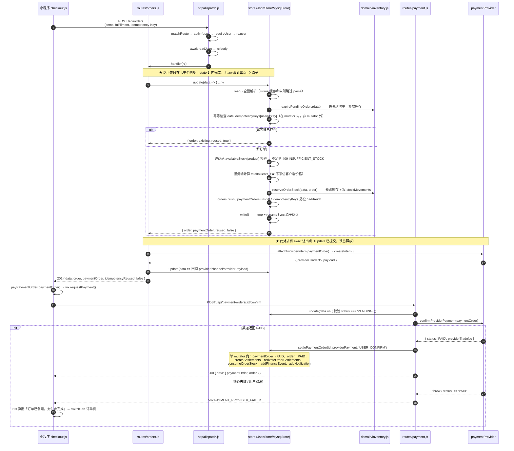
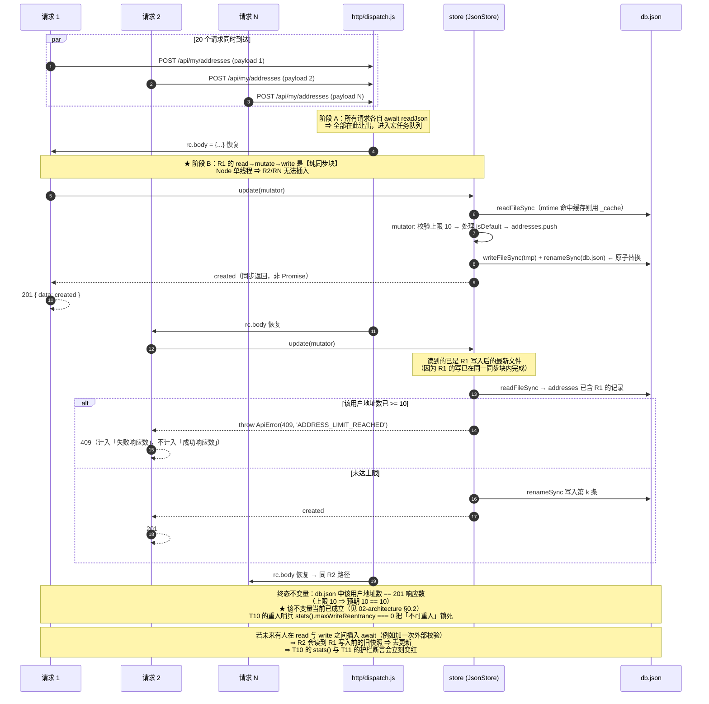
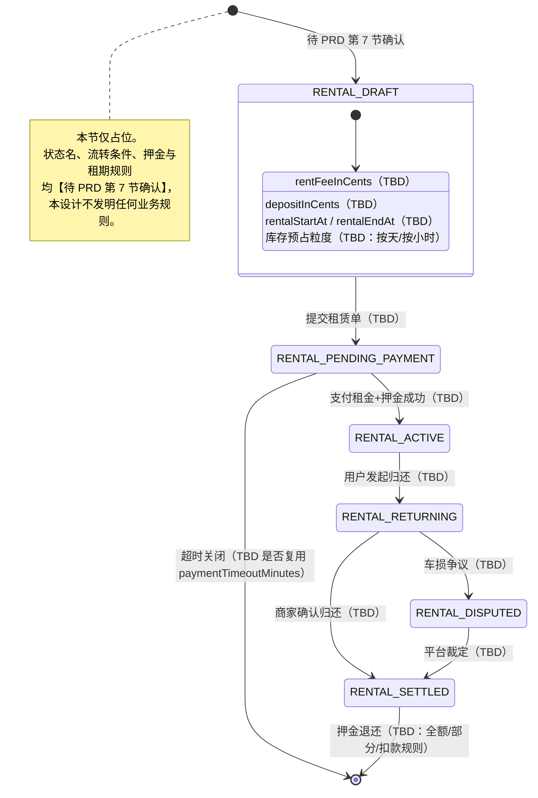
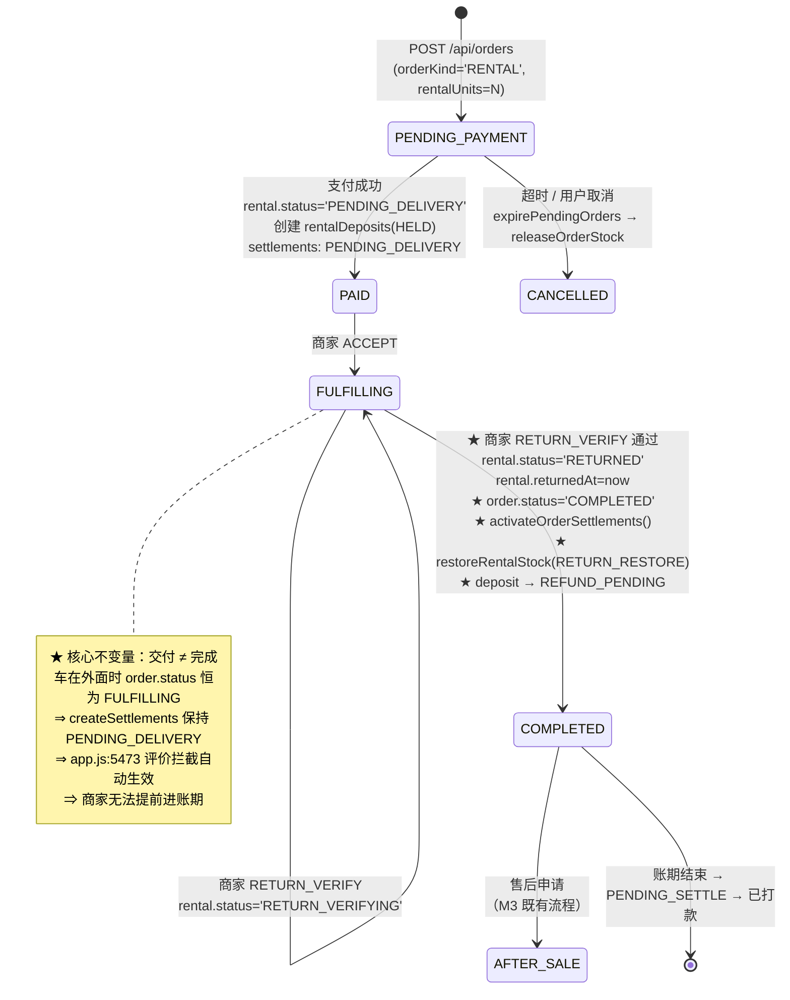
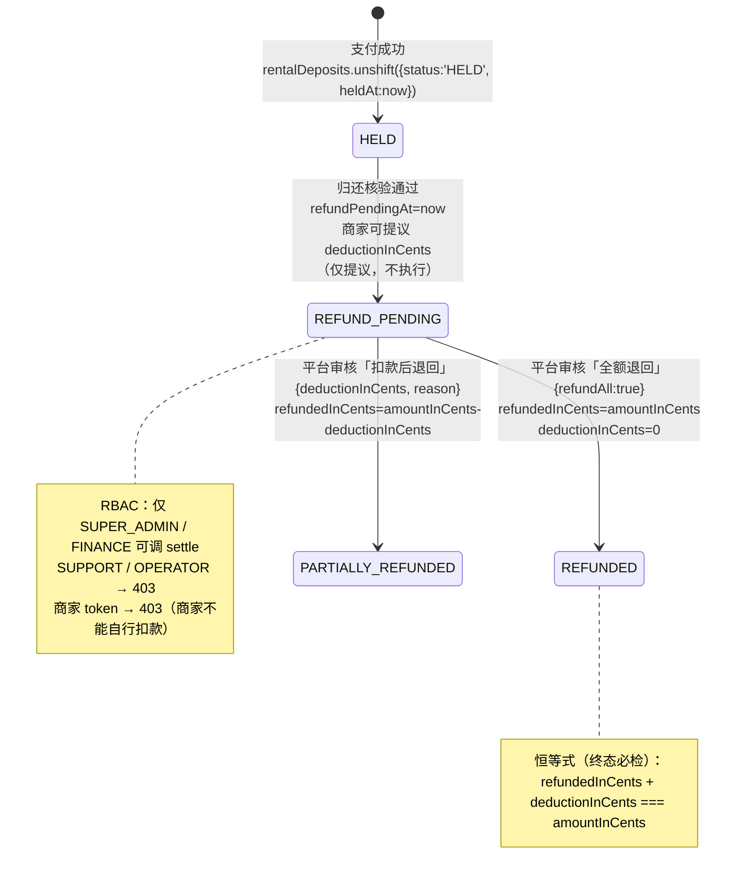

# 狮山智生活（campus-go-mvp）本轮优化 · 系统架构设计与任务分解

> 文档版本：**v1.5**（对齐 **PRD v1.5 最终冻结版**：Q1~Q10 全部裁决 + `M4-P0-01` 判据纠正 + 两段交付 + v1.4 两处资损级修正 + **v1.5 加强 M11 验收**）
> 架构师：高见远
> 编写日期：本轮迭代
> 上游输入：`docs/optimization/01-PRD.md` **v1.5（最终冻结）** + 用户已拍板的三个决策 + 实测代码基线
> 下游产出：`03-tasks.md`（工程师执行）、`04-test-report.md`
>
> **★ 本版本为架构阶段最终版（冻结）**。版本标签与 PRD 对齐为 **v1.5** —— 本设计**内容上已包含** v1.4 的两处资损级修正（见 §11.2 / §11.3），标签此前滞后于内容，本版已统一。
>
> **v1.5 变更摘要（对齐 PRD v1.5：只加强验收标准，不改需求/范围/优先级）**：
> | 变更 | 位置 | 说明 |
> | --- | --- | --- |
> | **★ `M11-P0-02` 断言由 6 条 → 9 条** | T02 | PRD v1.5 定稿 9 条：① 页面数 == `app.json.pages.length`；② 测试数 == 实际用例数；③ `config/api.js` 导出名一致；④ 依赖清单 == `dependencies`；⑤ 不出现 `API_BASE_URL`；⑥ **`.gitmodules` 存在且 `path = server`**；⑦ **`CLAUDE.md` 含「脚手架残留」标注且 `i18n/base.json`、`miniapp/` 仍存在**；⑧ **`README.md` 含「小程序端交付检查清单」且出现「真机」+「微信开发者工具」**；⑨ **`.gitmodules` 的 `url` 为 HTTPS 形式** |
> | **★ 断言 ⑨ 的立意：断言「形式」而非仅「存在」** | T02 / T01 | PRD v1.5 原文：「只断言『配置存在』不够，必须断言『配置的形式正确』—— 本条防的是一个**真实发生过的失效**：`.gitmodules` 曾被创建为 SSH 形式」 |
> | **★ `M11-P0-01` 验收 ④⑤⑥ 明确化** | T01 | ④ `url` 为 HTTPS（**不得为 SSH**）；⑤ **全新克隆内** `git submodule status` 与外层 gitlink 一致（**无 `-` 前缀、无 `+` 前缀**）；⑥ **全新克隆内** server 子模块 `git status` clean（5 文件已提交）。**⚠️ ④⑤⑥ 的求值环境是「全新克隆」，不是当前工作副本** —— 见 §10.5.1 的关键澄清 |
> | **★ `README.md` 必须含 `git submodule update --init --recursive` 步骤** | T01 / §10.5.1 | PRD v1.5 的 `M11-P0-01` 需求 ⑥ 要求 README 的「克隆后如何验证」小节含该命令。**与 §10.5.1「当前工作副本不要跑该命令」不矛盾**：前者针对**全新克隆**（正常生效），后者针对**当前工作副本**（会报错）。**已在 §10.5.1 显式对齐** |
>
> **v1.4 变更摘要（对齐 PRD v1.4 §7.5.6）**：
> | 变更 | 位置 | 说明 |
> | --- | --- | --- |
> | **★ 修正 A：分账激活调用点 6 处（已采纳）** | §11.2 / §11.2.1 / T34 | PRD v1.4 §7.5.6 修正 A **采纳我的发现**：调用点从 1 个更正为 **6 个**，且 v1.3 原写的 `5584` **行号不准确**（实际调用在 **`5590`**）。采纳修法：**函数入口单点守卫**，不改 6 个调用方。**PRD 已追加验证 `#3`（`6486`）是商家端主按钮** |
> | **★ 修正 B：`app.js:1954` 的 `\|\|` 回退（已采纳）** | §11.3 / §11.3.1 / T33 | PRD v1.4 §7.5.6 修正 B **采纳我的发现**：`\|\|` 在 `subtotalInCents === 0` 时回退到 `priceInCents × quantity`，第一层防线在边界失效。采纳修法：`priceInCents` **也承载租金**（第二层）+ 断言 `priceInCents === 4500`（第三层） |
> | **★ 勘误：我的「抽查命中」有 1 处假阳性** | §11.2 | PRD v1.4 §7.5.1 指出：我把 `5584` 报作「已命中」是**假阳性** —— 行号附近确有相关代码，但**覆盖面判断错了**（真正关键位置是 `6486`，调用在 `5590`）。本文已改用 **`5590`（调用）/ `5584`（分支）** 的精确表述 |
> | **★ `.gitmodules` 的 `url` 改为 HTTPS（推翻原 SSH 指令）** | §0.3 / §2 / T01 / §10.5 | 实测**两个仓库均为公开仓库**（`git ls-remote https://...` 无凭据可读）；SSH 形式要求每个克隆方配密钥，会让**全新克隆验收在干净环境变成假红**。改为 `url = https://github.com/komorebi-Lee/e-school-server.git`，推送用 `pushurl` 走 SSH |
> | **★ 子模块中间态与本地验证方式** | §10.5 / T01 | 当前工作副本处于「嵌套仓库 → 子模块」**中间态**（`server/.git` 是目录、`.git/modules` 不存在、`submodule status` 显示 `-`）。**本地不要跑 `submodule update --init`**；验证改用 `git ls-remote` 三方对比 |
> | **★ §7.2 补「回滚方式」列 + 需求↔任务映射表 + T43 归属** | §7.2 | 见 §7.2.1 / §7.2.2 / §7.2.3 |
>
> **v1.2 变更摘要（对齐 PRD v1.3）**：
> | 变更 | 位置 | 说明 |
> | --- | --- | --- |
> | **★ Q10 裁决：两段交付、都在本轮内** | §7.3 / §11.8 / §11.9 / R16 | 我原建议「Track B 顺延下一轮」**已被取代**；21 条 P1 **全部留在本轮**，分两批只是验收顺序。Track B **交付门槛 = 9 条**（T32~T40），T41/T42 为普通 P1 可后置 |
> | **★ `T43`（`M9-P1-01`）改为第一批固定任务** | §7.2 / §7.3 / §11.8 | 不再是「条件任务」；Q10 裁决冲突理由第 3 条明确要求「先交付 Track A 让 `admin.js` 先落到目标结构」 |
> | **★ 存储三层 A/B/C + 执行顺序** | §4.1 / §4.3 / §4.4 / T07 / T09 / T10 | PRD v1.3 §7.5.1 已采纳我的判据纠正。层次 A（`M4-P0-02`，**唯一必失败**）先于层次 C（`M4-P0-01`，护栏）；层次 B 归 `M10-P0-02` |
> | **★ Q6 三段式约束（缓存）** | §4.2.3 / T10 | (a) 94 处确认后才允许加缓存，确认不了就**放弃**（合法交付）；(b) 深拷贝；(c) **可回退开关** `CAMPUS_GO_STORE_CACHE=off` |
> | **★ Q7 定稿参数（上传限流）** | §5.1 #13 / §5.2 / §5.3 / T12 | **每用户每 24h 最多 30 次**（非「20 次/分钟」）；**单键** `uploadRateLimitPer24h`（非 2 键）；**单码** `UPLOAD_RATE_LIMITED`（`UPLOAD_QUOTA_EXCEEDED` 作废） |
> | **★ Q9 真机验证必须** | §8.2 / T02 / T17 | 「工具编译 + 真机确认是必要环节，**不接受仅凭静态断言判定通过**」写入交付检查清单 |
> | **★ Q3 / Q4 裁决** | §8.2 / T02 | Q3 不引入 ESLint/Prettier（`devDependencies` 为空）；Q4 **保留** `i18n/base.json` 与 `miniapp/`，只在 `CLAUDE.md` 标注 |
> | **★ 勘误：`order.status='COMPLETED'` 是 3 处赋值，不是 6 处** | §11.2.2 / §11.5 | PRD v1.3 §7.5.1 已裁定「数字以 3 为准」（`5589`/`6521`/`8029`）；我原「6 处」混淆了赋值形态与比较形态（`'COMPLETED'` 共 37 次：赋值 3、比较 11） |
> | **★ 倍数表述统一为「数量级膨胀」** | §11.3 / R13 | 不写死 71 或 213（取决于是否含租期天数） |
> | **★ R11 / R15 裁决** | §11.4.2 / §11.10 / T39 | R11 押金扣款**本轮不分配、暂挂平台待分配**（不采纳我的「归平台」）；R15 超时费**限定条件展示、不展示金额** |
> | **Q2 已采纳我的 9 模块方案** | §3 | `routes/` 9 个模块承接 135 个分发点；`admin.js` 超 1000 行允许内部再拆 4 个子文件 |
> | **§0.3 升格硬约定** | §4.1.1 | `store.js` 的 `update`/`read`/`write` **三函数体内禁止出现 `await`** |
> | `M11-P0-01` 口径校正 | T01 | 共 **6 个文件**（server 5 + 外层 1）；`.gitmodules` **实测已存在**，**url 须为 HTTPS**（见 v1.4 变更） |

---

## 0. 基线复述与本文档的定位

### 0.1 已实测确认的基线（本轮所有改动的起跑线）

| 项 | 实测值 | 复核方式 |
| --- | --- | --- |
| `server/src/app.js` | **9170 行 / 509656 字节** | `wc -l` |
| `createApp` 函数体 | **1213 → 9168 行（7956 行）** | `grep -n "^function "` |
| `handler` 内部函数 | **`async function app` 起 4434 行**，末尾 9140 行 | 读码 |
| 路由分发点 | **84 个 `pathname === '...'` + 52 个 `pathname.match(...)` = 136 处文本匹配 / 135 个真实分发点** | `grep -c`（见 §3.2 校验） |
| `createApp` 闭包内函数 | **108 个** | `grep -c "^  \(async \)\?function "` |
| 模块级顶层函数 | **46 个**（38 → 4426 行区间） | `grep -n "^function "` |
| 重复调用 | `readJson(request)` ×71、`store.read()` ×94、`store.update(` ×101、`new Date().toISOString()` ×161、`requireUser(request)` ×55、`randomUUID()` ×60 | `grep -c -F` |
| `server/src/store.js` | 389 行；`update()` 是 **全同步** read→mutate→write | 读码 |
| `server/src/mysql-store.js` | 88 行；`flush()` **不 await**，fire-and-forget | 读码 |
| 服务端测试 | `cd server && node --test` → **152 pass / 0 fail**（本机复核通过，16.1s） | 已跑 |
| 小程序页面 | `app.json` 注册 **32 页**，tabBar **4 项** | 读码 |
| git 状态 | 外层 `server` 为 `160000` gitlink（commit `c4f01a5`）；**`.gitmodules` 实测已存在**（**url 须改为 HTTPS：`https://github.com/komorebi-Lee/e-school-server.git`**，见 v1.4 变更；**勘误：v1.0 曾写「无 `.gitmodules`」，为误判**）；`server/` 内 5 个文件未提交；外层 `test/miniapp.test.js` 未提交；**子模块处于「嵌套仓库 → 子模块」中间态**（见 §10.5） | `git ls-files -s` / `git status` / `Test-Path .gitmodules` |

### 0.2 本文档的一个关键前置结论（会改变 P0-3 的验收方式，请 PM / 主理人知悉）

**PRD 第 4 节 M4-P0-01 声称「并发 20 次 `POST /api/my/addresses` 后地址数必然 < 20，当前必失败」——本结论经代码复核后不成立。**

理由（逐条可验证）：

1. `JsonStore.update()` 的实现是 `read()`（`fs.readFileSync` 同步）→ `mutator(data)`（同步，全仓 **0 个 async mutator**，`grep -n "store.update(async"` 无命中）→ `write()`（`fs.writeFileSync` + `renameSync` 同步）。**整段没有任何 `await`**。
2. Node.js 是单线程事件循环，**同步代码段不可被打断**。因此单个 `update()` 调用天然是原子的，不存在「两个并发请求的 read 都读到旧快照」的窗口。
3. 以 `POST /api/my/addresses`（`app.js:4574-4598`）为例：`await readJson(request)` 是唯一的让出点，让出点**之后**到 `store.update()` 之间全是同步代码。20 个并发请求依次恢复执行，每个都在自己的同步块里完成 read→push→write。
4. 另外该接口存在业务上限 `userAddresses.length >= 10 → 409 ADDRESS_LIMIT_REACHED`（`app.js:4580-4583`）。所以 20 并发最多成功 10 条，「地址数 == 成功响应数」= `10 == 10`，**该断言在当前代码上就是绿的**。
5. `POST /api/orders`（`app.js:8695-8779`）同理：库存校验、`reserveOrderStock`、幂等键写入**全部在同一个同步 mutator 内**，因此 10 并发下单也不会丢单。

**结论：`JsonStore` 当前的写路径是「已经正确但脆弱的」——正确是因为同步，脆弱是因为任何人只要在 read 与 write 之间插入一个 `await`，就会立刻退化成真实的丢更新 bug。**

因此本文档把 P0-3 拆成**三个层次**，验收判据据实重新设计（见 §4.4）：

| 层次 | 缺陷 | 是否当前真实可复现 | 对应任务 |
| --- | --- | --- | --- |
| **A. 真实缺陷（必失败→必通过）** | `MysqlStore.flush()` 无序 fire-and-forget，连写两次可能旧值覆盖新值 | ✅ **是**，注入 fake pool 即可稳定复现 | T09 |
| **B. 真实缺陷（必失败→必通过）** | 单请求内 `store.read()` 最多 94 次全量 `JSON.parse`（22+ 集合）；`read()` 无缓存 | ✅ **是**，spy 计数断言可稳定复现 | T07 / T10 |
| **C. 结构性加固（防止未来退化）** | `JsonStore.update()` 缺少显式的串行化契约与可观测性 | ❌ 否（当前同步所以正确）；改为断言**不变量**而非断言 bug | T10 |

> **★ 该复核纠正已被 PRD v1.3 §7.5.1 采纳**（团队负责人亲自实测验证，纠正成立）：M4-P0-01 的验收标准第 1 条（20 并发地址）**保留为端到端护栏**并显式标注「**当前即为绿，不作为本轮必失败判据**」；真实必失败判据改为**层次 A**（`M4-P0-02` = T09，注入 fake pool 判据）与**层次 B**（`M10-P0-02` = T07，`store.read()` ≤ 1 判据）；**执行顺序对调为「层次 A 先于层次 C」**。存储三层完整对照表见 **§4.1**，PRD 侧见 §7.5.1 与附录 A.2 的 `A-P0-3`。

### 0.3 已拍板决策对本设计的约束（**不可协商，以 PRD v1.5（最终冻结版）为准**）

> **★ 版本权威说明（三层）**：本节所有引用的「PRD v1.3 §X」为**决策首次作出处**；**v1.4 修正了两处范围不足**（v1.3 的「冲突点 2」与「`M12-P0-02` 验收标准 ②」，见 v1.4 §7.5.6，详见 §11.2 / §11.3）；**v1.5 是最终冻结版** —— **v1.5 只加强验收标准，不改任何需求本身、不改范围、不改优先级**（`M11-P0-02` 断言 6 条 → **9 条**，`M11-P0-01` 验收 ④⑤⑥ 明确化，见 §7.2 波次 A 的 T01/T02）。**一切以 v1.5 为准。**

**A. 用户拍板的三项（Q1 / Q5 / Q8）**

| 决策 | 对架构的硬约束 |
| --- | --- |
| ① `server/` **保留**独立仓库与远程 `e-school-server.git`，**不移除 `server/.git`、不合并仓库** | 外层 `.gitmodules` 必须正确注册子模块（**★ 实测已存在**）。**★ v1.4 更正：`url` 必须为 HTTPS 形式 `https://github.com/komorebi-Lee/e-school-server.git`**（**推翻原 SSH 指令** —— 实测**两个仓库均为公开仓库**，`git ls-remote https://...` 无凭据即可读；SSH 形式要求每个克隆方配密钥，会让**全新克隆验收在干净环境里变成假红**）。推送用 `pushurl` 走 SSH（`url` 保持 HTTPS 不变）。必须把 `server/` 5 个未提交文件 + 外层 1 个文件（**共 6 个**）**push 到 `e-school-server.git`**；外层 gitlink 必须同步到新 commit；**架构设计不得出现「把 server 并入外层仓库」的方案**（PRD Q1 的建议①作废） |
| ② **允许**修改 `app.json` 的 `tabBar.list` 数组，但不得改 `pages/map/**`、`assets/map/**`、`assets/campus/q/**`、`data/campus-map.js`、`data/pois.js`、`permission.scope.userLocation`、`requiredPrivateInfos` | **已定稿：把「市集」提为第 5 个 tab**（T18 改 `tabBar.list`，只做**追加**，`git diff app.json` 只允许出现新增行）。**硬约束**：`TABBAR_PAGES` 白名单必须从 `app.json` **派生**（`require('../../app.json')`），不得硬编码，否则 T18 一改白名单即过期；连带 3 处 `navigateTo('/pages/market/market')` 必然失败，已定位 `home.js:88`、`forum/forum.js:79`、`market/item.js:88`，须改为 `wx.switchTab`（见 §11.7） |
| ③ 电瓶车**租赁一并建模** | **已落地**：M12 共 13 条需求（5 P0 + 6 P1 + 2 P2）。架构落位见 **§11**，任务见 **§11.8 的 T32~T43**。三条不可协商原则：**不新增 `category`**、**不新增下单接口**（复用 `POST /api/orders`）、**不新增 `order.status` 枚举**。原 T29~T31 占位任务**已作废** |

**B. 团队负责人已裁决的其余事项（Q2 / Q3 / Q4 / Q6 / Q7 / Q9 / Q10，PRD v1.3 §6 + §7.4 + §7.5）**

| 裁决 | 对架构的硬约束 | 落位 |
| --- | --- | --- |
| **Q2 `app.js` 拆分粒度 → 采纳架构师的 9 模块方案** | `routes/` 下 **9 个模块**：`assets(5)/auth(3)/catalog(6)/community(11)/profile(20)/orders(18)/payment(11)/merchant(23)/admin(38)`，共承接 **135 个分发点**；`routes/admin.js` 若超 1000 行**允许内部再拆 4 个子文件**。**不再讨论粒度问题** | §3 |
| **Q3 代码风格工具 → 本轮不引入** | 不产生 `eslint.config.js` / `.prettierrc`；`package.json` 的 `devDependencies` **为空或不存在**；替代方案只落 `CONTRIBUTING.md` 风格约定 | §8.2 / T02 |
| **Q4 `i18n/base.json` 与 `miniapp/` → 本轮保留，不删除** | **不删除文件**；改为在 `CLAUDE.md` 标注「脚手架残留，无任何代码引用，可安全删除」 | T02 |
| **Q6 请求级 store 快照 → 有条件批准（三段式约束）** | (a) **94 处 `store.read()` 全部确认无原地修改才允许加 mtime 缓存**；确认不了就**放弃缓存**（合法交付形态）；(b) **缓存返回值必须深拷贝**；(c) **必须提供可回退开关**（`CAMPUS_GO_STORE_CACHE=off`），验收含「缓存关闭时行为与当前完全一致」 | §4.2.3 / T10 |
| **Q7 上传配额 → 定稿参数** | **每用户每 24 小时最多 30 次**（非「20 次/分钟」）；`adminSettings` **只加 1 键** `uploadRateLimitPer24h`（范围 1–200、默认 30）；**只有 1 个错误码** `UPLOAD_RATE_LIMITED`（`UPLOAD_QUOTA_EXCEEDED` 作废），`message` 必须含剩余等待时间；**不做孤儿文件清理** | §5.1 #13 / §5.2 / §5.3 / T12 |
| **Q9 小程序端真机验证 → 必须，写入交付检查清单** | ① 所有小程序端改动必须在**微信开发者工具编译预览**确认；② **核心链路（下单 → 支付 → 订单 → 售后）真机走通**；③ **「工具编译 + 真机确认是必要环节，不接受仅凭静态断言判定通过」** | T02 / T17 / §8.2 |
| **Q10 交付批次 → 两段交付，都在本轮内** | **不压缩范围**：Track A = P0 8 + 1 工程项 / P1 **15**；Track B = 租赁 **9 条**（5 P0 + **4 门槛 P1**）。**21 条 P1 全部留在本轮**，分两批只是验收顺序。**`M9-P1-01` 必须以 T43 落在第一批**（先让 `admin.js` 落到目标结构，Track B 再叠加） | §7.3 / §11.8 / §11.9 |
| **`M4-P0-01` 判据纠正 → 采纳架构师复核** | 存储写入拆 **A/B/C 三层**：**A（`M4-P0-02`，唯一当前必失败）先于 C（`M4-P0-01`，护栏）**；B 归 `M10-P0-02`。**`update`/`read`/`write` 三函数体内禁止出现 `await`**（升格为 §0.3 硬约定） | §4.1 / §4.2.4 / T07 / T09 / T10 |
| **★ v1.4 §7.5.6 修正 A → 采纳架构师发现（资损级）** | **分账激活调用点从 1 个更正为 6 个**；**不改 6 个调用方，改函数入口单点守卫**（`app.js:2001`）。v1.3 原写的 `5584` 为**分支判断位置**，**真正调用在 `5590`**；**关键位置是 `6486`（商家端主按钮）** | §11.2 / §11.2.1 / T34 |
| **★ v1.4 §7.5.6 修正 B → 采纳架构师发现（资损级）** | `app.js:1954` 的 `\|\|` 回退在 `subtotalInCents === 0` 时回退到 `priceInCents × quantity` ⇒ **数量级膨胀**。采纳：`priceInCents` **也承载租金**（第二层）+ 断言 `priceInCents === 4500`（第三层） | §11.3 / §11.3.1 / T33 |

### 0.4 本轮禁区（一行都不碰）

`miniprogram/pages/map/`、`miniprogram/data/campus-map.js`、`miniprogram/data/pois.js`、`miniprogram/assets/map/`、`miniprogram/assets/campus/q/`、根 `test/miniapp.test.js` 中 3 处 `require('campus-map')` 用例、`app.json` 的 `tabBar` 中「地图」项、`permission.scope.userLocation`、`requiredPrivateInfos`。

---

## 1. 实现方案总览与框架选型

### 1.1 为什么继续不引入任何 Web 框架

| 候选 | 结论 | 理由 |
| --- | --- | --- |
| Express / Koa / Fastify | **不引入** | ① 违反 PRD 0.3「服务端除 `mysql2` 外不新增 npm 包」；② `app.js` 已自研 `sendJson` / `readJson` / CORS 白名单 / 8MB 上限 / 静态文件 / `ApiError`，功能等价且已被 1585 条断言覆盖；③ 换成框架需要重写 135 个分发点的错误语义，回归风险极高 |
| 自研「路由表 + 模块装配」 | **采用** | 纯 CommonJS 函数组合，零依赖，可被 `node --test` 直接 require 单测；`createApp` 退化为「依赖注入 + 路由表拼装」 |
| 引入打包器 / TypeScript | **不引入** | PRD 附录 B 明确不做；且小程序端原生 ES6 无构建是现状约束 |
| 引入 ORM / 换数据库 | **不引入** | PRD 附录 B 明确不做 |
| devDependency（ESLint/Prettier） | **本轮不引入** | **★ Q3 已裁决**（PRD v1.3 §7.5.2）：存量文件上首次启用会产生海量噪声改动，与「最小变更」冲突。**运行时依赖保持只有 `mysql2`，`devDependencies` 也为空**。替代方案：只落 `CONTRIBUTING.md` 风格约定 |

### 1.2 分层方案整体思路

**核心判断：本轮是「20k 行存量项目的增量优化」，不是重写。因此拆分策略必须满足两个硬约束：**

- **约束 1（正确性）**：每完成一步，`cd server && node --test` 必须 **152 pass / 0 fail**。任何一步破坏测试即回滚该步。
- **约束 2（可执行性）**：迁移必须是**机械动作**（剪切 + 改 import + 补签名），不允许在迁移的同时改业务逻辑。业务逻辑修复必须放在迁移**之后**的独立提交里。

由此得出四层结构：

```
                    ┌─────────────────────────────────────────┐
   HTTP 入口        │ server.js   http.createServer(createApp) │
                    └────────────────────┬────────────────────┘
                                         │
                    ┌────────────────────▼────────────────────┐
   装配层           │ app.js  createApp()  ≤ 200 行            │
                    │  · 依赖注入（store / provider / sessions）│
                    │  · 路由表拼装 routes/*.js                │
                    │  · 分发器：匹配 → 前置处理 → 调 handler   │
                    └────────────────────┬────────────────────┘
                                         │
        ┌────────────────────────────────┼────────────────────────────────┐
        │                                │                                │
┌───────▼─────────┐          ┌───────────▼──────────┐        ┌────────────▼───────────┐
│ routes/  9 个域  │          │ http/  4 个基础设施   │        │ domain/  9 个纯业务函数 │
│ 每个导出         │◄────────►│ ApiError / sendJson   │        │ 无 IO、无闭包捕获、     │
│ RouteDef[]       │  依赖     │ readJson / guards     │        │ 可独立单测              │
│ 135 个分发点     │          │ dispatch / context    │        │ 约 110 个函数           │
└─────────────────┘          └───────────────────────┘        └────────────────────────┘
                                         │
                    ┌────────────────────▼────────────────────┐
   存储层           │ store.js (JsonStore)  mysql-store.js    │
                    │  · 写后合并串行化 + 可观测 health()      │
                    │  · read() mtime 缓存                    │
                    └─────────────────────────────────────────┘
```

**关键设计取舍：路由 handler 内部继续直接调用 `sendJson(response, ...)` 并 `return`**，而不是改成「返回 `{status, body}`」。

- 理由：`sendJson` 在 `app.js` 中出现 **152 次**，改成返回值形态等于把 152 处业务代码重写一遍，违反约束 2（迁移必须机械）。保留 `sendJson` 后，迁移 = **整段剪切 + 删掉 1 行 `requireUser`/`readJson` + 把 `userId` 改名 `rc.user.userId`**，是真正可机械执行、可逐段 diff 的动作。
- 代价：handler 与 `response` 仍有耦合。这是**有意接受的债务**，列入 §10（R6）。

---

## 2. 目标文件结构

图例：`[新]` 新增 · `[改]` 修改 · `[删]` 删除 · `[不动]` 本轮不碰

```
campus-go-mvp/
├── .gitmodules                                   [改] 注册 server 子模块（决策①）；**实测已存在**，T01 校验并确保 url 为 HTTPS
├── CLAUDE.md                                     [改] T02 文档一致性
├── README.md                                     [改] T01 增加「克隆后如何验证」；T02 修正数字
├── package.json                                  [改] 增加 scripts.test:miniapp-runtime（T17）
├── test/
│   ├── miniapp.test.js                           [改] 仅提交，不改内容（3 处 map 用例冻结）
│   └── miniapp-runtime.test.js                   [新] T17 小程序运行时测试（≥25 条）
│
├── miniprogram/
│   ├── app.json                                  [改] T18（可选：市集提为第 5 tab）
│   │                                                   ⚠️ tabBar「地图」项 / userLocation / requiredPrivateInfos 不动
│   ├── utils/                                    [新] 本轮新建目录
│   │   ├── navigation.js                         [新] T13 openLink / TABBAR_PAGES
│   │   ├── format.js                             [新] T22 formatDate / formatMoney / 倒计时
│   │   ├── upload.js                             [新] T19 uploadImage（收敛 4 处副本）
│   │   └── order-card.js                         [新] T22 订单卡片装饰纯函数
│   ├── services/
│   │   ├── api.js                                [不动]
│   │   ├── business.js                           [改] T18 增加 60s 内存缓存
│   │   ├── payment.js                            [改] T19 错误码映射表
│   │   └── merchant.js                           [新] T28 工作台分块数据函数 + 装饰纯函数
│   ├── lib/cloud-request.js                      [不动]
│   ├── config/api.js                             [不动]（导出 CLOUD_ENV_ID / CLOUD_SERVICE_NAME）
│   ├── data/
│   │   ├── campus-map.js                         [不动] 禁区
│   │   ├── pois.js                               [不动] 禁区
│   │   └── mock.js                               [改] T18（P2，可选）
│   └── pages/
│       ├── home/                                 [改] T18 兜底价 + 逛论坛入口
│       ├── card/                                 [改] T13 跳转修复；T24 分块错误态；T23 purchasable
│       ├── plate/                                [改] T14 垃圾值 + 错误态
│       ├── profile/                              [改] T13 openLink；T25 学生认证
│       ├── notifications/                        [改] T13 openLink
│       ├── checkout/                             [改] T19 支付失败引导；T21 数量上限
│       ├── orders/                               [改] T22 倒计时；T19 支付/退款进度
│       ├── edit-order/                           [改] T20 409 错误码处理
│       ├── favorites/ footprints/                [改] T23 按 category 分流
│       ├── market/
│       │   ├── publish.js                        [改] T15 contact 必填
│       │   └── mine.js + mine.wxml/wxss/json     [新] T27 「我发布的闲置」
│       ├── forum/
│       │   ├── forum.js  post.js                 [改] T16 点赞态；T26 作者自管理
│       │   └── mine.js + mine.wxml/wxss/json     [新] T26 「我的帖子」
│       ├── merchant/index.js                     [改] T28 分块错误态（目标 ≤500 行）
│       └── map/                                  [不动] 禁区
│
└── server/
    ├── package.json                              [不动] dependencies 仅 mysql2
    ├── README.md                                 [改] T02
    ├── .env.example                              [不动]
    ├── data/
    │   ├── db.json                               [不动]（运行时产物）
    │   └── probe.json                            [不动] P2 残留物，本轮不处理
    ├── public/
    │   ├── admin.html                            [改] T01 提交；M9-P1-01（P1 降级，Track A 不改 → 同轮交付时见 T43）
    │   └── admin.js                              [改] T01 提交（模块化拆分 M9-P1-01 本轮降级）
    ├── src/
    │   ├── server.js                             [改] T07 传递 nowIso / 结构化日志开关
    │   ├── app.js                                [改] ★本轮核心，9170 行 → ≤800 行
    │   ├── store.js                              [改] T10 串行队列 + stats + mtime 缓存
    │   ├── mysql-store.js                        [改] T09 写后合并串行化 + health()
    │   ├── payment-provider.js                   [不动]
    │   ├── wechat-pay-transport.js               [不动]
    │   ├── http/                                 [新] 基础设施层
    │   │   ├── api-error.js                      [新] ApiError（+ re-export 契约）
    │   │   ├── respond.js                        [新] sendJson / sendStatic / CORS
    │   │   ├── body.js                           [新] readJson / requireString / requirePositiveInteger
    │   │   ├── guards.js                         [新] createUserGuards / createAdminGuards（工厂）
    │   │   ├── context.js                        [新] createRequestContext
    │   │   └── dispatch.js                       [新] 路由表匹配 + 前置处理 + 统一 catch
    │   ├── utils/
    │   │   └── time.js                           [新] nowIso / addHours / localDateKey
    │   ├── domain/                               [新] 纯业务函数层（无 IO）
    │   │   ├── catalog.js                        [新] 库存/促销/曝光/店铺展示
    │   │   ├── inventory.js                      [新] 预占/释放/消耗/回补/超时关单
    │   │   ├── orders.js                         [新] 交付码/时段校验/协同
    │   │   ├── settlement.js                     [新] 结算/提现/退款金额
    │   │   ├── scoring.js                        [新] 服务分/风险/趋势
    │   │   ├── compliance.js                     [新] 商品合规巡检
    │   │   ├── settlement-tasks.js               [新] 对账任务/SLA 工时
    │   │   ├── notifications.js                  [新] 站内信/订阅消息/链接生成
    │   │   └── public-view.js                    [新] 对外序列化 + 脱敏
    │   └── routes/                               [新] 路由域模块（9 个）
    │       ├── index.js                          [新] 汇总注册顺序
    │       ├── assets.js                         [新] 5 个分发点
    │       ├── auth.js                           [新] 3 个分发点
    │       ├── catalog.js                        [新] 6 个分发点
    │       ├── community.js                      [新] 11 个分发点
    │       ├── orders.js                         [新] 18 个分发点
    │       ├── payment.js                        [新] 11 个分发点
    │       ├── merchant.js                       [新] 23 个分发点
    │       ├── profile.js                        [新] 20 个分发点
    │       └── admin.js                          [新] 38 个分发点
    └── test/
        ├── api.test.js                           [改] ★仅允许新增断言
        ├── docs-consistency.test.js              [新] T02（5 条断言）
        ├── store-concurrency.test.js             [新] T09 + T10 + T11
        ├── store-contract.test.js                [新] T10（双实现契约，MySQL 不可用 skip）
        ├── uploads-limit.test.js                 [新] T12
        ├── request-log.test.js                   [新] T08
        ├── route-table.test.js                   [新] T04~T06 结构守卫
        ├── auth-matrix.test.js                   [新] T04~T06 权限矩阵回归
        └── payment-*.test.js (12 个)             [不动] 回归安全网
```

---

## 3. `app.js` 分层拆分方案（本轮核心）

### 3.1 拆分后的三层职责边界

| 层 | 目录 | 允许依赖 | 禁止 | 单测方式 |
| --- | --- | --- | --- | --- |
| **http** | `server/src/http/` | `node:*`、`domain/*`（仅 `api-error` 不需要） | 禁止依赖 `routes/*`；禁止读 `store` | 直接 require，注入 mock `request`/`response` |
| **domain** | `server/src/domain/` | `http/api-error.js`、`utils/time.js` | **禁止 `require('node:fs')`**、禁止 `store.read()`、禁止闭包捕获 `sessions` | 纯函数，直接 require，传入 plain object |
| **routes** | `server/src/routes/` | `http/*`、`domain/*` | 禁止在模块顶层读 `store`（必须走 ctx 注入） | 导出 `RouteDef[]`，可断言路由表结构与 handler 可调用性 |
| **装配** | `server/src/app.js` | 全部 | 禁止出现 `pathname ===` | 集成测试（现有 152 条） |

### 3.2 每个路由模块承接的路由（真实行号，已脚本校验）

> **行号说明**：以下行号均为 **拆分前 `app.js` 的当前行号**。由于各域分支在文件中**交错分布**（例如 `profile` 的 `POST /api/leads` 在 7297 行，而 `admin` 的分支在 7761 行），**不存在「连续行号区间」的域切分**。因此迁移**必须按 §3.6 的自底向上顺序逐段进行**，避免行号漂移。
>
> 校验脚本：把 135 个分发点按域分桶后，与 `grep -n "pathname === '"` + `grep -n "pathname.match("` 的输出做差集，**未分配 = 0**，唯一多出的 4460 行是三元表达式 `pathname === '/admin' ? ...` 而非分支。

#### 3.2.1 `routes/assets.js` —— 5 个分发点

| 行号 | 路由 | 说明 |
| --- | --- | --- |
| 4442 | `GET /favicon.ico` | 204 空响应 |
| 4447 | `GET /tcb_probe` | 云托管探针 |
| 4452 | `GET /` | 302 → `/admin` |
| 4458 | `GET /admin`、`GET /admin/*` | `sendStatic` + `path.basename` 防穿越（**安全基线，必须原样保留**） |
| 5063 | `GET /health` | 本轮 T09 追加 `store` 健康字段 |

#### 3.2.2 `routes/auth.js` —— 3 个分发点

| 行号 | 路由 | 说明 |
| --- | --- | --- |
| 4466 | `POST /api/admin/login` | 锁定持久化 `adminLoginFailures` + `timingSafeEqual` |
| 4501 | `POST /api/auth/login` | 支持 `x-wx-openid` 平台头 + `wechatAuth(code)` |
| 4522 | `POST /api/auth/demo-login` | 演示登录 |

> `POST /api/admin/admins`（4981）与 `adminUserMatch`（5026）**归入 `routes/admin.js`**，不归 auth。

#### 3.2.3 `routes/profile.js` —— 20 个分发点

| 行号 | 路由 | 备注 |
| --- | --- | --- |
| 4529 | `GET/POST /api/order-message-subscriptions` | 订阅开关 |
| 4553 | `pathname.match(/^\/api\/my\/addresses\/([^/]+)$/)` | `addressMatch` |
| 4554 | `pathname === '/api/my/addresses' \|\| addressMatch` | 地址分组入口 |
| 4568 | `GET /api/my/addresses` | 内层分支 |
| 4574 | `POST /api/my/addresses` | 内层分支（**上限 10 条**） |
| 4651 | `POST /api/uploads` | T12 加限流/配额 |
| 4674 | `match(/^\/api\/products\/([^/]+)\/restock-alert$/)` | 到货提醒 |
| 4675 | `match(/^\/api\/products\/([^/]+)\/favorite$/)` | 收藏切换 |
| 4676 | `GET /api/my/favorites` | 收藏列表 |
| 4703 | `POST /api/my/footprints` | 写入足迹 |
| 4722 | `GET /api/my/footprints` | 足迹列表（上限 200） |
| 4744 | `GET /api/my/recommendations` | 推荐 |
| 4944 | `POST /api/identity/verify` | 实名（T25 前端接入） |
| 7297 | `POST /api/leads` | 咨询线索（**注意：位于 orders 域行区间内**） |
| 7385 | `GET /api/my/orders` | 我的订单聚合 |
| 7402 | `GET /api/my/product-reviews` | 我的评价 |
| 7425 | `GET /api/my/notifications` | 通知列表 |
| 7434 | `POST /api/my/notifications/read` | 全部已读 |
| 7446 | `match(/^\/api\/my\/notifications\/([^/]+)\/read$/)` | 单条已读 |
| 7460 | `match(/^\/api\/my\/notifications\/([^/]+)\/action$/)` | 通知动作（收藏降价等） |

#### 3.2.4 `routes/catalog.js` —— 6 个分发点

| 行号 | 路由 | 备注 |
| --- | --- | --- |
| 5068 | `GET /api/products` | T23 加 `purchasable`；M1-P2-02 加 `q` |
| 5103 | `GET /api/recharge-promos` | 话费活动 |
| 5337 | `GET /api/business-config` | `publicSettings`（T21 输出 `maxOrderQuantityPerItem`） |
| 5341 | `GET /api/subscribe-templates` | 订阅模板 |
| 5382 | `match(/^\/api\/products\/([^/]+)$/)` | 商品详情 |
| 5460 | `POST /api/product-reviews` | 发布评价 |

#### 3.2.5 `routes/community.js` —— 11 个分发点

| 行号 | 路由 | 备注 |
| --- | --- | --- |
| 5112 | `GET /api/market/items` | T15 过滤 `DELETED`；T27 |
| 5125 | `POST /api/market/items` | **T15 contact 必填** |
| 5168 | `GET /api/my/market-items` | T27 前端接入 |
| 5177 | `match(/^\/api\/market\/items\/([^/]+)$/)` | 详情/改状态（T27 `DELETED`） |
| 5209 | `GET /api/forum/posts` | **T16 点赞态修复（`optionalUser`）**；T26 加 `mine` |
| 5222 | `POST /api/forum/posts` | 发帖 |
| 5257 | `match(/^\/api\/forum\/posts\/([^/]+)$/)` | **T16 详情点赞态修复** |
| 5264 | `match(/^\/api\/forum\/posts\/([^/]+)\/like$/)` | **T16 点赞响应修复** |
| 5279 | `match(/^\/api\/forum\/posts\/([^/]+)\/comments$/)` | 评论 |
| 5305 | `match(/^\/api\/admin\/market-items\/([^/]+)\/status$/)` | 市集审核（**归 community 而非 admin**，因与市集状态机同源） |
| 5321 | `match(/^\/api\/admin\/forum-posts\/([^/]+)\/status$/)` | 论坛审核 |

> **T16 三处精确位置**：`5209-5218`（列表 `.map((post) => publicForumPost(post, null))` 在 **5218 行**）、`5261`（详情 `publicForumPost(post, null)`）、`5334`（点赞响应 `publicForumPost(updated, null)`）。同文件已有 `optionalUser(request)`（`app.js:1705-1711`），直接复用。

#### 3.2.6 `routes/orders.js` —— 18 个分发点

| 行号 | 路由 | 备注 |
| --- | --- | --- |
| 5528 | `POST /api/order-collab` | 订单协同 |
| 7330 | `GET /api/service-records` | 服务单 |
| 7340 | `GET /api/my/charging-eligibility` | 充电资格（`plate.js` 数据源） |
| 7475 | `POST /api/phone-card-orders` | 电话卡下单 |
| 7526 | `POST /api/recharge-orders` | 话费下单 |
| 7582 | `POST /api/broadband-applications` | 宽带申请 |
| 7604 | `POST /api/plate-applications` | 牌照申请 |
| 7680 | `match(/^\/api\/service-records\/([^/]+)\/actions$/)` | 服务单动作 |
| 7681 | `match(/^\/api\/plate-applications\/([^/]+)\/materials$/)` | 牌照材料 |
| 8640 | `POST /api/campus-card-applications` | 校园卡办理 |
| 8667 | `GET /api/campus-card-applications` | 校园卡查询 |
| 8675 | `POST /api/orders` | **下单（金额服务端计算 + 库存预占 + 幂等）** |
| 8784 | `GET /api/orders` | 订单列表 |
| 8792 | `match(/^\/api\/orders\/([^/]+)$/)` | 详情/**T20 改约 409** |
| 8971 | `match(/^\/api\/orders\/([^/]+)\/cancel$/)` | 取消 |
| 8999 | `POST /api/after-sales` | 申请售后 |
| 9100 | `GET /api/after-sales` | 售后列表 |
| 9106 | `match(/^\/api\/after-sales\/([^/]+)\/materials$/)` | 售后补充材料 |

#### 3.2.7 `routes/payment.js` —— 11 个分发点

| 行号 | 路由 | 备注 |
| --- | --- | --- |
| 6543 | `GET /api/admin/payment-orders` | 支付单列表 |
| 6549 | `POST /api/admin/payment-reconciliations/run` | 手动对账 |
| 6718 | `GET /api/admin/finance-tasks` | 财务任务 |
| 6725 | `match(/^\/api\/admin\/finance-tasks\/([^/]+)\/acknowledge$/)` | 认领 |
| 6744 | `match(/^\/api\/admin\/finance-tasks\/([^/]+)\/resolve$/)` | 处理 |
| 6869 | `match(/^\/api\/admin\/payment-orders\/([^/]+)\/refund\/refresh$/)` | 退款查询 |
| 6897 | `match(/^\/api\/admin\/payment-orders\/([^/]+)\/refund$/)` | 发起退款 |
| 8800 | `match(/^\/api\/my\/payment-orders\/by-order\/([^/]+)\/confirm$/)` | 按订单确认支付 |
| 8813 | `match(/^\/api\/payment-callbacks\/([^/]+)$/)` | **支付回调（含延迟支付自动退款）** |
| 8857 | `match(/^\/api\/payment-orders\/([^/]+)$/)` | 重载支付单 |
| 8866 | `match(/^\/api\/payment-orders\/([^/]+)(?:\/(confirm\|cancel\|refund))?$/)` | 确认/取消/退款 |

#### 3.2.8 `routes/merchant.js` —— 23 个分发点

| 行号 | 路由 | 备注 |
| --- | --- | --- |
| 5614 | `POST /api/merchants` | 入驻申请 |
| 5696 | `GET /api/merchants` | 商家列表 |
| 5705 | `match(/^\/api\/merchants\/([^/]+)\/storefront$/)` | 店铺主页 |
| 5748 | `match(/^\/api\/merchants\/([^/]+)\/resubmit$/)` | 驳回后重提 |
| 5818 | `POST /api/merchant/login` | 商家登录 |
| 5834 | `POST /api/merchant/qualification-renewals` | 资质复审 |
| 5874 | `GET /api/merchant/overview` | 工作台总览（T28） |
| 6073 | `GET /api/merchant/revenue-trend` | 趋势（T28 独立错误态） |
| 6120 | `GET /api/merchant/settlement-statement` | 对账单 |
| 6124 | `GET /api/merchant/settlement-statement/export` | 导出 |
| 6160 | `GET /api/merchant/stock-movements` | 库存流水 |
| 6180 | `GET /api/merchant/notifications` | 商家通知 |
| 6191 | `POST /api/merchant/notifications/read` | 已读 |
| 6207 | `GET/POST /api/merchant/message-subscriptions` | 消息订阅 |
| 6238 | `POST /api/merchant/payout-requests` | 提现申请 |
| 6249 | `POST /api/merchant/score-cases` | 服务分申诉 |
| 6314 | `GET /api/merchant/score-cases` | 申诉列表 |
| 6322 | `GET /api/merchant/payout-requests` | 提现列表 |
| 6330 | `POST /api/merchant/products` | 上架商品 |
| 6382 | `match(/^\/api\/merchant\/products\/([^/]+)$/)` | 商品改/删 |
| 6463 | `match(/^\/api\/merchant\/orders\/([^/]+)\/status$/)` | 履约状态 |
| 6498 | `match(/^\/api\/merchant\/after-sales\/([^/]+)\/status$/)` | 售后处理 |
| 7861 | `match(/^\/api\/merchant\/product-reviews\/([^/]+)\/reply$/)` | 评价回复 |

#### 3.2.9 `routes/admin.js` —— 38 个分发点

| 行号 | 路由 |
| --- | --- |
| 4896 | `POST /api/admin/uploads` |
| 4920 | `match(/^\/api\/admin\/uploads\/([^/]+)$/)` |
| 4932 | `match(/^\/api\/uploads\/([^/]+)$/)` |
| 4981 | `GET/POST /api/admin/admins` |
| 5026 | `match(/^\/api\/admin\/admins\/([^/]+)$/)` |
| 6763 | `GET /api/admin/notifications` |
| 6770 | `POST /api/admin/patrol/run` |
| 6788 | `GET /api/admin/sla-alerts` |
| 6802 | `match(/^\/api\/admin\/sla-alerts\/([^/]+)\/acknowledge$/)` |
| 6839 | `match(/^\/api\/admin\/sla-alerts\/([^/]+)\/assign$/)` |
| 6996 | `GET /api/admin/revenue-trend` |
| 7041 | `GET /api/admin/overview` |
| 7210 | `GET /api/admin/operations-report/export` |
| 7240 | `match(/^\/api\/admin\/merchants\/([^/]+)\/settle$/)` |
| 7263 | `match(/^\/api\/admin\/payout-requests\/([^/]+)\/review$/)` |
| 7761 | `GET /api/admin/leads` |
| 7762 | `match(/^\/api\/admin\/leads\/([^/]+)$/)` |
| 7781 | `match(/^\/api\/admin\/leads\/([^/]+)\/follow-ups$/)` |
| 7820 | `GET /api/admin/leads/export` |
| 7822 | `match(/^\/api\/admin\/product-reviews\/([^/]+)\/visibility$/)` |
| 7823 | `match(/^\/api\/admin\/product-reviews\/([^/]+)\/urge$/)` |
| 7909 | `match(/^\/api\/admin\/(orders\|phone-card-orders\|recharge-orders\|broadband-applications\|plate-applications\|after-sales)\/([^/]+)\/status$/)` |
| 8073 | `match(/^\/api\/admin\/merchants\/([^/]+)\/status$/)` |
| 8093 | `GET /api/admin/qualification-renewals` |
| 8101 | `match(/^\/api\/admin\/qualification-renewals\/([^/]+)\/review$/)` |
| 8140 | `match(/^\/api\/admin\/products\/([^/]+)$/)` |
| 8143 | `match(/^\/api\/admin\/products\/([^/]+)\/publish-review$/)` |
| 8168 | `GET /api/admin/merchant-scores` |
| 8206 | `match(/^\/api\/admin\/merchant-scores\/([^/]+)\/adjust$/)` |
| 8236 | `match(/^\/api\/admin\/score-cases\/([^/]+)\/review$/)` |
| 8303 | `match(/^\/api\/admin\/service-risk\/([^/]+)\/urge$/)` |
| 8342 | `GET /api/admin/subscribe-templates` |
| 8384 | `POST /api/admin/subscribe-messages/dispatch` |
| 8394 | `match(/^\/api\/admin\/subscribe-messages\/([^/]+)\/retry$/)` |
| 8437 | `match(/^\/api\/admin\/products\/([^/]+)\/compliance-restore$/)` |
| 8457 | `POST /api/admin/recharge-promos` |
| 8496 | `POST /api/admin/products` |
| 8523 | `POST /api/admin/settings` |

#### 3.2.10 分桶汇总

| 模块 | 分发点 | 占比 | 迁移顺序 |
| --- | --- | --- | --- |
| `assets.js` | 5 | 3.7% | 第 1（T04） |
| `auth.js` | 3 | 2.2% | 第 2（T04） |
| `catalog.js` | 6 | 4.4% | 第 3（T04） |
| `community.js` | 11 | 8.1% | 第 4（T05） |
| `profile.js` | 20 | 14.8% | 第 5（T05） |
| `orders.js` | 18 | 13.3% | 第 6（T05） |
| `payment.js` | 11 | 8.1% | 第 7（T05） |
| `merchant.js` | 23 | 17.0% | 第 8（T06） |
| `admin.js` | 38 | 28.1% | 第 9（T06） |
| **合计** | **135** | **100%** | — |

### 3.3 共享依赖如何在模块间传递

**方案：`ctx`（长生命周期依赖）+ `rc`（请求上下文）双层注入，不用全局变量、不用参数逐个传递。**

#### 3.3.1 `ctx` —— 每个域模块只接收一次的长生命周期依赖

```js
// server/src/app.js（装配层构造，传给每个 routes/*.js 工厂）
const ctx = {
  store,                    // JsonStore | MysqlStore
  paymentProvider,          // createPaymentProvider() 的返回值
  wechatAuth,               // 默认 exchangeWeChatCode
  wechatSubscribeSend,      // 默认 sendWeChatSubscribeMessage
  allowedCorsOrigins,       // string[]
  userSessions,             // Map<token, {userId, expiresAt}>   ← 闭包状态，必须注入
  merchantSessions,         // Map<token, merchantId>
  identityVerifications,    // Map（模块级，移入 ctx 便于测试隔离）
  adminLoginMaxFailures,
  adminLoginLockDurationMs,
  configuredAdminPasswordHash,
  // 由 http/guards.js 生成的守卫（内部捕获 userSessions）
  requireUser,
  optionalUser,
  requireAdmin,             // (request, requiredPermission) => adminUser
  requireMerchant,
  // 跨域共享的领域函数（避免每个域模块各 require 一次）
  domain,                   // { inventory, settlement, scoring, ... }
  nowIso                    // utils/time.js 的 nowIso
};
```

#### 3.3.2 `rc` —— 每个请求构造一次的请求上下文

```js
// server/src/http/context.js
function createRequestContext({ request, response, requestId, url, pathname, store, ctx }) {
  const rc = {
    request, response, requestId, url, pathname, store, ctx,
    body: undefined,      // 由 dispatcher 在 route.body === true 时填充
    user: null,           // 由 dispatcher 按 route.auth 填充
    admin: null,          // route.auth === 'admin:*' 时填充
    merchant: null,       // route.auth === 'merchant' 时填充
    params: [],           // 正则捕获组
    startedAt: process.hrtime.bigint(),
    _snapshot: undefined, // 请求级快照（read 至多一次）
    nowIso: ctx.nowIso
  };
  // M10-P0-02：同一请求内 store.read() 至多一次
  rc.readOnce = () => (rc._snapshot ??= store.read());
  return rc;
}
```

#### 3.3.3 `RouteDef` 契约（每个 routes/*.js 的导出形态）

```js
/**
 * @typedef {Object} RouteDef
 * @property {'GET'|'POST'|'PATCH'|'DELETE'|'*'} method
 * @property {string|RegExp} path         字符串=精确匹配；RegExp=捕获组匹配
 * @property {'public'|'user'|'optional-user'|'merchant'|`admin:${string}`} auth
 * @property {boolean} [body]             true → dispatcher 先 await readJson 注入 rc.body
 * @property {boolean} [snapshot]         true → dispatcher 先 store.read() 注入 rc._snapshot
 * @property {number} [order]             同域内匹配优先级（正则路由需要）
 * @property {(rc: RequestContext) => Promise<void>|void} handler
 */

// server/src/routes/profile.js
const { sendJson } = require('../http/respond');
const { requireString } = require('../http/body');
const { ApiError } = require('../http/api-error');

/** @returns {RouteDef[]} */
module.exports = function createProfileRoutes(ctx) {
  return [
    {
      method: 'POST', path: '/api/my/addresses', auth: 'user', body: true, snapshot: true,
      handler: async (rc) => {
        // 迁移后：删掉原 4575 行 `const body = await readJson(request);`
        //          删掉原 4555 行 `const { userId } = requireUser(request);`
        //          body → rc.body ；userId → rc.user.userId
        const body = rc.body;
        const userId = rc.user.userId;
        const normalized = normalizeAddress(body);   // ← 从原分支提升为模块级函数
        if (!/^1\d{10}$/.test(normalized.contactPhone)) {
          throw new ApiError(400, 'VALIDATION_ERROR', '请输入正确的手机号');
        }
        const created = rc.store.update((data) => { /* 原 4580-4597 行原样 */ });
        return sendJson(rc.response, 201, { data: created, requestId: rc.requestId });
      }
    },
    // ...
  ];
};
```

**关键点**：`normalizeAddress` / `sortAddresses` 这类**原来在分支内部定义的局部函数**（`app.js:4556-4566`）必须**提升为模块级函数**，否则迁移后每个 handler 都要重复定义。提升是纯机械动作（不改变行为），且提升了可测试性。

#### 3.3.4 守卫的工厂化（`http/guards.js`）

`requireUser` / `optionalUser` / `requireAdmin` / `requireMerchant` 目前是 `createApp` 闭包内的函数（`1698`、`1705`、`1650`、`2501`），捕获 `userSessions` / `merchantSessions` / `adminSessions`。拆分后必须变成**工厂**：

```js
// server/src/http/guards.js
function createUserGuards({ userSessions, userSessionTtlMs = 7 * 24 * 60 * 60 * 1000 }) {
  function requireUser(request) {
    const token = (request.headers.authorization || '').replace(/^Bearer\s+/i, '');
    const session = token ? userSessions.get(token) : null;
    if (!session || session.expiresAt < Date.now()) {
      throw new ApiError(401, 'USER_UNAUTHORIZED', '请先使用微信登录');
    }
    return session;
  }
  function optionalUser(request) {
    try { return requireUser(request); } catch { return null; }   // 语义完全保持
  }
  function issueUserSession(userId) {
    const token = createHash('sha256').update(`${userId}:${randomUUID()}`).digest('hex');
    userSessions.set(token, { userId, expiresAt: Date.now() + userSessionTtlMs });
    return token;
  }
  return { requireUser, optionalUser, issueUserSession };
}
module.exports = { createUserGuards };
```

`requireAdmin(request, requiredPermission)` 依赖 `adminPermissionForRequest(pathname)`（模块级，`app.js:1154`）+ `adminSessions` + `adminUsers`，同样工厂化。

### 3.4 拆分后 `createApp` 的形态（伪代码）

```js
// server/src/app.js   ——  目标 ≤ 800 行，createApp 函数体 ≤ 200 行
const { randomUUID, createHash } = require('node:crypto');
const { ApiError } = require('./http/api-error');            // ★ 必须 re-export
const { dispatch } = require('./http/dispatch');
const { createRequestContext } = require('./http/context');
const { createUserGuards, createAdminGuards, createMerchantGuards } = require('./http/guards');
const { normalizeCorsOrigins } = require('./http/respond');
const { nowIso } = require('./utils/time');
const domain = require('./domain');                          // 9 个域模块汇总
const buildRouteTable = require('./routes');                 // 汇总 9 个域模块

function createApp({
  store,
  wechatAuth = exchangeWeChatCode,                 // ← 签名保持不变
  wechatSubscribeSend = sendWeChatSubscribeMessage, // ← 签名保持不变
  paymentProvider = createPaymentProvider(),        // ← 签名保持不变
  corsAllowedOrigins,
  adminLoginLockout,
  adminPasswordHash
}) {
  // ---- 1. 依赖装配（≤ 60 行）----
  const allowedCorsOrigins = normalizeCorsOrigins(
    corsAllowedOrigins ?? process.env.CORS_ALLOWED_ORIGINS ?? 'http://localhost:3000,http://127.0.0.1:3000'
  );
  const userSessions = new Map();
  const merchantSessions = new Map();
  const adminSessions = new Map();          // 原为闭包内 saveAdminSession/hashAdminToken 的私有 Map
  const { maxFailures: adminLoginMaxFailures = 5, lockDurationMs: adminLoginLockDurationMs = 15 * 60 * 1000 } = adminLoginLockout || {};

  const guards = {
    ...createUserGuards({ userSessions }),
    ...createAdminGuards({ adminSessions, adminLoginMaxFailures, adminLoginLockDurationMs,
                           configuredAdminPasswordHash: adminPasswordHash || process.env.ADMIN_PASSWORD_HASH || '' }),
    ...createMerchantGuards({ merchantSessions })
  };

  const ctx = { store, paymentProvider, wechatAuth, wechatSubscribeSend, allowedCorsOrigins,
                userSessions, merchantSessions, adminSessions, ...guards, domain, nowIso };

  // ---- 2. 路由表装配（≤ 30 行）----
  const routes = buildRouteTable(ctx);

  // ---- 3. handler（≤ 120 行）----
  const handler = async function app(request, response) {
    const requestId = randomUUID();
    const startedAt = process.hrtime.bigint();
    try {
      response.corsOrigin = resolveCorsOrigin(request, allowedCorsOrigins);
      if (request.method === 'OPTIONS') return sendJson(response, 204, {});
      const url = new URL(request.url, 'http://localhost');
      const pathname = url.pathname.replace(/\/$/, '') || '/';

      const matched = matchRoute(routes, request.method, pathname);   // 精确优先 → 正则按 order
      if (!matched) throw new ApiError(404, 'ROUTE_NOT_FOUND', 'Route not found');

      const rc = createRequestContext({ request, response, requestId, url, pathname, store, ctx });
      rc.params = matched.params;
      await applyPreProcessing(rc, matched.route, guards);            // body / auth / snapshot
      await matched.route.handler(rc);
      logRequest({ requestId, request, pathname, status: 200, startedAt });   // T08
      return;
    } catch (error) {
      return handleError({ error, response, requestId, request, startedAt });  // 原 9131-9139 行语义
    }
  };

  // ---- 4. 后台巡检钩子（原 9141-9166 行，形状不变）----
  handler.startOperationsPatrol = function startOperationsPatrol({ onRun } = {}) { /* 原样 */ };
  handler.runOperationsPatrolOnce = patrolOnce;
  return handler;
}

module.exports = { createApp, ApiError };   // ★ 形态必须保持
```

#### 3.4.1 如何保证 `createApp` 签名与导出形态不变（测试契约）

| 契约 | 保障方式 |
| --- | --- |
| `createApp({ store, wechatAuth, wechatSubscribeSend })` 可调用 | `api.test.js:23-30` 的 `before` 钩子直接构造；T03~T06 每步跑 152 条即验证 |
| `paymentProvider` 默认值 | 保持默认参数 `paymentProvider = createPaymentProvider()`；`payment-*.test.js` 显式注入 |
| `module.exports = { createApp, ApiError }` | `http/api-error.js` 定义 `ApiError`，`app.js` 顶部 `require` 后 **原样 re-export**。⚠️ `security.test.js` 等测试可能 `require('../src/app').ApiError` —— 迁移前必须先 `grep -rn "ApiError" server/test/` 确认，**若有引用则 re-export 是硬要求** |
| `handler.startOperationsPatrol` / `handler.runOperationsPatrolOnce` | 由 `server.js:107` 与巡检测试使用，必须保持 |

### 3.5 循环依赖风险与规避

```
domain/*.js  →  http/api-error.js        （单向，安全）
domain/*.js  →  utils/time.js            （单向，安全）
routes/*.js  →  http/*, domain/*         （单向，安全）
app.js       →  routes/*, http/*, domain/*（单向，安全）
http/dispatch.js → http/api-error.js, http/body.js, http/guards.js（单向，安全）
```

**唯一风险点**：若某个 `domain/*.js` 需要 `sendJson`（不应该），就会形成 `domain → http/respond → domain`。**规避规则：`domain/` 层禁止 require `http/respond.js`**，只能抛 `ApiError`。这条规则写入 T03 的验收判据（`grep -n "require.*http/respond" server/src/domain/` 必须为 0）。

### 3.6 分步迁移顺序与每步验证（★ 关键：自底向上）

**为什么必须自底向上（从文件末尾往上迁）**：迁移会删除行，若从前往后迁，后续所有行号都会漂移，§3.2 的行号索引失效，且每次 diff 都跨越大段代码、极易错位。**从后往前迁**，未迁移部分的行号保持不变。

| 步 | 任务 | 迁移内容 | 迁移后 `grep -c "pathname === '"` | 验证命令 | 回滚点 |
| --- | --- | --- | --- | --- | --- |
| 0 | 基线 | 无 | 84 | `cd server && node --test` → 152 | — |
| 1 | T03 | 抽 `http/` + `domain/` + `utils/time.js`。**只搬模块级函数（38-1212 行）**，`createApp` 内部 108 个闭包函数**本步不动** | 84（不变） | 152 绿；`grep -c "^function " server/src/app.js` ≤ 8 | commit 前 |
| 2 | T04 | 建 `routes/index.js` + `http/dispatch.js`；迁 **assets(5) + auth(3) + catalog(6)** = 14 个分发点（位于 **4442-4527** 与 **5063-5460**） | 84 − 14 = **70** | 152 绿 + `route-table.test.js` | T04 commit |
| 3 | T05a | 迁 **community(11)**（**5112-5336**，含 `userNotificationLink` 调用方） | 70 − 11 = **59** | 152 绿 | T05a commit |
| 4 | T05b | 迁 **orders(18)**（**5528, 7330-7681, 8640-8791, 8971-9129**，**从 9129 往 8971 迁，再 8791 往 8640，再 7681 往 7330，最后 5528**） | 59 − 18 = **41** | 152 绿（**支付/订单测试是最强回归网，18 个支付测试文件全绿**） | T05b commit |
| 5 | T05c | 迁 **payment(11)**（**6543-6900, 8800-8998**） | 41 − 11 = **30** | 152 绿 | T05c commit |
| 6 | T05d | 迁 **profile(20)**（**4529-5020, 7297, 7385-7474**） | 30 − 20 = **10** | 152 绿 | T05d commit |
| 7 | T06a | 迁 **merchant(23)**（**5614-6542, 7861**） | 10 − 23 = **0**（含 1 处非分支） | 152 绿 | T06a commit |
| 8 | T06b | 迁 **admin(38)**（**4896-5050, 6763-7296, 7761-8523**）；`createApp` 收敛到 ≤200 行；`app.js` ≤800 行 | 0 | 152 绿 + `grep -c "pathname === '" app.js` == 0 | T06b commit |
| 9 | T07 | 收敛重复调用：`nowIso()`、请求级快照、`readJson`/`requireUser` 前置化 | 0 | 152 绿 + `new Date().toISOString()` ≤ 5 | T07 commit |

> ⚠️ **步 3~6 的排序说明**：`community` 先于 `orders`/`payment`，因为 `userNotificationLink()`（`app.js:882`）被订单通知大量调用，先把 community 的调用方迁走，能提前暴露「domain 函数导出不全」的问题，而此时订单链路尚未动，定位更容易。
>
> ⚠️ **每步都必须独立 commit**，commit message 统一为 `refactor(app): extract <domain> routes (T0X)`，便于 `git revert` 单步回滚。

---

## 4. 存储层并发安全方案

### 4.1 与 PRD v1.3 的「存储三层拆分」对齐（**已裁决，以本节为准**）

> **PRD v1.3 §7.5.1 已采纳架构师对 `M4-P0-01` 的判据纠正**，并把存储写入问题拆成 A/B/C 三层。**本节的层次编号、判据、执行顺序与 PRD 逐字一致，不得偏离。**

| 层次 | 缺陷 | 当前可复现？ | 归属需求 | **定稿判据（必须照此写测试）** | 本设计落位 |
| --- | --- | --- | --- | --- | --- |
| **A** | `MysqlStore.flush()` 无序 fire-and-forget（`mysql-store.js:71` 未 await、`:75-78` 只挂 `.catch()`），`connectionLimit: 4` 下可能**旧值覆盖新值** | ✅ **是（唯一真实必失败）** | `M4-P0-02` | **注入 fake pool**：第一次 `query` 延迟 30ms、第二次立即 resolve；连续两次 `update` 后断言**最终落库为第二次（新值）** | **T09** |
| **B** | 单请求内 `store.read()` 最多 **94 次**全量 `JSON.parse`，`read()` 无缓存 | ✅ **是** | `M10-P0-02` | **spy 计数**：单请求（`GET /api/products`）`store.read()` 调用次数 **≤ 1** | **T07** |
| **C** | `JsonStore.update()` 缺显式串行化契约与可观测性（**同步所以当前正确**） | ❌ **否（护栏）** | `M4-P0-01` | 不变量 `stats().maxWriteReentrancy === 0`；「并发 20 次地址」断言**保留但标注「当前即为绿」**（`app.js:4584` 的 `ADDRESS_LIMIT_REACHED` 使 20 次并发实际为 `10 == 10`） | **T10** |

**执行顺序（硬性）**：**层次 A（T09）先于层次 C（T10）** —— A 是唯一「当前必失败」的真实缺陷，必须先落地；C 是护栏，晚做不影响正确性。层次 B（T07）与 A/C 可并行（只改 dispatcher 与 `read` 调用方式）。

**本节的方案设计目标**（不是「修一个正在丢数据的 bug」）：

1. **修复唯一真实可复现的写序缺陷**（层次 A）——`MysqlStore.flush()`；
2. **消除读放大**（层次 B）——单请求最多 94 次全量 `JSON.parse`，22+ 集合；
3. **把「同步原子」这个隐式不变量变成显式契约**（层次 C），并用测试锁死，防止未来有人在 read 与 write 之间插入 `await`。

#### 4.1.1 PRD §0.3 升格后的硬性约定（**违反即视为破坏本轮安全基线**）

> `store.js` 的 **`update()` / `read()` / `write()` 三个函数体内禁止出现 `await`**（PRD v1.3 §7.5.1 已把架构师方案升格为 §0.3 硬性约定）。

这条约定的价值在于：**它是层次 C 的正确性来源**。只要这三个函数体保持全同步，Node 单线程下单个 `update()` 就天然原子。任何人在这三个函数体内加一个 `await`，层次 C 立刻退化为「可能丢更新」的真实缺陷 —— 因此 T10 必须同时落一条**源码级结构断言**（见 §4.2.3）。

### 4.2 `JsonStore`：写路径显式串行化（不破坏 101 处调用点）

#### 4.2.1 硬约束（必须遵守，否则 152 条测试大面积失败）

`store.update(...)` 的返回值在 **101 处**被**同步使用**，例如：

```js
// app.js:8695 / 8780
const result = store.update((data) => { /* ... */ return { order, paymentOrder, reused: false }; });
const paymentOrder = result.reused ? result.paymentOrder : await attachProviderIntent(result.paymentOrder);
//                  ^^^^^^^^^^^^^ 同步读取，若 update 返回 Promise 则此处 undefined → 崩
```

**因此 `JsonStore.update()` 必须保持「同步执行 mutator 并同步返回其结果」的签名。** PRD M4-P0-01 建议的「`update` 把整体排入队列尾部并返回 Promise」**会破坏 101 处调用点，不可直接采用**。这是本设计对 PRD 的一处**偏离**，理由与替代方案如下。

#### 4.2.2 代码骨架

```js
// server/src/store.js
class JsonStore {
  constructor(filePath) {
    this.filePath = path.resolve(filePath);
    this._stats = { writeCount: 0, readCount: 0, parseCount: 0, writeReentrancy: 0, maxWriteReentrancy: 0 };
    this._writing = false;          // 重入哨兵：用于断言「写不可重入」
    this._queue = Promise.resolve(); // 异步写队列（供 updateAsync / 未来的异步事务使用）
    // ★ Q6 约束 (c)：可回退开关。off ⇒ read() 走 _readDirect()，行为与改造前逐字节一致。
    this._cacheEnabled = String(process.env.CAMPUS_GO_STORE_CACHE || 'on').toLowerCase() !== 'off';
    this._cache = null;             // mtime 缓存
    this._cacheMtimeMs = -1;
    this.initialize();
  }

  // ---- 读：加 mtime 缓存（M10-P0-02 层次 B 的步骤 2）----
  // ★ Q6 约束 (c)：必须提供开关，可一键关闭缓存回退到直读。
  //   CAMPUS_GO_STORE_CACHE=off ⇒ 行为与改造前【逐字节一致】。
  // ★ Q6 约束 (a)：只有当 94 处 store.read() 全部确认无原地修改时才允许开启。
  read() {
    this._stats.readCount += 1;
    if (!this._cacheEnabled) return this._readDirect();      // ← 可回退路径（T10 验收 ⑤）
    const stat = fs.statSync(this.filePath);
    if (this._cache && stat.mtimeMs === this._cacheMtimeMs) {
      return JSON.parse(JSON.stringify(this._cache));   // ★ Q6 约束 (b)：深拷贝
    }
    const raw = fs.readFileSync(this.filePath, 'utf8');
    this._stats.parseCount += 1;
    this._cache = JSON.parse(raw);
    this._cacheMtimeMs = stat.mtimeMs;
    return JSON.parse(JSON.stringify(this._cache));      // ★ 命中与未命中都返回新对象
  }

  _readDirect() {
    const raw = fs.readFileSync(this.filePath, 'utf8');
    this._stats.parseCount += 1;
    return JSON.parse(raw);
  }

  // ---- 写：保持 tmp + renameSync 原子化（★ 不可改动，PRD 0.3 安全基线）----
  write(data) {
    const temporaryPath = `${this.filePath}.${process.pid}.tmp`;
    fs.writeFileSync(temporaryPath, `${JSON.stringify(data, null, 2)}\n`, 'utf8');
    fs.renameSync(temporaryPath, this.filePath);
    if (this._cacheEnabled) {                            // 写后同步缓存，避免下次 read 重复 parse
      this._cache = data;
      this._cacheMtimeMs = fs.statSync(this.filePath).mtimeMs;
    }
  }

  /**
   * 同步原子写。★ 签名与返回语义完全不变（保护 101 处调用点）。
   * 不变量：read → mutator → write 全同步，中间无 await 让出点 ⇒ 单进程内原子。
   * mutator 抛错 ⇒ 不写文件（保持现有语义，且加断言锁死）。
   */
  update(mutator) {
    if (this._writing) {
      // 只统计不抛错：正常路径永远不会命中；命中说明有人把 update 嵌套进了 mutator
      this._stats.writeReentrancy += 1;
    }
    this._writing = true;
    this._stats.maxWriteReentrancy = Math.max(this._stats.maxWriteReentrancy, this._stats.writeReentrancy);
    try {
      const data = this.read();
      const result = mutator(data);   // 同步；抛错则直接冒泡，不执行 write
      this.write(data);
      this._stats.writeCount += 1;
      return result;
    } finally {
      this._writing = false;
    }
  }

  /**
   * 异步串行写：供「mutator 内部需要 await」的场景使用（本轮无调用方，为未来留口）。
   * 与 update() 共享同一把「队列」，保证 update 与 updateAsync 互不交叉。
   */
  updateAsync(asyncMutator) {
    const run = async () => {
      const data = this.read();
      const result = await asyncMutator(data);
      this.write(data);
      this._stats.writeCount += 1;
      return result;
    };
    const scheduled = this._queue.then(run, run);
    this._queue = scheduled.then(() => undefined, () => undefined);  // 失败不污染队列
    return scheduled;
  }

  stats() {
    return { storage: 'json', filePath: this.filePath, ...this._stats, pendingWrites: this._stats.writeReentrancy };
  }
}
```

**关键设计说明**：

- **`update()` 保持同步**是硬约束，本设计通过「重入哨兵 `_writing` + `stats()`」把不变量**变成可断言的对象**，而不是强行改成 Promise。
- **`updateAsync()` 是新增方法，不替代 `update()`**，因此 101 处调用点零改动。它的价值在于：未来若某个 mutator 需要 `await`（例如需要在事务内调用支付渠道），有正确的入口，而不是被诱导去破坏 `update()` 的同步性。
- **`read()` 深拷贝 + 可回退**：原实现每次 `JSON.parse` 天然返回新对象。加缓存后必须显式深拷贝，否则调用方修改返回值会污染缓存。

#### 4.2.3 Q6 三段式约束（PRD v1.3 §7.5.3 已裁决，**T10 必须逐条满足**）

| 约束 | 定稿要求 | T10 的落地方式 |
| --- | --- | --- |
| **(a) 前置确认** | 只有当 **94 处 `store.read()` 全部确认无原地修改**（无 `push`/`splice`/`sort`/直接赋值属性）时，**才允许**加 mtime 缓存。若无法在合理成本内完成确认 → **放弃 read 缓存**，本轮只做 `updateAsync()` 与不变量可观测化。**不要为性能引入数据风险。** | T10 的第一个 commit 只做 `stats()` + `updateAsync()` + 重入哨兵（**不含缓存**）；缓存是第二个 commit，可单独 revert。`grep -n "store.read()" server/src/app.js` 的 94 处逐条过一遍（`R7`） |
| **(b) 深拷贝** | 若实施缓存，**缓存返回值必须深拷贝** | 上文的 `JSON.parse(JSON.stringify(...))`；断言：改 `read()` 返回值后下次 `read()` 不受影响 |
| **(c) 可回退** | 必须提供开关（环境变量或选项），可一键关闭缓存回退到直读；**`M10-P0-02` 验收必须包含「缓存关闭时行为与当前完全一致」** | `CAMPUS_GO_STORE_CACHE=off` ⇒ `read()` 走 `_readDirect()`。验收 ⑤：同一组请求在 `off` 与改造前**逐字节一致** |

> **★ 允许的合法交付形态（PRD 已明确写入验收标准 ⑦）**：若 (a) 未完成，**允许只交付 T10 的 ①②③④、把 ⑤⑥ 标 `test.skip`，并在 PR 说明「已放弃 read 缓存」—— 这不算未完成**。架构师明确支持这个取舍：`store.read()` 的返回值**被调用方直接原地修改是常态**（`store.update` 的 mutator 就在改它），漏掉任何一处深拷贝都会把「每次读新对象」悄悄变成「所有请求共享同一对象」，这类缺陷**不会立刻报错**，而是在并发下表现为随机数据错乱，**比原问题（性能）严重得多**。

#### 4.2.4 层次 C 的源码级结构断言（把「禁止 await」变成可执行检查）

```js
// T10 新增：test/store-contract.test.js
// 断言 store.js 的 update / read / write 三个函数体内不出现 await
const source = fs.readFileSync('src/store.js', 'utf8');
for (const fn of ['update', 'read', 'write']) {
  const body = extractFunctionBody(source, fn);   // 按花括号配对提取
  assert.ok(!/\bawait\b/.test(body), `store.${fn}() 体内不得出现 await（PRD §0.3 硬性约定）`);
}
```
这条断言的价值：**它是层次 C 正确性的唯一守卫**。一旦有人在 `update()` 的 read 与 write 之间插入 `await`，单进程内就不再原子 —— 而这类回归**没有任何行为测试能稳定捕获**（需要精确的并发时序），只有源码级断言能锁死。

### 4.3 层次 B：`read()` 全量解析的性能问题（本轮处理，但分两步）

> **归属需求**：`M10-P0-02`（PRD v1.3 已明确「`M10-P0-02` 同时承担存储层次 B」）。**判据：spy 计数断言单请求 `store.read()` ≤ 1。**

| 步骤 | 手段 | 任务 | 效果 |
| --- | --- | --- | --- |
| 1 | **请求级快照**：`rc.readOnce()`，dispatcher 在 `route.snapshot === true` 时预读一次，handler 内改用 `rc._snapshot` | **T07** | 单请求 `store.read()` 从最多 94 次降到 **≤1 次**（判据：`GET /api/products` 用 spy 断言 ≤1）★ **当前必失败** |
| 2 | **mtime 缓存**：文件未变更时直接返回上次解析结果（深拷贝），**受 Q6 三段式约束（含可回退开关）** | **T10** | 跨请求重复读从「每次 1 次 `JSON.parse`」降到「仅文件变更时 1 次」 |

**两步都建议做，但优先级不同**：**步骤 1 是层次 B 的必失败判据（P0，必须做）**；**步骤 2 是 Q6 有条件批准项（可能被合法放弃）**。只做步骤 1，跨请求仍每次全量 parse；只做步骤 2，单请求仍重复读 94 次（只是变便宜了）。**若 (a) 前置确认未完成，只交付步骤 1 即为合法交付。**

### 4.4 `MysqlStore.flush()` 串行化（★ 唯一真实可复现的写序缺陷）

#### 4.4.1 缺陷复述

```js
// 现状 server/src/mysql-store.js:67-79
update(mutator) {
  const data = clone(this.cache);
  const result = mutator(data);
  this.cache = data;
  this.flush();          // ← 不 await
  return result;
}
flush() {
  const payload = JSON.stringify(this.cache);
  this.pool.query('INSERT ... ON DUPLICATE KEY UPDATE payload = VALUES(payload)', [payload])
    .catch((error) => console.error(...));   // ← fire-and-forget
}
```

`pool` 的 `connectionLimit: 4` ⇒ 两次连续 `update` 的两个 `INSERT ... ON DUPLICATE KEY UPDATE` **可能在不同连接上并发执行**，MySQL 不保证它们的提交顺序。若第二次（新值 B）先提交、第一次（旧值 A）后提交，**最终落库为 A（旧值）**。这是真实的数据正确性缺陷。

#### 4.4.2 方案：**写后合并（write-behind coalescing）**，而非简单串行队列

> **★ 层次 A 的定稿判据（PRD v1.3 §7.5.1 / 附录 A.2 的 `A-P0-3`，T09 必须照此写测试）**
>
> **注入 fake pool：第一次 `query` 延迟 30ms、第二次立即 resolve；连续两次 `update` 后断言「最终落库的 payload 是第二次（新值）」。**
>
> 这条判据的设计意图：它**精确复现了乱序覆盖**（旧值慢、新值快 ⇒ 旧值后提交）。改造前的 `flush()` 是 fire-and-forget，这个 fake pool 会让测试**稳定失败**；改造后「任意时刻至多一个 flush 在飞 + 循环读取执行时刻的 cache」会让它**稳定通过**。
>
> 配套断言（T09 一并落）：
> ① `health()` 在两次连续 `update` 后 `dirty === false` 且 `flushCount === 2`（或 coalesce 后的实际值，需在测试里显式写死期望）；
> ② `pool.query` 的**调用次数 ≤ `update` 次数**（证明发生了合并，不是每次都写）；
> ③ `lastFlushError` 在正常路径为 `null`；
> ④ 注入一个 reject 的 `pool.query` ⇒ `dirty` 保持 `true`（保留脏标记供重试）且 `lastFlushError` 非空。

```js
// server/src/mysql-store.js
class MysqlStore {
  constructor(options) {
    // ... 原样 ...
    this.dirty = false;
    this._flushPromise = null;
    this.lastFlushAt = '';
    this.lastFlushError = null;
    this.flushCount = 0;
  }

  /** ★ 签名与同步返回语义完全不变（保护调用点） */
  update(mutator) {
    const data = clone(this.cache);
    const result = mutator(data);      // 抛错则不更新 cache、不 flush
    this.cache = data;
    this.dirty = true;
    this.pendingFlush = this._scheduleFlush();   // Promise，但 update 仍同步返回 result
    return result;
  }

  /**
   * 写后合并：任意时刻至多一个 flush 在飞。
   * 循环条件读取「执行时刻」的 this.cache，因此落库的永远是「最新状态」，
   * 与各次 flush 的完成顺序无关 ⇒ 从根上消除乱序覆盖。
   */
  _scheduleFlush() {
    if (this._flushPromise) return this._flushPromise;   // 已有 flush 在飞 ⇒ 复用它（合并）
    this._flushPromise = (async () => {
      try {
        while (this.dirty) {
          this.dirty = false;
          const payload = JSON.stringify(this.cache);      // ← 执行时刻快照，非入队时刻
          await this.pool.query(
            'INSERT INTO app_state (id, payload) VALUES (1, ?) ON DUPLICATE KEY UPDATE payload = VALUES(payload)',
            [payload]
          );
          this.flushCount += 1;
          this.lastFlushAt = new Date().toISOString();
          this.lastFlushError = null;
        }
      } catch (error) {
        this.dirty = true;                                  // ★ 保留脏标记，下次重试
        this.lastFlushError = error.message;
        console.error('[mysql-store] flush failed:', error.message);
      } finally {
        this._flushPromise = null;
      }
    })();
    return this._flushPromise;
  }

  /** M10-P2-02：供 GET /health 输出 */
  health() {
    return { storage: 'mysql', dirty: this.dirty, lastFlushAt: this.lastFlushAt,
             lastFlushError: this.lastFlushError, flushCount: this.flushCount,
             pending: Boolean(this._flushPromise) };
  }
}
```

**为什么优于「简单串行队列」**：

| 方案 | 落库正确性 | 写放大 | 说明 |
| --- | --- | --- | --- |
| 简单串行队列（PRD 建议） | ✅ | N 次 update → N 次写库 | 顺序对了，但 N 次连写产生 N 次全量 JSON 序列化 + N 次网络往返 |
| **写后合并（本设计）** | ✅ | N 次 update → **≥1 次、≤N 次**写库 | 循环读执行时刻的 cache，连写自动合并为 1 次；失败保留 `dirty` 自动重试 |

### 4.5 并发验收测试怎么写

#### 4.5.1 T09 —— `MysqlStore` 写序（**当前必失败，目标必通过**）

**不依赖真实 MySQL**：注入 fake `pool`，用「第一次慢、第二次快」模拟乱序提交。

```js
// server/test/store-concurrency.test.js
const test = require('node:test');
const assert = require('node:assert/strict');
const { MysqlStore } = require('../src/mysql-store');

function createFakePool() {
  const db = { payload: null };
  let callIndex = 0;
  return {
    db,
    query(sql, params) {
      const myIndex = callIndex++;
      // 第 1 次写延迟 30ms（模拟慢连接），第 2 次写立即返回 ⇒ 真实 DB 中「后发先至」
      const delay = myIndex === 0 ? 30 : 0;
      return new Promise((resolve) => setTimeout(() => {
        db.payload = JSON.parse(params[0]);   // 以「完成时刻」为准更新模拟 DB
        resolve([{}]);
      }, delay));
    }
  };
}

test('MysqlStore: 连续两次 update 后落库为最新值（写序安全）', async () => {
  const pool = createFakePool();
  const store = new MysqlStore({ host: 'x', user: 'x', password: 'x', database: 'x', seedData: { products: [], marker: 'A' } });
  store.pool = pool;                 // 注入 fake
  store.cache = { products: [], marker: 'A' };

  store.update((data) => { data.marker = 'A'; });   // 第 1 次
  store.update((data) => { data.marker = 'B'; });   // 第 2 次（最新）

  await store.pendingFlush;                          // ★ 新契约：可 await

  assert.equal(pool.db.payload.marker, 'B', '落库必须是最后一次 update 的值，不能是旧值 A');
});

test('MysqlStore: flush 失败时记录错误并保留 dirty', async () => {
  const store = new MysqlStore({ host: 'x', user: 'x', password: 'x', database: 'x', seedData: {} });
  store.cache = {};
  store.pool = { query: () => Promise.reject(new Error('boom')) };
  store.update((data) => { data.x = 1; });
  await store.pendingFlush;
  assert.equal(store.dirty, true);
  assert.equal(store.health().lastFlushError, 'boom');
});

test('MysqlStore: 连写 50 次合并为有限次写库（写放大收敛）', async () => {
  const pool = createFakePool();
  const store = new MysqlStore({ host: 'x', user: 'x', password: 'x', database: 'x', seedData: {} });
  store.pool = pool; store.cache = { n: 0 };
  for (let i = 1; i <= 50; i += 1) store.update((d) => { d.n = i; });
  await store.pendingFlush;
  assert.equal(pool.db.payload.n, 50);
  assert.ok(store.health().flushCount < 50, `写库次数应少于 50，实际 ${store.health().flushCount}`);
});
```

#### 4.5.2 T10 —— `JsonStore` 不变量（加固型断言）

```js
test('JsonStore: update 的 read→mutate→write 不可重入', () => {
  const store = new JsonStore(path.join(tmp, 'db.json'));
  for (let i = 0; i < 20; i += 1) store.update((d) => { (d.addresses ||= []).push({ i }); });
  assert.equal(store.stats().maxWriteReentrancy, 0, 'update 不允许被嵌套调用');
  assert.equal(store.stats().writeCount, 20);
  assert.equal(store.read().addresses.length, 20);
});

test('JsonStore: mutator 抛错时不写文件（语义回归保护）', () => {
  const store = new JsonStore(file);
  const before = fs.readFileSync(file, 'utf8');
  assert.throws(() => store.update((d) => { d.addresses.push({}); throw new Error('boom'); }));
  assert.equal(fs.readFileSync(file, 'utf8'), before, 'mutator 抛错必须零副作用');
});

test('JsonStore: 文件未变更时 read 不重复 JSON.parse（mtime 缓存）', () => {
  const store = new JsonStore(file);
  store.read();
  const baseline = store.stats().parseCount;
  for (let i = 0; i < 10; i += 1) store.read();
  assert.equal(store.stats().parseCount, baseline, '未变更时不应新增 parse');
  fs.writeFileSync(file, JSON.stringify({ ...store.read(), touched: 1 }));
  assert.equal(store.read().touched, 1, '外部修改后缓存必须失效');
});
```

#### 4.5.3 T11 —— 端到端并发护栏（PRD M4-P0-01 原口径）

```js
test('并发 20 次 POST /api/my/addresses 后地址数 == 成功响应数', async () => {
  const session = await loginWeChat('concurrent_addr_user');
  const results = await Promise.all(Array.from({ length: 20 }, (_, i) =>
    api('/api/my/addresses', {
      method: 'POST',
      headers: { 'content-type': 'application/json', authorization: `Bearer ${session.token}` },
      body: JSON.stringify({ contactName: `同学${i}`, contactPhone: '15527111396', address: `宿舍 ${i} 栋` })
    })
  ));
  const succeeded = results.filter((r) => r.response.status === 201).length;
  const persisted = store.read().addresses.filter((a) => a.userId === session.userId).length;
  assert.equal(persisted, succeeded, `落库 ${persisted} 条，成功响应 ${succeeded} 条`);
  // ⚠️ 该接口有 10 条上限：预期 succeeded === 10、persisted === 10。
  //    本断言当前即为绿（见 02-architecture §0.2），价值在于锁死未来重构不退化。
});

test('并发 10 次 POST /api/orders（不同商品）后订单数 == 10 且 orderNo 不重复', async () => {
  // ... 取 10 个不同商品（或 1 个库存 ≥10 的商品）并发下单
  const orders = store.read().orders.filter((o) => o.userId === session.userId);
  assert.equal(orders.length, 10);
  assert.equal(new Set(orders.map((o) => o.orderNo)).size, 10, 'orderNo 不允许重复');
});
```

> **给工程师的强制要求**：T11 落地时**必须先在不改任何源码的情况下跑一次**，把真实结果（绿/红）记录到 `04-test-report.md`。若为绿，则 T11 定位为「护栏」；若为红，则说明存在 §0.2 未识别的竞态，**立即上报主理人并暂停 T07/T10**。

---

## 5. 数据结构与接口变更

### 5.1 新增 / 变更的 API 端点

| # | 端点 | 变更 | 需求 ID | 请求 | 响应 |
| --- | --- | --- | --- | --- | --- |
| 1 | `GET /api/products` | **改** | M2-P1-03 / M1-P2-02 | `?q=<关键字>&category=&sort=` | 每个商品新增 `purchasable: Boolean`（= `active !== false && availableStock(product) > 0`）；`q` 过滤 `name`/`description` |
| 2 | `POST /api/orders` | **改** | M3-P1-02 | `quantity` 上限改由 `adminSettings.maxOrderQuantityPerItem`（默认 5）强校验 | 超限 → `400 VALIDATION_ERROR`，`message` = 「本商品单笔最多可买 N 件（平台规则）」 |
| 3 | `PATCH /api/orders/:id` | **改** | M3-P1-03 | 不变 | 订单状态 ∈ `['COMPLETED','CANCELLED','AFTER_SALE']` 或 `paymentStatus ∈ ['REFUNDED','PARTIALLY_REFUNDED']` → `409 ORDER_NOT_MODIFIABLE`，`message` 含当前状态与原因 |
| 4 | `POST /api/market/items` | **改** | M6-P0-01 | `contact` 由可选改**必填**，`trim()` 后长度 **5~50** | 不满足 → `400 VALIDATION_ERROR`，`message` = 「请填写联系方式（微信号或手机号）」 |
| 5 | `GET /api/market/items` | **改** | M6-P1-01 | 不变 | 过滤 `status === 'DELETED'`；`limit`/`before`（P2） |
| 6 | `GET /api/market/items/:id` | **改** | M6-P1-01 | 不变 | `status === 'DELETED'` → `404 MARKET_ITEM_NOT_FOUND` |
| 7 | `POST /api/market/items/:id` | **改** | M6-P1-01 | `{ status: 'DELETED' }` | 卖家软删除；**已有交易记录** → `409 MARKET_ITEM_HAS_TRADE`，提示改为 `SOLD` |
| 8 | `GET /api/my/market-items` | 已存在 | M6-P1-01 | — | 前端新增调用（小程序侧新页面 `pages/market/mine`） |
| 9 | `GET /api/forum/posts` | **改** | M7-P0-01 / M7-P1-01 | 新增 `?mine=1` | 每条新增 `liked`（真实值）、`isOwner`；`mine=1` 只返回 `authorId === viewerId` |
| 10 | `GET /api/forum/posts/:id` | **改** | M7-P0-01 / M7-P1-01 | 不变 | `liked` 真实值、`isOwner` |
| 11 | `POST /api/forum/posts/:id/like` | **改** | M7-P0-01 | 不变 | 响应体 `liked` 为真实值（`publicForumPost(updated, userId)`） |
| 12 | `POST /api/forum/posts/:id/status` | **新增** | M7-P1-01 | `{ status: 'PUBLISHED' \| 'HIDDEN' }` | 作者本人可置 `HIDDEN`/恢复；非作者 → `403 FORBIDDEN`；帖子不存在 → `404 FORUM_POST_NOT_FOUND` |
| 13 | `POST /api/uploads` | **改** | M4-P0-03 | 不变 | **Q7 定稿参数**：**每用户每 24 小时最多 30 次**（按登录用户维度计数）；第 **31** 次 → `429 UPLOAD_RATE_LIMITED`，`message` **必须告知剩余等待时间**；单次大小 **1KB~5MB 不变**，MIME 白名单与魔数校验**不变**。**★ 只有一个错误码**（原 `UPLOAD_QUOTA_EXCEEDED` 已作废）；**★ `adminSettings` 只加 1 个键** |
| 14 | `DELETE /api/my/footprints` | **新增**（**本轮范围外**，见 §7.3 说明） | M8-P1-03 | — | 占位，本轮不实现。**注：M8-P1-03 从未进入本轮 21 条 P1 范围**（Track A 的 15 条不含它），属后续轮次输入 |
| 15 | `POST /api/reports` | **新增**（P2，本轮不做） | M6-P2-02 | `{ targetType, targetId, reason }` | 占位，本轮不实现 |
| 16 | `GET /health` | **改** | M10-P2-02 | — | 新增 `store: { storage, dirty, lastFlushAt, lastFlushError }` |
| 17 | `GET /api/business-config` | **改** | M3-P1-02 | — | `publicSettings` 输出 `maxOrderQuantityPerItem` |
| 18 | `GET /api/products` | **改（M12 追加）** | M12-P0-01 | `?q=&category=&sort=` | 每个商品新增 `listingType`（缺省 `'SALE'`）；`listingType==='RENT'` 时附 `rentalPlan`。**`category` 不变**（租赁车仍是 `E_BIKE_NEW`） |
| 19 | `POST /api/admin/products`、`POST /api/merchant/products` | **改（M12 追加）** | M12-P0-01 | `listingType` + `rentalPlan` | `listingType==='RENT'` 时 `rentalPlan` 完整性必检（`unit` 枚举、`minUnits ≥ 1`、`maxUnits ≥ minUnits`、`unitPriceInCents ≥ 1`、`depositInCents ≥ 0`），不合法 → `400 VALIDATION_ERROR` |
| 20 | `POST /api/orders` | **改（M12 追加）** | M12-P0-02 | `items[].rentalUnits`（整数，`RENT` 必填） | `rentAmountInCents = unitPriceInCents × rentalUnits × quantity`；`depositInCents = plan.depositInCents × quantity`；`totalInCents = 租金 + 押金 + 配送费`；订单新增 `orderKind` 与 `rental{}`；`data.rentalDeposits` 新增 1 条 `HELD`。`SALE` 商品传 `rentalUnits` → 400；`RENT` 不传 → 400；越界 → 400 |
| 21 | `POST /api/order-collab` | **改（M12 追加）** | M12-P0-03 | `{ role:'USER', action:'RETURN_REQUEST' }` | 用户申请归还；`rental.status` → `RETURN_REQUESTED`。`SALE` 订单 → `409 ACTION_NOT_ALLOWED`。**不新增端点**（复用 `action` 枚举） |
| 22 | `POST /api/merchant/orders/:id/status`、`POST /api/order-collab`（`role:MERCHANT`） | **改（M12 追加）** | M12-P0-03 / P0-04 | `rentalAction:'RETURN_VERIFY'` | 归还核验通过：`rental.status → 'RETURNED'`、`order.status → 'COMPLETED'`、`activateOrderSettlements()`、`restoreRentalStock(...,'RETURN_RESTORE')`、押金 → `REFUND_PENDING`。重复调用 → `409 RENTAL_ALREADY_RETURNED`。**★ 交付取车（`COMPLETE`）对租赁单不置 `COMPLETED`、不激活分账** |
| 23 | `GET /api/admin/rental-deposits` | **新增** | M12-P0-05 | `?status=` | `{ data: RentalDeposit[], total }`（金额/账龄/订单信息）。RBAC：`SUPER_ADMIN`/`FINANCE`；其余 → 403 |
| 24 | `POST /api/admin/rental-deposits/:id/settle` | **新增** | M12-P0-05 | `{ refundAll:true }` 或 `{ deductionInCents, reason }` | 全额 → `REFUNDED`；扣款 → `PARTIALLY_REFUNDED`。`deductionInCents > amountInCents` 或 `< 0` → 400。写 `auditLogs` + `financeEvents`。商家 token → 403 |
| 25 | `POST /api/admin/patrol/run` | **改（M12 追加）** | M12-P1-01 | — | 新增 `RENTAL_RETURN` 巡检规则；同时把超期单 `rental.status` 置 `OVERDUE`。**不新增端点** |

> **M12 只新增 2 个 HTTP 端点**（#23、#24），其余全部是「改既有分支 + 新增 `domain/rental.js` 纯函数」。详见 §11.1。

### 5.2 错误码新增清单

| code | HTTP | 触发条件 | 需求 ID |
| --- | --- | --- | --- |
| `ORDER_NOT_MODIFIABLE` | 409 | 改约时订单已完结/已取消/售后中/已退款 | M3-P1-03 |
| `UPLOAD_RATE_LIMITED` | 429 | **每用户每 24 小时上传超过 `uploadRateLimitPer24h`（默认 30，范围 1–200）**；`message` 必须告知剩余等待时间 | M4-P0-03（Q7 定稿） |
| ~~`UPLOAD_QUOTA_EXCEEDED`~~ | — | **已作废**：「文件数配额 200/用户」已被「24h 次数限制」取代，**统一为一个码** | — |
| `MARKET_ITEM_HAS_TRADE` | 409 | 有交易记录的闲置被卖家尝试删除 | M6-P1-01 |
| `FORBIDDEN` | 403 | 非作者调用 `POST /api/forum/posts/:id/status` | M7-P1-01 |
| `MARKET_ITEM_NOT_FOUND` | 404 | 详情命中 `DELETED` 闲置 | M6-P1-01 |
| `DUPLICATE_REPORT` | 409 | 重复举报（P2，本轮不做） | M6-P2-02 |
| `RENTAL_ALREADY_RETURNED` | 409 | 重复调用 `RETURN_VERIFY`（防止库存重复回补） | M12-P0-04 |

**M12 只新增 1 个错误码**（`RENTAL_ALREADY_RETURNED`）。其余 M12 用到的错误码全部**沿用既有**：`VALIDATION_ERROR`(400，`rentalPlan` 不完整 / `rentalUnits` 缺失或越界)、`ACTION_NOT_ALLOWED`(409，对 `SALE` 订单调 `RETURN_REQUEST`/`RETURN_VERIFY`)、`ORDER_NOT_COMPLETED`(409，交付后归还前评价)、`DELIVERY_CODE_INVALID`(409，交付码错误)、`ORDER_NOT_FOUND`(404)、`ORDER_FORBIDDEN`(403)、`FORBIDDEN`(403，非 `SUPER_ADMIN`/`FINANCE` 结算押金)。

**沿用不改**：`VALIDATION_ERROR`(400)、`ROUTE_NOT_FOUND`(404)、`USER_UNAUTHORIZED`(401)、`ADDRESS_LIMIT_REACHED`(409)、`INSUFFICIENT_STOCK`(409)、`PAYMENT_STATUS_NOT_ALLOWED`(409)、`FORUM_POST_NOT_FOUND`(404)、`ADMIN_LOGIN_LOCKED`(429)、`PAYLOAD_TOO_LARGE`(413)、`INVALID_JSON`(400)、`INTERNAL_ERROR`(500)。

### 5.3 集合（`data/db.json` / MySQL `app_state.payload`）字段变更

| 集合 | 变更 | 字段 | 需求 ID |
| --- | --- | --- | --- |
| `uploadRecords` | **新增** | `{ id, userId, fileName, size, mimeType, createdAt }` | M4-P0-03 |
| `adminSettings` | **新增键（Q7 定稿后只剩 2 个）** | `maxOrderQuantityPerItem: 5`（M3-P1-02）、**`uploadRateLimitPer24h: 30`**（范围 1–200，M4-P0-03）。**★ 原设计的 `uploadRateLimitPerMinute` 与 `uploadQuotaPerUser` 两个键已合并为这一个** | M3-P1-02 / M4-P0-03（Q7 定稿） |
| `marketItems` | **新增枚举值** | `status` 增加 `'DELETED'`（卖家软删除） | M6-P1-01 |
| `forumPosts` | 沿用 | `status` 已有 `'PUBLISHED' \| 'HIDDEN'`，本轮启用 `HIDDEN` 的作者侧写入 | M7-P1-01 |
| `rentalDeposits` | **新增（v1.1 修订）** | `{ id, orderId, orderNo, userId, merchantId, amountInCents, status, deductionInCents, deductionReason, evidenceImages[], refundedInCents, heldAt, refundPendingAt, refundedAt, settledBy }`，见 §11.4.1 | M12-P0-02 ⑤ |
| ~~`rentalOrders` / `rentalAssets`~~ | **已作废** | **不新增集合**（原 §5.4 的猜测与最终契约不符），见 §5.4 的作废说明 | 决策③ → M12-P0-02 |

**`store.js` 的 `initialData()` 与 `initialize()` 必须同步更新**：

- `initialData()` 增加 `uploadRecords: []`（`store.js:252-334`）
- `initialize()` 的「集合兜底」数组（`store.js:353` 的长 `for...of`）追加 `'uploadRecords'`，否则老库升级时该集合缺失
- `adminSettings` 新增 3 个默认键（`store.js:299-328`）
- `server.js` 的 `ensureDefaultSettings`（`server.js:48-56`）会自动补齐新键，**无需改动**（它遍历 `initialData().adminSettings` 的所有键）

### 5.4 租赁建模扩展点（⚠️ **本节已作废，被 §11 取代**）

> **v1.1 变更说明**：PRD v1.1 第 7 节（`docs/optimization/01-PRD.md:817-1023`）已落地 **M12 电瓶车租赁业务域**（13 条需求：5 P0 + 6 P1 + 2 P2），原「待 PRD 第 7 节确认」的占位假设**已全部被真实契约替代**。
>
> **请直接阅读 §11（第 11 章）**。本节仅作历史留痕，**工程师不得依据本节实施**。特别地，本节下表的三处猜测**与最终契约不符**：
>
> | 本节原猜测 | §11 的最终契约 |
> | --- | --- |
> | 新增 `rentalOrders` / `rentalAssets` 集合 | **不新增集合**，复用 `orders` + 新增 `data.rentalDeposits`（§11.4） |
> | `orders[].businessType: 'RENTAL'` | 字段名为 **`orders[].orderKind`**（§11.4） |
> | 新增 `routes/rental.js`、`pages/rental/*` | **不新增路由文件、不新增页面**，租赁复用 `routes/orders.js` 与 `pages/scooters/*`（§11.1） |
>
> 下表保留原文以便追溯差异。

只预留**结构与命名**，不定义任何业务规则：

| 扩展点 | 预留内容 | 待确认项 |
| --- | --- | --- |
| 商品维度 | `products[].listingType: 'SALE' \| 'RENT'`（默认 `'SALE'`，向后兼容）。当前 `prod_ebike_rent_001`（`store.js:17-28`）名为 Rental 但无任何租赁字段 | 是否需要该字段？还是用独立集合？ |
| 订单维度 | `orders[].businessType: 'RENTAL'`（当前 `orders` 无该字段）；`paymentOrders[].businessType` 增加 `'RENTAL'` 枚举位 | 租赁单是否复用 `orders` 集合？ |
| 新集合 | `rentalOrders: []`（占位）、`rentalAssets: []`（车辆资产，占位） | 租期/押金/归还流程的字段定义 |
| 状态机 | `RENTAL_PENDING → RENTAL_ACTIVE → RENTAL_RETURNING → RENTAL_SETTLED`（**仅占位命名**，见 §6.4） | 完整状态枚举与流转条件 |
| 库存 | 租赁需按「时间窗」而非「数量」预占，`domain/inventory.js` 需新增 `reserveRentalWindow()` | 时间窗粒度（按天/按小时）、并发预占冲突策略 |
| 金额 | 押金（`depositInCents`）与租金（`rentFeeInCents`）分离；押金退还是否走现有 `paymentOrders` 退款链路 | 押金退还时机与部分退还规则 |
| 页面 | `pages/rental/detail`、`pages/rental/orders`（**仅预留路径**，不创建） | 是否新增 tabBar 项 |

> **给工程师的硬性要求（v1.1 修订）**：原 T29~T31 已作废，替换为 §11.8 的 **T32~T43**。租赁实施**唯一**的依据是 §11，且必须遵守 PM 的三条「不新增」原则：**不新增 `category`**、**不新增下单接口**（复用 `POST /api/orders`）、**不新增 `order.status` 枚举**（复用 `FULFILLING` / `COMPLETED`）。租赁**不新增路由文件**，因此 `routes/index.js` 的租赁注册位注释与 `domain/inventory.js` 的 `reserveRentalWindow()` 占位**均不需要预留**。

---

## 6. 关键链路时序图（Mermaid）

### 6.1 ① 下单到支付确认（`POST /api/orders` → `POST /api/payment-orders/:id/confirm`）



### 6.2 ② 支付回调（含延迟支付自动退款）

```mermaid
sequenceDiagram
    autonumber
    participant WX as 微信支付平台
    participant RT as routes/payment.js
    participant ST as store
    participant PP as paymentProvider
    participant DOM as domain/inventory.js

    WX->>RT: POST /api/payment-callbacks/:paymentId<br/>(验签头 + 回调体)
    RT->>PP: verifyCallback(request, body)
    alt 验签失败
        PP-->>RT: throw
        RT-->>WX: 400 / 401（不落库）
    else 验签通过
        PP-->>RT: { providerTradeNo, status, paidAt, payload }
    end

    RT->>ST: read() → 定位 paymentOrder 与其 order

    alt 订单仍为 PENDING（正常回调）
        RT->>ST: update(data => settlePaymentOrder(...))
        Note over ST: paymentOrder→PAID、order→PAID、<br/>createSettlements + activateOrderSettlements、<br/>consumeOrderStock、addFinanceEvent、addNotification
        RT-->>WX: 200 { data: { handled: true } }

    else paymentOrder.status === 'CANCELLED'（★ 延迟支付：订单已超时关闭后收到支付）
        RT->>ST: update(data => handleLatePaymentCallback(paymentOrder, providerPayment))
        Note over ST: 同一 mutator 内：<br/>1) status 由 CANCELLED 改回 PAID、latePaymentCaptured = true<br/>2) 写入 refund = { status:'PENDING', refundNo: `RF_${paymentNo}`,<br/>&nbsp;&nbsp;&nbsp;note:'订单已关闭后收到支付，平台自动退款' }<br/>3) addFinanceEvent('PAYMENT', 'LATE_PAYMENT')<br/>4) addAudit('超时订单收到延迟支付，自动发起退款')<br/>5) addNotification 通知用户将自动退款
        RT->>PP: refund(paymentOrder) → 渠道发起退款
        alt 退款受理成功
            PP-->>RT: { status: 'REFUNDED', refundNo }
            RT->>ST: update(data => completePaymentRefund(id, providerRefund, 'LATE_PAYMENT_CALLBACK'))
            Note over ST: paymentOrder→REFUNDED；order→CANCELLED + restoreOrderStock；<br/>markSettlementsRefunded；addFinanceEvent('REFUND', -amount)；<br/>addAudit('超时支付自动退款')；addNotification('订单已退款')
            RT-->>WX: 200 { data: { handled: true, autoRefunded: true } }
        else 退款受理失败（渠道抖动）
            PP-->>RT: throw
            RT->>ST: update(data => 保留 refund.status = 'PENDING' + 记录 providerPayload)
            Note over ST: 由管理端 POST /api/admin/payment-orders/:id/refund/refresh<br/>或对账任务重试（不丢单）
            RT-->>WX: 200 { data: { handled: true, autoRefunded: false } }
        end

    else 已处理过（幂等重放）
        RT->>ST: read() 发现 status === 'PAID'
        RT-->>WX: 200 { data: { handled: true, duplicate: true } }
    end

    Note over RT,DOM: 支付回调必须恒返回 2xx（除非验签失败），<br/>否则微信会持续重推，且重推期间用户侧状态不一致。
```

### 6.3 ③ 并发写地址（展示互斥 / 原子性生效）



### 6.4 ④ 租赁订单状态流转（⚠️ **本节已作废，被 §11.6 取代**）

> **v1.1 变更说明**：PRD v1.1 第 7 节已落地，租赁状态机与押金状态机**已在 §11.6 给出最终版**（两个 `stateDiagram-v2`）。
> 本节原占位图基于「新增 `rentalOrders` 集合 + 新增 `RENTAL_*` 独立状态枚举」的假设，**与最终契约不符**——最终契约是：
>
> | 本节原占位 | §11.6 的最终契约 |
> | --- | --- |
> | 新增 `RENTAL_DRAFT`/`RENTAL_ACTIVE`/… 独立状态枚举 | **不新增 `order.status` 枚举**，`order.status` 沿用 `FULFILLING` → `COMPLETED` |
> | 状态挂在 `order.status` 上 | 状态挂在 **`order.rental.status`**（`PENDING_DELIVERY`→`RENTING`→`RETURN_REQUESTED`→`RETURN_VERIFYING`→`RETURNED`，旁支 `OVERDUE`） |
> | `RENTAL_DISPUTED` 争议态 | **无独立争议态**，扣款金额落在 `rentalDeposits.deductionInCents` |
> | 押金退还时机 TBD | `HELD`→`REFUND_PENDING`→`REFUNDED`/`PARTIALLY_REFUNDED`，恒等式 `refundedInCents + deductionInCents === amountInCents` |
>
> 下图保留原文以便追溯差异，**工程师不得依据本节实施**。



---

## 7. 有序任务列表（★ 最重要的交付物）

### 7.1 排序原则

1. **先做「可复现」再做「正确性」再做「功能」**（PRD §3 取舍原则）：T01 交付可复现、T02 文档一致性 → 决定后续所有改动是否可验证。
2. **先重构再叠功能**：8 条 P0 中有 6 条的代码位置在 `app.js` 内（T15 市集 contact、T16 论坛点赞、T20 改约 409、T21 数量上限、T23 purchasable、T12 上传限流）。先完成 T03~T07 的结构拆分，可避免在同一批代码上二次改动。
3. **自底向上迁移**（§3.6）：`assets → auth → catalog → community → orders → payment → profile → merchant → admin`。
4. **每个任务足够小**：可独立完成、可独立自测、可独立 commit / revert。
5. **波次划分（与 Q10 的两段交付对齐）**：为满足「任务分组不超过 5 组」的原则，把 **第一批 Track A 的 28 个原子任务（T01~T28）+ T43 归入 A~E 五个波次**（见 §7.2）。**M12 租赁不并入 A~E**，单独作为 **F 波次 / 第二批 Track B（T32~T42）**（见 §11.8）。
6. **两段交付的批次归属（Q10 裁决）**：
   - **第一批 Track A**：T01~T28 + **T43**（`M9-P1-01` 拆 `admin.js`，作为 T41 的前置，必须先落）—— 对应需求 P0 8 + 1 工程项、P1 15，**完全在用户原预算内**；
   - **第二批 Track B**：T32~T42 —— 其中 **T32~T40 是交付门槛（9 条，与 P0 等同，不得降级）**；T41（`M12-P1-06`）、T42（`M12-P1-01`）为普通 P1，可在第二批内后置；
   - **两段都在本轮内**，分两批只是**验收顺序**，不是范围裁剪。

### 7.2 任务表

#### 波次 A：交付可复现与文档一致（**必须最先，串行**）

| 任务ID | 任务标题 | 依赖任务 | 涉及文件 | 对应需求ID | 完成判据 |
| --- | --- | --- | --- | --- | --- |
| **T01** | 修复交付可复现性（子模块注册 + 提交全部未提交文件 + push） | 无 | `.gitmodules`（**★ 实测已存在**，需校验内容与 `url` 形式）、`README.md`（「克隆后如何验证」小节，**必须含 `git submodule update --init --recursive` 步骤**）、`server/`(提交并 push `public/admin.html`、`public/admin.js`、`src/app.js`、`src/store.js`、`test/api.test.js`)、`test/miniapp.test.js`(外层 1 文件) | M11-P0-01 / **P0-1** | **★ 共 6 个文件 = server 5 个 + 外层 1 个**。**验收判据（PRD v1.5 定稿 ①~⑥）**：① **在全新临时目录**执行 `git clone <外层>` + `git submodule update --init --recursive` 后，`server/src/app.js`、`server/src/store.js`、`server/public/admin.html`、`server/public/admin.js`、`server/test/api.test.js` **五个文件全部存在**；② 该克隆内 `cd server && npm install && node --test` → **152 pass / 0 fail**；③ 该克隆内根目录 `node --test` → **245 pass / 0 fail**；④ `.gitmodules` 存在、含 `path = server`，且 **`url` 为 HTTPS 形式 `https://github.com/komorebi-Lee/e-school-server.git`（★ 不得为 SSH）**；⑤ **该克隆内** `git submodule status` 输出的 server commit 与外层 `git ls-files -s server` 的 gitlink **一致（无 `-` 前缀、无 `+` 前缀）**；⑥ **该克隆内** `git -C server status` 为 **clean**（5 个文件已提交，不再显示 `M`）。**架构师追加 ⑦~⑨**：⑦ **`pushurl` 配置** —— `server` 仓库配置 `pushurl = git@github.com:komorebi-Lee/e-school-server.git`（推送走 SSH、`url` 保持 HTTPS），并确认 `git -C server push origin` 成功且 `git -C server log --oneline -1` 非 `c4f01a5`；⑧ **本地验证用 `git ls-remote` 三方对比**，不要用 `git log origin/main..HEAD`（会误报），也不要用 `git submodule status` 作为**本地**判据（见 §10.5.1 / §10.5.2）；⑨ **外层** `git add server` 后 gitlink 指向新 commit（`160000 <新commit>`）。**★ 前置探测（R3）**：先 `git -C server push --dry-run origin HEAD` 确认写权限；若失败，降级为「本地 commit + `.gitmodules` + gitlink」并在 README 标注「子模块尚未推送」 |
| **T02** | 文档与代码一致性修正（**7 处冲突陈述**）+ 守卫测试（**★ PRD v1.5 定稿 9 条防复发断言**）+ 交付检查清单 | T01 | `CLAUDE.md`、`README.md`（含**「小程序端交付检查清单」章节**）、`server/README.md`、`server/test/docs-consistency.test.js`(新)、`CONTRIBUTING.md`(新，仅风格约定) | M11-P0-02 / **P0-2** | **★ PRD v1.5 定稿 9 条断言全绿（当前 9 条全失败，目标 0 失败）**：① `CLAUDE.md` 页面数 == `app.json` 的 `pages.length`（**32**）；② 文档测试数 == 实际 `node --test` 用例数（**152 / 245**）；③ 文档提到的 `miniprogram/config/api.js` 导出名 == 实际 `module.exports`（`CLOUD_ENV_ID` / `CLOUD_SERVICE_NAME`）；④ 文档依赖清单 == `server/package.json` 的 `dependencies`（**仅 `mysql2`**）；⑤ 文档不出现 `API_BASE_URL` 字样；⑥ **`.gitmodules` 存在且含 `path = server`**（防配置被误删）；⑦ **`CLAUDE.md` 含「脚手架残留」标注，且 `i18n/base.json`、`miniapp/` 目录仍存在**（Q4：标注可删但文件保留）；⑧ **`README.md` 含「小程序端交付检查清单」章节，且文中出现「真机」与「微信开发者工具」两个关键词**（Q9）；⑨ **★ `.gitmodules` 的 `url` 必须是 HTTPS 形式**（`https://github.com/komorebi-Lee/e-school-server.git`），**不得为 SSH**（`git@github.com:...`）—— **本条防的是一个真实发生过的失效**：`.gitmodules` 曾被创建为 SSH 形式，**只断言「存在」会漏掉它**。另修正 **7 处**冲突陈述：微信支付链路描述、`reserveOrderStock` 已实现、CORS 已是精确白名单、页面数、测试数、`config/api.js` 导出名、依赖清单。**★ Q4 裁决**：**不删除** `i18n/base.json` 与 `miniapp/` 空目录，改为在 `CLAUDE.md` 标注「脚手架残留，无任何代码引用，可安全删除」。**★ Q9 裁决**：把「小程序端改动的验收，工具编译 + 真机确认是必要环节，不接受仅凭静态断言判定通过」**写入 `README.md` 的「小程序端交付检查清单」**（同时见 M11-P1-01）。**★ `CLAUDE.md` 还需补充**：`server/` 现为**正式 git submodule**（不再是「有独立 git 仓库但无 `.gitmodules`」的模糊状态）+「**提交 server 改动后必须同步外层 gitlink**」的操作说明 + 租赁资金约定（押金不计入分账、商家不能自行扣款） |

#### 波次 B：服务端结构重构（**严格串行**，每步 152 绿）

| 任务ID | 任务标题 | 依赖任务 | 涉及文件 | 对应需求ID | 完成判据 |
| --- | --- | --- | --- | --- | --- |
| **T03** | 抽出 `http/` 基础设施层 + `domain/` 纯函数层 + `utils/time.js`（**只搬模块级函数，闭包函数不动**） | T02 | `server/src/http/{api-error,respond,body,guards}.js`(新)、`server/src/utils/time.js`(新)、`server/src/domain/{catalog,inventory,orders,settlement,scoring,compliance,settlement-tasks,notifications,public-view}.js`(新)、`server/src/app.js` | M10-P0-01 | ① **152 pass / 0 fail**；② `grep -c "pathname === '" app.js` **仍为 84**（路由未动）；③ `grep -c "^function " app.js` ≤ 8（模块级函数已搬走）；④ `grep -rn "require.*http/respond" server/src/domain/` == **0**（分层依赖规则）；⑤ `node -e "require('./server/src/app')"` 无循环依赖告警；⑥ `module.exports = { createApp, ApiError }` 形态保持（`ApiError` 从 `http/api-error.js` re-export） |
| **T04** | 建 `http/dispatch.js` + `http/context.js` + `routes/index.js`；迁 **assets(5) + auth(3) + catalog(6)** = 14 个分发点 | T03 | `server/src/http/{dispatch,context}.js`(新)、`server/src/routes/{index,assets,auth,catalog}.js`(新)、`server/src/app.js`、`server/test/route-table.test.js`(新)、`server/test/auth-matrix.test.js`(新) | M10-P0-01 | ① **152 绿**；② `grep -c "pathname === '" app.js` == **70**；③ `route-table.test.js` 断言「每个 `RouteDef` 的 `handler` 是函数、`auth` 取值合法、正则路由不与精确路由冲突」；④ `auth-matrix.test.js` 断言「每条 `auth:'user'` 路由无 token → **401**，且**先于** body 校验（无 token + 非法 body 仍返回 401）」；⑤ `createApp` 签名与 `paymentProvider` 默认值不变 |
| **T05** | 迁 **community(11) → orders(18) → payment(11) → profile(20)** = 60 个分发点（**域内自底向上，域间按此序**） | T04 | `server/src/routes/{community,orders,payment,profile}.js`(新)、`server/src/app.js` | M10-P0-01 | ① **152 绿**（18 个支付测试文件必须全绿）；② `grep -c "pathname === '" app.js` == **10**；③ 每迁完一个域单独 commit；④ 局部函数（如 `normalizeAddress`/`sortAddresses`，`app.js:4556-4566`）已提升为模块级；⑤ `test/api.test.js` **仅新增断言，未删改既有断言**（`git diff --stat` 确认删除行仅来自 `app.js`） |
| **T06** | 迁 **merchant(23) + admin(38)** = 61 个分发点；`createApp` 收敛 | T05 | `server/src/routes/{merchant,admin}.js`(新)、`server/src/app.js` | M10-P0-01 | ① **152 绿**；② `grep -c "pathname === '" app.js` == **0**；③ `wc -l app.js` ≤ **800**；④ `createApp` 函数体 ≤ **200 行**（用 `awk` 定位 `function createApp` 到 `^}` 计行）；⑤ 全仓**无单文件 > 1200 行**；⑥ `handler.startOperationsPatrol` / `handler.runOperationsPatrolOnce` 仍存在；⑦ `adminPermissionForRequest`（原 `app.js:1154`）权限矩阵在 `auth-matrix.test.js` 中有逐路由断言 |
| **T07** | 重复调用收敛：`nowIso()`、请求级快照 `rc.readOnce()`、`readJson`/`requireUser` 前置化（**★ 同时承担存储层次 B —— 当前必失败**） | T06 | `server/src/app.js`、`server/src/http/{dispatch,context}.js`、`server/src/utils/time.js`、`server/src/domain/**`、`server/src/routes/**`、`server/test/store-read-count.test.js`(新) | M10-P0-02（**层次 B**） | ① **152 绿**；② 全仓 `new Date().toISOString()` 出现次数 ≤ **5**（仅 `utils/time.js` 内部）；③ **★ 层次 B 定稿判据：单次 `GET /api/products` 内 `store.read()` 调用 ≤ 1（spy 计数断言），改造前为最多 94 次 ⇒ 当前必失败**；④ `readJson(request)` / `requireUser(request)` 在 `routes/` 内的直接调用 == **0**（全部由 dispatcher 注入）；⑤ `route.snapshot === true` 的路由在 handler 内改用 `rc._snapshot`，不再直连 `store.read()` |
| **T08** | 结构化请求日志 + 慢请求标注 + 未捕获异常 stack | T06 | `server/src/http/dispatch.js`、`server/src/app.js`、`server/test/request-log.test.js`(新) | M10-P1-03 | ① 每次请求输出一行日志含 `requestId`/`method`/`pathname`/`status`/`durationMs`；② 构造慢接口（>500ms）日志含 `slow`；③ 抛错请求日志含 `error.stack` 且响应仍为标准错误格式 `{ error: { code, message }, requestId }`；④ **152 绿** |

#### 波次 C：存储层与数据正确性（T09~T11 与波次 B **可并行**；T12 依赖 T05）

| 任务ID | 任务标题 | 依赖任务 | 涉及文件 | 对应需求ID | 完成判据 |
| --- | --- | --- | --- | --- | --- |
| **T09** | `MysqlStore` 写后合并串行化 + `pendingFlush` + `health()`（**★ 存储层次 A —— 全项目唯一「当前必失败」的真实缺陷，必须最先做**） | T02 | `server/src/mysql-store.js`、`server/src/routes/assets.js`(或 `app.js` 的 `/health`)、`server/test/store-concurrency.test.js`(新) | M4-P0-02（**层次 A**）/ **P0-3** | **★ 层次 A 定稿判据：注入 fake pool（第一次 `query` 延迟 30ms、第二次立即 resolve），连续两次 `update`（第 2 次置 `marker='B'`）后断言最终落库为 `B`（新值）—— 改造前必红、改造后必绿**；② `flush` 失败时 `dirty === true` 且 `health().lastFlushError` 有值；③ `pool.query` 调用次数 ≤ `update` 次数（证明发生合并）；④ 连写 50 次 `flushCount < 50`（写放大收敛）；⑤ `update()` 仍**同步返回** mutator 结果（101 处调用点零改动）；⑥ `health()` 输出 `{ storage, dirty, lastFlushAt, lastFlushError }`；⑦ **152 绿** |
| **T10** | `JsonStore` 写路径显式串行化契约 + `stats()` + `read()` mtime 缓存（**★ 存储层次 C 护栏 + Q6 三段式约束**） | T02 | `server/src/store.js`、`server/test/store-concurrency.test.js`、`server/test/store-contract.test.js`(新) | M4-P0-01（**层次 C**） | **分两个 commit**：commit-1 = `stats()` + 重入哨兵 + `updateAsync()`（**不含缓存**）；commit-2 = mtime 缓存（**可单独 revert**）。判据：① `stats().maxWriteReentrancy === 0`（20 次 `update` 后）；② `stats().writeCount === 20` 且落库 20 条；③ **mutator 抛错时文件字节完全不变**（语义回归保护）；④ 连续 10 次 `read()` 在文件未变更时 `parseCount` 不增（**commit-2 才生效**）；⑤ **★ Q6(c)：`CAMPUS_GO_STORE_CACHE=off` 时行为与改造前逐字节一致**；⑥ **★ Q6(b)：改 `read()` 返回值后下次 `read()` 不受影响**（深拷贝断言）；⑦ **★ 源码级结构断言：`store.js` 的 `update`/`read`/`write` 三个函数体内不出现 `await`**（PRD §0.3 硬性约定，见 §4.2.4）；⑧ `update()` 签名与同步返回语义不变；⑨ **152 绿**。**★ 允许的合法交付形态（PRD 验收标准 ⑦）**：若 Q6(a) 的 94 处确认未完成，**只交付 ①②③⑦⑧⑨、把 ④⑤⑥ 标 `test.skip` 并在 PR 说明「已放弃 read 缓存」—— 不算未完成** |
| **T11** | 并发端到端护栏测试（PRD M4-P0-01 原口径） | T10 | `server/test/store-concurrency.test.js` | M4-P0-01 / **P0-3** | ① 并发 20 次 `POST /api/my/addresses`：`db.json` 中该用户地址数 == **201 响应数**；② 并发 10 次 `POST /api/orders`（不同商品）：`orders` 长度 == 10 且 `orderNo` 无重复；③ **⚠️ 强制步骤：先在未改任何源码的情况下跑一次并记录真实结果到 `04-test-report.md`**。若为绿（预期），本任务定位为护栏；若为红，立即上报主理人并暂停 T07/T10 |
| **T12** | 上传接口频率限制 + 上传记录（**Q7 定稿参数：24h / 30 次 / 单键 / 单错误码**） | T05（uploads 已迁入 `routes/profile.js`） | `server/src/routes/profile.js`、`server/src/store.js`(`initialData` 加 `uploadRecords`、`initialize()` 集合兜底追加 `'uploadRecords'`、**`adminSettings` 只加 1 键 `uploadRateLimitPer24h: 30`**)、`server/src/routes/admin.js`(运营设置校验 1–200)、`server/test/uploads-limit.test.js`(新) | M4-P0-03 / **P0-4** | ① **第 31 次/24h** 上传 → `429 UPLOAD_RATE_LIMITED`，`message` **必须含剩余等待时间**；② 配额改为 **2** 后第 3 次 → 429（**同一个码，不是 `UPLOAD_QUOTA_EXCEEDED`**）；③ 配额 `> 200` 或 `< 1` → 400 被拒；④ 改配额产生 **1 条 `auditLogs`**（复用现有机制）；⑤ 限流**只影响上传接口**，同 token 调 `/api/my/orders` 仍 **200**；⑥ `uploadRecords` 记录数 == 成功上传数；⑦ 老库（无 `uploadRecords`）能正常启动（`initialize()` 兜底生效）；⑧ **1KB~5MB 尺寸校验与 MIME 白名单未被改动**（回归断言）；⑨ **152 绿** |

#### 波次 D：小程序端 P0 断点修复（**与波次 B/C 可并行**，仅依赖 T02）

| 任务ID | 任务标题 | 依赖任务 | 涉及文件 | 对应需求ID | 完成判据 |
| --- | --- | --- | --- | --- | --- |
| **T13** | 新增 `utils/navigation.js`，修复跳转 tabBar 页面必然失败（**v1.1：`TABBAR_PAGES` 必须从 `app.json` 派生，且需覆盖 5 个 tab**） | T02 | `miniprogram/utils/navigation.js`(新)、`miniprogram/app.json`(读 `tabBar.list`)、`miniprogram/pages/profile/profile.js:79`、`miniprogram/pages/notifications/notifications.js:openNotification`、`miniprogram/pages/card/card.js:112`、**`miniprogram/pages/home/home.js:88`**、**`miniprogram/pages/forum/forum.js:79`**、**`miniprogram/pages/market/item.js:88`**、`server/src/domain/notifications.js` 的 `userNotificationLink()`、`test/miniapp-runtime.test.js`(新，由 T17 提供桩) | M1-P0-01 + M1-P0-02 / **P0-5** | ① `openLink('/pages/orders/orders?focusId=ord_1')` 调用 `wx.switchTab` **且** `wx.setStorageSync('campusGoOrderFocusId','ord_1')`；② `openLink('/pages/detail/detail?id=p1')` 调用 `wx.navigateTo` 且 url 不变；③ **`TABBAR_PAGES` 从 `app.json` 的 `tabBar.list` 派生（`require('../../app.json').tabBar.list.map(i => i.pagePath)`），源码中不得出现硬编码的 tabBar 路径数组**——v1.1 决策 Q5 后 tabBar 变成 5 项（新增「市集」），硬编码会立刻过期；④ 全局 `grep -rn "navigateTo" miniprogram/` 无指向任一 tabBar 页面的调用，**特别是 v1.1 新增的 3 处 `/pages/market/market`：`home.js:88`、`forum/forum.js:79`、`market/item.js:88`（后者在 `navigateBack` 的 `fail` 兜底里，极易漏改）**；⑤ `card.js` 的提交后跳转改用 `openLink`，650ms 内切到订单 tab；⑥ `userNotificationLink()` 不再生成 tabBar 页面的 `navigateTo` 目标；⑦ **`test/miniapp-runtime.test.js` 加一条「tabBar 白名单与实际 `app.json` 一致」断言，防止 T18 改 `app.json` 后 T13 失效** |
| **T14** | 修复 `plate.js` 垃圾初始值 + `loadCharging` 错误态 | T02 | `miniprogram/pages/plate/plate.js:6,30-34`、`miniprogram/pages/plate/plate.wxml` | M2-P0-01 / **P0-6** | ① 静态断言 `plate.js` 源码**不含**字符串 `,detail:`；② 初始值改为 `charging:{eligible:false,stateLabel:'',detail:''}`；③ `loadCharging()` 的 `.catch(()=>{})` 改为设置 `charging:{eligible:false,stateLabel:'暂不可查',detail:'充电资格加载失败，下拉可重试'}`；④ 单测断言失败后 `data.charging.stateLabel === '暂不可查'`；⑤ 接口正常时渲染服务端 `stateLabel` |
| **T15** | 市集发布联系方式必填（前端 + 服务端双保险） | T05（community 路由已迁） | `server/src/routes/community.js`（原 `app.js:5125` 的 `POST /api/market/items`）、`miniprogram/pages/market/publish.js` | M6-P0-01 / **P0-7** | ① 不填 `contact` → `400` 且 `error.code === 'VALIDATION_ERROR'`，`message` 含「请填写联系方式」；② `contact` 为 4 字符 → 仍 400；5 字符 → 通过；③ 前端不填时**本地拦截且不发请求**（请求计数断言为 0）并聚焦输入框；④ 既有 seed 数据（`market_seed_*` 均有 `contact`）不受影响；⑤ **152 绿** |
| **T16** | 修复论坛点赞态恒为 `false` | T05（community 路由已迁） | `server/src/routes/community.js`（原 `app.js:5218`、`5261`、`5334` 三处 `publicForumPost(post, null)`）、`miniprogram/pages/forum/post.js`、`miniprogram/pages/forum/forum.js` | M7-P0-01 / **P0-8** | ① 三处全部改为 `publicForumPost(post, ctx.optionalUser(rc.request)?.userId \|\| null)`；② 点赞后再次 `GET /api/forum/posts/:id` → `liked === true` 且 `likes` 计数正确；③ 再次点赞（取消）→ `liked === false` 且计数 -1；④ 列表 `GET /api/forum/posts` 也返回真实 `liked`；⑤ 无 token 时 `liked === false`（不报错，`optionalUser` 语义）；⑥ 前端 `post.js`/`forum.js` 渲染实心/空心图标；⑦ 新增 3 条接口断言；⑧ **152 绿** |
| **T17** | 小程序运行时测试基建（`wx` 桩 + 工具模块单测）+ **交付检查清单（Q9 真机验证）** | T02 | `test/miniapp-runtime.test.js`(新)、`package.json`(`scripts.test:miniapp-runtime`)、`miniprogram/utils/*.js`、`docs/optimization/delivery-checklist.md`(新) | M11-P1-01 | ① 新增 **≥25 条运行时断言**，**不含任何 `campus-map` 相关用例**；② 用轻量 `wx` 全局桩：`globalThis.wx = { switchTab, navigateTo, setStorageSync, getStorageSync, showToast, pageScrollTo, removeStorageSync }`；③ 根目录 `node --test` 总数从 **245 增至 ≥270** 且全绿；④ `test/miniapp.test.js` 中 3 处被冻结的 map 用例**保持不变**（`git diff` 无改动）；⑤ **★ Q9：交付检查清单必须含三条**——(a) 所有小程序端改动在**微信开发者工具编译预览**确认；(b) **核心链路（下单 → 支付 → 订单 → 售后）真机走通**；(c) 「小程序端改动的验收，工具编译 + 真机确认是必要环节，**不接受仅凭静态断言判定通过**」 |

#### 波次 E：P1 业务与交互（依赖 T06 路由稳定 + T13 导航工具 + T17 测试基建）

| 任务ID | 任务标题 | 依赖任务 | 涉及文件 | 对应需求ID | 完成判据 |
| --- | --- | --- | --- | --- | --- |
| **T18** | 首页删除编造兜底价 + **市集提为第 5 个 tabBar 项**（v1.1 决策 Q5 已定稿） | T13 | `miniprogram/pages/home/home.js:57,58,62`、`home.wxml`、`miniprogram/services/business.js`(60s 缓存)、`miniprogram/app.json`(`tabBar.list` **追加**市集项) | M1-P1-01 + M1-P1-02 | ① 断开 `/api/products` 后首页**不出现 1899 / 19**（`scooterFromPrice`/`phoneFromPrice` 置 `null`）；② wxml 出现「价格加载失败，点击重试」按钮且点击后重新请求；③ 恢复接口后展示真实最低价（种子最低 239900 分 / 2900 分）；④ `app.json` 的 `tabBar.list` 变为 **5 项**，第 5 项 `pagePath: 'pages/market/market'`、`text: '市集'`；⑤ **`tabBar.list` 的改动只允许「追加一项」，不得删除/重排「地图」项；`permission.scope.userLocation`、`requiredPrivateInfos`、`pages/map/**` 一律不动**（`git diff app.json` 必须只出现新增行）；⑥ **T13 的 `TABBAR_PAGES` 派生断言在本任务后仍绿**（回归：证明没有硬编码）；⑦ `home.wxml` 的「逛论坛」次级按钮保留（`catchtap` 阻止冒泡）→ `/pages/forum/forum`；⑧ 首页 banner 的 `goMarket` 改走 `openLink`（因为 `pages/market/market` 现在是 tabBar 页，`navigateTo` 会失败） |
| **T19** | 结算支付失败给下一步 + 抽 `utils/upload.js` | T13、T17 | `miniprogram/pages/checkout/checkout.js:submit`、`miniprogram/utils/upload.js`(新)、`miniprogram/pages/{orders,aftersales}/**.js`、`miniprogram/pages/market/publish.js`、`miniprogram/pages/forum/publish.js` | M3-P1-01 + M3-P2-01 | ① 模拟 `/api/payment-orders/:id/confirm` 500 → 出现 `wx.showModal({title:'订单已创建，支付未完成', confirmText:'去支付'})`；② 点「去支付」→ `switchTab` 到订单 tab 且能看到该待支付订单；③ `/api/orders` 本身失败时**不出现**该弹窗（只 toast）；④ 静态断言 `readFile({filePath: file.tempFilePath` 只出现在 `miniprogram/utils/upload.js` |
| **T20** | `PATCH /api/orders/:id` 改约补状态校验（409） | T05 | `server/src/routes/orders.js`、`miniprogram/pages/edit-order/edit-order.js` | M3-P1-03 | ① 已完成/已取消/售后中订单调 `PATCH` → `409 ORDER_NOT_MODIFIABLE`，`message` 含当前状态；② `paymentStatus` 为 `REFUNDED`/`PARTIALLY_REFUNDED` → 同样 409；③ 进行中订单 → **200**；④ 新增 **4 条**接口断言（进行中/已完成/已取消/已售后）；⑤ 前端捕获该错误码 → 提示「当前订单状态不支持改约」并 `navigateBack`；⑥ **152 绿** |
| **T21** | 统一购买数量上限（`maxOrderQuantityPerItem`） | T05、T06 | `server/src/store.js`(`adminSettings` 加 `maxOrderQuantityPerItem: 5`)、`server/src/routes/{catalog,orders}.js`、`miniprogram/pages/checkout/checkout.js` | M3-P1-02 | ① `adminSettings.maxOrderQuantityPerItem` 默认 `5`；② `publicSettings` 输出到 `GET /api/business-config`；③ 运营改为 2 后结算页 `maxQuantity` 变 2；④ 直接调接口传 `quantity: 3` → `400 VALIDATION_ERROR`；⑤ 前端超限提示「本商品单笔最多可买 N 件（平台规则）」；⑥ **152 绿** |
| **T22** | 待支付倒计时分级高亮 + 秒级精度 + 定时器动态切换 | T17 | `miniprogram/utils/format.js`(新)、`miniprogram/utils/order-card.js`(新)、`miniprogram/pages/orders/orders.js:91-106,285-307`、`orders.wxml`、`orders.wxss` | M3-P1-05 + M3-P2-02 | ① 单测：剩余 4 分 30 秒 → 文案含「4 分」与「30 秒」；剩余 6 分钟 → 不含秒；② `refreshCountdowns` 在存在紧急订单时以 **1000ms** 重建定时器，全部超出后回落 **30000ms**；③ 剩余 ≤5 分钟卡片加 `countdown-urgent` 类（红边框 + 高亮底色）；④ `onHide`/`onUnload` 清理定时器（回归验证）；⑤ `order-card.js` 新增 **≥8 条**纯函数断言（覆盖 `PARTIALLY_REFUNDED`、`PAYMENT_TIMEOUT`、有售后、无商家 4 种分支） |
| **T23** | 收藏/足迹按品类分流 + 电话卡 `purchasable` 真实化 | T05 | `server/src/routes/catalog.js`、`miniprogram/pages/favorites/favorites.js`、`miniprogram/pages/footprints/footprints.js`、`miniprogram/pages/card/card.js` | M2-P1-01 + M2-P1-03 | ① 服务端 `GET /api/products` 每个商品含 `purchasable` 布尔字段（新增接口断言）；② `purchasable = Boolean(product.active !== false && availableStock(product) > 0)`；③ 下架一个 `PHONE_PLAN` 后前端显示「已售罄/不可办理」且提交按钮不可点；④ 收藏/足迹读 `item.category`：`PHONE_PLAN` → `/pages/card/card?planId=<id>`（`card.js` 已支持 `pendingPlanId`）；`E_BIKE_NEW` → `/pages/detail/detail?id=<id>`；⑤ **152 绿** |
| **T24** | `card.js` 套餐/活动区块独立错误态与重试 | T17 | `miniprogram/pages/card/card.js`(`loadCatalog`)、`card.wxml` | M2-P1-02 | ① 两个请求（`/api/products?category=PHONE_PLAN`、`/api/recharge-promos`）的 `.catch(()=>{})` 改为维护 `plansError`/`promosError` 状态；② 断开两个接口 → 出现「套餐加载失败，点击重试」且点击重新请求；③ **两个区块错误态互相独立**（只断一个接口时另一区块正常渲染）；④ `card.js` 内空 `catch` 数量为 0 |
| **T25** | 学生认证真实落库 + 展示脱敏信息 | T05 | `miniprogram/pages/profile/profile.js:verify()`、`server/src/routes/profile.js` | M8-P1-01 | ① `verify()` 调用 `POST /api/identity/verify`（接口已存在于原 `app.js:4944`）；② 成功后展示服务端返回的 `verified` 与 `applicantNameMasked`/`studentNoMasked`；③ `onShow` 时从服务端读取认证状态；④ 刷新页面认证状态保持；⑤ 展示的姓名/学号**不含完整 18 位数字**；⑥ 新增接口断言认证状态可读回 |
| **T26** | 论坛作者自管理（隐藏/恢复 + 「我的帖子」入口） | T16 | `server/src/routes/community.js`、`server/src/domain/public-view.js`(`publicForumPost` 加 `isOwner`)、`miniprogram/pages/forum/{post,forum}.js`、`miniprogram/pages/forum/mine.{js,wxml,wxss,json}`(新)、`miniprogram/app.json`(注册新页)、`miniprogram/pages/profile/profile.js` | M7-P1-01 | ① `publicForumPost` 在 `viewerId === authorId` 时返回 `isOwner: true`；② 新增 `POST /api/forum/posts/:id/status`（作者可置 `HIDDEN`/恢复）；③ 隐藏后列表与详情对**该用户以外**返回 `404`；④ 非作者调 status → `403 FORBIDDEN`；⑤ 「我的」页新增「我的帖子」入口（复用 `GET /api/forum/posts?mine=1`）；⑥ 新增 3 条接口断言；⑦ **152 绿** |
| **T27** | 「我发布的闲置」入口 + 卖家软删除 | T15 | `server/src/routes/community.js`、`miniprogram/pages/market/mine.{js,wxml,wxss,json}`(新)、`miniprogram/app.json`(注册新页)、`miniprogram/pages/profile/profile.js` | M6-P1-01 | ① 「我的」页出现「我发布的闲置」入口 → 新页面 `pages/market/mine`；② 服务端 `POST /api/market/items/:id` 允许卖家置 `status='DELETED'`；③ `GET /api/market/items` 与详情对 `DELETED` 返回 **404**；④ **已产生交易记录的闲置不允许删除** → `409 MARKET_ITEM_HAS_TRADE` 并提示改为 `SOLD`；⑤ 新增 3 条接口断言；⑥ **152 绿** |
| **T28** | 商家工作台分块独立 loading/error/重试 | T17 | `miniprogram/services/merchant.js`(新)、`miniprogram/pages/merchant/index.js`(869 行)、`merchant/index.wxml` | M5-P1-01 | ① 抽出 `services/merchant.js`，每块数据一个独立函数 + 装饰纯函数；② 每块独立 `loading`/`error` 状态，wxml 按块渲染错误占位与「重试」；③ 断开 `/api/merchant/revenue-trend` → **仅趋势图区域**显示「趋势加载失败，点击重试」，其余面板正常；④ 断开 `/api/merchant/overview` → 仍能进入申请页/工作台错误态（现有降级逻辑保持）；⑤ `merchant/index.js` 内空 `catch` 数量为 **0**；⑥ 装饰纯函数可在 node 环境 require 且有 ≥6 条单测 |

#### 波次 F：M12 租赁（**v1.1 已落地，T29~T31 作废 → 见 §11.8 的 T32~T43**）

> **原 T29/T30/T31 占位任务已全部作废**（它们基于「新增 `routes/rental.js` + 新增 `pages/rental/*` + 新增 `rentalOrders` 集合」的假设，而 PRD v1.1 第 7 节最终契约是**不新增路由文件、不新增页面、不新增集合**）。
>
> **完整任务表、完成判据、依赖关系请见 §11.8**。此处仅保留索引，避免两处维护不一致：

| 任务ID | 任务标题 | 依赖任务 | 涉及文件 | 对应需求ID | **回滚方式** | 详情 |
| --- | --- | --- | --- | --- | --- | --- |
| **T32** | 租赁商品模型：`listingType` + `rentalPlan`（**不新增 category**） | T06 | `server/src/store.js`、`server/src/domain/catalog.js`、`server/src/routes/{catalog,merchant}.js`、`server/test/rental-model.test.js`(新) | M12-P0-01 | `git revert` 单 commit。**`rentalDeposits` 集合键可保留**（加键向后兼容，不影响存量读） | §11.8 |
| **T33** | 租赁下单 + **押金隔离三层防线** | T32 | `server/src/domain/rental.js`(新)、`server/src/routes/orders.js`（原 `app.js:8675`）、`server/test/rental-order.test.js`(新) | M12-P0-02 | 单 commit revert；`priceInCents = unitRentInCents` 可**单独 revert**（回退后押金隔离回到「只有一层防线」，**须同步回退验收断言 ②'**）。**只回代码、不删已产生的 `rentalDeposits` 数据** | §11.8 |
| **T34** | ★ 租赁状态机 + **资金侧单点守卫 + 状态侧收口** | T33 | `server/src/domain/settlement.js`、`server/src/domain/rental.js`、`server/src/routes/{orders,merchant,admin}.js`、`server/test/rental-state-machine.test.js`(新) | M12-P0-03 | **★ 守卫是 3 行，可单独 revert**（回退后 `activateOrderSettlements` 恢复原行为，**不影响其它任务**）；状态侧 `resolveOrderCompletion()` 是独立函数，也可单独 revert | §11.8 |
| **T35** | 归还库存归位 `RETURN_RESTORE` + 管理端映射补齐 | T34 | `server/src/domain/inventory.js`、**`server/public/admin.js:88/89`**、`server/test/rental-return-stock.test.js`(新) | M12-P0-04 | 单 commit revert。**`admin.js:88/89` 的多余映射键可保留**（键存在但无流水产生时无害） | §11.8 |
| **T36** | 押金结算（平台审核 + RBAC + 恒等式） | T35 | `server/src/domain/rental.js`、`server/src/routes/admin.js`（**新增 2 端点**）、`server/test/rental-deposit.test.js`(新) | M12-P0-05 | **2 个新端点可单独移除**（不触碰既有端点）；**已结算的 `rentalDeposits` 需人工核对**（资金侧不可静默回退） | §11.8 |
| **T37** | 租赁展示层（`scooters` + `detail`） | T32 | `miniprogram/pages/scooters/scooters.js:14,26,77`、`miniprogram/pages/detail/detail.js:24` | M12-P1-02 | 单页面 revert（`scooters`/`detail` 各一个 commit） | §11.8 |
| **T38** | 租赁结算交互（`checkout`）+ 改约排除 | T33、T20 | `miniprogram/pages/checkout/checkout.js`、`server/src/routes/orders.js`（原 `8943`） | M12-P1-03 | 单页面 + `PATCH /api/orders/:id` 分支**分开 commit**，可分别 revert | §11.8 |
| **T39** | 租赁订单页（`rentalJourney` + 归还入口 + 倒计时复用） | T34、T22 | `miniprogram/pages/orders/orders.js:31-65,107-113,294-307` | M12-P1-04 | 单页面 revert。**`rentalJourney` 与 `ebikeJourney` 并存期间可切回**（`SALE` 订单始终走 `ebikeJourney`，回退影响面仅租赁单） | §11.8 |
| **T40** | 商家端租赁动作（交付取车 / 核验归还） | T34 | `miniprogram/pages/merchant/orders.js:131,144`、`server/src/routes/merchant.js` | M12-P1-05 | 单页面 revert（商家端动作按钮隐藏后，服务端状态机仍可手工驱动） | §11.8 |
| **T41** | 管理端「租赁管理」视图（**普通 P1，可后置**） | T36、**T43** | `server/public/admin.html`、`server/public/admin.js` | M12-P1-06 | 移除 `data-view="rentals"` + 渲染函数 + `views`/`titles` 映射项即可（**不触碰其余 27 个视图**）。**⚠️ 若 T43 已拆，需先 revert T41 再 revert T43** | §11.8 |
| **T42** | 超期未归还巡检（**普通 P1，可后置**） | T34 | `server/src/domain/settlement-tasks.js`、`server/src/routes/admin.js`、`server/test/rental-patrol.test.js`(新) | M12-P1-01 | `RENTAL_RETURN` 规则**可单独移除**（`collectSlaTargets` 少一条规则，其余规则不受影响）。**已置 `OVERDUE` 的订单状态需人工回置** | §11.8 |
| **T43** | 管理端 `admin.js` 模块化拆分（**归第一批 Track A 执行**，是 T41 的前置） | 无（放在第一批内） | `server/public/admin.js`（1259 行 → 拆 4 个子文件）、`server/public/admin.html` | **M9-P1-01** | 拆分前后各 commit，`git revert` 后回到 **1259 行单文件形态**，`admin.html` 的 `<script>` 引用同步回退。**⚠️ 若 T41 已依赖拆分后结构，需先 revert T41** | §11.8 |

**波次 F 的串行骨架**（PRD M12 硬约束 `P0-01→P0-02→P0-03→P0-04→P0-05`；**⬆️ = 交付门槛，不得降级**）：

```
T32⬆️ ─► T33⬆️ ─► T34⬆️ ─► T35⬆️ ─► T36⬆️ ─► T41（普通 P1，可后置）
          │        │                        ▲
          │        │                        └── T43（第一批 Track A 内执行，T41 的前置）
          │        ├──► T39⬆️ ──（同时依赖 T22）
          │        ├──► T40⬆️
          │        └──► T42（普通 P1，可后置）
          └──► T37⬆️（可并行）
          └──► T38⬆️ ──（同时依赖 T20）
```

> **可并行组 F**：`T37` 与 `T38` 在 `T33` 完成后即可与 `T34` **并行**（三者改的文件集互不相交：`T37` 只改 `scooters/detail`，`T38` 只改 `checkout` + `PATCH` 分支，`T34` 只改 `domain/` 与服务端路由）。`T39/T40/T42` 必须等 `T34` 完成。
>
> **★ Q10 裁决后的批次归属（与 v1.1 的关键差异）**：`T43` **不再是条件任务**，而是**第一批 Track A 内的固定任务**（PRD v1.3 §7.4 冲突理由第 3 条明确要求「先交付 Track A 让 `admin.js` 先落到目标结构，Track B 再叠加」）。`T41`/`T42` 是**普通 P1，可在第二批内后置**；`T32~T40` 是**交付门槛（9 条），不得降级**。

#### 7.2.1 波次 A~E（T01~T28）的回滚方式

> **★ 为什么这里用独立表而不是「列」**：波次 A~E 的明细行每行 **2000+ 字符**（含完整完成判据），在行尾再插一列会让 29 行全部超长且极易改错。**波次 F 的索引表行短，已直接加「回滚方式」列**（见上）。本表与 §10.4 的分层回滚方案**互为补充**：§10.4 按「层级」组织（单步重构 / 整个重构 / 存储层 / 小程序 / 租赁 / 交付 / 兜底），本表**按任务 ID** 组织，便于工程师逐任务查阅。

| 任务 | 回滚方式 | 粒度 |
| --- | --- | --- |
| **T01** | 见 §10.4「交付」行：`git -C server reset --soft HEAD~1` 撤销 commit，`cp -r /tmp/server-git-backup/.git server/.git` 恢复；外层 `git rm --cached server` 后恢复 gitlink | 全量 |
| **T02** | 纯文档 + 测试文件，`git revert` 单 commit | 单 commit |
| **T03** | **波次 B 全程在分支 `refactor/app-layering` 上进行**；`git checkout main -- server/src/app.js` 回到 9170 行单文件形态（**已完成的 T01/T02 与并行组 C/D 不受影响**） | 整个波次 B |
| **T04** | 同上（波次 B 分支） | 整个波次 B |
| **T05** | 同上；**且每迁完一个域单独 commit**（`community`/`orders`/`payment`/`profile`），可 `git revert` 单个域 | 单域 |
| **T06** | 同上（波次 B 分支） | 整个波次 B |
| **T07** | 单 commit revert（`nowIso()` 与 `rc.readOnce()` 收敛可独立回退；快照路由改回直连 `store.read()`） | 单 commit |
| **T08** | 单 commit revert（只改 `http/dispatch.js` 的日志输出） | 单 commit |
| **T09** | 单 commit revert（只改 `mysql-store.js` + `/health` 字段）；**`pendingFlush` 可单独 revert 而保留 `health()`** | 单 commit / 单特性 |
| **T10** | **缓存部分（commit-2）可单独 revert**，保留 `stats()`/`updateAsync()`（commit-1）；另有 `CAMPUS_GO_STORE_CACHE=off` **一键关闭缓存**（无需改码） | 单特性 |
| **T11** | 测试文件，revert 即移除（**护栏本身无生产影响**） | 单 commit |
| **T12** | 单 commit revert；`adminSettings.uploadRateLimitPer24h` 键**可保留**（多键无害） | 单 commit |
| **T13** | 单 commit revert（删除 `utils/navigation.js` + 调用点改回 `navigateTo`） | 单 commit |
| **T14** | 单 commit revert（`plate.js` 单页面） | 单页面 |
| **T15** | 前端与服务端**分开 commit**，可分别 revert（服务端回退后前端仍会本地拦截） | 单端 |
| **T16** | 单 commit revert（3 处 `publicForumPost(post, null)` 调用点） | 单 commit |
| **T17** | 测试基建，revert 即移除（`test/miniapp-runtime.test.js` + `package.json` 的 script） | 单 commit |
| **T18** | **`tabBar.list` 只追加**，revert 即回到 4 tab；**`TABBAR_PAGES` 已从 `app.json` 派生 ⇒ 自动跟随，无需额外回退** | 单 commit |
| **T19** | 单页面 + `utils/upload.js` **分开 commit** | 单页面 |
| **T20** | 单 commit revert（`PATCH` 分支校验 + 前端错误码提示） | 单 commit |
| **T21** | 单 commit revert；`maxOrderQuantityPerItem` 键**可保留** | 单 commit |
| **T22** | 单 commit revert（删除 `utils/format.js`/`utils/order-card.js` + `orders.js` 回退） | 单 commit |
| **T23** | 服务端 `purchasable` 与前端品类分流**分开 commit** | 单端 |
| **T24** | 单页面 revert（`card.js`/`card.wxml`） | 单页面 |
| **T25** | 前端与服务端**分开 commit**（服务端接口本轮**不改契约**，回退面仅前端） | 单端 |
| **T26** | 单 commit revert；**新增页面 `pages/forum/mine` 须同时从 `app.json.pages` 移除** | 单 commit |
| **T27** | 单 commit revert；**新增页面 `pages/market/mine` 须同时从 `app.json.pages` 移除** | 单 commit |
| **T28** | 单 commit revert（删除 `services/merchant.js` + `merchant/index.js` 回退） | 单 commit |

> **★ 通用原则**：① **每个任务独立 commit**，commit message 含任务 ID（便于 `git revert`）；② **新增的 `data/db.json` 集合键一律保留**（加键向后兼容，删键才危险）；③ **资金侧（T36）与已产生的业务数据不可静默回退**，需人工核对；④ 波次 B（T03~T06）**必须整波回退**，不可只回退其中一步（因为迁移是自底向上且相互依赖）。

#### 7.2.2 需求 ↔ 任务映射表（**供 PM 与工程师交叉核对**）

> **口径说明**：本表把 **PRD 的需求 ID** 映射到 **本设计的任务 ID**。一个需求可能对应多个任务（如 `M10-P0-01` 对应 T03~T06），一个任务也可能覆盖多个需求（如 T23 覆盖 `M2-P1-01` + `M2-P1-03`）。

| 模块 | 需求 ID | 任务 ID | 批次 |
| --- | --- | --- | --- |
| **M1** 首页与导航 | `M1-P0-01`、`M1-P0-02` | **T13**（P0-5） | Track A |
| | `M1-P1-01`、`M1-P1-02`（市集提第 5 tab） | **T18** | Track A |
| | `M1-P2-02`（商品 `q` 搜索） | T23（并入 `GET /api/products`） | Track A |
| **M2** 话费卡与商品 | `M2-P0-01` | **T14**（P0-6） | Track A |
| | `M2-P1-01`、`M2-P1-03` | **T23** | Track A |
| | `M2-P1-02` | **T24** | Track A |
| **M3** 订单与结算 | `M3-P1-01`、`M3-P2-01` | **T19** | Track A |
| | `M3-P1-02`（数量上限） | **T21** | Track A |
| | `M3-P1-03`（改约 409） | **T20**（+ T38 的租赁分支） | Track A |
| | `M3-P1-05`、`M3-P2-02`（倒计时） | **T22** | Track A |
| **M4** 存储正确性 | `M4-P0-01`（**层次 C 护栏**） | **T10**（+ T11 端到端护栏） | Track A |
| | `M4-P0-02`（**层次 A，唯一必失败**） | **T09**（P0-3） | Track A |
| | `M4-P0-03`（上传限流） | **T12**（P0-4） | Track A |
| **M5** 商家工作台 | `M5-P1-01` | **T28** | Track A |
| **M6** 市集 | `M6-P0-01`（联系方式必填） | **T15**（P0-7） | Track A |
| | `M6-P1-01`（软删除） | **T27** | Track A |
| | `M6-P2-02`（举报） | — | **本轮不做** |
| **M7** 论坛 | `M7-P0-01`（点赞态） | **T16**（P0-8） | Track A |
| | `M7-P1-01`（作者自管理） | **T26** | Track A |
| **M8** 个人中心 | `M8-P1-01`（学生认证） | **T25** | Track A |
| | `M8-P1-03`（足迹删除） | — | **本轮范围外**（见 §5.1 #14） |
| **M9** 管理端 | `M9-P1-01`（拆 `admin.js`） | **T43** | **Track A（前置工程任务）** |
| **M10** 服务端结构与可观测性 | `M10-P0-01`（分层） | **T03 ~ T06** | Track A |
| | `M10-P0-02`（**层次 B，必失败**） | **T07**（+ T10 的读缓存） | Track A |
| | `M10-P1-03`（请求日志） | **T08** | Track A |
| | `M10-P2-02`（`/health` 字段） | T09（并入 `GET /health`） | Track A |
| | `M10-P2-03`（**不引入 ESLint/Prettier**） | T02（反向验收：不产生配置文件） | Track A |
| **M11** 交付可复现与文档 | `M11-P0-01` | **T01**（P0-1） | Track A |
| | `M11-P0-02` | **T02**（P0-2） | Track A |
| | `M11-P1-01`（测试基建 + 交付清单） | **T17** | Track A |
| **M12** 电瓶车租赁 | `M12-P0-01` | **T32** | Track B |
| | `M12-P0-02` | **T33** | Track B |
| | `M12-P0-03` | **T34** | Track B |
| | `M12-P0-04` | **T35** | Track B |
| | `M12-P0-05` | **T36** | Track B |
| | `M12-P1-01`（超期巡检） | **T42** | Track B（普通 P1） |
| | `M12-P1-02`（展示层） | **T37** | Track B（⬆️ 门槛） |
| | `M12-P1-03`（结算交互） | **T38** | Track B（⬆️ 门槛） |
| | `M12-P1-04`（订单页） | **T39** | Track B（⬆️ 门槛） |
| | `M12-P1-05`（商家端动作） | **T40** | Track B（⬆️ 门槛） |
| | `M12-P1-06`（管理端视图） | **T41** | Track B（普通 P1） |

**P0 工程项（PRD §7.4 的 8 条）↔ 任务**：`P0-1`→T01、`P0-2`→T02、`P0-3`→**T09（层次 A，唯一必失败）**+ T11（护栏）、`P0-4`→T12、`P0-5`→T13、`P0-6`→T14、`P0-7`→T15、`P0-8`→T16。

**覆盖性自查**：Track A 的 15 条 P1 需求 → 任务 `T17~T28` + `T43`（共 13 个任务覆盖 15 条需求，因 T18/T19/T22/T23 各覆盖 2 条）；Track B 的 6 条 P1 → `T37~T42`。**未承接的需求只有 `M6-P2-02`（P2，本轮不做）与 `M8-P1-03`（本轮范围外）—— 两者均已在 §5.1 显式标注。**

#### 7.2.3 `T43` 的归属说明（**Q10 裁决 + 团队负责人确认**）

> **`M9-P1-01` 作为 `M12-P1-06` 的硬前置放在第一批执行**；它**不在 PRD 的 21 条 P1 内**，是**前置工程任务**。因此**任务表 Track A 29 / Track B 11 与 PRD 的 P0 13 / P1 21 不冲突**（**PRD 数需求，任务表数任务 + 前置**）。

**为什么 `T43` 必须在第一批（三重理由）**：

| # | 理由 | 依据 |
| --- | --- | --- |
| 1 | **避免同一文件交叉改动** | PRD v1.4 §7.4 冲突理由第 3 条：「`M9-P1-01`（拆分 `admin.js`）与 `M12-P1-06`（新增租赁视图）都改 `admin.js`/`admin.html`；**先交付 Track A 可以让这些文件先落到目标结构，Track B 再叠加**」 |
| 2 | **不拆则新增视图会加深痛点** | `admin.js` 当前 **1259 行 / 27 个 `data-view`**，加「租赁管理」后变 **28 个视图**；若不先拆，新视图会叠加在第 88/89 行的映射表与 265 行的 `views` 映射上，**进一步加深 US-O-03 的核心诉求**（「改一个视图要在千行文件里翻找」）。**不允许「不拆就加第 28 个视图」** |
| 3 | **架构侧独立吻合** | 本设计在 v1.1 就补了 `T43`；PM 复核时确认「架构师补的 `T43` 条件任务与 PM 的预警**独立吻合**，不是 PRD 缺陷」 |

**计数口径澄清（重要）**：

| 口径 | 数量 | 说明 |
| --- | --- | --- |
| **PRD 的需求数** | P0 **13** / P1 **21** / P2 35 | PRD 数的是**需求条目** |
| **本设计的任务数** | Track A **29**（T01~T28 + T43）/ Track B **11**（T32~T42）/ 合计 **40** | 任务表数的是**可执行任务**，且**含 1 个前置工程任务 T43** |
| **差异来源** | `T43`（`M9-P1-01`）**不计入 PRD 的 21 条 P1** | 它是 `M12-P1-06` 的**前置**，单独成任务以便在第一批先落 |

**即：Track A 的 29 = 28 个任务（覆盖 P0 8 + 1 工程项 + P1 15）+ 1 个前置工程任务（T43）**；Track B 的 11 = `M12` 的 11 条需求（P0 5 + P1 6）一一对应。**两边相加不重复计数。**

### 7.3 任务统计（v1.4 对齐版：**两段交付，都在本轮内**）

> **★ Q10 已裁决（PRD v1.3 §7.4）**：**不压缩范围，改为两段交付、两段都在本轮内。** 因此下表的「批次」列不是「本轮 / 下轮」，而是**第一批 / 第二批**。

**第一批 Track A（M1~M11 全模块优化，不含租赁）**

| 维度 | 数量 |
| --- | --- |
| **Track A 任务总数** | **28 + 1**（T01~T28，**+ T43**（`M9-P1-01`）） |
| **P0 任务**（覆盖 8 条 P0 需求 + M10-P0-01/02 工程项） | **15**（T01~T07、T09~T16） |
| **P1 任务** | **14**（T08、T17~T28、**T43**） |
| **波次** | **5**（A 交付 / B 重构 / C 存储 / D 小程序 P0 / E 业务 P1） |
| **对应需求口径** | P0 8 条 + 1 项工程项、P1 **15 条**（✅ 在用户原预算 P0 5~8 / P1 10~15 内） |

**Track B（M12 租赁，独立交付，见 §11.8）**

| 维度 | 数量 |
| --- | --- |
| **Track B 任务总数** | **12**（T32~T43，其中 **T43 归第一批 Track A 执行**） |
| **P0 任务**（M12 五条 P0，**串行不可并行**） | **5**（T32~T36）—— **全部是交付门槛** |
| **P1 任务** | **7**（T37~T43）。其中 **4 条门槛**（T37~T40）+ **2 条普通**（T41、T42）+ **T43**（归第一批） |
| **波次** | **1**（F 租赁） |
| **★ 交付门槛（与 P0 等同，不得降级）** | **9 条**（T32~T40 = 5 P0 + 4 门槛 P1），见 §11.9 |
| **对应需求口径** | P0 **5 条**、P1 **6 条**（其中 4 条门槛）—— 与 PRD v1.3 §7.4 一致 |

**本轮合并口径（Q10 裁决：两段交付，都在本轮内）**

| 维度 | 任务数 | 对应需求口径 | 说明 |
| --- | --- | --- | --- |
| **第一批 Track A** | **29**（T01~T28 + **T43**） | P0 8 + 1 工程项 / P1 **15** | ✅ **完全在用户原预算内**（P0 ≤ 8、P1 ≤ 15） |
| **第二批 Track B** | **11**（T32~T42） | P0 **5** / P1 **6**（4 门槛） | ⚠️ 新增范围，无原始预算；**交付门槛 9 条** |
| **本轮合计** | **40** | P0 **13** / P1 **21** / P2 35 | ❌ 超单批预算，**已由「两段交付」化解** |

> **★ Q10 裁决已取代我的原站队**：我在 v1.1 建议「拆两轮、Track B 顺延到下一轮」，**团队负责人裁决为「不压缩范围，两段交付、都在本轮内」** —— **21 条 P1 全部留在本轮，没有任何一条被推出范围**，分两批只是**验收顺序**。我完全认同：它同时解决了「预算超限」与「交付不可验收」两个问题，且不牺牲任何一条需求。详见 §11.9。
>
> **★ `M9-P1-01` 的处置已定**：它不是「默认降级」，而是 **T43，归第一批 Track A 执行**，作为 `T41`（第二批）的前置 —— 因为 Q10 裁决的冲突理由第 3 条明确要求「先交付 Track A 让 `admin.js` 先落到目标结构，Track B 再叠加，避免在同一文件上交叉改动」。

### 7.4 可并行分组

```
                           ┌──────────────────────────────────────────┐
 串行主干（不可并行）        │  T01 ──► T02 ──► T03 ──► T04 ──► T05 ──► T06 ──► T07
                           └────┬─────────────────────────────────────┘
                                │              │                │
        ┌───────────────────────┴──┐   ┌───────┴────────┐  ┌────┴──────────┐
        │ 并行组 C（存储层）        │   │ 并行组 D（小程序）│  │ 串行续 B      │
        │ 只改 store.js /          │   │ 只改 miniprogram/ │  │ T08（依赖 T06）│
        │ mysql-store.js           │   │ 与服务端解耦       │  └───────────────┘
        │ T09 ──► T10 ──► T11      │   │ T13 T14 T17      │
        │ T12（依赖 T05）           │   │ （T15/T16 依赖 T05）│
        └──────────────────────────┘   └──────────────────┘
                                                 │
                                    ┌────────────┴─────────────┐
                                    │ 并行组 E（业务 P1）        │
                                    │ 依赖 T06 + T13 + T17      │
                                    │ T18~T28（组内可再并行）    │
                                    └──────────────────────────┘
```

| 组 | 任务 | 可并行条件 | 冲突文件 |
| --- | --- | --- | --- |
| **C 存储层** | T09、T10、T11、T12 | 与波次 B 的 T03~T08 **完全并行**（文件集不相交：`store.js`/`mysql-store.js` vs `app.js`/`routes/`/`http/`） | ⚠️ T12 会改 `store.js` 的 `initialData()`，与 T10 **同一文件** → **T12 必须在 T10 之后串行** |
| **D 小程序 P0** | T13、T14、T17 | 与波次 B/C **完全并行**（`miniprogram/` vs `server/`） | 无 |
| **D' 小程序 P0（依赖服务端）** | T15、T16 | 依赖 T05（community 路由迁移完成），之后与 T17 并行 | 无（T15/T16 改 `routes/community.js`，T17 改 `test/`） |
| **E 业务 P1** | T18~T28 | 依赖 T06（路由稳定）+ T13（导航工具）+ T17（测试基建）后，**组内高度可并行** | ⚠️ T20/T21/T23 都改 `routes/orders.js` 或 `routes/catalog.js` → **按 T20→T21→T23 串行**；T26/T27 都改 `routes/community.js` 与 `app.json` → **串行** |

**必须串行（无并行空间）的关键路径**：

```
T01 → T02 → T03 → T04 → T05 → T06 → T07
```

理由：这 7 个任务全部修改 `server/src/app.js` 与 `server/src/routes/`，且每一步都以「152 绿 + 行号索引有效」为前提。并行会立即导致合并冲突与行号索引失效。

---

## 8. 依赖包清单

### 8.1 运行时依赖（**不得新增**）

```json
// server/package.json —— dependencies 保持完全不变
{
  "dependencies": {
    "mysql2": "^3.11.0"
  }
}
```

根 `package.json` 的 `dependencies` 为**空**（`campus-go-miniapp` 是纯源码检查工程），本轮**保持为空**。

### 8.2 开发依赖

**本轮不引入任何 devDependency。**

| 候选 | 结论 | 理由 |
| --- | --- | --- |
| ESLint / Prettier | **不引入** | **★ Q3 已裁决（PRD v1.3 §7.5.2）**：在 9170 行 `app.js` + 1259 行 `admin.js` 的存量文件上首次启用会产生**海量噪声改动**，与「最小变更」原则冲突。**替代方案**：本轮只落 `CONTRIBUTING.md` 风格约定（缩进/行长/命名），**不引入任何工具与配置**。**反向验收（`M10-P2-03`）**：本轮不产生 `eslint.config.js` / `.prettierrc`，且 `package.json` 的 `devDependencies` **为空或不存在** |
| 测试框架（Jest/Vitest） | **不引入** | `node --test`（Node 18+ 内置）已覆盖 152 + 245 条断言 |
| `miniprogram-automator` | **不引入** | **★ Q9 已裁决（PRD v1.3 §7.5.5）**：不引入自动化工具，改为**「工具编译 + 真机确认」人工环节**并**写入交付检查清单** —— 「小程序端改动的验收，工具编译 + 真机确认是必要环节，**不接受仅凭静态断言判定通过**」。落地见 T02 / T17 |
| 打包器 / TypeScript | **不引入** | PRD 附录 B 明确不做 |

### 8.3 根 `package.json` 的唯一改动

```json
{
  "scripts": {
    "test": "node --test",
    "test:miniapp-runtime": "node --test test/miniapp-runtime.test.js"
  }
}
```

> 说明：`node --test`（无参数）会自动发现 `test/` 下的 `*.test.js`，因此 `miniapp-runtime.test.js` **无需改 `scripts.test`** 即被纳入。新增 `test:miniapp-runtime` 只是为了单独调试用。**这不算新增依赖。**

---

## 9. 跨文件共享约定（供工程师跨文件保持一致）

### 9.1 命名约定

| 类别 | 约定 | 示例 |
| --- | --- | --- |
| 路由模块工厂 | `create<Domain>Routes(ctx)` → `RouteDef[]` | `createCommunityRoutes` |
| 域函数模块 | `module.exports = { <verb><Noun>, ... }`，**纯函数，无 IO** | `reserveOrderStock`, `publicForumPost` |
| 守卫工厂 | `create<User\|Admin\|Merchant>Guards({ sessions, ... })` | `createUserGuards` |
| 请求上下文 | 参数名统一 `rc` | `handler: (rc) => ...` |
| 长生命周期依赖 | 参数名统一 `ctx` | `createXxxRoutes(ctx)` |
| 时间 | 统一 `nowIso()`（`server/src/utils/time.js`），**禁止裸写 `new Date().toISOString()`** | `const now = nowIso()` |
| 小程序工具 | `miniprogram/utils/<domain>.js`，导出纯函数 | `openLink`, `formatMoney` |
| 任务 ID | 第一批 Track A：`T01`~`T28` **+ `T43`**（`M9-P1-01`）；第二批 Track B（M12 租赁）：`T32`~`T42`（两位补零）。**`T29`~`T31` 已作废，不得复用** | — |
| commit message | `refactor(app): extract <domain> routes (T0X)` / `fix(<module>): <描述> (T0X)` / `feat(rental): <描述> (T3X)` | — |

### 9.2 响应包装（**不得偏离**）

```js
// 成功（单对象 / 动作结果）
sendJson(response, 200, { data: <object>, requestId });
// 成功（列表）—— 必须带 total
sendJson(response, 200, { data: <array>, total: <array.length>, requestId });
// 创建
sendJson(response, 201, { data: <object>, requestId });
// 错误（统一由 handler 的 catch 生成）
sendJson(response, statusCode, {
  error: { code, message, details },   // details 可选
  requestId
});
```

- `requestId` **每个响应都必须带**（含 204 之外的错误响应）。
- 5xx 时 `message` 必须**固定为 `'Internal server error'`**（不泄露内部信息），`code` 为 `'INTERNAL_ERROR'`，`stack` **只进日志不进响应**。

### 9.3 错误码约定

```js
// 抛出（不要直接 sendJson 错误响应）
throw new ApiError(statusCode, 'SCREAMING_SNAKE_CASE', '面向用户的中文 message', details?);
```

- `code` 一律 `UPPER_SNAKE_CASE`；`message` 一律**中文、面向用户、不含技术细节**。
- 参数校验失败一律 `400 VALIDATION_ERROR`，`message` 说明**哪个字段、什么要求**。
- 资源不存在 `404 <RESOURCE>_NOT_FOUND`；状态冲突 `409 <RESOURCE>_NOT_ALLOWED` 或 `409 <RESOURCE>_NOT_MODIFIABLE`。
- 限流 `429 <RESOURCE>_RATE_LIMITED`，**必须带 `details.retryAfterSeconds`**。
- 权限不足 `403 FORBIDDEN`。

### 9.4 金额单位（**硬性约定，违反即缺陷**）

- **服务端所有金额字段一律人民币「分」整数**：`priceInCents`、`totalInCents`、`amountInCents`、`feeInCents`、`paidInCents`、`receiveInCents`、`partialRefundedInCents`、`depositInCents`（租赁）。
- 字段名**必须以 `InCents` 结尾**（新增字段一律遵守）。
- **客户端传入的价格一律不采信**，订单金额由服务端从 `products` 现算（`POST /api/orders` 现有行为，T20/T21 改动不得破坏）。
- 前端展示统一 `¥${(cents / 100).toFixed(2)}`；抽到 `miniprogram/utils/format.js` 的 `formatMoney(cents)`。
- `rechargePromos` 的 `pay`/`receive` 是**元**（历史遗留），服务端在 `POST /api/recharge-orders` 内 `Math.round(x * 100)` 转换（原 `app.js:7535-7536`）——**不得改动该转换**。

### 9.5 脱敏模式（**硬性约定**）

| 字段 | 模式 | 现有实现 |
| --- | --- | --- |
| 姓名 | `applicantNameMasked = 首字 + '**'` | `publicApplication`（原 `app.js:686-693`） |
| 学号 | `studentNoMasked = 前 2 + '****' + 后 2` | 同上 |
| 商家负责人 | `ownerNameMasked = 首字 + '**'` | `merchantPublic`（原 `app.js:695-705`） |
| 手机号 | `phoneMasked = 前 3 + '****' + 后 4` | 同上 |
| 结算账号 | `settlementAccountMasked = 前 4 + ' **** ' + 后 4` | 同上 |
| 身份证 | `maskIdNumber = 前 4 + '********' + 后 4` | 原 `app.js:4422-4424` |

**规则**：对外序列化函数**必须显式解构掉原始字段**（`const { applicantName, studentNo, ...safe } = application`），不得只做「新增 masked 字段」而保留原文。新增的对外序列化函数一律放在 `server/src/domain/public-view.js`。

### 9.6 状态枚举（**不得新增同义枚举**）

```js
// 订单
'PENDING_PAYMENT' | 'PAID' | 'FULFILLING' | 'COMPLETED' | 'CANCELLED' | 'AFTER_SALE'
// 支付状态
'UNPAID' | 'PENDING' | 'PAID' | 'CANCELLED' | 'PARTIALLY_REFUNDED' | 'REFUNDED'
// 支付单
'PENDING' | 'PAID' | 'CANCELLED' | 'REFUNDED'
// 电话卡
'PENDING_PAYMENT' | 'PENDING_REALNAME' | 'ACTIVATED' | 'CANCELLED' | 'REJECTED'
// 话费
'PENDING_PAYMENT' | 'PENDING_CREDIT' | 'CREDITED' | 'CANCELLED' | 'REJECTED'
// 宽带
'PENDING_VERIFY' | 'APPROVED' | 'REJECTED'
// 牌照
'PENDING_PAYMENT' | 'MATERIAL_PENDING' | 'REVIEWING' | 'COMPLETED' | 'REJECTED'
// 售后
'SUBMITTED' | 'REVIEWING' | 'CLOSED' | 'REJECTED'
// 市集（★ 本轮新增 'DELETED'）
'ACTIVE' | 'RESERVED' | 'SOLD' | 'DELETED' | 'REMOVED'
// 论坛（★ 本轮启用作者侧写入 'HIDDEN'）
'PUBLISHED' | 'HIDDEN'
// 取消原因
'PAYMENT_TIMEOUT' | ...
// 商品分类
'E_BIKE_NEW' | 'PHONE_PLAN' | 'RECHARGE' | 'BROADBAND' | 'PLATE'
// 商家
'REVIEWING' | 'APPROVED' | 'REJECTED'
```

### 9.7 安全基线（**只允许增强，不允许削弱**）

| 项 | 约定 |
| --- | --- |
| 密码哈希 | `scryptSync` + `timingSafeEqual`（`hashPassword`/`verifyPasswordHash`，原 `app.js:1132-1153`） |
| 会话 token | 仅存 `SHA-256`，**不存明文** |
| 登录失败锁定 | 持久化到 `adminLoginFailures`，**不改为内存** |
| CORS | 精确 Origin 白名单（`CORS_ALLOWED_ORIGINS`），**不得回退为 `*`** |
| 静态文件 | `path.basename` 防目录穿越（原 `app.js:4461`），**必须保留** |
| Body 上限 | 8MB（原 `app.js:672`），**不得放宽** |
| JSON 写入 | `tmp + renameSync` 原子化（`store.js:375-379`），**必须保留** |
| 幂等 | `Idempotency-Key` 请求头机制**必须保持**；`POST /api/orders` 的幂等检查**必须在 mutator 内**（原 `app.js:8698`） |
| 价格 | 服务端计算，不采信客户端 |
| 错误响应 | 5xx 不泄露内部信息 |

### 9.8 测试约定

| 项 | 约定 |
| --- | --- |
| `server/test/api.test.js` | **只允许新增断言，严禁重写或删改既有断言**（PRD 附录 B 硬性要求） |
| `test/miniapp.test.js` | 仅提交，**内容不改**；3 处 `require('campus-map')` 用例冻结 |
| 新增测试文件 | 一律 `server/test/<主题>.test.js` 或 `test/<主题>.test.js`，使用 `node:test` + `node:assert/strict` |
| 需要 MySQL 的测试 | 无 `MYSQL_HOST` 时用 `test.skip`，**不得报错** |
| 小程序测试 | 用 `globalThis.wx` 轻量桩，**不得引入 `miniprogram-automator`** |
| 每步验收 | `cd server && node --test` → **152 pass / 0 fail**（硬门槛）；根 `node --test` → 245 → ≥270 |

---

## 10. 待明确事项与风险

### 10.1 待明确事项（需主理人 / PM / 用户裁决）

| ID | 事项 | 我的建议 | 影响任务 |
| --- | --- | --- | --- |
| **R1** | ~~PRD M4-P0-01 的「20 并发地址当前必失败」经复核不成立~~ **→ ✅ 已被 PRD v1.3 §7.5.1 采纳**（团队负责人亲自实测验证，纠正成立） | **已定稿**：① 该断言保留为**端到端护栏**并显式标注「**当前即为绿，不作为本轮必失败判据**」（`ADDRESS_LIMIT_REACHED` 使 20 次并发实际为 `10 == 10`）；② 真实必失败判据改为**层次 A**（T09，注入 fake pool：第一次延迟 30ms、第二次立即）+ **层次 B**（T07，`store.read()` ≤ 1）；③ 存储三层拆分与执行顺序见 §4.1 | T07、T09、T10、T11 |
| **R2** | ~~`JsonStore.update()` 不能改为返回 Promise~~ **→ ✅ 已被 PRD v1.3 §7.5.1 采纳，并升格为 §0.3 硬性约定** | **已定稿**：保持 `update()` **同步返回**；新增 `updateAsync()`；**`update`/`read`/`write` 三函数体内禁止出现 `await`**（PRD §0.3）。PRD 原文的「`update` 返回 Promise」建议**已废弃**（实测 101 处调用、其中 82 处 `= store.update(` 同步取用返回值） | T10 |
| **R3** | **`server/` 子模块 push 需要远程仓库写权限**。若 `server` 仓库的 `pushurl`（**v1.4：SSH 形式 `git@github.com:komorebi-Lee/e-school-server.git`；`url` 为 HTTPS**）当前凭证无 push 权限，T01 会失败，且**本地无法自证** | ① 先执行 `git -C server push --dry-run origin HEAD` 探测权限；② 若失败，降级方案：在 `server/` 内创建本地 commit 并保留 `.gitmodules` + 更新外层 gitlink，但**必须在 README 中明确标注「子模块尚未推送，需仓库所有者执行 push」**；③ 请主理人确认是否可提供推送凭证。**注：读权限无需凭据**（两个仓库均为公开仓库），故 `git ls-remote` 验证与「全新克隆验收」**不受本风险影响** | T01（**阻塞波次 A，进而阻塞全部**） |
| **R4** | ~~是否把「市集」提为第 5 个 tab~~ **→ v1.1 已定稿：提为第 5 tab** | **已采纳**。T18 改 `app.json` 的 `tabBar.list`（追加市集项）。**新增的技术约束**：`TABBAR_PAGES` 必须从 `app.json` 派生（否则 T18 一改就过期）；连带 3 处 `navigateTo('/pages/market/market')` 必然失败，已定位 `home.js:88`、`forum/forum.js:79`、`market/item.js:88`（后者藏在 `navigateBack` 的 `fail` 兜底里） | T13、T18 |
| **R5** | ~~是否允许引入 devDependency（ESLint / Prettier）~~ **→ ✅ 已裁决（Q3）：本轮不引入** | **已定稿**：不产生 `eslint.config.js` / `.prettierrc`；`devDependencies` **为空或不存在**；只落 `CONTRIBUTING.md` 风格约定。**反向验收**已写入 `M10-P2-03` | T02（仅落 `CONTRIBUTING.md`） |
| **R6** | **路由 handler 保留 `sendJson(response, ...)` 直接写响应**（而非改为返回 `{status, body}`）。这是为了把 135 个分发点的迁移做成纯机械动作（`sendJson` 出现 152 次） | 接受该技术债。若未来要做「响应统一后处理」（如自动加 trace 头），再另立重构任务 | T04~T06 |
| **R7** | ~~`read()` 加 mtime 缓存后必须深拷贝返回值~~ **→ ✅ 已裁决（Q6）：有条件批准 + 三段式约束** | **已定稿**：**(a) 前置确认** 94 处 `store.read()` 全部无原地修改才允许加缓存，确认不了就**放弃缓存**（合法交付形态，PRD 验收标准 ⑦）；**(b) 深拷贝**（否则「读」变成隐式写共享）；**(c) 可回退开关** `CAMPUS_GO_STORE_CACHE=off`，验收含「缓存关闭时行为与当前完全一致」。**实施方式**：T10 拆两个 commit（commit-1 不含缓存，可独立 revert）。详见 §4.2.3 | T10 |
| **R8** | ~~PRD 第 7 节（租赁）尚未落地~~ **→ v1.1 已定稿（§7.3），M12 共 13 条需求** | **已采纳**。租赁不再是占位，改为**真实建模**：拆为 T32~T43（见 §11.8）。**同时发现 2 处 PRD 未覆盖的架构缺口**：① `activateOrderSettlements` 有 **6 个调用点**（PRD 只点了 1 个，其中 `app.js:6481` 可由商家端主按钮触达，属**资损级**）② `app.js:1954` 的 `subtotalInCents \|\| …` 回退会让押金隔离失效。见 §11.2 / §11.3 | T32~T43 |
| **R9** | **`app.js` 从 9170 行拆到 ≤800 行，`createApp` ≤200 行**是 PRD 的硬判据。但 §3.2 的 135 个分发点中，`admin.js` 独占 38 个（28.1%），单文件可能仍超 1000 行 | 允许 `routes/admin.js` 内部按子域再拆为 `admin/{content,finance,merchant,system}.js`（若 `wc -l` > 1000）。这是**执行细节**，不改变 §3.1 的分层规则 | T06 |
| **R10** | **`payment-*.test.js` 12 个文件是否引用了 `app.js` 的内部函数**（如直接 require 私有 helper）？若引用，拆分会导致这些测试失败 | T03 实施前必须 `grep -rn "require('../src/app')" server/test/` 并逐一确认导入符号。若存在对私有符号的导入，需在 `domain/*.js` 中**原样导出同名符号**以保持兼容 | T03 |

### 10.2 风险最高的 3 个任务（**v1.2 重排：把租赁的两个资损级任务提到前两位**）

> **重排理由**：v1.1 时租赁尚未落地，风险最高的是「基础设施类」任务（T01/T03/T06）。PRD v1.3 冻结后，**本轮唯一的新增资金流（押金 + 租赁分账）**成为风险最集中的地方 —— 它的失败不是「测试变红」，而是**平台按错误金额给商家打款，不可逆**。因此把 T34 / T33 提到 1、2 位。

| 排名 | 任务 | 风险 | 缓解措施 |
| --- | --- | --- | --- |
| **1** | **T34 ★ 租赁状态机 + 资金侧单点守卫 + 状态侧收口（资损级）** | ① `activateOrderSettlements` 有 **6 个调用点**（`2489/5590/6486/6524/8032/8037`），PRD 原文只点了 1 个 —— **按原文实现必然漏**；② 其中 **`app.js:6486` 所在端点（`POST /api/merchant/orders/:id/status`）是商家端主按钮路径**（`merchant/orders.js:144-149` 的 `submitStatus()` 直连），商家点一下「完成」就会把**还在外面的车**的分账激活进账期；③ 状态侧 `order.status='COMPLETED'` 有 **3 处赋值**（`5589/6521/8029`），提前置位会导致「还车前能评价」「服务分被错误计入」 | ① **不改 6 个调用方，改函数入口单点守卫**（3 行）：`if (order.orderKind === 'RENTAL' && order.rental?.status !== 'RETURNED') return [];`；② 状态侧用 `domain/rental.js` 的 `resolveOrderCompletion(order, action)` 统一收口 3 处赋值；③ **行为断言**：枚举 4 条路径（order-collab / merchant status / admin status / 售后 CLOSED），每条都不得激活租赁分账；④ **结构断言**：`settlement.js` 源码含 `orderKind === 'RENTAL'` 守卫字符串。见 §11.2 |
| **2** | **T33 ★ 租赁下单 + 押金隔离三层防线（资损级）** | ① 押金隔离的**唯一前提**是 `subtotalInCents` 只写租金，但 `app.js:1954` 用 `\|\|` 而非 `??` —— `subtotalInCents === 0` 时会**回退到 `priceInCents × quantity`**；② 若 `priceInCents` 仍是售价 319900，分账会**数量级膨胀**（真实租金 4500），平台按虚高余额打款，**不可逆**；③ 服务端必须完全无视客户端传值 | ① **三层防线**（见 §11.3）：L1 押金不进 `subtotalInCents`；**L2 `priceInCents = unitRentInCents`（不是售价）**；L3 断言 `order.items[0].priceInCents === 4500`；② 断言 `settlements.amountInCents === 4500` 且 `platformFeeInCents === Math.round(4500 * 2 / 100)`；③ 全局恒等式：`Σ settlements.amountInCents == Σ orderItems[].subtotalInCents`；④ 幂等断言（同 `Idempotency-Key` 只产生 1 订单 + 1 押金记录） |
| **3** | **T09 ★ `MysqlStore` 写后合并（层次 A，全项目唯一「当前必失败」）** | ① 这是**唯一能在改造前稳定复现**的真实数据正确性缺陷；② `flush()` 是 fire-and-forget + `connectionLimit: 4` ⇒ 两次写可能乱序提交、**旧值覆盖新值**；③ 若不做，**后续所有改动都建立在会丢数据的存储之上**（PRD 把它的执行序号排在 M4-P0-01 之前正是这个原因）；④ `update()` 签名不能动（101 处调用点） | ① **定稿判据**：注入 fake pool（第一次 `query` 延迟 30ms、第二次立即），连续两次 `update` 后断言**最终落库为新值**；② 写后合并（`_scheduleFlush` 循环读取**执行时刻**的 `cache`）⇒ 与各次 flush 完成顺序无关；③ 失败保留 `dirty = true` 供重试；④ `health()` 输出 `{ storage, dirty, lastFlushAt, lastFlushError }`；⑤ `update()` 保持同步返回 |

**次高风险的 3 个（第一批的基础设施类，v1.1 的原 1~3 位）**

| 排名 | 任务 | 风险 | 缓解措施 |
| --- | --- | --- | --- |
| **4** | **T01 修复交付可复现性** | ① **阻塞全部后续任务**（波次 A 的第一个）；② 依赖**远程仓库写权限**，本地无法自证；③ gitlink 与外层 commit 必须严格对应，操作错误会导致「克隆后 server 目录为空」这个**原缺陷复现**；④ `server/` 有 5 个未提交文件，其中 `src/app.js` 是 509KB / 9170 行 | ① 先 `git -C server push --dry-run` 探测权限（R3）；② **操作前后各跑一次** `cd server && node --test` 与根 `node --test`；③ 在全新临时目录做 `git clone --recurse-submodules` 实测（判据④）；④ 保留 `server/.git` 的本地备份以便回滚。**★ 实测补充**：`.gitmodules` **当前已存在**且为 SSH 形式，T01 的第一步应是**校验内容**而非新建 |
| **5** | **T03 抽出 `http/` + `domain/` 层** | ① **触及 `app.js` 全文的 import 重写**（46 个模块级函数 + 所有引用点）；② `ApiError` 的 re-export 契约一旦破坏，`security.test.js` 等测试可能直接崩；③ `domain/*.js` 若误引入 `http/respond.js` 会形成循环依赖；④ 模块级函数之间存在**隐式依赖**（如 `withAvailableStock` 依赖 `availableStock`，`reserveOrderStock` 依赖 `recordStockMovement`/`lowPriorityThreshold`），漏搬一个就运行时报错 | ① **搬之前先跑 `grep -rn "require('../src/app')" server/test/` 列出所有被导入的符号**（R10），逐个保证可用；② `ApiError` 在 `app.js` 顶部 require 后**原样 re-export**，并在 `route-table.test.js` 加断言 `require('../src/app').ApiError === require('../src/http/api-error').ApiError`；③ 搬完后立刻跑 **152 条测试**；④ 分层依赖规则用 `grep -rn "require.*http/respond" server/src/domain/` == 0 作为判据；⑤ 本步**只搬函数、不改函数体** |
| **6** | **T06 迁移 `merchant(23) + admin(38)` 路由** | ① **单步迁移量最大**（61 个分发点，约占 `app.js` 的 45% 行数）；② `admin` 域有**权限矩阵**（`adminPermissionForRequest`，原 `app.js:1154`），迁移中极易把 `requireAdmin(request, 'finance')` 改成默认权限 → **越权漏洞**；③ `admin` 域包含退款、结算、打款审批等**资金操作**；④ 是「`pathname ===` 归零」的最后一公里 | ① **admin 域内部再分 4 个子步**（`content`/`finance`/`merchant`/`system`），每子步独立 commit；② `auth-matrix.test.js` **逐路由**断言权限（覆盖 38 条）；③ 迁移前后对 `adminPermissionForRequest` 的 `pathname → permission` 映射做**快照对比**；④ 迁移完 `merchant` 后先跑一次全绿，再动 `admin` |

### 10.3 其余风险清单

| 风险 | 影响 | 缓解 |
| --- | --- | --- |
| T05 迁移 `orders(18)` 时破坏 18 个支付测试文件 | 回归网失效，后续改动失去保护 | T05b 单独 commit；迁移前后各跑 `node --test server/test/payment-*.test.js`；`git revert` 单步可回滚 |
| T11 的并发测试若**实测为红**（说明存在 §0.2 未识别的竞态） | P0-3 的范围需重新评估 | **强制先实测并记录**（见 §4.5.3 的 ⚠️）；若为红，**立即上报主理人并暂停 T07/T10** |
| T10 的 mtime 缓存在某些文件系统上 `mtimeMs` 精度不足（如秒级） | 缓存失效不及时 → 读到脏数据 | 用「`mtimeMs` + `size`」双键；且 `write()` 内**主动更新缓存**，同进程写入不依赖 mtime |
| T13 修改 `card.js:112` 后，`miniapp.test.js` 中可能有指向该行的源码正则断言 | 根测试变红 | T13 前先 `grep -n "card.js" test/miniapp.test.js` 确认；若有断言则**同步更新该断言**（该文件仅 3 处 map 用例冻结，其余可改） |
| T18 改 `tabBar.list`（**Q5 已定稿：提为第 5 个 tab**） | 可能被判定为「触碰地图」 | **只追加、不删除不重排**；**不碰「地图」项、不碰 `permission.scope.userLocation`、不碰 `requiredPrivateInfos`、不碰 `pages/map/**`**；`git diff app.json` 必须**只出现新增行**；commit message 显式说明。T13 的 `TABBAR_PAGES` 派生断言必须在 T18 后仍绿 |
| T22/T28/T37~T40 涉及 wxml/wxss 改动，命令行无法验证 | 视觉缺陷漏到用户侧 | **★ Q9 已裁决：必须，且写入交付检查清单** —— ① 微信开发者工具**编译预览**确认；② **核心链路（下单 → 支付 → 订单 → 售后）真机走通**；③ **不接受仅凭静态断言判定通过**。逻辑类改动仍必须有 node 单测 |
| T26/T27 新增小程序页面需注册进 `app.json` 的 `pages` 数组 | 漏注册 → 页面无法访问 | 在 `docs-consistency.test.js` 中加断言「`miniprogram/pages/**/*.js` 中每个含 `Page(` 的文件都在 `app.json.pages` 中注册」（防复发，比逐次人工检查可靠） |

### 10.4 回滚方案

| 层级 | 回滚手段 | 粒度 |
| --- | --- | --- |
| **单步重构** | 每个 T03~T08 子步独立 commit，`git revert <commit>` | 单域 |
| **整个重构** | 波次 B（T03~T07）全部在分支 `refactor/app-layering` 上进行；若中途无法保持 152 绿，`git checkout main -- server/src/app.js` 回到 9170 行单文件形态，**已完成的 T01/T02 与并行组 C/D 不受影响** | 整个波次 B |
| **存储层** | T09/T10 分别在 `store.js` / `mysql-store.js` 内；T10 的缓存部分单独 commit（R7），可单独 revert 而保留 `stats()`/`updateAsync()` | 单特性 |
| **小程序** | T13~T28 按页面粒度独立 commit | 单页面 |
| **租赁（第二批）** | T32~T42 每个任务独立 commit；**T34 的资金侧单点守卫是 3 行改动，可单独 revert**（回退后 `activateOrderSettlements` 恢复原行为，不影响其它任务）；T33 的 `priceInCents = unitRentInCents` 也可单独 revert（回退后押金隔离回到「只有一层防线」，需同步回退 `M12-P0-02` 验收断言 ②'） | 单任务 / 单特性 |
| **T43（`admin.js` 拆分）** | 拆分前后各 commit；`git revert` 后 `admin.js` 回到 1259 行单文件形态，`admin.html` 的 `<script>` 引用同步回退。**注意**：若 T41 已依赖拆分后的结构，需先 revert T41 | 单文件 |
| **交付** | T01 若 push 失败：`git -C server reset --soft HEAD~1` 撤销 commit，`cp -r /tmp/server-git-backup/.git server/.git` 恢复原状；外层 `git rm --cached server` 后恢复 gitlink | 全量 |
| **最终兜底** | 保留本轮开始前的完整快照：`git -C server tag pre-round1 c4f01a5` + 外层 `git tag pre-round1`，任何时候可 `git checkout pre-round1` | 全量 |

### 10.5 工程师执行前置检查清单（**开工前必须逐条完成**）

```bash
# 1. 基线确认
cd server && node --test          # 期望 152 pass / 0 fail
cd .. && node --test              # 期望 245 pass / 0 fail

# 2. 契约探测（T01 之前）
git -C server push --dry-run origin HEAD          # R3：探测远程写权限
git -C server tag pre-round1 c4f01a5 && git tag pre-round1

# 3. 测试导入符号探测（T03 之前，R10）
grep -rn "require('../src/app')" server/test/
grep -rn "ApiError" server/test/ | head -30

# 4. 缓存安全性探测（T10 之前，R7）
grep -n "store.read()" server/src/app.js | wc -l   # 94 处，逐处确认无原地修改

# 5. 小程序断言冲突探测（T13 之前）
grep -n "card.js\|profile.js\|notifications.js" test/miniapp.test.js

# 6. 禁区确认（任何任务之前）
git status --short -- miniprogram/pages/map miniprogram/data/campus-map.js \
  miniprogram/data/pois.js miniprogram/assets/map miniprogram/assets/campus/q
# 期望：无输出（禁区零改动）
```

#### 10.5.1 ★ 子模块当前状态：处于「嵌套仓库 → 子模块」的中间态（**v1.4 补入，团队负责人实测**）

团队负责人实测了 submodule 的真实状态：

```
server/.git 是文件还是目录 → 目录（仍是嵌套独立仓库）
.git/modules 是否存在      → 不存在（从未初始化）
git submodule status       → -f49f3c5a0cfbeedcb976dd2651234f98d046d5ed server   （- 前缀 = 未初始化）
```

**结论：当前工作副本的子模块处于「嵌套仓库 → 子模块」的中间态** —— `server/.git` 是**目录**而非 gitdir 指针文件，`.git/modules` **不存在**，`git submodule status` 显示 **`-` 前缀**。

| 场景 | 行为 | 说明 |
| --- | --- | --- |
| **全新克隆路径** | ✅ **正常** | `git clone --recurse-submodules`（或 `git clone` + `git submodule update --init --recursive`）会正确生成 `server/.git` **文件**并检出 gitlink 指向的提交。所以 `M11-P0-01` 的验收标准（**干净目录克隆后文件齐全 + 152/245 全绿**）**成立** |
| **当前工作副本** | ⚠️ **不要执行 `git submodule update --init`** | 目标目录**已有内容**，git 会报错。本地开发继续按「**`server/` 是独立仓库、单独 `cd server && git commit && git push`**」的方式工作 |

> **★ 关键澄清：`M11-P0-01` 验收 ④⑤⑥ 的求值环境是「全新克隆」，不是当前工作副本** —— 这两者不矛盾，但**极易被误读为矛盾**，工程师务必注意：
>
> | 判据 | **全新克隆内**（PRD v1.5 的验收环境） | **当前工作副本**（本地开发环境） |
> | --- | --- | --- |
> | `git submodule status` | ✅ **无 `-` 前缀、无 `+` 前缀**（已初始化，commit 与 gitlink 一致） | ⚠️ **显示 `-` 前缀**（未初始化，中间态）—— **这是预期状态，不是缺陷** |
> | `server/.git` | **文件**（gitdir 指针） | **目录**（嵌套独立仓库） |
> | `git submodule update --init --recursive` | ✅ **正常生效**（README 要求的步骤） | ❌ **会报错**（目标目录已有内容） |
> | server 内 `git status` | ✅ **clean**（5 文件已提交） | 改造前显示 5 个 `M`；T01 完成后应 clean |
>
> **结论**：**PRD v1.5 的 ⑤（无 `-` 前缀）与本节描述的当前工作副本状态（有 `-` 前缀）并不冲突** —— 前者在全新克隆里判定，后者描述本地现状。**T01 的完成判据必须在全新临时目录里跑**，不能在当前工作副本里跑。

**因此 T01 的本地（当前工作副本）验证方式为**：`git ls-remote <url> main` 与本地 HEAD / gitlink **三方对比**（见 §10.5.2），**不要**用 `git submodule status` 或 `submodule update --init` 作为**本地**判据；而**交付判据**（PRD ①~⑥）则必须在**全新克隆**里跑。

> **★ README 要求的命令与本节警告的边界**：PRD v1.5 的 `M11-P0-01` 需求 ⑥ 要求 `README.md` 的「克隆后如何验证」小节**必须含 `git submodule update --init --recursive` 步骤** —— 这是给**全新克隆者**看的，正确且必要。本节警告的是「**当前工作副本**不要跑该命令」。**两者不冲突**：README 面向「新克隆者」，本节面向「已在本工作副本里的人」。**建议 README 中同时加一句提示**：「若你已在含 `server/` 内容的现有工作副本中，请勿执行 `submodule update --init`，改为直接 `cd server && git pull`。」

#### 10.5.2 ★ 本地推送状态验证：用 `git ls-remote` 三方对比（**v1.4 补入**）

**不要用 `git log origin/main..HEAD`** —— 用**显式 SSH URL 推送**后本地跟踪引用**不更新**，会**误报「未推送」**（这条已坑过工程师一次）。**用 `git ls-remote` 三方对比**：

```bash
export GIT_TERMINAL_PROMPT=0

# 外层仓库：远程 main 应等于本地 git rev-parse HEAD
git ls-remote https://github.com/komorebi-Lee/e-school.git main

# 子模块仓库：远程 main 应等于外层 git ls-files -s server 的 SHA
git ls-remote https://github.com/komorebi-Lee/e-school-server.git main
```

**三方一致性判据**：

| # | 对比项 | 期望 |
| --- | --- | --- |
| ① | `git ls-remote <外层> main` 的 SHA | == `git rev-parse HEAD`（外层） |
| ② | `git ls-remote <server> main` 的 SHA | == `git ls-files -s server` 输出的 SHA（gitlink） |
| ③ | `git -C server rev-parse HEAD` | == ② 的 SHA（`server/` 本地 HEAD 与远程一致） |

**三方全部相等 ⇒ 交付可复现**；任一不等 ⇒ 按 T01 判据 ⑧ 定位是「未 commit」「未 push」还是「gitlink 未同步」。

> **★ `GIT_TERMINAL_PROMPT=0` 必须设置**：否则在需要凭据的环境下 `git ls-remote` 会**挂起等待输入**，CI 里表现为超时。

---

## 附录 A：拆分前后对照速查

| 指标 | 拆分前 | 拆分后（目标） | 验证命令 |
| --- | --- | --- | --- |
| `server/src/app.js` 行数 | 9170 | **≤ 800** | `wc -l` |
| `createApp` 函数体行数 | 7956 | **≤ 200** | `awk '/^function createApp/,/^}$/' \| wc -l` |
| `pathname === '...'` 分支数 | 84 | **0** | `grep -c "pathname === '"` |
| `pathname.match(...)` 分支数 | 52 | **0**（移入 `routes/*.js`） | `grep -c "pathname.match("` |
| 单文件最大行数 | 9170 | **≤ 1200** | `wc -l server/src/**/*.js \| sort -n \| tail -1` |
| `server/src/` 文件数 | 6 | **约 40** | `find server/src -name "*.js" \| wc -l` |
| 服务端测试 | 152 pass | **152 pass（不得减少）** | `cd server && node --test` |
| 根测试 | 245 pass | **≥ 270 pass** | `node --test` |
| 运行时依赖 | `mysql2` | **`mysql2`（不变）** | `cat server/package.json` |

## 附录 B：本设计对 PRD 的两处有意偏离（需主理人确认）

| # | PRD 原文 | 本设计 | 理由 | 关联 |
| --- | --- | --- | --- | --- |
| 1 | M4-P0-01：「`update` 把 read → mutator → write 整体排入队列尾部**并返回 Promise**」 | **保持 `update()` 同步并同步返回 mutator 结果**；新增 `updateAsync()` 承载异步场景；用重入哨兵 + `stats()` 把不变量变成可断言对象 | `update()` 的返回值在 **101 处**被同步使用（如 `app.js:8695/8780`），改为 Promise 会导致大面积运行时报错。且当前 `update()` 已是同步原子，改为 Promise 并不提升正确性 | §4.2、§10 R2、T10 |
| 2 | M4-P0-01 验收：「并发 20 次地址后地址数 == 成功响应数，**当前必失败**」 | 保留该断言但**重新定位为端到端护栏**；P0-3 的真实必失败判据改用 T09（`MysqlStore` 写序）+ T10（读放大/mtime/重入哨兵） | 经代码复核，`JsonStore.update()` 全同步 ⇒ Node 单线程下天然原子，该断言当前即为绿（且因 10 条上限，预期 `10 == 10`）。若作为 P0 验收判据会产生「假绿」，掩盖真正的缺陷（`MysqlStore.flush()` 乱序） | §0.2、§4.5.3、§10 R1、T11 |

---

# 第 11 章（v1.1 新增）：M12 电瓶车租赁业务域架构

> **本章依据**：PRD **v1.4（最终冻结版）** 的 M12（13 条需求）、§5.7 租赁状态机、§7.3 Q8 定稿、§7.4 两段交付裁决、**§7.5.6 两处资损级修正**。
> **本章的 3 个原创发现**（已逐行实测确认）见 §11.2 / §11.3 / §11.5.7~11.5.9。**其中 §11.2 与 §11.3 是资损级缺口，已在 PRD v1.4 §7.5.6 中被采纳为「修正 A / 修正 B」，请务必先看。**
>
> **★ v1.4 落地状态**：本章 §11.2 与 §11.3 即 PRD v1.4 §7.5.6 两处修正的**来源**，**设计与 PRD 现已完全一致**。`§11.8` 的任务表为 Track B 权威版本。

## 11.1 M12 的模块归属（落在哪个 `routes/` 与 `domain/`）

按第 3 章的分层规则，M12 **不新增路由域模块**（避免多一个 500 行的文件），而是**按语义拆分落入既有模块**：

| M12 需求 | 落位路由模块 | 落位 domain 模块 | 新增路由分发点 |
| --- | --- | --- | --- |
| M12-P0-01 商品模型 | `routes/catalog.js`（改 `GET /api/products`、`POST /api/admin/products`）+ `routes/merchant.js`（改 `POST /api/merchant/products`） | `domain/catalog.js`（新增 `normalizeRentalPlan`、`withListingType`） | **0**（只改既有分支） |
| M12-P0-02 下单 + 押金隔离 | `routes/orders.js`（改 `POST /api/orders`，原 `app.js:8675`） | `domain/rental.js`（新）+ `domain/inventory.js` | **0** |
| M12-P0-03 状态机 | `routes/orders.js`（改 `POST /api/order-collab` —— **分支判断 `5584`、`activateOrderSettlements` 调用 `5590`**；与 `POST /api/merchant/orders/:id/status` —— 分支 `6481`、调用 `6486`）+ `routes/merchant.js` | `domain/rental.js` | **0**（新增 action 枚举值，非新端点） |
| M12-P0-04 库存归位 | `routes/merchant.js`（`RETURN_VERIFY` 分支内） | `domain/inventory.js`（新增 `restoreRentalStock`）+ `domain/rental.js` | **0** |
| M12-P0-05 押金结算 | **`routes/admin.js`**（新增 2 个端点） | `domain/rental.js`（`settleRentalDeposit`） | **+2** |
| M12-P1-01 超期巡检 | `routes/admin.js`（改 `patrol/run`，非新端点） | `domain/settlement-tasks.js`（`collectSlaTargets` 加 `RENTAL_RETURN` 规则） | **0** |
| M12-P1-06 管理端视图 | `server/public/admin.js`（+1 个视图渲染函数，非端点） | — | **0** |

**结论**：M12 只新增 **2 个 HTTP 端点**（`GET /api/admin/rental-deposits`、`POST /api/admin/rental-deposits/:id/settle`），其余全部是**改既有分支 + 新增 domain 纯函数**。这印证了 PRD 的「最大化复用」原则在架构上确实成立。

**分发点计数更新**：`admin.js` 从 38 → **40**，`routes/` 总数从 135 → **137**。第 3.2.9 节的 `admin.js` 行号清单需追加 `admin.js:88/89` 所在的库存流水视图（前端）与 2 个新端点。

## 11.2 ★ 关键发现 1（资损级）：`activateOrderSettlements` 有 **6 个调用点**，PRD 只点了 1 个

**PRD v1.3 §4 M12 冲突点第 2 条曾称「商家 `COMPLETE` 分支（`app.js:5584`）是全链路唯一必须改的既有业务分支」。这个判断不完整 —— 该条已在 PRD v1.4 §7.5.6「修正 A」中被更正并采纳本节的结论。**

> **★ PRD v1.4 §7.5.6 采纳记录**：PM 独立重跑验证后确认本节成立，团队负责人逐条实测复核后授权修正。PRD 明确：「**不改 6 个调用方，改函数入口单点守卫（`app.js:2001`）**」，并追加验证了 `#3`（`6486`）**是商家端主按钮**（架构师当时只给了推论）。
>
> **★ 行号精确化（v1.4 勘误）**：v1.3 写的 `5584` **不准确** —— `5584` 是 `role === 'MERCHANT' && action === 'COMPLETE'` 的**分支判断位置**，真正的 `activateOrderSettlements` **调用在 `5590`**。且 `5584` **不是**租赁改造的关键位置（关键位置是 `6486`）。**本节表格一律以「调用点」为准。**

实测 `grep -n "activateOrderSettlements" server/src/app.js` 的结果（定义 1 处 + 调用 **6 处**）：

| # | 行号（**调用点**） | 所在路由 | 触发条件 | 若只改 `5584`/`5590` 会怎样 |
| --- | --- | --- | --- | --- |
| 0 | `2001` | — | 函数定义 | — |
| 1 | `2489` | `applyPartialOrderRefund`（售后部分退款） | 售后部分退款完成 → `order.status = order.statusBeforeAfterSale \|\| 'COMPLETED'`（`2484`） | 租赁车在租期内发生部分退款 → **分账被提前激活** |
| 2 | **`5590`** | `POST /api/order-collab` | 商家 `COMPLETE` + 交付码校验通过（`5589` 置 `COMPLETED`） | ✅ **PRD 已覆盖** |
| 3 | **`6486`** | `POST /api/merchant/orders/:id/status` | 商家把 `status` 直接设为 `COMPLETED`（`6481`） | ❌ **未覆盖 → 资损缺口** |
| 4 | `6524` | `POST /api/merchant/after-sales/:id/status` | 售后 `CLOSED` → `order.status = 'COMPLETED'`（`6521`） | ❌ 未覆盖 |
| 5 | `8032` | `POST /api/admin/.../status`（售后处理） | 平台处理完售后 → `order.status = 'COMPLETED'`（`8029`） | ❌ 未覆盖 |
| 6 | `8037` | 同上路由的订单状态分支 | `adminStatusMatch[1] === 'orders' && status === 'COMPLETED'` | ❌ **未覆盖 → 平台可提前激活** |

**#3 是最危险的**，因为它不是边角路径，而是**商家端的主按钮**：实测 `miniprogram/pages/merchant/orders.js:144-149` 的 `submitStatus()` 调用的正是 `POST /api/merchant/orders/${id}/status`，而 `merchant/orders.js:131` 的 `update()` 对 `status === 'COMPLETED'` 会弹「核验交付码」输入框。也就是说：**如果只按 PRD v1.3 改 `app.js:5584`（分支）与 `5590`（调用），商家在「商家工作台 → 订单」页点「核验交付码」仍然会把租赁订单置为 `COMPLETED` 并激活分账** —— 车还在外面，钱已经进了商家账期，而且 `app.js:5473` 的评价拦截也同时失效。这正是 PRD 最想避免的「账期被提前激活」。

> **★ 该推论已被 PRD v1.4 §7.5.6 独立验证并升级为事实**：PRD 明确记载「**#3 是本轮最危险的遗漏，我追加验证确认了它的真实性（架构师只给了推论）**」，并给出 `miniprogram/pages/merchant/orders.js:131/140/145/158` 四行证据链 —— **商家端「核验交付码并完成配送」主按钮走 `6486`，而 v1.3 点的是 `5590`**。**若按 v1.3 实现，商家点一下「完成」，车还在外面、分账就进账期了。**

### 11.2.1 推荐方案：单点守卫，而不是改 6 个调用方

**不要在 6 个调用点各加一次 `orderKind === 'RENTAL'` 判断**（漏一个就是资损，且未来新增第 7 个调用点会再次绕过）。改为在**函数入口加单点守卫**：

```js
// server/src/domain/settlement.js —— 只加 3 行，6 个调用点零改动
function activateOrderSettlements(data, order, now) {
  if (!order?.id || !Array.isArray(data.settlements)) return [];
  // ★ 租赁：车辆未归还核验前，分账不得进入账期。
  //   这里是唯一收口点，任何调用方（商家/平台/售后）都无法绕过。
  //   与 M12-P0-03 的「交付 ≠ 完成」是同一不变量，但守卫放在资金侧更安全。
  if (order.orderKind === 'RENTAL' && order.rental?.status !== 'RETURNED') return [];
  // ... 原 2002-2022 行逻辑不变
}
```

**为什么单点守卫优于改 6 个调用方**：

| 方案 | 漏改风险 | 未来第 7 个调用点 | 改动面 | 可测试性 |
| --- | --- | --- | --- | --- |
| 改 6 个调用方（PRD 隐含方案） | **高**（已验证 PRD 自己就漏了 5 个） | 会再次绕过 | 6 处业务分支 | 需为每个分支写断言 |
| **函数入口单点守卫（推荐）** | **零**（调用方无需知道租赁） | 自动被守卫 | 1 个函数 + 3 行 | 1 条断言覆盖全部调用方 |

**同时必须加的护栏测试**（防止未来有人把守卫挪走）：

```js
test('租赁订单在归还核验前，任何路径都不得激活分账', async () => {
  // 枚举 4 条路径：order-collab COMPLETE / merchant orders status / admin orders status / 售后 CLOSED
  for (const path of paths) {
    await driveOrderToPaidRentalOrder(...);
    await callPath(path);                       // 交付取车（非归还）
    const stl = store.read().settlements.find(s => s.orderId === orderId);
    assert.equal(stl.settlementStatus, 'PENDING_DELIVERY',
      `${path} 不得把租赁分账激活到 IN_ACCOUNT_PERIOD`);
  }
});

test('结构断言：activateOrderSettlements 的所有调用点都被入口守卫覆盖', () => {
  const src = fs.readFileSync('src/domain/settlement.js', 'utf8');
  assert.match(src, /orderKind === 'RENTAL' && order\.rental\?\.status !== 'RETURNED'/,
    '入口守卫不得被移除');
});
```

### 11.2.2 状态侧：`order.status = 'COMPLETED'` 的 **3 处赋值点**

> **⚠️ 勘误（PRD v1.3 §7.5.1 已裁决，以 PRD 为准）**：我在 v1.1 中写的「`order.status = 'COMPLETED'` 有 **6 处**赋值点」**是错的**。实测 `grep -nE "status\s*=\s*'COMPLETED'|status:\s*'COMPLETED'" server/src/app.js` ⇒ **只有 3 处**：
>
> | # | 行号 | 所在端点 | 商家/平台可达 |
> | --- | --- | --- | --- |
> | 1 | **`app.js:5589`** | `POST /api/order-collab`（`role:MERCHANT, action:COMPLETE`） | 商家（`order-collab` 路径） |
> | 2 | **`app.js:6521`** | `POST /api/merchant/orders/:id/status` | **商家端主按钮** |
> | 3 | **`app.js:8029`** | `POST /api/admin/orders/:id/status` | 平台 |
>
> 我原先的「6 处」应是**混淆了赋值形态与比较形态**：`'COMPLETED'` 在 `app.js` 中共出现 **37 次**，其中**赋值 3 次、比较（`===` / `!==`）11 次**。**数字以 3 为准**（团队负责人已实测复核）。

单点守卫保护了**钱**，但 `order.status` 本身仍会被提前置为 `COMPLETED`，导致：
- `app.js:5473` 的评价拦截失效（用户在还车前就能评价）；
- `orders.js` 的 `statusTones`（`orders.js:107-113`）与 `ebikeJourney`（`orders.js:31-65`）显示「已完成」；
- `dailyOperationsReports`（`app.js:3814`）把租赁单计入「已完成订单」；
- `computeMerchantScore`（`app.js:3338`）把租赁单计入「已完成订单」影响服务分。

**方案**：`order.status` 的赋值点无法单点收口（**3 处直接赋值，分布在 3 个路由**），因此：

1. **必须改**：`app.js:5589`（order-collab）与 `app.js:6521`（merchant status）—— 这两条是商家面向前端的主路径；
2. **必须改**：`app.js:8029`（admin status）—— 平台路径；
3. 统一抽 `domain/rental.js` 的 `resolveOrderCompletion(order, action)`，返回 `{ status, rentalStatus, activateSettlements: boolean }`，各调用点只做一次赋值，**避免 3 处各写一遍判断**。

> **给 PM 的建议（已被 PRD v1.3 采纳）**：PRD 冲突点第 2 条应改为「**资金侧**：`activateOrderSettlements` 的 **6 个调用点**，用**入口单点守卫**收口；**状态侧**：`order.status = 'COMPLETED'` 的 **3 处赋值点**，用 `domain/rental.js` 的 `resolveOrderCompletion()` 收口」。PRD v1.3 已按此改写，并明确「数字以 3 为准」。

## 11.3 ★ 关键发现 2：`subtotalInCents` 的 `||` 回退会让「押金隔离」失效

**PRD M12-P0-02 的押金隔离论证是**：「`orderItems[].subtotalInCents` 只写租金，绝不写押金 —— 因为 `createSettlements` 按 `subtotalInCents` 汇总，只要押金不进这个字段，押金就天然不会进入分账」。

**论证方向正确，但有一个未覆盖的漏洞。** 实测 `app.js:1954`：

```js
const gross = Number(item.subtotalInCents || (Number(item.priceInCents || 0) * Number(item.quantity || 0)));
```

**`||` 是逻辑或，不是 `??`（空值合并）。因此当 `subtotalInCents` 为 `0`（或 `undefined`/`null`/`NaN`）时，会回退到 `priceInCents × quantity`。**

对租赁单的后果：租赁商品 `prod_ebike_rent_001` 的 `priceInCents` 是 **319900**（售价）。如果租赁订单项的 `subtotalInCents` 因为任何原因变成 `0`（例如 `rentalUnits` 被算成 0、或未来某次重构漏赋值），分账金额会瞬间变成 **319900 × quantity**，而真实租金只有 4500 分 —— **数量级膨胀，平台按虚高余额给商家打款，不可逆**。

> **★ 关于倍数的表述（PRD v1.3 已裁定，以 PRD 为准）**：`319900 / 4500 ≈ 71.1`、`319900 / 1500 ≈ 213.3` —— 两者都成立，**取决于是否含租期天数**。因此 **PRD 统一表述为「数量级膨胀」，不写死 71 或 213**。本设计同步采用该表述，**不再出现「虚高 71 倍」**。
>
> **★ 本节已被 PRD v1.4 §7.5.6「修正 B」采纳**：PRD 原文记载「**实测证据（我读了原文）**」，并采纳修法「`orderItems[].priceInCents` **也承载租金**（`= unitRentInCents`），作为**第二层防线**；验收断言 ②' 锁死 `priceInCents === 4500` 作为**第三层**。**三层防线已写入 `M12-P0-02` 需求描述与 §7.3**」。**即：本节 §11.3.1 的 `buildRentalOrderItem` 实现即 PRD 的「第二层防线」原文来源。**

### 11.3.1 推荐方案：让 `priceInCents` 与 `subtotalInCents` 都只承载租金

```js
// domain/rental.js
function buildRentalOrderItem(product, rentalUnits, quantity) {
  const plan = product.rentalPlan;
  const unitRentInCents = plan.unitPriceInCents * rentalUnits;      // 单车租金
  const rentAmountInCents = unitRentInCents * quantity;             // 租金合计
  return {
    productId: product.id,
    merchantId: product.merchantId || '',
    name: product.name,
    // ★ 关键：priceInCents 也写「单车租金」而非商品售价。
    //   这样即使 subtotalInCents 因任何原因变成 0，
    //   app.js:1954 的 `||` 回退算出的仍是租金，不会膨胀到售价。
    priceInCents: unitRentInCents,
    originalPriceInCents: product.priceInCents,   // 原售价仅作展示，不参与分账
    quantity,
    subtotalInCents: rentAmountInCents,           // ★ 不含押金（PRD 要求）
    rentalUnits,
    rentAmountInCents,
    depositInCents: plan.depositInCents * quantity
  };
}
```

**三层防线**：

| 层 | 措施 | 防的是什么 |
| --- | --- | --- |
| 1 | `subtotalInCents = rentAmountInCents`（不含押金） | 押金进分账（PRD 已要求） |
| 2 | **`priceInCents = unitRentInCents`（非售价）** | `app.js:1954` 的 `\|\|` 回退膨胀到售价 |
| 3 | 断言 `order.items[0].subtotalInCents > 0` 且 `settlements.amountInCents === 4500` | 任何回归 |

**同时建议加一条更硬的断言**（比 PRD 的验收标准更强）：

```js
test('押金隔离：分账金额恒等于租金，与押金无关（含 priceInCents 回退路径）', async () => {
  const order = await createRentalOrder({ rentalUnits: 3, unitPriceInCents: 1500, depositInCents: 29900 });
  await confirmPayment(order.paymentOrderId, token);
  const stl = store.read().settlements.find(s => s.orderId === order.id);
  assert.equal(stl.amountInCents, 4500, '分账 == 租金，不含押金');
  // ★ 额外：模拟 subtotalInCents 缺失，验证回退路径也不会膨胀
  const fallback = Number(undefined || (order.items[0].priceInCents * order.items[0].quantity));
  assert.equal(fallback, 4500, 'priceInCents 必须承载租金，否则 || 回退会膨胀到售价 319900');
});
```

> **给 PM 的建议**：M12-P0-02 的验收标准第 ② 条（`subtotalInCents === 4500`）建议**补一条**「`order.items[0].priceInCents === 4500`（单车租金 × rentalUnits，非商品售价 319900）」。这条断言能防止 §11.3 的膨胀路径。另外 M12-P0-05 的「全局扫描 `settlements` 不含押金金额」很好，建议再加「`settlements.amountInCents` 之和 == `order.items[].subtotalInCents` 之和」的恒等式。

## 11.4 押金资金隔离：数据模型与三层防线

### 11.4.1 `rentalDeposits` 完整字段表（补齐 PRD M12-P0-02 ⑤ 的口径）

| 字段 | 类型 | 说明 | 来源 |
| --- | --- | --- | --- |
| `id` | string | `dep_${randomUUID()}` | 新建 |
| `orderId` | string | 关联订单 id | M12-P0-02 ⑤ |
| `orderNo` | string | 冗余，便于管理端展示与对账 | M12-P0-02 ⑤ |
| `userId` | string | 承租人 | M12-P0-02 ⑤ |
| `merchantId` | string | 出租商家（`order.items[0].merchantId`） | M12-P0-02 ⑤ |
| `amountInCents` | number | **押金总额**（`rentalPlan.depositInCents × quantity`），**人民币分** | M12-P0-02 ⑤ |
| `status` | enum | `HELD` → `REFUND_PENDING` → `REFUNDED` \| `PARTIALLY_REFUNDED` | M12-P0-05 ① |
| `deductionInCents` | number | 平台审核后核定的扣款额，默认 `0` | M12-P0-05 ③ |
| `deductionReason` | string | 扣款原因（商家提议 → 平台核定） | M12-P0-05 ② |
| `evidenceImages` | string[] | 车损/超时证据图（`/api/uploads/...`），商家提议时提交 | M12-P0-05 ② |
| `refundedInCents` | number | 实际退回额 | M12-P0-05 ③ |
| `heldAt` | string | 收款时间（= 支付成功时间） | 新建 |
| `refundPendingAt` | string | 归还核验通过、转 `REFUND_PENDING` 的时间 | M12-P0-04 ⑤ |
| `refundedAt` | string | 实际退回时间 | M12-P0-05 ③ |
| `settledBy` | string | 平台审核人（`adminUsers.id`），用于审计 | 新建（PRD 未提，建议加） |

**恒等式（PRD M12-P0-05 ④ 要求，建议写成独立断言函数）**：
```js
// domain/rental.js
function assertDepositBalance(deposit) {
  if (!['REFUNDED', 'PARTIALLY_REFUNDED'].includes(deposit.status)) return true;
  return deposit.refundedInCents + deposit.deductionInCents === deposit.amountInCents;
}
```

### 11.4.2 押金与租金在财务视图中的分离

PRD M12-P0-05 ⑤ 要求「押金退回复用现有退款链路并生成 `financeEvents`，在财务流水中与租金分账分开呈现」。架构上：

| 资金流 | 记录载体 | 是否进分账 | 是否计佣金 | 是否进商家可结算余额 |
| --- | --- | --- | --- | --- |
| **租金**（`rentAmountInCents`） | `settlements`（`app.js:1945` 生成） | ✅ 进 | ✅ 计（`commissionRatePercent`） | ✅ 进 |
| **押金-收取**（`depositInCents`） | `rentalDeposits`（`status: HELD`）+ `financeEvents`（`type: 'PAYMENT'`, `businessType: 'RENTAL_DEPOSIT'`） | ❌ **不进** | ❌ **不计** | ❌ **不进** |
| **押金-退还** | `rentalDeposits`（`status: REFUNDED`）+ `financeEvents`（`type: 'REFUND'`, `businessType: 'RENTAL_DEPOSIT'`）+ `payment-provider.refund()` | ❌ | ❌ | ❌ |
| **押金-扣款** | `rentalDeposits.deductionInCents` + `financeEvents` + `auditLogs` | ❌ | ❌ | ❌（本轮不进商家余额，见下） |

> **★ 押金扣款所得归属：PRD v1.3 已裁定 ——「本轮不分配，暂挂平台待分配」**（不采纳我原先的「归平台」建议）。
>
> **裁定理由**：技术改动面与「只记 `financeEvents`」完全相同，但**不会留下错误的产品语义** —— 若本轮写成「归平台」，未来若要改为「归商家」就需要同时改财务口径与历史数据；写成「暂挂平台待分配」则只需新增一个分配动作。
>
> **对实现的硬性要求（T36 必须照此做）**：
> ① `deductionInCents` 只落 `rentalDeposits` + `financeEvents` + `auditLogs`；
> ② **不得写入 `settlements`**（不进分账、不计佣金、不进商家可结算余额）；
> ③ `financeEvents` 的 `businessType` 用 `'RENTAL_DEPOSIT'`，并在 note/remark 中标注「暂挂平台待分配」；
> ④ **不新增任何分配字段**（避免本轮提前固化口径）。

## 11.5 与既有代码的冲突点逐条回应（PRD 6 条 + 我新增 3 条）

| # | PRD 冲突点 | 我的架构回应 | 落位任务 |
| --- | --- | --- | --- |
| 1 | `createSettlements`（`app.js:1945`）按 `subtotalInCents` 汇总，不得为租赁单独改 | ✅ **同意，一行不改**。但**必须同时处理 `app.js:1954` 的 `\|\|` 回退**（见 §11.3），否则「不改 `createSettlements`」这个前提在 `subtotalInCents` 为 0 时会失效 | T33 |
| 2 | 商家 `COMPLETE` 分支（`app.js:5584`，**调用在 `5590`**）加 `orderKind === 'RENTAL'` 判断 | ⚠️ **方向对但范围不足，已在 PRD v1.4 §7.5.6「修正 A」中更正并采纳我的方案**。`activateOrderSettlements` 有 **6 个调用点**（我实测确认，PRD 原只点 1 个）；`order.status = 'COMPLETED'` 有 **3 处直接赋值**（`5589` / `6521` / `8029`，**勘误：我在 v1.1 误写为 6 处，PRD v1.3 §7.5.1 已裁定「数字以 3 为准」**；另有 `app.js:2484` 一处**条件回退赋值** `order.statusBeforeAfterSale \|\| 'COMPLETED'`）。改为「资金侧入口单点守卫 + 状态侧 `resolveOrderCompletion()` 收口」——比改 `5584`/`5590` 一处更安全（见 §11.2）。**关键位置是 `6486`，不是 `5584`** | T34 |
| 3 | `admin.js:88/89` 补 `RETURN_RESTORE` | ✅ **同意，且已实测确认**：`admin.js:88` 的 `movementTypeLabels` 与 `admin.js:89` 的 `movementBadges` 当前**恰好各 7 个键**（`INITIAL`/`ADJUST_IN`/`ADJUST_OUT`/`RESERVE`/`RELEASE`/`CONSUME`/`RESTORE`），确实缺 `RETURN_RESTORE` | T35 |
| 4 | `store.js` 的 `initialData()` 与 `initialize()` 补 `rentalDeposits` | ✅ **同意**。⚠️ 补充：`initialize()` 的集合补齐是 `store.js:353` 那一行长 `for...of` 数组，**漏加会导致旧库加载后该集合为 `undefined`**，而 `rentalDeposits.unshift()` 会直接抛错。建议同时加一条「`initialData()` 的集合键集合 ⊇ `initialize()` 补齐列表」的结构断言防复发 | T32 |
| 5 | `M3-P1-03` 改约校验对租赁订单额外排除 `RENTING`/`RETURN_REQUESTED`/`RETURN_VERIFYING` | ✅ **同意**。⚠️ 实测补充：当前 `app.js:8943` 返回的是 **`409 ORDER_STATUS_NOT_ALLOWED`**，而 M3-P1-03 要求新码 **`409 ORDER_NOT_MODIFIABLE`**。**已确认改码是安全的**：`grep -rn "ORDER_STATUS_NOT_ALLOWED" server/` 命中 8 处（全在 `app.js`），**没有任何测试断言该码**（`api.test.js` 与全部 `payment-*.test.js` 均无命中） | T20（改码）+ T38（租赁排除） |
| 6 | `M3-P1-05` 倒计时机制被 `M12-P1-04` 复用，不写第二套定时器 | ✅ **同意，且架构上已支持**：`orders.js:285-293` 的 `startCountdownTimer/stopCountdownTimer` 与 `orders.js:294-307` 的 `refreshCountdowns` 是唯一的定时器；`refreshCountdowns` 目前按 `item.status === 'PENDING_PAYMENT' && item.paymentExpiresAt` 过滤。**扩展方式**：把过滤条件抽成 `domain` 纯函数 `isCountdownRelevant(record)`，租赁归还倒计时（`rental.dueAt`）作为第二种「倒计时来源」并入同一个 timer。**禁止**新增 `setInterval` | T22（改造）+ T42（复用） |
| **7** | **（我新增）** `applyPartialOrderRefund`（`app.js:2484` 的条件回退赋值 + `app.js:2489` 的 `activateOrderSettlements`） | 租赁单在租期内发生部分退款 → **分账被提前激活**（资金侧）；状态侧 `order.status = order.statusBeforeAfterSale \|\| 'COMPLETED'` 也会把租赁单置为已完成。被 §11.2 的单点守卫覆盖资金侧，状态侧仍需 `resolveOrderCompletion()` 处理 | T34 |
| **8** | **（我新增）** `POST /api/merchant/orders/:id/status`（`app.js:6474/6481/6486`）是**商家端主按钮**的路径 | 这是 §11.2 最危险的缺口，**已被 PRD v1.4 §7.5.6 追加验证确认为事实**。`merchant/orders.js:144-149` 的 `submitStatus()` 直连该端点，`merchant/orders.js:131` 对 `COMPLETED` 弹交付码输入框。**必须改**，且必须与 `order-collab` 的调用点（`5590`）用同一个 `resolveOrderCompletion()` | T34、T41 |
| **9** | **（我新增）** 平台状态接口 `POST /api/admin/orders/:id/status`（**赋值点 `app.js:8029`**；其比较分支在 `7968`/`8036` 附近） | 平台运营可在管理端把租赁订单直接标记 `COMPLETED`。同样被单点守卫保护资金侧（`8032`/`8037` 两个 `activateOrderSettlements` 调用点），状态侧需 `resolveOrderCompletion()` | T34 |

## 11.6 租赁状态机与押金状态机（落地版，替代 §6.4 的占位）

### 11.6.1 租赁订单状态机



### 11.6.2 押金状态机



## 11.7 `TABBAR_PAGES` 派生方案（v1.1 决策 Q5 的连锁影响）

**问题**：v1.1 允许把「市集」提为第 5 个 tab。若 `utils/navigation.js` 硬编码 4 项白名单，T18 一改 `app.json`，T13 就立刻失效 —— 而且失效方式是**静默的**（市集页被当成非 tabBar 页，用 `navigateTo` 跳转 → 必然失败 → 回到本轮要修的原始 bug）。

**方案**：从 `app.json` 派生，单一数据源。

```js
// miniprogram/utils/navigation.js
// ★ 单一数据源：tabBar 白名单从 app.json 派生，不硬编码。
//   小程序支持 require json 文件；这样 T18 增删 tabBar 项时本文件零改动。
const appConfig = require('../../app.json');

const TABBAR_PAGES = (appConfig.tabBar?.list || []).map((item) => item.pagePath);

function parseLink(url) {
  const raw = String(url || '');
  const [pathname, query = ''] = raw.split('?');
  return { pathname: pathname.replace(/^\//, ''), query };
}

function openLink(url, { focusStorageKey = 'campusGoOrderFocusId' } = {}) {
  const { pathname, query } = parseLink(url);
  if (!pathname) return;
  if (TABBAR_PAGES.includes(pathname)) {
    // switchTab 不支持带参：把 focusId 落到 storage，由目标页 onShow 读取
    const focusId = new URLSearchParams(query).get('focusId');
    if (focusId) {
      try { wx.setStorageSync(focusStorageKey, focusId); } catch (error) {}
    }
    wx.switchTab({ url: `/${pathname}` });
    return;
  }
  wx.navigateTo({ url: raw.startsWith('/') ? raw : `/${raw}` });
}

module.exports = { openLink, TABBAR_PAGES, parseLink };
```

**必须同时加的护栏断言**（`test/miniapp-runtime.test.js`）：

```js
test('TABBAR_PAGES 必须与 app.json 的 tabBar.list 完全一致（禁止硬编码）', () => {
  const appConfig = require('../miniprogram/app.json');
  const { TABBAR_PAGES } = require('../miniprogram/utils/navigation');
  assert.deepEqual(TABBAR_PAGES, appConfig.tabBar.list.map((i) => i.pagePath));
});

test('TABBAR_PAGES 不是源码内联的字面量数组', () => {
  const src = fs.readFileSync('miniprogram/utils/navigation.js', 'utf8');
  assert.ok(!/TABBAR_PAGES\s*=\s*\[/.test(src), '不得硬编码 tabBar 白名单');
});

test('全仓无指向 tabBar 页面的 navigateTo 调用', () => {
  const appConfig = require('../miniprogram/app.json');
  const tabbar = new Set(appConfig.tabBar.list.map((i) => i.pagePath));
  for (const file of walk('miniprogram/pages')) {
    const src = fs.readFileSync(file, 'utf8');
    for (const m of src.matchAll(/navigateTo\(\{\s*url:\s*[`'"]([^`'"]+)/g)) {
      const target = m[1].replace(/^\//, '').split('?')[0];
      assert.ok(!tabbar.has(target), `${file} 用 navigateTo 跳 tabBar 页 ${target}`);
    }
  }
});
```

> 第 3 条断言是本轮**性价比最高的一条**：它一次性覆盖 `home.js:88`、`forum/forum.js:79`、`market/item.js:88`（藏在 `navigateBack` 的 `fail` 兜底里）以及未来任何新增的违规调用，**不需要人工枚举**。

## 11.8 M12 任务分解（T32~T43，替代原 T29~T31 占位）

> **依赖顺序严格遵守 PRD M12 的硬约束**：`P0-01 → P0-02 → P0-03 → P0-04 → P0-05`，不可并行。

### Track A（第一批交付：T01~T28 + T43，对应 P0 8 + 1 工程项 / P1 15，**完全在用户原预算 P0 5~8 / P1 10~15 内**）

沿用第 7.2 节的 **T01~T28**（波次 A~E）**+ T43**（`M9-P1-01` 拆 `admin.js`，Q10 裁决要求先落），**不含 M12**。

> **★ 计数口径（与 §7.2.3 一致）**：Track A = **29 个任务** = 28 个任务（覆盖 P0 8 + 1 工程项 + P1 15）+ **1 个前置工程任务 T43**。**`T43` 不计入 PRD 的 21 条 P1**，故任务表 Track A 29 / Track B 11 与 PRD 的 P0 13 / P1 21 **不冲突**（PRD 数需求，任务表数任务 + 前置）。

### Track B（第二批交付，最小可交付集合 = 9 条，见 §11.9）

> **⬆️ 交付门槛图例（PRD v1.4 §7.4 定稿）**：
> - **⬆️ 门槛（与 P0 等同，不得降级）**：**T32 / T33 / T34 / T35 / T36**（M12 五条 P0）+ **T37 / T38 / T39 / T40**（`M12-P1-02/03/04/05` 四条门槛 P1）⇒ **共 9 条**，即 Track B 的**最小可交付集合**。
> - **普通 P1（第二批内可后置）**：**T41**（`M12-P1-06` 管理端视图）、**T42**（`M12-P1-01` 超期巡检）。
> - **T43**（`M9-P1-01` 拆 `admin.js`）：**归第一批 Track A 执行**，是 T41 的前置（Q10 裁决冲突理由第 3 条）。

| 任务ID | 任务标题 | 依赖任务 | 涉及文件 | 对应需求ID | 完成判据 |
| --- | --- | --- | --- | --- | --- |
| **T32** | 租赁商品模型：`listingType` + `rentalPlan`（**不新增 category**） | T06（Track A 路由稳定） | `server/src/store.js`（`initialData()` 与 `initialize()` 补齐列表加 `rentalDeposits`；种子 `prod_ebike_rent_001` 加 `listingType:'RENT'` + `rentalPlan`）、`server/src/domain/catalog.js`（`normalizeRentalPlan`/`withListingType`）、`server/src/routes/catalog.js`、`server/src/routes/merchant.js`、`server/test/rental-model.test.js`(新) | M12-P0-01 | ① `GET /api/products` 每个商品含 `listingType`，存量无该字段输出 `'SALE'`；② `prod_ebike_rent_001` 返回 `listingType==='RENT'`、`rentalPlan.depositInCents===29900`、`rentalPlan.unitPriceInCents===1500`；③ 缺 `rentalPlan.unit` → 400 `VALIDATION_ERROR`；④ `maxUnits < minUnits` → 400；⑤ **`GET /api/products?category=E_BIKE_NEW` 同时返回租赁车与售卖车**（证明未把租赁车挤出列表）；⑥ 存量种子商品仍为 5 个；⑦ **结构断言：`initialData()` 的集合键 ⊇ `initialize()` 的补齐列表**（防 `rentalDeposits` 漏加）；⑧ **152 绿** |
| **T33** | 租赁下单 + **押金隔离三层防线** | T32 | `server/src/domain/rental.js`(新，`buildRentalOrderItem`/`createRentalDeposit`)、`server/src/routes/orders.js`（改 `POST /api/orders`，原 `app.js:8675`）、`server/test/rental-order.test.js`(新) | M12-P0-02 | ① 租 3 天/日租 1500/押金 29900/免配送 → `order.totalInCents === 34400`；② `order.items[0].subtotalInCents === 4500`（不含押金）；③ **`order.items[0].priceInCents === 4500`**（★ 我新增：承载租金而非售价 319900，堵住 `app.js:1954` 的 `\|\|` 回退膨胀路径）；④ 支付成功后 `settlements.amountInCents === 4500` 且 `platformFeeInCents === Math.round(4500*2/100)`；⑤ `rentalDeposits` 1 条 `amountInCents===29900` 且 `status==='HELD'`；⑥ `order.orderKind==='RENTAL'`、`rental.rentAmountInCents===4500`、`rental.depositInCents===29900`；⑦ `SALE` 商品传 `rentalUnits` → 400；`RENT` 商品不传 → 400；`rentalUnits` 越界 → 400；⑧ 同 `Idempotency-Key` 重复提交只产生 1 订单 + 1 `rentalDeposits`；⑨ **152 绿** |
| **T34** | ★ 租赁状态机 + **资金侧单点守卫 + 状态侧收口** | T33 | `server/src/domain/settlement.js`（`activateOrderSettlements` **入口加 3 行守卫**）、`server/src/domain/rental.js`（`resolveOrderCompletion`/`RETURN_REQUEST`/`RETURN_VERIFY`）、`server/src/routes/orders.js`（`order-collab` 原 `5584`）、`server/src/routes/merchant.js`（`orders/:id/status` 原 `6481`、`after-sales/:id/status` 原 `6521`）、`server/src/routes/admin.js`（原 `8029`/`8036`）、`server/test/rental-state-machine.test.js`(新) | M12-P0-03 | ① 交付码核验后：`order.status==='FULFILLING'` 且 `rental.status==='RENTING'` 且 `settlements.settlementStatus==='PENDING_DELIVERY'`（未激活）；② 归还核验后：`order.status==='COMPLETED'`、`rental.status==='RETURNED'`、`settlementStatus ∈ {IN_ACCOUNT_PERIOD, PENDING_SETTLE}`；③ 交付后归还前调 `POST /api/product-reviews` → 409 `ORDER_NOT_COMPLETED`；归还后成功；④ `RETURN_REQUEST` 后 `rental.status==='RETURN_REQUESTED'`；⑤ 对 `SALE` 订单调 `RETURN_REQUEST`/`RETURN_VERIFY` → 409 `ACTION_NOT_ALLOWED`；⑥ 交付码错误仍 409 `DELIVERY_CODE_INVALID`（回归）；⑦ **★ 单点守卫断言：枚举 4 条路径（order-collab / merchant orders status / admin orders status / 售后 CLOSED），每条都不得把租赁分账激活**；⑧ **★ 结构断言：`settlement.js` 源码含 `orderKind === 'RENTAL' && order.rental?.status !== 'RETURNED'`**；⑨ **152 绿** |
| **T35** | 归还库存归位 `RETURN_RESTORE` + 管理端映射补齐 | T34 | `server/src/domain/inventory.js`（`restoreRentalStock`）、`server/src/domain/rental.js`、`server/src/routes/merchant.js`、**`server/public/admin.js:88`（`movementTypeLabels` 补 `RETURN_RESTORE:'租赁归还回补'`）、`admin.js:89`（`movementBadges` 补 `RETURN_RESTORE:'green'`）**、`server/test/rental-return-stock.test.js`(新) | M12-P0-04 | ① 库存 5 租出 1 辆，支付后 `stock===4`；归还核验后 `stock===5` 且新增 1 条 `movementType==='RETURN_RESTORE'` 流水；② 重复 `RETURN_VERIFY` → 409 `RENTAL_ALREADY_RETURNED` 且 `stock` 不变；③ **断言 `admin.js:88/89` 两个映射表都含 `RETURN_RESTORE` 键**（当前各 7 键 → 各 8 键）；④ 租赁单走售后退款时回补类型为 `RESTORE` 而非 `RETURN_RESTORE`；⑤ 归还核验后押金 `status==='REFUND_PENDING'` 且 `refundPendingAt` 非空；⑥ **152 绿** |
| **T36** | 押金结算（平台审核 + RBAC + 恒等式） | T35 | `server/src/domain/rental.js`（`settleRentalDeposit`/`assertDepositBalance`）、`server/src/routes/admin.js`（**新增 2 端点**：`GET /api/admin/rental-deposits`、`POST /api/admin/rental-deposits/:id/settle`）、`server/test/rental-deposit.test.js`(新) | M12-P0-05 | ① 归还后押金 `REFUND_PENDING`；② 全额退回 → `REFUNDED` 且 `refundedInCents===29900`；③ 扣 5000 → `PARTIALLY_REFUNDED`、`deductionInCents===5000`、`refundedInCents===24900`；④ **恒等式 `refundedInCents + deductionInCents === amountInCents`（终态必检）**；⑤ `deductionInCents > amountInCents` → 400；`< 0` → 400；⑥ `SUPPORT`/`OPERATOR` → 403，`SUPER_ADMIN`/`FINANCE` → 200；⑦ 商家 token → 403；⑧ 每次扣款产生 1 条 `auditLogs` + 1 条 `financeEvents`；⑨ **全局扫描：押金金额不出现在任何 `settlements`**；⑩ **恒等式：`settlements.amountInCents` 之和 == `order.items[].subtotalInCents` 之和**；⑪ **152 绿** |
| **T37** | 租赁展示层（`scooters` + `detail`） | T32 | `miniprogram/pages/scooters/scooters.js:14,26,77`、`scooters.wxml`、`miniprogram/pages/detail/detail.js:24`、`detail.wxml` | M12-P1-02（+ M2-P2-02） | ① 租赁卡片文案含「/天」且**不出现裸 `¥3199`**；② `detail` 渲染押金「¥299.00」与租期「1~30 天」；③ 底部按钮为「立即租赁」；④ **`filterProducts` 的 `price` 排序按 `rentalPlan.unitPriceInCents` 而非 `item.price`**（构造日租 1500 与 2000 两车，断言 1500 在前）；⑤ `salesText` 租赁车改为「N 辆在租」（`scooters.js:26`）；⑥ 售卖车文案与改造前一致（回归）；⑦ **`scooters.js:14` 与 `detail.js:24` 的 `prod_ebike_rent_001` ID 特判移除**（随 `listingType` 自然移除） |
| **T38** | 租赁结算交互（`checkout`）+ 改约排除 | T33、T20 | `miniprogram/pages/checkout/checkout.js`、`checkout.wxml`、`server/src/routes/orders.js`（`PATCH /api/orders/:id` 原 `8943`） | M12-P1-03（+ M3-P1-03 租赁分支） | ① 租 3 天应付合计 == 日租×3 + 押金 + 配送费（与服务端一致）；② 提交体含 `rentalUnits: 3`；③ 出现押金说明「押金 ¥299.00 在归还核验后原路退回，不计入商家分账」；④ 超 `maxUnits` 不可增并提示；⑤ 展示 `dueAt` 文案；⑥ 售卖商品结算页不出现租期选择与押金说明（回归）；⑦ **租赁订单在 `RENTING`/`RETURN_REQUESTED`/`RETURN_VERIFYING` 时调 `PATCH /api/orders/:id` → 409 `ORDER_NOT_MODIFIABLE`** |
| **T39** | 租赁订单页（`rentalJourney` + 归还入口 + 倒计时复用）（**交付门槛，不得降级**） | T34、T22 | `miniprogram/pages/orders/orders.js`（`rentalJourney` 替代 `ebikeJourney`；`orders.js:31-65`、`107-113`、`294-307`）、`orders.wxml`、`orders.wxss` | M12-P1-04（**⬆️ 门槛**） | ① 卡片渲染租期与押金文案；② 进度条首节点为「已支付待取车」（非 `ebikeJourney` 的「支付成功」）；③ `RENTING` 出现「申请归还」，点击后 `rental.status==='RETURN_REQUESTED'`；④ 倒计时基于 `rental.dueAt`（构造 2 小时后到期，断言文案含「2 小时」）；⑤ `RETURNED` 后「申请归还」消失、出现「查看押金状态」；⑥ 售卖订单仍用 `ebikeJourney`（回归）；⑦ **★ 复用 `orders.js` 的单一 timer，不新增 `setInterval`**（结构断言：`orders.js` 内 `setInterval` 出现次数为 1）；⑧ **★ R15 裁决：正常租期（`dueAt` 前 24h 以外）不出现任何超时相关文案**；⑨ **★ R15 裁决：任何状态下不出现具体金额数字**（超时提示文案为「超时归还将由平台核定处理，可能产生额外费用」，**不含「¥X」**） |
| **T40** | 商家端租赁动作（交付取车 / 核验归还） | T34 | `miniprogram/pages/merchant/orders.js:131,144`、`merchant/orders.wxml`、`server/src/routes/merchant.js` | M12-P1-05 | ① 租赁订单显示「租赁」标签与应还时间；② `PENDING_DELIVERY` 按钮为「交付取车」，提交后 `rental.status==='RENTING'` 且 `order.status` 仍 `FULFILLING`；③ `RETURN_REQUESTED` 出现「核验归还」，提交后 `rental.status==='RETURNED'`；④ 扣款金额超押金时前端拦截且**不发请求**；⑤ **商家端不存在「退还押金」按钮**（源码断言）；⑥ 售卖订单动作与改造前一致（回归） |
| **T41** | 管理端「租赁管理」视图（**非门槛 P1，第二批内可后置**） | **T36、T43** | `server/public/admin.html`（`data-view="rentals"`）、`server/public/admin.js`（新增视图渲染函数 + `views`/`titles` 映射注册） | M12-P1-06（**普通 P1**） | ① 导航出现「租赁管理」且可切换、`#pageTitle` 正确；② `REFUND_PENDING` 押金出现在「待处理押金」分组；③ 「全额退回」后移出待处理且显示「已退回」；④ 「扣款后退回」5000 分后显示「已扣 ¥50.00」；⑤ `data-view="rentals"` 在 `views` 映射表有渲染函数；⑥ **其余 27 个 `data-view` 仍全部可切换**（回归） |
| **T42** | 超期未归还巡检（**非门槛 P1，第二批内可后置**） | T34 | `server/src/domain/settlement-tasks.js`（`collectSlaTargets` 加 `RENTAL_RETURN` 规则 + `OVERDUE` 置位）、`server/src/routes/admin.js`、`server/test/rental-patrol.test.js`(新) | M12-P1-01（**普通 P1**） | ① 构造 `dueAt` 已过期订单，巡检后 `slaAlerts` 出现 `ruleKey==='RENTAL_RETURN'` 且 `ownerRole==='MERCHANT'`；② 该单 `rental.status` 被置 `'OVERDUE'`；③ 归还后再巡检 → 预警 `RESOLVED`；④ 未过 `dueAt` 不产生预警；⑤ 连续两轮只产生 1 条未关闭预警（`${ruleKey}:${businessId}` 去重）；⑥ 商家端「履约提醒」出现该预警；⑦ **152 绿** |
| **T43** | **（`M9-P1-01`，随第一批 Track A 交付）管理端 `admin.js` 模块化拆分** | 无（**放在第一批 Track A 内，先于 T41**） | `server/public/admin.js`（1259 行 → 拆为 `public/admin/` 下 ≤4 个子文件 + 保持 `admin.js` 为入口）、`server/public/admin.html`（`<script>` 引用调整） | **M9-P1-01** | ① `admin.js` 主文件 ≤400 行，子文件按子域切（`content`/`finance`/`merchant`/`system`）；② **27 个 `data-view` 全部仍可切换**（回归）；③ 无 bundler 前提下用多个 `<script>` 标签顺序加载，**全局符号名不变**（避免 `admin.html` 内联 `onclick` 失效）；④ 拆完后 `admin.js:88/89` 的两个映射表迁移到 `admin/content.js` 且 `RETURN_RESTORE` 键仍在（与 T35 联动）；⑤ 无 `import`/`export` 语句（保持非模块脚本） |

> **T43 的批次归属（Q10 裁决已明确）**：PRD v1.3 §7.4 冲突理由第 3 条指出 —— 「`M9-P1-01`（拆分 `admin.js`）与 `M12-P1-06`（新增租赁视图）都改 `admin.js`/`admin.html`；**先交付 Track A 可以让这些文件先落到目标结构，Track B 再叠加**，避免在同一文件上交叉改动」。因此 **T43 必须放在第一批（Track A）内**，是 `T41`（第二批）的前置。**若把 T43 放到第二批，就会与 T41 在同一文件上交叉改动 —— 这正是裁决要避免的。**
>
> PRD v1.3 §7.5.1 也确认：「架构师补的 `T43` 条件任务与 PM 的预警**独立吻合**，不是 PRD 缺陷；仅需在 `03-tasks.md` 说明『Track B 从 11 条变 12 条』是因为把 `M9-P1-01` 作为 `M12-P1-06` 的前置计入。」

**Track B 任务数**：**12 条**（T32~T43，其中 T43 归第一批 Track A 执行但计入 M12-P1-06 的前置链）。
**Track B 交付门槛（与 P0 等同，不得降级）**：**9 条** = T32~T36（5 P0）+ **T37 / T38 / T39 / T40**（4 条门槛 P1，对应 `M12-P1-02/03/04/05`）。
**Track B 非门槛 P1（可在第二批内后置）**：**T41**（`M12-P1-06` 管理端租赁视图）、**T42**（`M12-P1-01` 超期归还巡检）。

**合并后总计**：Track A 28 条（T01~T28，**含 T43**）+ Track B 12 条（T32~T43）= **40 条**（原 T29~T31 的占位任务作废）。

## 11.9 Q10 已裁决：**两段交付、都在本轮内**；租赁的交付门槛是 **9 条**，不是 5 条

> **★ Q10 裁决（PRD v1.3 §7.4 定稿）**：**不压缩范围，改为两段交付，两段都在本轮内。**
> - **第一批 Track A**：M1~M11 全模块优化 —— P0 8 条 + 1 项工程项、P1 **15 条**、P2 33 条（不强制）
> - **第二批 Track B**：M12 租赁建模 —— P0 **5 条**、P1 **6 条（其中 4 条为交付门槛）**、P2 2 条（不强制）
> - **本轮合计**：P0 **13** 条 / P1 **21** 条 / P2 **35** 条。**21 条 P1 全部留在本轮，没有任何一条被推出本轮范围。**
>
> **架构师原站队（「拆两轮、Track B 顺延到下一轮」）已被该裁决取代** —— 裁决保留了范围，只把「验收顺序」分两批。**我完全认同这个处理**：它同时解决了「预算超限」与「交付不可验收」两个问题，且不牺牲任何一条需求。
>
> **PRD v1.3 §7.5.1 的评语**：「架构师的 Q10 站队（拆两轮）已被裁决取代，但其依赖图证据（`T38`/`T39`/`T40` 是 `M12-P0-02`/`M12-P0-03` 验收标准的前置）**独立印证了 §7.4 的『租赁最小可交付集合是 9 条不是 5 条』**，两边独立得出同一结论。」

**下表保留原分析（它现在是「为什么 Track B 门槛必须是 9 条」的论证，而非排期建议）**：

| 口径 | 条数 | 交付后用户能做什么 | 能否验收 |
| --- | --- | --- | --- |
| 仅 5 条 P0（T32~T36） | 5 | ❌ **完全不可用**：租赁车在 `scooters` 列表显示裸售价 ¥3199（`scooters.js:77` 排序也错）、`detail` 页按钮还是「立即购买」、结算页无租期选择器（`rentalUnits` 无从输入，必然 400）、订单页无归还按钮（`RETURN_REQUEST` 无法触发）、商家端无「交付取车/核验归还」按钮 | ❌ 无法通过端到端验收（`rentalUnits` 必填但前端无处输入 → `POST /api/orders` 必然 400） |
| 5 P0 + 4 必备 P1（T32~T36 + T37 + T38 + T39 + T40） | **9** | ✅ 完整闭环：浏览 → 选租期 → 下单支付 → 商家交付取车 → 用户申请归还 → 商家核验 → 押金结算 | ✅ 可端到端验收 |
| 全部 12 条（+ T41 管理端 + T42 巡检 + T43 `admin.js` 拆分） | 12 | ✅ + 平台可审核押金、超期可预警、管理端可维护 | ✅ + 运营闭环 |

**架构上的硬依赖证据**（这是「5 条不够」的技术根因）：

```
T32 模型 ──► T33 下单（rentalUnits 必填）
                 │
                 ├──► 若缺 T38（checkout 租期选择器）：
                 │     前端无处输入 rentalUnits
                 │     ⇒ M12-P0-02 的验收标准 ⑦「RENT 商品不传 rentalUnits → 400」
                 │       会被自己的前端 100% 触发 ⇒ 租赁功能上线即不可用
                 │
                 ├──► 若缺 T39（订单页归还入口）：
                 │     RETURN_REQUEST 无触发入口
                 │     ⇒ T34 的验收标准 ⑤「用户调 RETURN_REQUEST」只能靠手写 HTTP
                 │
                 └──► 若缺 T40（商家端动作）：
                       交付取车/核验归还无入口
                       ⇒ T34 的验收标准 ①② 只能靠手调 order-collab 接口
```

**即：T38/T39/T40（+ T37）不是「锦上添花的 P1」，而是 M12-P0-02/P0-03 的**验收前提**。把它们降级会让 5 条 P0 无法自证。

> **★ 该结论已被 PRD v1.3 §7.4 采纳为硬约束**：「`M12-P1-02`/`M12-P1-03`/`M12-P1-04`/`M12-P1-05` 已定为 Track B 的『交付门槛』，**与 P0 等同、不得降级**（编号仍为 P1）。**租赁的最小可交付集合是 9 条（5 P0 + 4 门槛 P1），不是 5 条。**」

**关于 `M9-P1-01`（拆分 `admin.js`）**：PM 指出它不能降级（因为 M12-P1-06 要在 1259 行/平均 106 字符/行的文件里再加一个视图）—— **同意**。补充架构依据：`admin.js` 当前 **1259 行**，27 个 `data-view`；加「租赁管理」后变 28 个视图。若不先拆，新增视图会叠加在第 88/89 行的映射表与 265 行的 `views` 映射上，**进一步加深「改一个视图要在千行文件里翻找」的问题**（PRD US-O-03 的核心诉求）。

**Q10 裁决已明确其批次归属**：`M9-P1-01` 必须以 **T43** 形式落在**第一批 Track A**，作为 `T41`（第二批）的前置 —— 因为「先交付 Track A 可以让这些文件先落到目标结构，Track B 再叠加，避免在同一文件上交叉改动」（PRD v1.3 §7.4 冲突理由第 3 条）。**不允许「不拆就加第 28 个视图」。**

## 11.10 待明确事项（M12 专属）—— **PRD v1.5（最终冻结版）已全部裁决，本节改为「裁决落地清单」**

> **PRD v1.5 §6 已声明「Q1~Q10 全部已解决，待确认项 = 0 条，PRD 就此冻结」**（v1.5 只加强 `M11` 的验收断言，**不改 M12 任何需求、范围或优先级**）。我在 v1.1 提的 R11~R16 **已全部被裁决**（含 2 条不采纳我的建议；**其中 R12/R13 已在 v1.4 §7.5.6 被正式采纳为「修正 A / 修正 B」**）。下表逐条给出**裁决结果**与**架构侧的落地要求**，供工程师直接执行。
>
> **★ v1.4 增补**：`R12` 与 `R13` 已从「PM 采纳我的意见」升级为 **PRD 正文的正式修正条款（§7.5.6）**，并**追加了独立验证证据**（`#3`=`6486` 是商家端主按钮；守卫零新增分支且类型安全）。**本节已同步。**

| ID | 事项 | **裁决结果（PRD v1.3 → v1.4）** | 架构侧落地要求 | 影响任务 |
| --- | --- | --- | --- | --- |
| **R11** | 押金扣款所得归谁？ | **★ 不采纳我的「归平台」。裁决：本轮不分配，暂挂平台待分配**（技术改动面与「只记 `financeEvents`」完全相同，但不会留下错误的产品语义） | `deductionInCents` 只落 `rentalDeposits` + `financeEvents` + `auditLogs`；**不得进 `settlements`**；`financeEvents.note` 标注「暂挂平台待分配」；**不新增任何分配字段**（避免提前固化口径）。见 §11.4.2 | T36 |
| **R12** | `activateOrderSettlements` 有 6 个调用点（PRD 只点了 1 个） | **✅ 已采纳，并在 v1.4 §7.5.6「修正 A」中正式固化**（v1.3 冲突点第 2 条已改写为「资金侧 6 个调用点 + 状态侧 3 处赋值点」；v1.4 追加验证 `#3`=`6486` 是商家端主按钮，并确认守卫零新增分支且类型安全） | 资金侧用**入口单点守卫**（`app.js:2001`）；状态侧用 `resolveOrderCompletion()` 收口。见 §11.2 | T34 |
| **R13** | `app.js:1954` 的 `\|\|` 回退会让押金隔离失效 | **✅ 已采纳，并在 v1.4 §7.5.6「修正 B」中正式固化**（已写入 `M12-P0-02` 需求描述与 §7.3，验收断言 ②' 锁死 `priceInCents === 4500`）。**倍数表述统一为「数量级膨胀」，不写死 71 或 213** | `buildRentalOrderItem()` 让 `priceInCents = unitRentInCents`；三层防线见 §11.3 | T33 |
| **R14** | `ORDER_STATUS_NOT_ALLOWED` → `ORDER_NOT_MODIFIABLE` 改码是否安全 | **✅ 已确认安全**（8 处全在 `app.js`，无测试断言该码） | 按 M3-P1-03 直接改码，无需额外保护 | T20 |
| **R15** | 租赁超时费是否在用户端展示 | **★ 不采纳我的「展示预计超时费 ¥X」。裁决：限定条件展示，且不展示具体金额** —— 时机仅 `dueAt` 前 24h 内或已 `OVERDUE`；内容为归还截止时间 + 「即将到期/已超时」状态 + 「超时归还将由平台核定处理，可能产生额外费用」；**不落库、不参与扣款** | T39 验收补两条：① **正常租期（`dueAt` 前 24h 以外）不出现任何超时相关文案**；② **任何状态下不出现具体金额数字** | T39 |
| **R16** | Track A / Track B 是否同轮交付（Q10） | **✅ 已裁决：两段交付，都在本轮内**（不压缩范围）。Track A = P0 8 + P1 15；Track B = 租赁 9 条（5 P0 + 4 门槛 P1）。**21 条 P1 全部留在本轮** | 任务表按「第一批 T01~T28（含 T43）/ 第二批 T32~T42」组织；**门槛 T32~T40 不得降级**；T41/T42 为普通 P1 可后置。见 §7.3 / §11.8 / §11.9 | 全部 |

